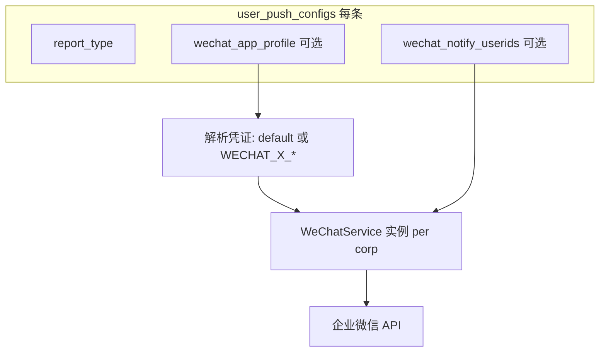

# 3 倍量报告推送：不同接收人 + 不同企业主体

## 一、现状（仅「人」可分，主体不可分）

- **接收人**：[`PushService._wechat_recipient_userids`](backend_api/services/push_service.py) 已支持按 `user_push_configs.wechat_notify_userids` 覆盖；空则回退 `users.wechat_userid` / `wechat_openid`。
- **企业主体 / 应用**：[`WeChatConfig`](backend_core/wechat/wechat_config.py) 仅从环境变量读取 **一套** `WECHAT_CORP_ID`、`WECHAT_CORP_SECRET`、`WECHAT_AGENT_ID`；[`WeChatService`](backend_core/wechat/wechat_service.py) 构造时绑定该配置，[`PushService`](backend_api/services/push_service.py) 内用 **单个** `self.wechat_service` 发所有微信推送。
- **结论**：同一进程内所有 `report_type` 共用同一 corp 的 access_token 与应用；**无法**仅靠现有字段让「扫描走 A 公司、复核走 B 公司」。

## 二、需求：不同任务对应不同企业主体

不同主体意味着至少 **corp_id、corp_secret、agent_id** 可能都不同；成员 **userid 也在各 corp 内独立命名**。因此需要：

1. **每条推送配置**（或每条含微信渠道的 `user_push_configs`）能声明「用哪套企业微信应用发」。
2. **发送链路**在发文本/上传文件/发文件消息时，使用该套凭证取 **独立 access_token**（多 corp 时 **不可** 共用单例 `WeChatConfig` 里那一个 token）。

## 三、推荐实现方向（兼顾安全与运维）

### 方案 A（推荐）：配置档名 + 环境变量多套凭证

- 在 `user_push_configs` 增加可空字段，例如 **`wechat_app_profile`**（`VARCHAR`，如 `default`、`corp_b`、`tvo_scan`）。
- **空或未设置**：行为与现网一致，读取现有 `WECHAT_CORP_ID` / `WECHAT_CORP_SECRET` / `WECHAT_AGENT_ID`。
- **非空**：按约定读取第二套变量，例如 profile=`B` 时读 `WECHAT_B_CORP_ID`、`WECHAT_B_CORP_SECRET`、`WECHAT_B_AGENT_ID`（具体命名在实现时写死一份表并在 `.env.example` / 运维文档说明）。
- **优点**：密钥不进业务库、与现有部署方式一致；**缺点**：新增主体需改服务器 env 并重启（或可接受）。

### 方案 B：库内存储 corp_id + secret + agent_id

- JSON 或三列存在 `user_push_configs`。
- **优点**：管理端可完全自助；**缺点**：密钥落库需加密、轮换、审计，工作量大。

**建议优先方案 A**；若必须自助改密钥再评估 B 或接 KMS。

### 代码层要点

| 模块 | 改动要点 |
|------|----------|
| [`WeChatConfig`](backend_core/wechat/wechat_config.py) | 支持从显式参数或 profile 构造；**每个 corp+secret 组合独立 token 缓存**（实例字段或带 key 的全局 LRU，避免 A/B 串用 token）。 |
| [`WeChatService`](backend_core/wechat/wechat_service.py) | 支持 `WeChatService(WeChatConfig(...))` 或由工厂按 profile 返回实例；`send_*` 使用实例内 config。 |
| [`PushService`](backend_api/services/push_service.py) | `_send_via_wechat` 增加「当前 `config` → 解析 profile → 取 WeChatService」；不再假定全局单例 `self.wechat_service` 适用于所有任务（可保留默认实例作 fallback，或每次按需构造并缓存 profile→实例）。 |
| 其它调用 `WeChatService()` 的路径 | 如 [`push_routes`](backend_api/push_routes.py)、[`start_scheduler`](start_scheduler.py) 等：仅「无 config 上下文」的默认发送仍用 default；与按条推送无关的可不改或共用工厂。 |
| [`UserPushConfig`](backend_api/models.py) + 迁移 | 新增 `wechat_app_profile`（或等价名）。 |
| [`push_routes`](backend_api/push_routes.py) / [`config_service`](backend_api/services/config_service.py) | 读写新字段。 |
| [`admin/.../PushConfigView.vue`](admin/src/views/PushConfigView.vue) | 下拉或输入 profile；说明与 `wechat_notify_userids` 组合使用（userid 必须属于该 corp 下应用可见成员）。 |
| 文档 | [`docs/prod/triple_volume_observe_ops.md`](docs/prod/triple_volume_observe_ops.md) + 日常运维：多 profile、可信 IP 每应用单独配置。 |

## 四、操作层面（需求落地后的用法）

1. 在服务器为第二主体配置 **第二套** `WECHAT_<PROFILE>_CORP_ID` 等环境变量，并在企业微信后台为该应用配置 **可信 IP**。
2. 为 `triple_volume_observe_scan` / `triple_volume_observe_eval` 各建一条推送配置，分别设置 **`wechat_app_profile`** 指向不同 profile（及各自 **`wechat_notify_userids`** 为对应企业内的 userid）。
3. 未改 profile 的旧配置继续走默认 `WECHAT_*`，兼容现网。

## 五、与前一版「仅不同 userid」说明的关系

- **仅不同 userid、同一公司**：继续只用 `wechat_notify_userids` 即可，无需 profile。
- **不同公司**：必须 **profile（或等价凭证）+ 该公司下的 userid**；不能把 B 公司成员的 userid 填在仍用 A 公司应用发的配置上。

---

以下为实施待办（确认方案后执行开发时可勾选）。
