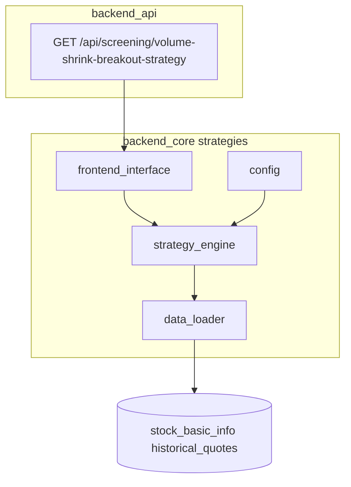

# 3倍量缩量突破选股 — 实现计划（GMS 式独立模块）

## 架构定位：与 GMS 对齐、与「单文件 low_nine」脱钩

用户要求 **参考 GMS 独立开发一套策略**，即：**核心逻辑与数据访问放在 `backend_core/strategies/<包名>/`**，API 只做 **薄封装**，而不是把大段 SQL 与循环写在 `backend_api/stock/*.py` 单文件里。

参考现有 GMS 结构（[`backend_core/strategies/gms/`](e:/wangxw/股票分析软件/编码/stock_quote_analayze/backend_core/strategies/gms/__init__.py)）：

| GMS 组件 | 本策略对应（首版最小集） |
|----------|-------------------------|
| [`config.py`](e:/wangxw/股票分析软件/编码/stock_quote_analayze/backend_core/strategies/gms/config.py) + `gms_config.json` | `config.py` + `vsb_config.json`（默认 volume_ratio、lookback、MA 周期等） |
| [`data_loader.py`](e:/wangxw/股票分析软件/编码/stock_quote_analayze/backend_core/strategies/gms/data_loader.py) | `data_loader.py`：按 code / 日期范围从 `historical_quotes` 拉 K 线（与 GMS 一样可封装 SQL，避免 API 层散落查询） |
| [`strategy_engine.py`](e:/wangxw/股票分析软件/编码/stock_quote_analayze/backend_core/strategies/gms/strategy_engine.py) | `strategy_engine.py`：单股判定、全市场/自选池循环、结果 dict 组装 |
| [`frontend_interface.py`](e:/wangxw/股票分析软件/编码/stock_quote_analayze/backend_core/strategies/gms/frontend_interface.py) | `frontend_interface.py`：**对外统一入口**（如 `VolumeShrinkBreakoutFrontendInterface.screen(...)`），供 `stock_screening_routes` 调用 |
| `gms_signal_trace` 落库与增量计算 | **首版可不实现**：先实时扫；若后续需与 GMS 一致「可缓存、可邮件/管理端」，再增加 `vsb_signal_trace` 表与回填逻辑（单独迭代） |

## 策略逻辑（与前一版一致，不重复发明）

- **爆量日**：在 `[boom_lookback_min, boom_lookback_max]` 索引窗口内，`volume[k] >= ratio * volume[k+1]`，默认 `ratio=3`；多候选取 **最近** 爆量（下标 `k` 最小）。
- **均线多头（初筛）**：在爆量日 `k` 用 **k 及更早** 收盘价计算 MA5/MA10/MA20，满足 `MA5 > MA10 > MA20`（首版「金叉」弱化为多头排列，可调参）。
- **缩量突破**：默认 **最新 bar（下标 0）**：`close[0] > close[k]` 且 `volume[0] < volume[k]`。
- **数据**：`historical_quotes` 与 [`low_nine_strategy`](e:/wangxw/股票分析软件/编码/stock_quote_analayze/backend_api/stock/low_nine_strategy.py) 相同字段；历史窗口需覆盖 MA20 + lookback（建议单次查询约 120+ 交易日等价的自然日跨度，具体在 `data_loader` 内集中计算）。

## 实现任务（按顺序）

### 1. 新建包 `backend_core/strategies/volume_shrink_breakout/`

- **`__init__.py`**：导出 `VolumeShrinkBreakoutFrontendInterface`、`VolumeShrinkBreakoutConfigManager`（命名与 GMS 风格一致）、可选 `__version__`。
- **`config.py`**：读 `vsb_config.json`（路径与 GMS 类似：包目录下默认文件 + 可选环境覆盖）；参数：`volume_ratio`、`boom_lookback_min/max`、`ma_periods`。
- **`data_loader.py`**：输入 `Session`、股票列表、起止日期；输出每只股票 **日期倒序** 的 OHLCV 列表（与现有策略约定一致）。
- **`strategy_engine.py`**：MA 计算、`find_boom_index`、`pass_ma_alignment`、`pass_shrink_breakout`；`screen_stock(...)` / `screen_universe(...)`。
- **`frontend_interface.py`**：组装 `scope`（首版支持 `all` + `limit` 压测；可选第二阶段 `watchlist` 与 GMS 相同从 `get_db` 注入用户自选）、调用 engine、返回 `List[Dict]` 与元信息（`strategy_name`、`parameters` 等），便于路由直接 `JSONResponse`。

**不要求首版**：回测 runner、worker、`backtest_data` 目录；若需要与 GMS 回测同源，列为 **Phase 2**。

### 2. API 薄路由

- 文件 [`backend_api/stock/stock_screening_routes.py`](e:/wangxw/股票分析软件/编码/stock_quote_analayze/backend_api/stock/stock_screening_routes.py)：
  - `try: from backend_core.strategies.volume_shrink_breakout import ...` 与 GMS 的 `GMS_AVAILABLE` 相同模式，失败返回 503。
  - `GET /api/screening/volume-shrink-breakout-strategy`，Query 透传至 `frontend_interface`（`volume_ratio`、`boom_lookback_*`、`limit`、`scope`）。
- **超时**：全 A 扫描可能较慢，在计划/代码注释中增加 **`VSB_SCREENING_TIMEOUT`**（或复用文档里对 GMS 的 nginx 超时说明），与 [`GMS_SCREENING_TIMEOUT`](e:/wangxw/股票分析软件/编码/stock_quote_analayze/backend_api/stock/stock_screening_routes.py) 同理在路由层 `asyncio.wait_for` 可选（若 GMS 路由未用 wait_for 则本策略也可先仅文档提示）。

### 3. 测试（`test/`）

- 针对 **`strategy_engine`** 内纯逻辑：人造倒序 K 线列表，覆盖「满足 / 不满足爆量 / 不满足缩量 / 不满足均线」等分支；**不依赖**真实数据库。

### 4. 前端（可选）

- [`frontend/screening.html`](e:/wangxw/股票分析软件/编码/stock_quote_analayze/frontend/screening.html) + [`frontend/js/screening.js`](e:/wangxw/股票分析软件/编码/stock_quote_analayze/frontend/js/screening.js)：新增策略 Tab，请求 `/api/screening/volume-shrink-breakout-strategy`，列展示爆量日、突破日、量比等（与 GMS Tab 同级体验）。

## 风险与约束

- **全市场耗时**：与 GMS 类似，必须 **`limit`** 做联调 + 生产网关超时对齐说明。
- **首版无 trace 表**：结果每次实时算；若后续要「管理端观察池 / 邮件推送」，再按 GMS 的 `gms_signal_trace` 模式扩展表结构与增量写入。

## 验收

- 包可被 `import`；`GET .../volume-shrink-breakout-strategy?limit=50` 返回 200 与结构化 `data`。
- `test/` 中单测通过。
- （可选）选股页 Tab 可用。
