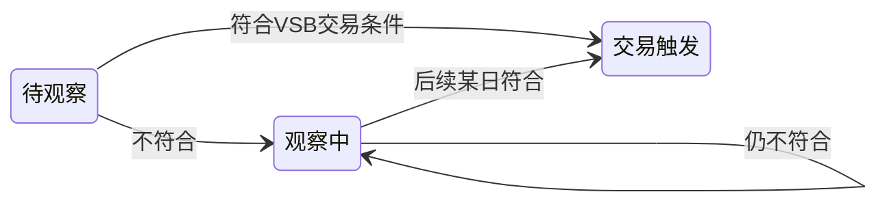

# 3倍量观察股：定时任务、推送与前后端改造

## 1. 业务与状态约定

- **任务1（爆量侦测）**：对配置范围内的市场与板块，取「最近一个已有日线数据的交易日」`T` 及其在表中的上一交易日 `T-1`（按 `historical_quotes` / `historical_quotes_hk` 每只股票各自相邻两行，而非自然日）。若 `volume[T] >= ratio * volume[T-1]`（默认 `ratio=3`），则写入观察表，**初始状态为「待观察」**；同一 `(market, code, T)` 做幂等（唯一约束或 `ON CONFLICT DO NOTHING`），避免重复插入。
- **任务2（策略复核）**：对状态中 **「待观察」或「观察中」** 的记录，按 [docs/3倍量缩量突破策略设计与使用手册.md](e:/wangxw/股票分析软件/编码/stock_quote_analayze/docs/3倍量缩量突破策略设计与使用手册.md) 的 **完整 VSB 条件** 判定：调用已有 [`evaluate_stock`](e:/wangxw/股票分析软件/编码/stock_quote_analayze/backend_core/strategies/volume_shrink_breakout/strategy_engine.py)（`historical_data` 日期 **DESC**，参数与 `vsb_config.json` / `VolumeShrinkBreakoutConfigManager` 一致）。命中则更新为 **「交易触发」**；未命中则 **「观察中」**（含从「待观察」首次未命中转入）。

**板块与市场**：A 股板块键与 SQL 过滤逻辑直接复用 [`VSB_BOARD_PREFIX_GROUPS` / `normalize_vsb_board_keys` / `code_matches_vsb_boards`](e:/wangxw/股票分析软件/编码/stock_quote_analayze/backend_core/strategies/volume_shrink_breakout/data_loader.py)（CYB/KCB/SH_MAIN/SZ_MAIN/SZ_SME）。港股可选：`market=HK`，数据源 [`HistoricalQuotesHK`](e:/wangxw/股票分析软件/编码/stock_quote_analayze/backend_api/models.py)；港股代码规则与 ST 过滤需单独约定（可与现有港股采集一致：按 `stock_basic_info` 或港股基础表过滤）。

## 2. 数据层

- **新表**（建议名 `triple_volume_observe_stocks`，名称可在实现时微调）：核心字段示例  
  `id`, `market`（`CN`/`HK`）, `code`, `name`, `observe_trade_date`（爆量判定日 T）, `prev_trade_date`, `prev_volume`, `curr_volume`, `volume_ratio_actual`, `status`（枚举字符串：`待观察`/`观察中`/`交易触发`）, `vsb_evaluated_at`, `vsb_detail_json`（可选，存 `evaluate_stock` 返回摘要便于审计）, `created_at`, `updated_at`。  
  **唯一约束**：`(market, code, observe_trade_date)`。
- **迁移脚本**：放在 [migrations/](e:/wangxw/股票分析软件/编码/stock_quote_analayze/migrations)（或项目既有习惯路径），并在 [`backend_api/models.py`](e:/wangxw/股票分析软件/编码/stock_quote_analayze/backend_api/models.py) 增加 ORM 模型与 Pydantic 模式（供 API 使用）。

## 3. 服务与定时任务

### 3.1 通知配置：利旧 GMS 同款表（与 `gms_daily` 一致链路）

不新增「通知专用 settings 表」。**订阅谁、何时推、走企业微信还是邮件** 与 GMS 日报一致，复用：

- [`user_push_configs`](e:/wangxw/股票分析软件/编码/stock_quote_analayze/backend_api/models.py)：`enabled`、`channels`（JSON）、`push_times`（JSON）、关联 `users.id`；通过扩展 **`report_type`** 区分两条任务，例如 **`triple_volume_observe_scan`**（任务1 爆量入库结果）、**`triple_volume_observe_eval`**（任务2 状态复核结果）。同一用户可各建一条配置，分别设推送时间（如收盘后 16:10 / 16:30）与渠道。
- [`push_records`](e:/wangxw/股票分析软件/编码/stock_quote_analayze/backend_api/models.py)：每次群发后写入，与 [`PushService`](e:/wangxw/股票分析软件/编码/stock_quote_analayze/backend_api/services/push_service.py) 现有 **去重、渠道状态、失败重试** 行为对齐（参考 `gms_daily`、`volume_aberration`）。
- [`users`](e:/wangxw/股票分析软件/编码/stock_quote_analayze/backend_api/models.py)：`wechat_userid` / `wechat_openid` / `email` 等，作为 **默认接收人**（与现有 [`push_service`](e:/wangxw/股票分析软件/编码/stock_quote_analayze/backend_api/services/push_service.py) 逻辑一致）。

**企业微信接收人按任务区分（`scan` / `eval` 可为不同成员）**  
任务1 与任务2 的通知对象可能不是同一企业微信身份（用户口语中的 openid 在应用消息场景一般对应成员 **userid**）。仅靠「同一 `users` 行」无法表达「两条 `report_type` 各发谁」时，在 **仍利旧 `user_push_configs` 表** 的前提下增加 **可选覆盖字段**（需迁移，名称实现时拟定，例如 `wechat_notify_userids`：`JSON` 字符串数组，或多个 userid 用 `|` 拼接的 `TEXT`）：  
- **每条 `user_push_configs` 记录独立配置**：`triple_volume_observe_scan` 一条、`triple_volume_observe_eval` 一条，各自可填不同的企业微信 userid 列表。  
- **[`PushService`](e:/wangxw/股票分析软件/编码/stock_quote_analayze/backend_api/services/push_service.py)**：发企业微信时 **若当前配置的覆盖字段非空，则仅向该列表发送**；若为空，则 **回退** `users.wechat_userid` / `users.wechat_openid`（与 `gms_daily`、`volume_aberration` 现网一致）。其它 `report_type` 不受影响（字段默认可空）。  
- 管理端 / 用户推送配置 UI：在编辑某条推送任务时展示「本任务企业微信接收人（可选，覆盖账号默认绑定）」。

实现要点：

- 在 [`push_routes.py`](e:/wangxw/股票分析软件/编码/stock_quote_analayze/backend_api/push_routes.py)、[`report_service.py`](e:/wangxw/股票分析软件/编码/stock_quote_analayze/backend_api/services/report_service.py)、[`config_service`](e:/wangxw/股票分析软件/编码/stock_quote_analayze/backend_api/services/config_service.py) 等处将新 `report_type` 纳入合法值；为两种类型各实现 **生成 Excel + 走现有渠道发送**（可抽私有方法与 `volume_aberration` 并列）。
- **调度触发方式二选一或组合**：（1）由现有 [`PushScheduler`](e:/wangxw/股票分析软件/编码/stock_quote_analayze/backend_core/scheduler/push_scheduler.py) 在 `push_times` 触发，内部调用与 `gms_daily` 相同的批量推送入口，仅 `report_type` 不同；（2）若任务必须紧跟 `backend_core` 日 K 采集，则在 [`main.py`](e:/wangxw/股票分析软件/编码/stock_quote_analayze/backend_core/data_collectors/main.py) 采集完成后调用「仅执行 3 倍量观察推送」的函数，该函数内 **查询当日已到达推送条件且 `report_type` 匹配的用户配置** 再发送——仍只读写上述三张业务表。

### 3.2 扫描范围参数（市场 / 板块 / 倍数）

与「通知订阅」解耦：**不占用 `user_push_configs`** 的语义。建议仍以 **环境变量** 为主（`TRIPLE_VOLUME_MARKETS`、`TRIPLE_VOLUME_BOARDS`、`TRIPLE_VOLUME_RATIO`、`TRIPLE_VOLUME_OBSERVE_ENABLED`）；**可选利旧** [`GMSRuntimeConfig`](e:/wangxw/股票分析软件/编码/stock_quote_analayze/backend_api/models.py)（`gms_runtime_config.config_params`）中增加嵌套键（如 `triple_volume_observe`）供管理端与 GMS 参数同页维护——仅当希望少依赖 env 时采用，与通知表仍分离。

### 3.3 任务逻辑与 Excel

- **任务1**：新模块如 `backend_core/strategies/triple_volume_observe/scan_job.py`：`Session` + SQL（`LAG` 或子查询）筛 `T` 相对 `T-1` 放量倍数；`stock_basic_info` + 板块前缀；港股 `historical_quotes_hk`；交易日判定复用 [`is_market_session_closed`](e:/wangxw/股票分析软件/编码/stock_quote_analayze/backend_api/utils/trading_calendar_utils.py) 或与 `main.py` 休市逻辑一致。
- **任务2**：`eval_job.py`：`status IN ('待观察','观察中')` + `VolumeShrinkBreakoutDataLoader` + [`evaluate_stock`](e:/wangxw/股票分析软件/编码/stock_quote_analayze/backend_core/strategies/volume_shrink_breakout/strategy_engine.py)。
- **Excel**：参考 [`ReportService._generate_volume_aberration_report`](e:/wangxw/股票分析软件/编码/stock_quote_analayze/backend_api/services/report_service.py)；作为附件随推送下发。

### 3.4 调度注册

在 [`backend_core/data_collectors/main.py`](e:/wangxw/股票分析软件/编码/stock_quote_analayze/backend_core/data_collectors/main.py) 于日 K 落库后串联 **扫描入库 + 状态复核**（或拆两个时间点）；**推送**侧优先与 **PushScheduler + user_push_configs.push_times** 对齐；`_env` 控制总开关，默认关闭。

## 4. HTTP API（供前后端）

- **用户/只读**：`GET /api/.../triple-volume-observe` 分页列表、按 `market`/`status`/`日期` 筛选、导出当前查询为 Excel（可选与定时生成列一致）。  
- **管理端**：手动触发 `POST .../run-scan`、`POST .../run-eval`（管理员鉴权）；若扫描参数落在 `GMSRuntimeConfig`，则 **GET/PUT 走现有 GMS 运行时配置接口**（扩展 JSON 字段，不新造「通知表」API）。**用户订阅、渠道、推送时间、本任务企业微信接收人覆盖** 通过既有 **`/api/push/...` 与用户推送配置管理** 维护（新 `report_type` 两条，读写含 `user_push_configs` 新增覆盖字段）。  
路由可挂在现有 [`backend_api`](e:/wangxw/股票分析软件/编码/stock_quote_analayze/backend_api) 的 `stock` 或新建 `triple_volume_observe_routes.py` 并在 `main.py` `include_router`。

## 5. 前端 `frontend`

- 新增页面或在「策略/选股」相关导航下增加入口：**3倍量观察股** 列表（表格展示代码、名称、市场、观察日、量比、状态、更新时间）；支持筛选与导出；调用上述只读 API（沿用 [`authFetch` / `smartFetch`](e:/wangxw/股票分析软件/编码/stock_quote_analayze/frontend/js/common.js) 与现有页面风格）。

## 6. 管理端 `admin`

- **观察股列表**：新菜单 + Vue 页面（状态筛选、手动触发扫描/复核若 API 提供）。
- **通知配置**：**复用现有「用户推送配置」管理流程**（与 GMS 日报相同），为 `triple_volume_observe_scan` / `triple_volume_observe_eval` 提供类型选项、渠道与时间配置；并为 **每条配置** 提供可选的 **企业微信接收人覆盖**（与另一条 `report_type` 可填不同 userid），避免与账号默认 `wechat_userid` 强行绑死。
- **扫描参数**（市场、板块、倍数）：环境变量或（可选）GMS 运行时配置 JSON 小节；若采用后者，可在 GMS 管理页增加折叠区块或独立子页编辑 `gms_runtime_config` 中的 `triple_volume_observe` 键。

参考 [`admin/src/router`](e:/wangxw/股票分析软件/编码/stock_quote_analayze/admin/src/router/index.ts) 与用户推送相关页面。

## 7. 测试与文档

- 在 [`test/`](e:/wangxw/股票分析软件/编码/stock_quote_analayze/test) 增加单元测试：LAG 筛股 SQL 或内存小数据集、状态迁移、`evaluate_stock` mock。  
- 在 [`docs/prod/`](e:/wangxw/股票分析软件/编码/stock_quote_analayze/docs/prod) 或策略手册旁增加运维小节：环境变量、建议 cron 时间、企业微信可信 IP、与 `backend_core` 进程部署关系。

## 8. 风险与边界

- **任务2 全表扫描性能**：若「观察中」行数长期很大，需分批 + 日志进度或限流；可考虑仅扫描「最近 N 日有更新的」或加索引 `(status, updated_at)`。  
- **港股 ST 规则**：若无 ST 字段，按名称关键字或单独可采名单过滤。  
- **与现有 VSB HTTP 选股**：逻辑共用 `evaluate_stock`，避免两套算法漂移。
