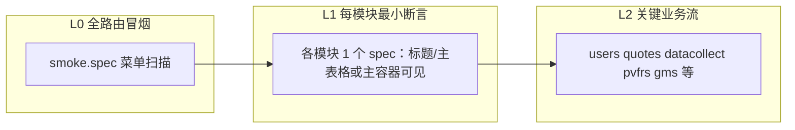

# 管理端 Admin Web 全模块自动化测试计划

## 现状摘要

- **管理端技术栈**：Vue 3 + Vite + Element Plus + Pinia，路由与菜单见 [admin/src/router/index.ts](admin/src/router/index.ts)、[admin/src/views/AdminLayout.vue](admin/src/views/AdminLayout.vue)。
- **已有 E2E 框架**：[test/web_auto](test/web_auto) 使用 `@playwright/test`，`npm run test:all` / `test:smoke` / `test:cases`（见 [test/web_auto/package.json](test/web_auto/package.json)）。
- **已覆盖能力**：
  - **全菜单浅层**：[`specs/smoke.spec.ts`](test/web_auto/specs/smoke.spec.ts) 调用 [`src/runner/smoke-scanner.ts`](test/web_auto/src/runner/smoke-scanner.ts)，依次点击 `.sidebar-nav .nav-item`，断言 `.admin-content` 可见（与 `AdminLayout` 模板一致）。
  - **专项流程**：用户 [`users-management.spec.ts`](test/web_auto/specs/users-management.spec.ts)、行情 [`market-data.spec.ts`](test/web_auto/specs/market-data.spec.ts)、采集 [`data-collection.spec.ts`](test/web_auto/specs/data-collection.spec.ts)、PVFRS [`pvfrs-workflow.spec.ts`](test/web_auto/specs/pvfrs-workflow.spec.ts)、GMS [`gms-workflow.spec.ts`](test/web_auto/specs/gms-workflow.spec.ts)、日志调试 [`debug-logs.spec.ts`](test/web_auto/specs/debug-logs.spec.ts)、Excel 驱动 [`excel-cases.spec.ts`](test/web_auto/specs/excel-cases.spec.ts)。
- **文档与缺口对照**：[test/web_auto/docs/test-plan.md](test/web_auto/docs/test-plan.md) 中部分 checklist 已实现（如已有 `pvfrs.page.ts`、`data-collect.page.ts`），但**与「侧边栏每一个业务模块」一一对应的专项 spec 尚未齐全**。
- **环境注意**：[`playwright.config.ts`](test/web_auto/playwright.config.ts) 默认 `baseURL` 为 `http://127.0.0.1:3000`，而 [`admin/vite.config.ts`](admin/vite.config.ts) 开发服务器端口为 **8001**；[README](test/web_auto/README.md) 示例与真实端口可能不一致，需在实施时**以 `.env.web-auto` 的 `WEB_BASE_URL` 为准**并与实际启动命令对齐。
- **admin 包内 Cypress**：[`admin/package.json`](admin/package.json) 含 `cypress`，仓库内未见与之配套的 `cypress/` 目录；**建议以 `test/web_auto` 为唯一 E2E 真源**，避免双框架并行维护（可选：后续删除或冻结 Cypress 脚本，本次可不强制）。

## 目标定义（「全模块」分层）

- **L0**：保持并加固现有菜单冒烟（必要时增加「首屏关键 API 无连续失败」等轻量断言，避免过度耦合）。
- **L1（本次「全模块」核心交付）**：对下列**当前尚无独立 spec 的菜单路由**，各增 **至少 1 条** Playwright 用例（建议统一打标签 `@module`，关键路径保留 `@smoke` 子集），通过 **POM 的 `goto()` + 页面级稳定选择器**（优先 `getByRole` / 文案 / `data-testid`——若页面缺少 testid，仅在必要时在 admin 内少量补充，需单独评审）验证主界面加载成功。
- **L2**：在已有工作流 spec 上按需扩展（异步任务轮询、导出等），与 [test-plan.md](test/web_auto/docs/test-plan.md) 优先级对齐，**不阻塞** L1 全模块落地。

**与路由对齐的模块清单（来自 `AdminLayout` + `router`）**：

| 模块 | 路径 | 现有专项 spec |
|------|------|----------------|
| 仪表板 | `/dashboard` | 无独立文件（仅冒烟） |
| 用户管理 | `/users` | 有 |
| 行情数据 | `/quotes` | 有 |
| 股票基本信息 | `/stock-basic` | 无 |
| 指标管理 | `/indicators` | 无 |
| PVFARS 交易策略 | `/pvfrs-strategy` | 无（与 management 分离） |
| PVFARS 策略管理 | `/pvfrs-management` | 有 |
| GMS 回测管理 | `/gms-management` | 有 |
| GMS 策略管理 | `/selection-results` | 无 |
| 数据源配置 | `/datasource` | 无 |
| 数据采集 | `/datacollect` | 有 |
| 系统监控 | `/monitoring` | 无 |
| 预测模型 | `/models` | 无 |
| 系统日志 | `/logs` | 部分（debug） |
| 内容管理 | `/content` | 无 |
| 公告发布 | `/announcements` | 无 |
| 报告管理（含邮件/推送/日志子页） | `/report-management` + query | 无 |
| 登录 | `/login` | 隐含在 fixture | 建议增加 **未登录** 用例文件（不 extend `authenticatedPage`） |

**不在侧边栏但应纳入计划（可选 L1.5）**：

- 报告详情 `/reports/:id`：依赖列表中存在可点击项或后端种子数据；建议 `test.skip` 无数据时跳过，或从列表页取第一条 ID 再进入。

## 实施步骤

1. **模块路由表与选择器基线**  
   - 浏览各 `views/*.vue`，记录每页「稳定可见」的标题或 `el-page-header` / 首屏表格文案，写入 [test/web_auto/docs/test-plan.md](test/web_auto/docs/test-plan.md) 的「模块 ↔ 断言锚点」小节，便于后续维护。

2. **扩展 POM（`test/web_auto/src/pages/`）**  
   - 为 L1 缺口模块各增一个轻量 `*.page.ts`：`goto()`（使用 `config.baseUrl` + 路径）、`expectLoaded()`（断言锚点）。  
   - 可抽一个小的 `BaseAdminPage`（可选）封装 `admin-content` 等待逻辑，减少重复。

3. **新增/拆分 spec（`test/web_auto/specs/`）**  
   - 方案 A（推荐）：按模块单文件，如 `dashboard.spec.ts`、`stock-basic.spec.ts`、…、`report-management.spec.ts`，便于失败定位。  
   - 或方案 B：单文件 `modules-smoke.spec.ts` 内 `test.describe` 分块；可读性略差。  
   - **报告管理**：覆盖 `?tab=sender` / `push` / `logs`（与 [admin/src/router/index.ts](admin/src/router/index.ts) 中 redirect 一致），断言对应 Tab 面板可见。

4. **登录与未登录**  
   - 新增 `login.spec.ts`：`错误密码`、`空字段`、或「未登录访问受保护路由应跳转 `/login`」等（不污染 `authenticatedPage` fixture）。  
   - 保持 [test/web_auto/src/auth/login-manager.ts](test/web_auto/src/auth/login-manager.ts) 与 [`.env.web-auto.example`](test/web_auto/.env.web-auto.example) 为唯一配置入口说明。

5. **导入与规范统一**  
   - 将 [smoke.spec.ts](test/web_auto/specs/smoke.spec.ts)、[excel-cases.spec.ts](test/web_auto/specs/excel-cases.spec.ts) 等内部 import 统一为 README 推荐的 **`.js` 后缀**（与 [market-data.spec.ts](test/web_auto/specs/market-data.spec.ts) 一致），减少 ESM 解析差异。

6. **npm 脚本与 CI（可选）**  
   - 在 [test/web_auto/package.json](test/web_auto/package.json) 增加 `test:modules`（`--grep @module`）便于只跑全模块浅层用例。  
   - 若仓库已有 GitHub Actions / 其他 CI，增加一步：`cd test/web_auto && npm ci && npx playwright install chromium && npm run test:all`（需传入 secrets 或跳过需写库的 `@case`）。

7. **Vitest 组件测（非必须）**  
   - [admin/package.json](admin/package.json) 含 `vitest` 与 `@vue/test-utils`，但 [admin/vite.config.ts](admin/vite.config.ts) 未配置 `test` 块；若需「单元 + E2E」双轨，可另起子任务配置 `vitest` + `environment: happy-dom`。**本计划默认以 E2E 全模块为主**，单元测试不作为本次必交付。

## 风险与依赖

- **必须**：管理端可访问、`WEB_USERNAME`/`WEB_PASSWORD` 有效、后端 API 可用（Vite 代理 `/api` → 后端，见 [admin/vite.config.ts](admin/vite.config.ts)）。  
- **数据依赖**：L1 尽量只做「页面加载 + 主 UI 锚点」；写库/长任务仍放在 `@case` 或现有工作流 spec。  
- **端口/basePath**：开发若使用 `8001` 或非根路径，必须通过 `WEB_BASE_URL` 与 Playwright `baseURL` 一致，否则冒烟全红。

## 验收标准

- `cd test/web_auto && npm run test:all` 在标准本地环境（文档写明的前置条件）下通过。  
- 侧边栏所列模块均有对应 L1 用例（或明确 `test.skip` 理由与跟踪项）。  
- [test/web_auto/README.md](test/web_auto/README.md) 与 [test/web_auto/docs/test-plan.md](test/web_auto/docs/test-plan.md) 更新为与实现一致（含端口说明）。
