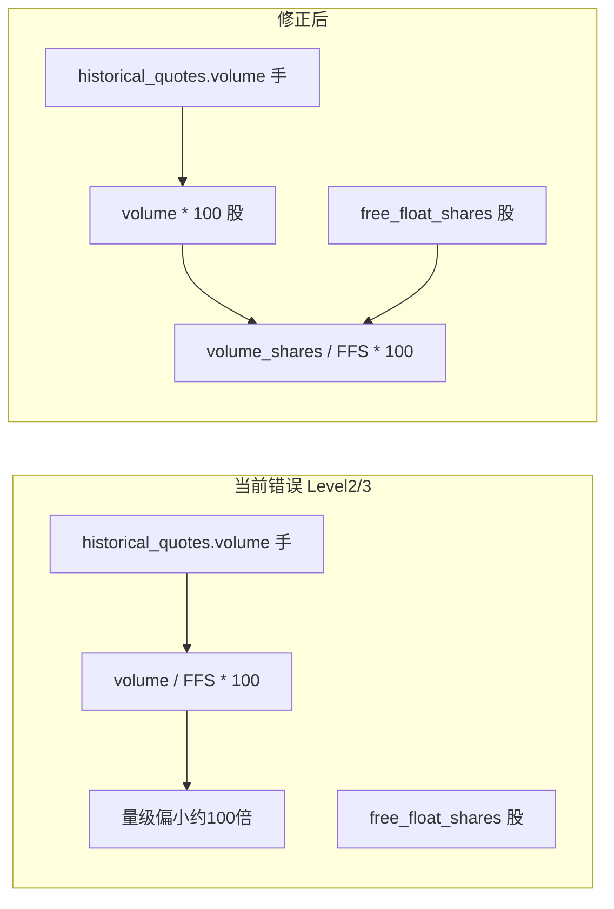

# A 股换手率计算逻辑排查与修正计划

## 结论摘要

| 场景                                                                                                                        | 数据来源 / 计算方式                                                                                                                                     | 单位约定                                                                               | 问题                                                                                                                                             |
| ------------------------------------------------------------------------------------------------------------------------- | ----------------------------------------------------------------------------------------------------------------------------------------------- | ---------------------------------------------------------------------------------- | ---------------------------------------------------------------------------------------------------------------------------------------------- |
| A 股实时 `[akshare/realtime.py](backend_core/data_collectors/akshare/realtime.py)`                                           | 东方财富等：`row['换手率']` 直写库；成交量注释写明 **统一按「手」存库**（新浪源为股则 ÷100 转手）                                                                                     | `stock_realtime_quote.volume` = **手**；`stock_basic_info.free_float_shares` = **股** | **无自算**：未用 volume÷股本；若接口无换手率（如新浪缺字段）则为 `None`，不涉及手/股混算 bug                                                                                     |
| A 股历史日线采集 `[akshare/historical_collector.py](backend_core/data_collectors/akshare/historical_collector.py)`               | `row['换手率']` 来自 AKShare，非自算                                                                                                                     | `historical_quotes.volume` 与上游「成交量」一致（A 股惯例为 **手**）                                | 无自算混算问题                                                                                                                                        |
| **历史换手率回填（自算）** `[akshare/historical_turnover_rate.py](backend_core/data_collectors/akshare/historical_turnover_rate.py)` | Level 2：`volume` + `stock_basic_info.free_float_shares`；Level 3：`circulating_market_value/current_price` 得流通股本 + 同一条 `historical_quotes.volume` | 股本为 **股**；注释写「换手率 = 成交量/流通股本×100」，但代码为 `volume / free_float_shares * 100`          | **错误**：`volume` 为 **手**，应先将手换算为股：`**volume_shares = volume * 100`**（A 股 1 手=100 股），再 `turnover_rate = volume_shares / free_float_shares * 100` |
| 对照（已正确）                                                                                                                   | `[tushare/historical.py](backend_core/data_collectors/tushare/historical.py)` 中 Level 2 自算                                                      | 注释明确 `vol` 为手，公式为 `(vol_hand * 100) / free_float_shares * 100`                     | 可作为实现参照                                                                                                                                        |

## 建议代码修改（实施阶段）

1. **文件** `[backend_core/data_collectors/akshare/historical_turnover_rate.py](backend_core/data_collectors/akshare/historical_turnover_rate.py)`
  - 在模块级或类内定义常量，例如 `A_SHARE_LOT_SIZE = 100`（与 `[realtime.py](backend_core/data_collectors/akshare/realtime.py)` 中「手/股」约定一致）。  
  - `**_calculate_from_free_float_shares`**：在计算前令 `volume_shares = volume * A_SHARE_LOT_SIZE`，用 `volume_shares` 参与 `round(.../ free_float_shares * 100, 4)`；更新 docstring。  
  - `**_calculate_from_market_value`**：对从 `historical_quotes` 取出的 `volume` 同样先乘 `A_SHARE_LOT_SIZE` 再参与换手率计算；更新 docstring。  
  - **Level 1**（从 `stock_realtime_quote.turnover_rate` 拷贝）：仍为接口/采集写入的换手率百分比，**不改动**（与 volume 单位无关）。
2. **可选文档/注释**
  - 在 `HistoricalTurnoverRateCollector` 类或 `run` 入口增加简短说明：`historical_quotes.volume` 与 `stock_realtime_quote.volume` 均为 **手**，自算必须与 `free_float_shares`（股）换算一致。
3. **测试（建议放在 `[test/](test/)`）**
  - 单元测试或小型脚本：给定 `free_float_shares=1e10` 股、`volume=10000` 手，期望换手率 = `(10000*100)/1e10*100 = 0.01`（即 0.01%），用于锁定公式。

## 不在本次计划内（除非你希望扩展）

- **实时行情**：若未来在新浪等无「换手率」时用 `volume`+`free_float_shares` **补算**，必须使用同一规则：`(volume_手 * 100) / free_float_shares * 100`，与本次历史回填一致。  
- **港股**：单位规则可能不同，本次仅针对 A 股。

## 验证方式

- 本地跑 `HistoricalTurnoverRateCollector` 对单日样本，对比修正前后同一股票 `turnover_rate` 是否约为原值的 **100 倍**（在仅走 Level 2/3 时）。  
- 与 Tushare 路径或行情软件同字段抽查几只股票的数量级是否一致。

