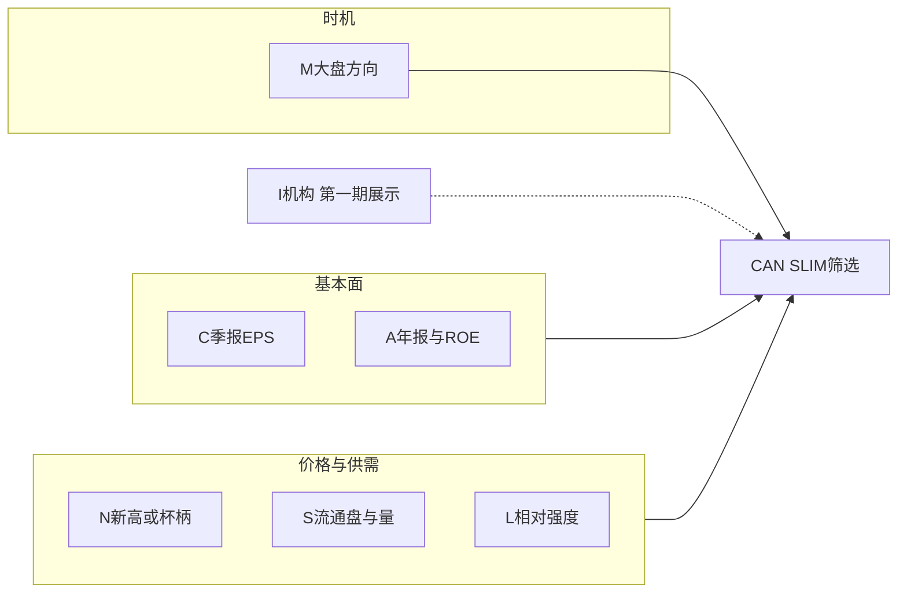

# CAN SLIM 规则说明与第一期落地

## 什么是 CAN SLIM

CAN SLIM 是威廉·奥尼尔（William J. O'Neil / IBD）的成长股选股与时机框架，七个字母分别对应买入前要同时满足的条件。它不是单一技术指标，而是 **基本面成长 + 价格结构 + 相对强度 + 大盘方向** 的组合。经典阈值来自美股；A 股需改口径（尤其流通盘、涨跌停、季报披露节奏），阈值做成可配置。

- **C Current quarterly earnings**：最近一季 EPS 同比至少约 **25%**，最好连续加速；营收同比同步走强更佳。
- **A Annual earnings growth**：近 **3 年** 年度 EPS 增速约 **25%+**，ROE 约 **17%+**。
- **N New**：新产品/新管理层/新高。实操上多用 **接近 52 周新高**，以及突破 **带柄杯底** 等基底。
- **S Supply and demand**：流通盘不宜过大；上涨日放量、下跌日缩量（吸筹）。
- **L Leader or laggard**：只要行业/市场里的领涨股。IBD 用 **RS Rating ≥ 80（更好 ≥ 90）**，不要落后股。
- **I Institutional sponsorship**：有质量的机构在增持，但不要过度拥挤。第一期不做硬过滤。
- **M Market direction**：约 3/4 个股跟随大盘。只在指数处于确认上升趋势时开新仓。

买入节奏通常是：先过 C/A/L 基本面与强度，再等 N 的基底突破（杯柄等），并用 M 决定是否允许开仓。

---

## 系统是否已具备条件（结论）

**没有现成的 CAN SLIM 选股策略。** 现有能力是「部分字母可复用、关键基本面不能全市场筛选」。

已具备、可直接复用：

- **L（最完整）**：IBD 风格 RS Rating 已落地。表 `[rs_ratings](backend_api/models.py)`，算法见 `[docs/indicators/股价相对强度_RS_Rating.md](docs/indicators/股价相对强度_RS_Rating.md)`，日终节点 `rs_rating_cn`。阈值 ≥80/90 即可作为硬过滤。板块「龙头/中军」见 `[backend_core/board_roles/service.py](backend_core/board_roles/service.py)`，是行业内涨幅角色，**不能替代** RS Rating。
- **N（形态侧较完整，新高未做成筛选项）**：CUPB 带柄杯底已按奥尼尔框架实现（`[backend_core/strategies/cup_bottom/](backend_core/strategies/cup_bottom/)`）；选股里有简化版「高而窄的旗形」（`[backend_api/stock/high_tight_flag_strategy.py](backend_api/stock/high_tight_flag_strategy.py)`）。日 K 在 `historical_quotes`，可现算 52 周新高，但目前没有「距 52 周高点 15% 以内」的筛选。
- **S（部分）**：`stock_basic_info.free_float_shares` / 总股本（SBBR 已用，但注释指出 IPO 后解禁可能失真）；日成交量 + `[mavol_indicators](backend_api/models.py)`；实时换手率在 `stock_realtime_quote.turnover_rate`。缺少标准的「上涨放量/下跌缩量」吸筹评分。
- **C/A（仅个股展示，不能选股）**：`[/latest_financial](backend_api/stock/stock_manage.py)` 每次实时调 AkShare，**没有季报/年报财务表**，无法全市场按 EPS 同比、3 年增速、ROE 筛选。这是第一期最大缺口。
- **M（偏弱）**：有 `index_realtime_quotes`（上证/深证/创业板/沪深300 等快照）。A 股指数**没有**可用的日线历史表（Tushare `[index.py](backend_core/data_collectors/tushare/index.py)` 仍是示例、未入库）。无法稳定判断「指数在 MA50 之上且均线向上」。港股指数历史有表，但 CAN SLIM 第一期针对 A 股。
- **I（不具备）**：无机构持仓/基金持仓/北向持仓时间序列。研报、公告只能作展示，不能当硬条件。第一期按你的选择：**不做硬过滤，结果里可留空或仅展示占位**。

现有选股（GMS/URT/RPE/SBBR/VSB/CUPB 等）是技术/结构策略，**不是** CAN SLIM 七项合取。

---

## 第一期范围（按你的选择）

落地 **C + A + N + S + L**，**M 做简单大盘开关**，**I 置后**。只做 A 股。默认规则为合取（全部通过才入选），阈值写入配置，不写死在代码里。

建议默认（均可在配置改）：

- **C**：最新单季 EPS 同比 ≥ 25%；可选开关：单季营收同比 ≥ 20%。
- **A**：近 3 个会计年度 EPS 同比均 ≥ 25%（缺年则用 CAGR 兜底）；加权 ROE ≥ 17%。
- **N**：收盘价不低于 52 周最高价的 85%（即距新高 ≤15%）；**或** CUPB 为 `forming`/`confirmed`。旗形只作加分展示，不强制。
- **S**：流通股本 ≤ 可配置上限（建议默认 20 亿股，因美股 2000–2500 万股不能直接套 A 股）；最新交易日若收阳，成交量 ≥ MAVOL20（或 50）。
- **L**：`rs_rating` ≥ 80（展示档：≥90 标「很强」）。无当日评级则剔除。
- **M**：沪深300（或上证）收盘 > MA50，且 MA50 高于 10 日前；不满足则 **整批选股返回空并标明「大盘未确认上升」**（仍允许管理端关掉该开关做研究）。
- **I**：第一期不参与过滤。

---

## 实现要点

### 1. 财务数据入库（C/A 的前提）

优先用 **Tushare `fina_indicator`**（项目已有 `TUSHARE_TOKEN` 配置与采集框架），按报告期增量拉取 EPS、单季同比、ROE、营收同比等，写入新表例如 `stock_fina_indicator`（PostgreSQL：`code + end_date` 唯一，`ann_date`、`eps`、`q_eps`、`basic_eps_yoy`、`q_eps_yoy`/`q_profit_yoy`、`q_sales_yoy`、`roe`/`roe_waa`、`update_time`）。

- 采集挂到 A 股日终流程节点（财报季可提高频率；日常增量按 `ann_date`）。
- AkShare 现有个股财务接口保留给详情页；**选股只读库表**，禁止对 6000 只票现场打外网。
- 迁移脚本放 `migrations/`；测试放 `[test/](test/)`。

### 2. A 股指数日线（M 的前提）

新表 `index_historical_quotes`（至少 000001.SH、399001.SZ、399006.SZ、000300.SH）。Tushare `index_daily` 入库；日终追加。M 只用沪深300（可配置）。

### 3. 选股引擎与 API

新增 `[backend_core/strategies/canslim/](backend_core/strategies/canslim/)`（`config.py`、`data_loader.py`、`engine.py`、`frontend_interface.py`），风格对齐 CUPB/GMS：读库、合取过滤、返回每条字母的通过原因。

- 52 周高：对 `historical_quotes` 用约 252 个交易日 `MAX(high)`（注意不复权高点与现价口径一致；与 RS 一样尽量用前复权比较新高，避免除权假跌破）。
- N 与 CUPB：左连接已有 `cupb_signal_trace` 预计算，不在选股时重扫全市场形态。CUPB 目前只在管理端，**未挂用户** [`frontend/screening.html`](frontend/screening.html)；第一期 CAN SLIM Tab 挂用户选股页，形态数据仍读预计算表。
- 路由：`[backend_api/stock/stock_screening_routes.py](backend_api/stock/stock_screening_routes.py)` 增加 `/api/screening/canslim`；权限注册 `channel.screening.tab.canslim`。
- 前端：`[frontend/js/screening.js](frontend/js/screening.js)` 增加 Tab，列：代码、名称、C/A/N/S/L 结果、RS、距 52 周高%、流通股、量比、大盘状态。

实现时不要误用已有表：`quarterly_quotes` / `annual_quotes` 是 K 线周期聚合，**不是财报**；`fund_*` 是 ETF 行情，**不是机构持仓**。流通股本继续用现有节点 `stock_shares`（[`stock_shares_collector.py`](backend_core/data_collectors/akshare/stock_shares_collector.py)）。

### 4. 文档与测试

- 文档：`[docs/strategies/canslim/](docs/strategies/canslim/)` 业务简化版 + 信号计算规则（A 股口径、默认阈值、与 IBD 原文差异）。
- 测试：`test/test_canslim_engine.py`、`test/test_canslim_screening_api.py`（财务缺数剔除、RS 不足剔除、M 关闭时整批空、N 新高或 CUPB 二选一）。

### 5. 明确不做（第一期）

- 机构持仓采集与 I 硬过滤。
- IBD「跟进日 / 派发日」完整大盘择时（M 只用均线趋势）。
- 「新产品/新管理层」NLP（公告仅有 `stock_notice_report`，质量不够当硬条件）。
- 港股 CAN SLIM（无 RS、财务口径不同）。

---

## 主要改动文件

- 新增：`migrations/add_canslim_tables.py`、`backend_core/strategies/canslim/*`、`backend_core/data_collectors/tushare/fina_indicator.py`、指数日线采集、`docs/strategies/canslim/*`、`test/test_canslim_*.py`
- 修改：采集流程 `[node_registry.py](backend_core/data_collectors/workflow/node_registry.py)`、`[stock_screening_routes.py](backend_api/stock/stock_screening_routes.py)`、`[models.py](backend_api/models.py)`、选股前端与权限注册、`[docs/README.md](docs/README.md)`

