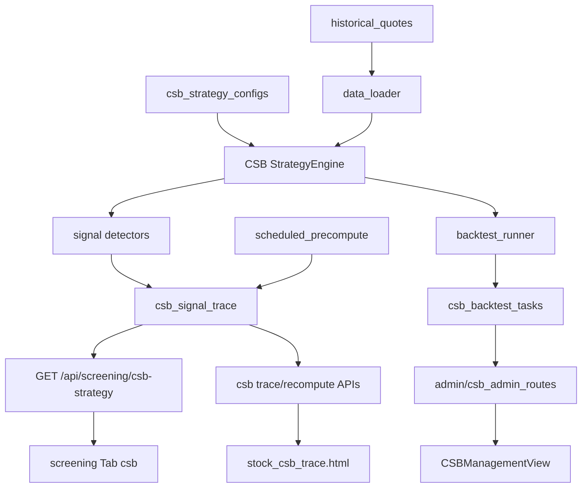

# CSB 策略补充优化与独立实现方案

## 策略理解（对照文档）

核心链路：**换手活跃初筛 → 四均线极度粘合通道（≥15 日）+ 年线防守 → N≥2 回踩下轨不破 + 地量 → 买点1缩量止跌试仓 → 买点2放量实体突破上轨/前高 → 三日不重回 + 基准点止损 + 阶梯止盈**。

与现有 SBBR（做小做底箱体）**概念相近但规则不同**：CSB 以 **MA5/10/20/60 粘合通道** 与 **放量突破上轨** 为主，且**不设市值上下限**；实现上必须独立包，禁止调用 SBBR 引擎或共用其 signal 表。

---

## 一、规则补充与优化建议（先量化再编码）

文档中若干表述需落成可计算默认值（均进 `config.py`，可配置版本覆盖）：

| 模糊点        | 建议默认量化                                                        | 说明                                           |
| ---------- | ------------------------------------------------------------- | -------------------------------------------- |
| 粘合带宽 3%～5% | `ma_squeeze_pct=0.04`（4%）                                     | 用 `(max(MA)-min(MA))/close`；可按板块另配 0.03/0.05 |
| 「接近下轨」     | `touch_tol_pct=0.015`                                         | 低点或收盘距通道下轨 ≤1.5% 计一次触碰                       |
| 通道上下轨定义    | 下轨=`min(MA5,10,20,60)`，上轨=`max(...)`                          | 与「狭长粘合」一致；突破也可 OR 近20日最高价                    |
| 地量         | 近5日均量 / 近60日均量 ≤ `dry_vol_ratio=0.55`，且近5日均换手 / 近60日均换手 ≤ 同阈值 | 「显著低于」需双侧确认                                  |
| 缩量止跌 K     | 量比 ≤0.8；收阴幅度 ≤2% 或下影≥实体；或阳包阴                                  | 买点1形态白名单                                     |
| 大阳实体       | 实体涨幅 ≥3% 且收盘接近最高（上影≤实体30%）                                    | 避免长上影假突破                                     |
| 突破 2%      | 收盘 ≥ 上轨（或20日前高）×1.02                                          | 取 `max(上轨, HH20)` 为压制位                       |
| 年线防守       | 收盘≥MA250，或 MA250 近20日斜率归一化 ≥ `-0.0005`                        | 文档「走平/向上」需斜率阈值                               |
| 三日不重回      | 买点2后 T+1～T+3 任一日收盘 < 突破日通道上轨 → `false_break` 清仓信号             | 作独立出场事件                                      |
| 阶梯止盈       | 用日线 swing low（ZigZag 或 HH/HL）抬止损；或保底用 MA20                    | 首版回测用「基准点 + MA20 + 三日假突破」；阶梯 swing 作增强项     |
| 排除标的       | ST/*ST、停牌、上市不足 250 日、当日无量                                     | 文档未写，生产必需                                    |

**信号分层（避免与「命中」混为一谈）：**

- `CSB_SETUP`：通道+年线+回踩次数+地量成立（观察池，非下单）
- `CSB_PROBE`：买点1（试仓 10%～15%，仓位仅建议字段）
- `CSB_BREAKOUT`：买点2（加仓建议 20%～30%）
- `CSB_FALSE_BREAK` / `CSB_STOP` / `CSB_TRAIL`：防守事件（追溯页展示）

**回测与参数建议：** 对 `ma_squeeze_pct`、`squeeze_days`、`vol_expand_mult`、`break_pct` 做敏感性；统计突破后 5/10/20 日收益与假突破率，再锁默认值。管理端回测首版支持两种类型（对齐 SBBR）：

- `signal_hit_rate`：采样区间内 SETUP/PROBE/BREAKOUT 命中后，前瞻 N 日是否触及目标涨幅 / 是否假突破
- `trade_simulation`：PROBE 轻仓 + BREAKOUT 加仓 + 三日不重回 / 基准点止损 / MA20 跟踪 的简化交易模拟

**刻意不做的耦合：** 不并入 `board_signals.STRATEGY_KEYS`、不进 `stock_multi_strategy` 四策略聚合（除非后续单独需求）；不复用 `sbbr_*` 表与引擎；不复用 GMS/URT 回测任务表。

---

## 二、独立实现架构（对齐 RPE/SBBR，含管理端回测）

### 1. 策略包（新建）

目录：[`backend_core/strategies/csb/`](backend_core/strategies/csb/)

| 文件 | 职责 |
|------|------|
| `config.py` | 默认参数 + `CSBConfigManager`（读 `csb_strategy_configs`） |
| `data_loader.py` | A 股池 + 日 K（OHLCV、换手；需 ≥250 日算年线） |
| `channel.py` | MA5/10/20/60/250、粘合带宽、持续天数、上下轨 |
| `setup_detector.py` | 年线过滤、回踩计数、地量 → SETUP |
| `entry_detector.py` | PROBE / BREAKOUT |
| `defense_exit.py` | 三日不重回、基准点止损、MA20 跟踪 |
| `strategy_engine.py` | `evaluate_one` / `screen` |
| `frontend_interface.py` | trace 优先，miss 现算 |
| `signal_storage.py` | upsert/load |
| `scheduled_precompute.py` | 日终预计算 |
| `backtest_storage.py` | 回测任务 CRUD、进度、summary、明细（对齐 SBBR） |
| `backtest_runner.py` | `signal_hit_rate` + `trade_simulation` 异步任务 |

**单股评估伪流程：** 取 K 线 → 算均线与通道 → 初筛换手 → SETUP 判定 → 当日/近几日 PROBE/BREAKOUT → 若已有突破则检查假突破与止损建议 → 返回结构化 `detail` JSON。

### 2. 数据库

迁移（新建，如 `migrations/add_csb_tables.py`）+ ORM（[`backend_api/models.py`](backend_api/models.py)）：

- `csb_strategy_configs`：`name`、`config_params` JSONB、`is_default`、`precompute_enabled`
- `csb_signal_trace`：唯一键 `(code, trade_date, config_id, signal_type)`；`detail` JSONB
- `csb_backtest_tasks`：任务状态、进度、`config` 快照、`summary`、明细引用（对齐 SBBR/RPE 任务表形态）
- 可选：`csb_trace_recompute_tasks`

### 3. API

- 选股：[`backend_api/stock/stock_screening_routes.py`](backend_api/stock/stock_screening_routes.py) 增加 `GET /api/screening/csb-strategy`
- 追溯：新建 `backend_api/stock/csb_frontend_routes.py`
- 管理端：新建 [`backend_api/admin/csb_admin_routes.py`](backend_api/admin/csb_admin_routes.py)（**完整**，非仅配置）
  - 配置 CRUD / 设默认 / 手动预计算
  - 回测：`POST/GET /backtests`、`GET /backtests/{id}`、取消/重跑/删除（模板抄 [`sbbr_admin_routes.py`](backend_api/admin/sbbr_admin_routes.py)）
  - 股票池：`market` / `stocks` / `watchlist`；绑定 `strategy_config_id`；类型 `signal_hit_rate` | `trade_simulation`
- [`backend_api/main.py`](backend_api/main.py)：`include_router`

### 4. 用户前端（选股频道）

- [`frontend/screening.html`](frontend/screening.html)：`data-strategy="csb"` Tab
- `frontend/js/csb_screening.js`
- `frontend/stock_csb_trace.html` + `frontend/js/stock_csb_trace.js`
- 权限：`channel.screen.tab.csb` 等

### 5. 管理端前端（回测模块，首版必含）

对齐 [`admin/src/views/SBBRManagementView.vue`](admin/src/views/SBBRManagementView.vue)（三 Tab：策略配置 / 回测任务 / 预计算入口）：

- 新建 `admin/src/views/CSBManagementView.vue`
- 新建 `admin/src/services/csbApi.ts`
- 路由：`admin/src/router/index.ts` 增加 `csb-management`
- 侧栏菜单挂「CSB 管理」
- 回测任务表：创建、刷新、状态/进度、命中率或胜率摘要、详情抽屉；创建对话框含日期区间、`config_id`、回测类型、股票池模式

首版**不照搬** GMS/URT 的 PDF 导出、板块多选等重能力；需要时再增强。

### 6. 测试与文档

- 核心检测单测 + `test/test_csb_backtest_runner.py`（假突破清仓、PROBE 后 BREAKOUT 加仓路径）
- `test/test_csb_admin_backtest_api.py`（创建任务、列表）
- `docs/strategies/csb/`：规则量化 + 实现设计 + 回测口径说明

---

## 三、落地阶段

1. **规格固化**：默认参数、信号枚举、回测两种类型口径  
2. **核心检测 + 单测**：channel / setup / entry / defense  
3. **引擎 + 落库 + 选股/追溯 API**  
4. **选股 Tab + 追溯页**  
5. **管理端：配置版本 + 预计算 + 回测任务（runner/storage/Vue）** ← 与选股同级交付，非二期可选项  
6. **（后续增强）** 阶梯 swing 止盈、回测导出、个股分析页旁证挂接  

---

## 四、验收标准

- 给定样例 K 线，能稳定产出 SETUP / PROBE / BREAKOUT，假突破三日规则可单测复现  
- 选股页独立 Tab 可按基准日/配置版本筛选  
- 个股 trace 可回看历史信号并强制重算  
- **管理端可创建/查看 CSB 回测任务**（命中率或交易模拟至少一种跑通并写出 summary）  
- 代码库中 **无** import SBBR/GMS/URT/RPE/VSB 策略引擎；独立表与 `config_id` 空间  
