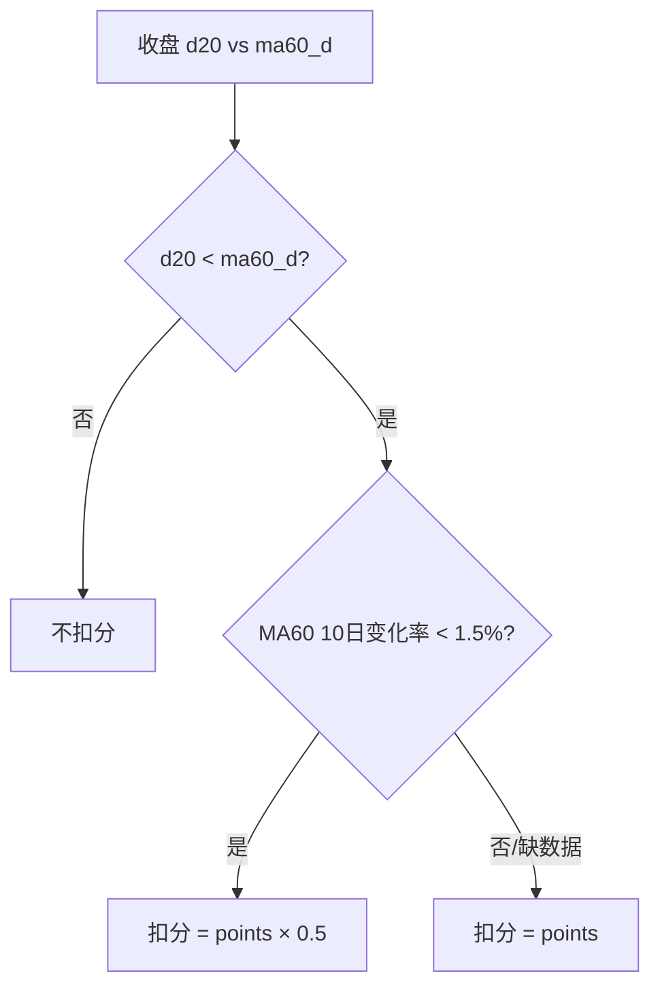

# GMS MA60 走平判定与减分减半实现计划

## 业务背景

当前 [`penalties.py`](backend_core/strategies/gms/scoring/penalties.py) 中 `close_below_ma60` 仅判断 `d20 < ma60_d`，命中则扣满 `points`：

```55:63:backend_core/strategies/gms/scoring/penalties.py
    if rule_id == "close_below_ma60":
        close = _close_price(row)
        ma60 = row.get("ma60_d")
        ...
        return close < ma60_f
```

增强版默认扣 10 分（[`config.py`](backend_core/strategies/gms/config.py)）。新需求：**跌破 MA60 仍扣分，但若 MA60 处于走平状态，扣分减半**（如 10 → 5）。

---

## 走平判定：专家推荐方案

### 为何不用「斜率角度」

一阳穿三线 spec 对短均线用「斜率 &lt; 0.5°」，适合 MA5/MA10 等快速均线。MA60 本身已是 60 日平滑，日变化极小，角度法对噪声敏感、参数难调，且与项目内已有实现不一致。

### 推荐：相对变化率（与 VSB 策略同族）

项目内 3 倍量缩量突破策略对 MA5 走平已有成熟定义：

```239:252:backend_core/strategies/volume_shrink_breakout/strategy_engine.py
def pass_phase2_ma_at_t(closes, t, *, flat_tol):
    ...
    if abs(ma5 - ma5_old) / ma5_old < flat_tol and ma5 >= ma20:
        return True
```

**MA60 走平（默认参数，可配置）：**

```
ma60_flat = |ma60_d - ma60_d_lag| / ma60_d_lag < ma60_flat_tol
```

| 参数 | 默认值 | 说明 |
|------|--------|------|
| `ma60_flat_lookback_days` | **10** | 回看 **10 个交易日**（非自然日）的 MA60 |
| `ma60_flat_tol` | **0.015** | 相对变化 &lt; **1.5%** 视为走平 |

**选型理由（交易语义）：**
- MA60 代表季度级成本中枢；10 个交易日内变化不足 1.5%，说明长期均线横向整理，股价跌破 MA60 更可能是**箱体内震荡/假跌破**，而非趋势性空头。
- 相比 20 日/2% 更灵敏，能更早识别「均线粘合区」；参数可在管理端配置微调。
- **缺数据保守处理**：若 lag 日 MA60 查不到 → 视为**非走平**，扣满分（避免误减半）。



---

## 实现架构


### 1. 新增 MA60 走平工具函数 — [`ma60_source.py`](backend_core/strategies/gms/ma60_source.py)

- `is_ma60_flat(ma60_now, ma60_lag, tol) -> bool`：纯函数，便于单测。
- `batch_lookup_ma60_lag(db, keys, lookback_days) -> Dict[Ma60Key, float]`：
  - 对每个 `(code, date, market_type)`，在 `ma_indicators` 中取 `date < 当前日` 按日期降序的第 N 条记录的 `ma60`（N = lookback_days）。
  - 复用现有 `batch_lookup_ma60_d` 的分块查询模式。
- `enrich_rows_ma60_flat(db, rows, *, lookback_days, tol) -> None`：
  - 在已有 `ma60_d` 基础上写入 `ma60_d_lag`、`ma60_flat`（bool）。
  - 与 `enrich_rows_ma60_d` 串联调用。

### 2. 数据加载入口补全 — [`data_loader.py`](backend_core/strategies/gms/data_loader.py)

在 `_enrich_ma60_missing` 之后增加 `_enrich_ma60_flat`，从 `scoring` 配置读取 `ma60_flat_lookback_days` / `ma60_flat_tol`（缺省用上述默认值）。

### 3. 减分引擎 — [`penalties.py`](backend_core/strategies/gms/scoring/penalties.py)

`PenaltyEngine.apply` 中对 `close_below_ma60` 特殊处理：

- 命中后读取 `row.get("ma60_flat")` 或现场调用 `is_ma60_flat`。
- 规则级开关 `half_when_ma60_flat`（默认 `true`）。
- 走平时：`effective_points = points * 0.5`。
- `penalty_details` 扩展字段：
  - `base_points`：配置满分
  - `points`：实际扣分
  - `ma60_flat`: true/false
  - `ma60_d_lag`（可选，供前端展示）

更新 `PENALTY_RULE_TYPES["close_below_ma60"].description` 说明走平减半逻辑。

### 4. 单股 fallback 路径 — [`stock_screening_routes.py`](backend_api/stock/stock_screening_routes.py)

`_fill_gms_score_fallback` 在 `enrich_rows_ma60_d` 后同样调用 `enrich_rows_ma60_flat`，保证追溯页/单股得分明细与批量选股一致。

### 5. 配置与校验

- [`config.py`](backend_core/strategies/gms/config.py) 默认增强版 `scoring` 增加：
  ```json
  "ma60_flat_lookback_days": 10,
  "ma60_flat_tol": 0.015
  ```
- 默认 `close_below_ma60` 规则增加 `"half_when_ma60_flat": true`。
- [`registry.py`](backend_core/strategies/gms/scoring/registry.py) 的 `validate_scoring_config`：校验 lookback ≥ 1、tol ∈ (0, 0.1)。

### 6. 前端展示

- [`gms_score_detail.js`](frontend/js/gms_score_detail.js)：
  - MA60 行 hint：补充「MA60 走平 / 非走平（10日变化 x.xx%）」。
  - 减分表：`close_below_ma60` 命中且 `ma60_flat` 时，条件列显示「d₂₀ &lt; ma60_d；MA60 走平，扣分减半」。
- [`screening.js`](frontend/js/screening.js) 复制到剪贴板的得分明细同步上述文案。

### 7. 文档

更新 [`docs/GMS_STATE_DETECTION_RULES.md`](docs/GMS_STATE_DETECTION_RULES.md) 第 5.4 节：补充走平定义、默认参数、减半规则、缺数据行为。

### 8. 测试 — [`test/`](test/)

| 文件 | 用例 |
|------|------|
| `test_gms_ma60_source.py` | `is_ma60_flat` 边界；lag 批量查询 |
| `test_gms_scoring_mechanism.py` | 跌破+非走平扣满；跌破+走平扣半；缺 lag 扣满 |
| 可选 smoke | `test_gms_scoring_smoke_compare.py` 输出 `ma60_flat` 列 |

---

## 影响范围与不变项

- **仅增强版** `tiered_dual_penalty` 生效；标准版无减分规则，不受影响。
- **等级判定**仍按减分前基础分（现有约定不变）。
- [`risk_tags.py`](backend_core/strategies/gms/risk_tags.py) 自动沿用 `PenaltyEngine` 实际扣分，无需单独改逻辑。
- 依赖 `ma_indicators.ma60` 历史数据；新上市/MA 未回填的股票 lag 为空 → 不减半。

---

## 部署

- 后端改动后重启 `start_backend_api.py`。
- 无需 DB 迁移（不新增表字段；`ma60_flat` 为运行时计算）。
- 若生产 MA 历史不足 10 日，走平判定自动降级为「非走平」。
