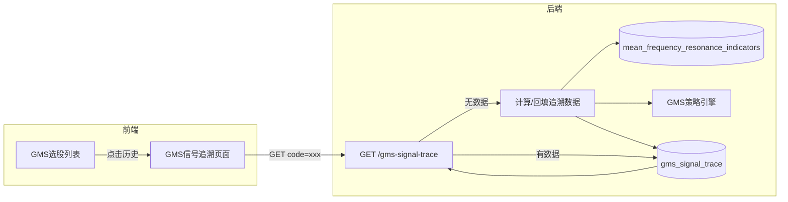

# GMS 信号追溯页面与存储实现方案

## 一、需求理解

- **现状**：GMS 选股列表中的【历史】链接指向 `stock_history.html`（历史行情页面）
- **目标**：【历史】链接改为跳转到新建的「GMS 信号追溯」页面，按日展示该股票的 GMS 策略信号与指标
- **数据范围**：从 `mean_frequency_resonance_indicators` 中该股票有记录的首日，到最新日
- **持久化**：新增 `gms_signal_trace` 表，存储每日 GMS 指标、信号强度、买点类型等

## 二、架构与数据流

## 三、数据库设计

### 3.1 新建表 `gms_signal_trace`

| 列名                 | 类型          | 说明              |
| ------------------ | ----------- | --------------- |
| code               | VARCHAR(20) | 股票代码            |
| date               | VARCHAR(20) | 交易日期 YYYY-MM-DD |
| market_type        | VARCHAR(10) | CN / HK         |
| score_total        | REAL        | 总分              |
| score_accumulation | REAL        | 均值收敛态得分         |
| score_momentum     | REAL        | 动量溢出态得分         |
| signal_strength    | REAL        | 信号强度 0-1        |
| buy_type           | VARCHAR(20) | 左侧/右侧/空         |
| left_buy_signal    | BOOLEAN     | 左侧买点            |
| right_buy_signal   | BOOLEAN     | 右侧买点            |
| sell_signal        | BOOLEAN     | 卖点              |
| accumulation_grade | VARCHAR(5)  | S/A/空           |
| momentum_grade     | VARCHAR(20) | 全速切入/分批买入/空     |
| delta              | REAL        | 宏观位移 Δ          |
| d                  | REAL        | 20日均价           |
| ratio_d20          | REAL        | 偏离率             |
| ratio_d1           | REAL        | 突变率             |
| fz_ratio           | REAL        | F/Z 数方比         |
| volume_ratio       | REAL        | 量比 m₂₀/m        |
| instant_deviation  | REAL        | d₂₀-d           |
| rising_days        | INTEGER     | Z               |
| falling_days       | INTEGER     | F               |
| created_at         | TIMESTAMP   | 创建时间            |

主键：`(code, date, market_type)`

参考文件：[backend_api/models.py](backend_api/models.py)、[database/tables](database/tables)

## 四、后端实现

### 4.1 新增 SQLAlchemy 模型与建表

- 在 [backend_api/models.py](backend_api/models.py) 中新增 `GMSSignalTrace` 模型
- 在 [database/tables](database/tables) 中补充建表 DDL（或在首次启动时通过 migrate/init 创建）

### 4.2 信号追溯计算逻辑

- 在 [backend_core/strategies/gms/](backend_core/strategies/gms/) 或新建 `backend_api/stock/` 下服务模块中实现：
  - 根据 `code`、`market_type` 从 `mean_frequency_resonance_indicators` 查询该股票所有日期（ORDER BY date ASC）
  - 对每个日期调用现有 GMS 引擎（`GMSDataLoader.load_indicators` + `GMSIndicatorsCalculator.calculate` + `GMSSignalDetector`）
  - 将结果写入 `gms_signal_trace`（UPSERT）
  - 策略配置使用当前 `gms_config.json` 默认值（或允许通过参数传入）

### 4.3 API 设计

| 方法  | 路径                            | 说明                |
| --- | ----------------------------- | ----------------- |
| GET | `/api/stock/gms-signal-trace` | 查询某股票的 GMS 信号追溯记录 |

**查询参数**：

- `code`（必填）：股票代码
- `start_date`（可选）：起始日期 YYYY-MM-DD
- `end_date`（可选）：结束日期 YYYY-MM-DD
- `force_compute`（可选）：1 时强制重新计算并覆盖

**响应**：`{ "data": [...], "total": N }`，按 date 降序

**行为**：

1. 若表中无该股票记录且未传 `force_compute`：先执行追溯计算并入库，再返回
2. 若有记录且未传 `force_compute`：直接按日期范围查询返回
3. `force_compute=1`：重新全量计算后返回

路由注册在 [backend_api/stock/stock_screening_routes.py](backend_api/stock/stock_screening_routes.py) 或单独新建 `gms_trace_routes.py` 并在 [backend_api/main.py](backend_api/main.py) 挂载。

## 五、前端实现

### 5.1 新建页面

- **文件**：`frontend/stock_gms_trace.html`、`frontend/js/stock_gms_trace.js`、`frontend/css/stock_gms_trace.css`
- **URL**：`stock_gms_trace.html?code=000001&name=平安银行`
- **功能**：
  - 从 URL 解析 `code`、`name`
  - 调用 `/api/stock/gms-signal-trace?code=xxx` 获取数据
  - 展示表格：日期、总分、信号强度、买点类型、左侧/右侧/卖出、均值收敛态等级、动量溢出态等级、Δ、d、Δ/d₂₀、Δ/d₁、F/Z、量比 等
  - 支持分页或滚动加载
  - 提供「强制重新计算」按钮（传 `force_compute=1`）
  - 样式与 [frontend/stock_history.html](frontend/stock_history.html) 保持一致风格

### 5.2 修改 GMS 选股列表中的【历史】链接

- 文件：[frontend/js/screening.js](frontend/js/screening.js)
- 将 GMS 策略表格中的 `stock_history.html` 替换为 `stock_gms_trace.html`，仅针对 GMS 策略行
- 示例：`<a href="stock_gms_trace.html?code=${stock.symbol || stock.code}&name=${encodeURIComponent(stock.name || '')}" class="action-link" target="_blank">历史</a>`

注意：PVFARS、一阳穿三线等其他策略的【历史】链接保持不变，仍指向 `stock_history.html`。

## 六、实施顺序

1. 数据库：新增 `gms_signal_trace` 表及模型
2. 后端：实现追溯计算逻辑 + GET 接口
3. 前端：新建 GMS 信号追溯页面
4. 前端：修改 GMS 选股列表【历史】链接

## 七、边界情况

- 股票在 `mean_frequency_resonance_indicators` 中无任何记录：返回空列表并提示「该股票暂无 GMS 指标数据」
- A 股与港股共用同一表，通过 `market_type` 区分
- 追溯计算可能耗时较长，建议首次加载时显示「正在计算信号追溯，请稍候」

