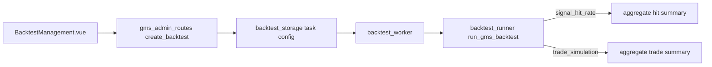

# GMS 回测：任务类型（命中率 vs 交易回测）

## 现状结论

- 管理端创建任务：[backend_api/admin/gms_admin_routes.py](backend_api/admin/gms_admin_routes.py) 的 `BacktestCreateBody` → `config` → `admin_interface.create_backtest`。
- 执行：`[backend_core/strategies/gms/backtest_worker.py](backend_core/strategies/gms/backtest_worker.py)` 调用 `[backend_core/strategies/gms/backtest_runner.py](backend_core/strategies/gms/backtest_runner.py)` 的 `run_gms_backtest`，对每个信号计算 **T+1 开盘价入场**、窗口内 **最高价是否触及 target_pct** 得到 `hit`；汇总为 `hit_rate`、`by_buy_type`、`by_score_bucket`。
- 前端：[admin/src/components/gms/BacktestManagement.vue](admin/src/components/gms/BacktestManagement.vue) + 详情 [admin/src/components/gms/TaskDetail.vue](admin/src/components/gms/TaskDetail.vue)；API 封装 [admin/src/services/gmsApi.ts](admin/src/services/gmsApi.ts)。
- 追溯页也会 `create_backtest`（[backend_api/stock/gms_trace_routes.py](backend_api/stock/gms_trace_routes.py)）：**未传新字段时默认 `signal_hit_rate`**，保持兼容。

## 设计约定（交易回测 v1）

在 **与命中率模式相同的信号产生、min_score、股票池、同标的观察期互斥（`block_until_obs_end`）** 前提下，增加 **交易向出场**：

| 项目 | 约定 |
|------|------|
| 入场价 | 与现逻辑一致：信号日之后 **下一交易日开盘价** |
| 数据粒度 | 使用日线 OHLC（与现有 `historical_quotes` / `historical_quotes_hk` 一致） |
| 止盈 | 持仓区间内，若某日 `high >= entry * (1 + take_profit_pct)`，**按限价止盈价成交**：`exit = entry * (1 + take_profit_pct)`（`take_profit_pct` 默认等于现有 `target_pct`） |
| 止损 | 可选 `stop_loss_pct`（默认 `0` 表示不启用）；若某日 `low <= entry * (1 - stop_loss_pct)`，**按止损价成交**：`exit = entry * (1 - stop_loss_pct)` |
| 同日同时触发 | 保守约定：**先判断止损再判断止盈**（更符合风控口径；在文档/`buy_signal_rule` 中写明） |
| 时间出场 | 若在 `horizon_days` 根bar内未触发止盈止损，**最后一根 K 线收盘价平仓** |
| 费用 | 可选 `commission_bps`（单边）与 `slippage_bps`（双边或单边，实现时选一种并在摘要中写明），默认 `0` |
| 净值曲线（v1） | 将全部成交按 **开仓日升序、同日多笔按 code 字典序** 排序，用 **单笔简单收益率连乘**：`equity *= (1 + r_trade)`，作为**单资金顺序执行近似**（报告摘要中显式说明：未建模同日多标的真实同时持仓与资金占用） |

**命中率模式**：完全保留现有 `_aggregate_details_to_summary` 与 `hit` 语义；交易模式明细行可增加 `exit_date`、`exit_price`、`exit_reason`、`pnl_pct`、`bars_held` 等字段，CSV/XLSX 随 `save_details_*` 一并导出。

## 实现步骤

### 1）配置与 API

- 在 `[backend_api/admin/gms_admin_routes.py](backend_api/admin/gms_admin_routes.py)` 的 `BacktestCreateBody` 增加：
  - `backtest_type: Literal["signal_hit_rate", "trade_simulation"] = "signal_hit_rate"`
  - 交易专用可选字段：`stop_loss_pct`（float，默认 0）、`commission_bps`、`slippage_bps`（float，默认 0）、如需可再拆 `take_profit_pct`（默认沿用 `target_pct` 或与 `target_pct` 同义，避免 UI 重复）
- `create_backtest` 拼装 `config` 时写入上述字段。
- **兼容**：`gms_trace_routes` 不传时 runner 内默认 `signal_hit_rate`。

### 2）Runner 分支

- 在 `[backend_core/strategies/gms/backtest_runner.py](backend_core/strategies/gms/backtest_runner.py)`：
  - 为 `run_gms_backtest` 增加参数 `backtest_type`（或由 `config` 字典传入，worker 解构）。
  - 抽象「取信号后 N 日 OHLC 序列」：` _get_future_ohlc_cn/hk`（日期升序，最多 `horizon_days` 条）。
  - 将 `_gms_evaluate_one_signal` 拆成两种尾部评估：
    - **signal**：保留现有 `hit` / `max_high` 逻辑。
    - **trade**：在 OHLC 序列上按上述规则仿真出场，写明细与 `pnl_pct`。
  - 新增 `_aggregate_trade_summary(details, ...)`：输出 `total_trades`、`win_rate`、`avg_win`、`avg_loss`、`profit_factor`、`total_return_compound`、`max_drawdown`、`equity_curve`（可取每日末权益或每交易一步，v1 用逐步权益列表即可）、以及简述性 `buy_signal_rule` 补充交易规则说明。
  - `signal_hit_rate` 路径仍调用原有 `_aggregate_details_to_summary`。

### 3）Worker

- `[backend_core/strategies/gms/backtest_worker.py](backend_core/strategies/gms/backtest_worker.py)`：从 `config` 读取 `backtest_type` 及交易参数，传入 `run_gms_backtest`；`complete_task` 的 `summary` 需同时兼容两种结构的 consumers（任务详情按类型渲染）。

### 4）管理端前端

- `[admin/src/components/gms/BacktestManagement.vue](admin/src/components/gms/BacktestManagement.vue)`：表单单选项「任务类型」；选「交易回测」时展示 `stop_loss_pct`、费用（bps）等控件；创建请求 body 带上 `backtest_type`。
- `[admin/src/components/gms/TaskDetail.vue](admin/src/components/gms/TaskDetail.vue)`：
  - 展示 `task.config.backtest_type`。
  - `signal_hit_rate`：保持现有命中率表格。
  - `trade_simulation`：展示交易汇总（收益、回撤、盈亏比等），命中率表可隐藏或简化为「样本统计」辅助块（若仍需要可保留 `hit` 作为对照字段，可选）。

- `[admin/src/services/gmsApi.ts](admin/src/services/gmsApi.ts)`：`createBacktest` 类型补充新字段。

### 5）测试

- 在 `test/` 下新增或扩展用例（建议 `test/test_gms_backtest_trade_simulation.py`）：
  - 构造极简伪造 DB 或 mock `Session` + 固定 OHLC 序列，验证 **先止损**、**止盈**、**时间出场** 三种分支之一。
  - 回归：`backtest_type` 默认或不传时行为与现有一致（可用现有 `test/test_gms_backtest_multistock_batch.py` 抽样跑通）。

## 数据流示意

## 风险与后续扩展

- **同日多标**：v1 净值连乘为近似；若需严谨组合回测，二期可增加「固定仓位权重 / 最多同时 K 只 / 资金占用表」。
- **盘中顺序**：日线无法还原真实 intraday，已在规则中固定「先止损后止盈」并文档化。
