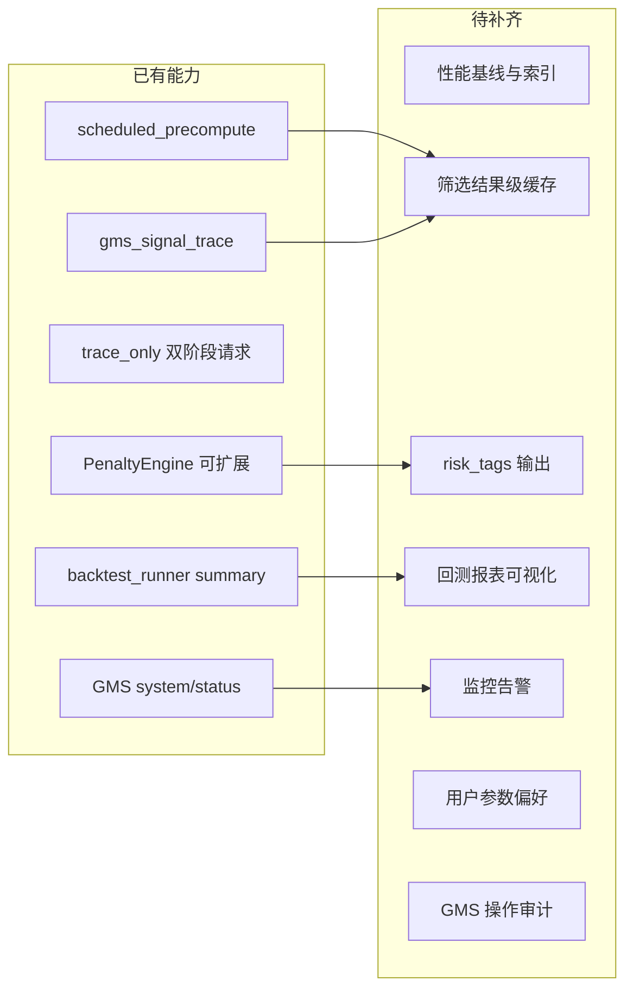
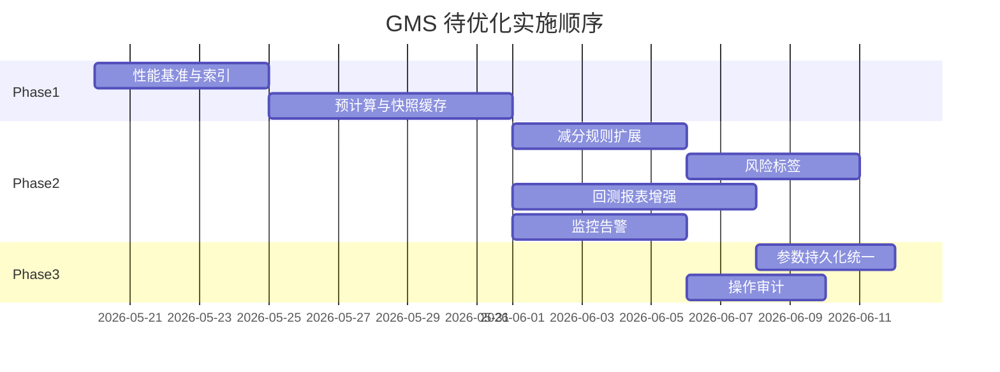

# GMS 待优化事项实现思路计划

## 现状与目标关系

---

## 阶段一：高优先级（性能，1~2 周）

### 1. 全 A 股大批量筛选性能基准与优化

**现状**：[stock_screening_routes.py](backend_api/stock/stock_screening_routes.py) 用 `asyncio.wait_for` + `GMS_SCREENING_TIMEOUT`（默认 600s）；[frontend_interface.py](backend_core/strategies/gms/frontend_interface.py) 先读 `gms_signal_trace`、缺失再增量计算；生产 502 主因是网关超时（见 [GMS选股全A股502说明.md](docs/GMS选股全A股502说明.md)）。

**实现思路**

| 步骤 | 内容 | 产出 |
|------|------|------|
| A. 基准测试 | 在 `test/` 新增性能脚本：固定日期，分别测 `scope=cn` 全量、`trace_only=true/false`、各 `config_id`；记录「trace 命中率、实时计算数、总耗时、DB 查询次数」 | 基线报告（可写入 Excel/日志） |
| B. 索引复核 | 核对 `gms_signal_trace (date, config_id, code)`、`mean_frequency_resonance_indicators (date, code, market_type)` 是否有复合索引；缺失则加 migration | 迁移脚本 + 慢查询对比 |
| C. 计算优化 | 在 [strategy_engine.py](backend_core/strategies/gms/strategy_engine.py) / [frontend_interface.py](backend_core/strategies/gms/frontend_interface.py) 调大批量 `batch_size`、减少重复 Session 查询；缺失股票计算后批量 `commit` 写 trace | 同场景耗时下降 |
| D. 产品策略 | 全 A 股默认走「先 trace_only 快显 → 提示缓存未覆盖再补算」；管理端/文档明确：**预计算未完成时不应期待秒级全量** | 502 发生率下降 |
| E. 运维对齐 | 确认 Nginx `proxy_read_timeout` ≥ `GMS_SCREENING_TIMEOUT`；预计算 cron 在收盘后优先跑完 CN 全量 | 与 [docs/nginx.conf](docs/nginx.conf) 一致 |

**验收标准**：全 A 股在 trace 覆盖率 ≥90% 时，接口 P95 < 30s；trace 未覆盖时返回明确 `gms_trace_meta`（已有字段扩展即可）。

---

### 2. 高频筛选结果缓存策略（与项 1 协同）

**现状**：缓存粒度是**单股单日单 config**（`gms_signal_trace`），不是「一次筛选请求的结果集」；相同 date+scope+config+min_score 仍会重复聚合排序。

**实现思路（推荐轻量方案，不引入 Redis）**

1. **加强预计算覆盖**（低成本）
   - 确保 `default` / `gms_penalty` 的 `precompute_enabled=true`（[config.py](backend_core/strategies/gms/config.py) 已有字段）
   - 预计算任务记录「完成时间、覆盖股票数、config_id」到新表 `gms_precompute_runs` 或写入 `operation_logs`

2. **筛选结果快照表**（中成本，按需）
   - 新表 `gms_selection_snapshots`：`(trade_date, config_id, scope_key, param_hash, result_json 或 row_count, created_at)`
   - `scope_key` = 规范化后的 scope（如 `cn:MAIN`、`industry:BK0475`）
   - `param_hash` = min_score、exclude_st、left_buy_min_accumulation 等 query 参数的 hash
   - 命中快照则直接分页返回，TTL 当日有效；miss 则走现有 trace+计算并异步写入快照

3. **接口行为**
   - [stock_screening_routes.py](backend_api/stock/stock_screening_routes.py) 增加可选 `use_snapshot=true`（默认对全市场 scope 开启）
   - 响应 meta 增加 `cache_layer: trace | snapshot | computed`

**不推荐**：短期上 Redis——当前瓶颈在计算与 DB，trace 表已能覆盖大部分场景。

---

## 阶段二：中优先级（算法与回测，2~3 周）

### 3. 减分规则类型扩展

**现状**：[penalties.py](backend_core/strategies/gms/scoring/penalties.py) 仅 `close_below_ma60`；[registry.py](backend_core/strategies/gms/scoring/registry.py) 已通过 `PENALTY_RULE_TYPES` + `validate_scoring_config` 支持注册；管理端已有 `/penalty-rule-types` API。

**实现思路**

1. **规则注册模式**：每个规则 = `{ id, label, description, default_points, eval_fn }`，统一在 `PENALTY_RULE_TYPES` 注册
2. **建议首批规则**（均基于 MFR 已有字段，无需新采集）：

| 规则 ID | 触发条件 | 数据字段 |
|---------|----------|----------|
| `close_below_ma60` | 已有 | `d20` / `ma60_d` |
| `volume_shrink_after_breakout` | 突破后缩量回落 | `volume_ratio`, `ratio_d1` |
| `momentum_fade` | 动量模块分低于阈值且 fz_ratio 走弱 | `score_momentum`, `fz_ratio` |
| `excessive_deviation` | ratio_d20 超过 overbought 阈值 | `ratio_d20`, config |

3. **管理端**：[StrategyConfiguration.vue](admin/src/components/gms/StrategyConfiguration.vue) 从 API 拉规则元数据，支持启用/禁用与扣分值编辑（已有 schema 校验）
4. **追溯/选股**：`score_detail.penalties[]` 已有结构，前端 [gms_score_detail.js](frontend/js/gms_score_detail.js) 无需大改
5. **测试**：`test/test_gms_scoring_mechanism.py` 每种规则增 1~2 条用例

---

### 4. 信号风险提示标签

**现状**：[signal_detector.py](backend_core/strategies/gms/signal_detector.py) 有 `detect_sell`（乖离过大），但未结构化输出；注释提到「趋势破坏需多日序列，此处不实现」。

**实现思路**

1. **后端新增 `risk_tags: List[dict]`**（在 [strategy_engine.py](backend_core/strategies/gms/strategy_engine.py) 或 detector 层组装）
   - 标签示例：`overbought`（乖离过大）、`volume_weak`（量能不足）、`below_ma60`（结构走弱）、`left_signal_weak`（左侧蓄势不足）
   - 每项含 `{ id, label, level: info|warn|danger, reason }`

2. **规则来源**
   - 复用 `detect_sell`、PenaltyEngine 触发项、左侧/右侧买点未满足的关键条件
   - 趋势破坏：在 [data_loader.py](backend_core/strategies/gms/data_loader.py) 取近 N 日序列，判断 d20 连续跌破 d（与注释一致）

3. **持久化**：写入 `gms_signal_trace` 新 JSON 列 `risk_tags`（migration）或并入现有 `score_detail`

4. **前端**：选股表增加「风险」列（图标+tooltip）；[gms_score_detail.js](frontend/js/gms_score_detail.js) / [GmsScoreDetailBlock.vue](admin/src/components/gms/GmsScoreDetailBlock.vue) 展示标签 chips

---

### 5. 策略效果统计维度扩展

**现状**：[backtest_runner.py](backend_core/strategies/gms/backtest_runner.py) 已区分两类 summary：
- **目标命中率模式**：`hit_rate`、`by_buy_type`、`by_score_bucket`
- **交易模拟模式**：`win_rate`、`profit_factor`、`max_drawdown`、`approx_annual_return_simple` 等

[ReportAnalysis.vue](admin/src/components/gms/ReportAnalysis.vue) 已部分展示，但缺少**持有周期分布、分月收益、信号类型对比图**。

**实现思路**

1. **后端补 aggregate**（在 `_aggregate_trade_summary` / `_aggregate_details_to_summary`）
   - `holding_days_histogram`: `{ "1-3": n, "4-10": n, ... }`
   - `monthly_returns`: `[{ month, return_pct, trade_count }]`
   - `by_signal_type`: 左买/右买/卖 分组胜率与平均 R

2. **报告 JSON 版本号**：`summary_schema_version: 2`，前端兼容旧报告

3. **管理端 UI**：ReportAnalysis 增加 Tab「分布图表」（ECharts：柱状+折线），列表页增加关键 KPI 列

4. **导出**：XLSX 报告增加「统计摘要」sheet

**验收**：同一回测任务，详情页可看到持有天数分布与分月收益，无需重新跑历史任务（新任务自动带新字段）。

---

### 6. 策略执行监控与错误告警

**现状**：[gms_admin_routes.py](gms_admin_routes.py) `/system/status` 仅 `runningBacktests`、`totalReports`；[scheduled_precompute.py](backend_core/strategies/gms/scheduled_precompute.py) 仅 logger，无结构化状态。

**实现思路**

1. **扩展 GMS 健康接口** `/api/admin/gms/system/status`：
   - 各 config 最近预计算：时间、耗时、成功/失败、覆盖数
   - 当日选股 API：超时次数、trace 命中率均值（可从日志或轻量 counters 表统计）
   - 回测队列：pending/running/failed 计数

2. **运行记录表** `gms_job_runs`（job_type: precompute | screening_timeout | backtest_failed）

3. **告警通道**（复用现有推送）
   - 预计算失败 / 连续 2 日未跑完 CN 全量 → 调用 [push_service.py](backend_api/services/push_service.py) 或邮件
   - 阈值可环境变量配置

4. **管理端**：GMSManagementView 顶部健康卡片 + 最近异常列表（只读）

---

## 阶段三：低优先级（体验与审计，1~2 周）

### 7. 前端参数持久化体验统一

**现状**：[screening.js](frontend/js/screening.js) `initGmsStrategyConfig` 已拉 `/api/frontend/gms/strategy-configs`，但仍用 `localStorage.gmsParams` 兜底保存完整参数；管理端 [GmsScreeningResults.vue](admin/src/components/gms/GmsScreeningResults.vue) 同样 localStorage。

**实现思路**

1. **职责分离**
   - **策略参数本体**：只读来自服务端 `gms_strategy_configs`（管理端编辑，前端不 localStorage 全量参数）
   - **用户偏好**：仅持久化 `config_id`、日期范围、scope、分页大小

2. **新增用户偏好 API**（轻量）
   - `GET/PUT /api/user/preferences/gms-screening`（JSON blob 或字段化）
   - 未登录仍可用 sessionStorage 短期兜底，但不再与 server config 冲突

3. **前端改造**
   - 删除 `saveGmsParams` 写 localStorage 全量 body；改为切换 config_id 时 `syncGmsParamsFromServer`
   - 表单「保存」按钮改为「保存筛选偏好」或仅在管理端保留参数编辑

4. **管理端**：筛选条件与网站端共用偏好 API 或继续 localStorage（可选）

---

### 8. 操作审计日志

**现状**：通用 [operation_logs.py](backend_api/admin/operation_logs.py) 面向采集任务；GMS 管理操作（改配置、创建回测、观察股变更）无专用留痕。

**实现思路**

1. **方案 A（推荐）**：扩展 `operation_logs` 表，`log_type` 增加前缀 `gms_*`
   - 事件：`gms_config_update`、`gms_backtest_create`、`gms_watchlist_import`、`gms_precompute_manual`
   - 字段：`log_message`（JSON：操作人、config_id、diff 摘要）、`affected_count`

2. **方案 B**：独立表 `gms_audit_logs`（若需更细字段：before/after JSON）

3. **埋点位置**：[gms_admin_routes.py](backend_api/admin/gms_admin_routes.py) 写操作末尾；[gms_trade_observe_routes.py](backend_api/gms_trade_observe_routes.py) 加入/移除观察

4. **管理端**：复用现有 logs 页面或 GMS 管理下增「操作记录」Tab，按 log_type 筛选

---

## 实施顺序与依赖

| 优先级 | 事项 | 依赖 | 风险 |
|--------|------|------|------|
| 高 | 性能基准 | 无 | 需生产/准生产环境测才准确 |
| 高 | 结果缓存 | 预计算稳定 | 快照与 trace 一致性需测试 |
| 中 | 减分扩展 | MFR 字段 | 规则需业务确认阈值 |
| 中 | 风险标签 | 可选 migration | UI 信息密度需控制 |
| 中 | 回测报表 | 无 | 旧报告兼容 |
| 中 | 监控告警 | 预计算 run 记录 | 告警噪音需阈值调优 |
| 低 | 参数统一 | 用户偏好 API | 影响用户习惯 |
| 低 | 审计日志 | 无 | 存储量随操作增长 |

---

## 每项交付物（不含代码清单）

- 性能：基准测试报告 + 索引 migration + 运维检查项更新到 [日常运维.md](日常运维.md)
- 缓存：预计算运行记录 +（可选）快照表设计与命中率 meta
- 算法：新减分规则说明（补 [GMS_STATE_DETECTION_RULES.md](docs/GMS_STATE_DETECTION_RULES.md)）+ 风险标签词典
- 回测：ReportAnalysis 图表 + summary v2 字段说明
- 运维：GMS 健康看板 + 告警配置说明
- 体验：用户偏好 API + 前端不再 localStorage 全量策略参数
- 审计：GMS 操作可查询、可筛选

---

## 建议首期 MVP（若资源有限）

只做 **阶段一全部 + 阶段二中的「风险标签（只读展示）」+「回测持有周期分布」**，可在约 2 周内显著改善「全 A 股可用性」与「结果可解释性」，其余项按迭代排期。
