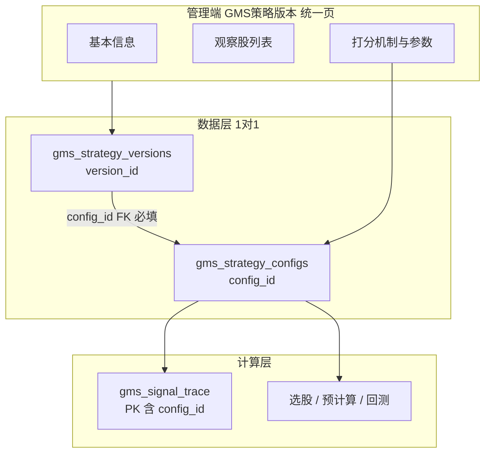

# GMS 按策略版本区分打分机制 — 实施方案（修订版 v2）

> **修订说明：**
> 1. 打分：**标准版**（现网不变）+ **增强版**（标准分 + 可配置减分，如 MA60 下方 -10）。
> 2. 版本管理：**管理体验融合** — 用户只面对一个「GMS策略版本」，同时管理观察股与打分公式；底层保留 `gms_strategy_configs` 供 trace/回测，`gms_strategy_versions` 与 config **1:1 强绑定**。

---

## 1. 版本管理机制（最终选型）

### 1.1 可以融合吗？

**可以。** 但建议采用 **「管理体验融合 + 数据层双表 1:1」**，而不是把两张表物理合并成一张。

| 层级 | 用户看到什么 | 底层存储 | 原因 |
|------|--------------|----------|------|
| **用户层** | 一个「GMS策略版本」 | — | 观察股、打分机制、策略参数在同一页面配置 |
| **业务层** | `gms_strategy_versions` | 版本元数据 + 观察股列表 + **必填 `config_id`** | 与 `gms_watchlist` 选股范围天然对齐 |
| **计算层** | `config_id`（对用户透明） | `gms_strategy_configs.config_params` | trace 主键已含 `config_id`；回测快照已固化 `strategy_config_id` |



### 1.2 为何不物理合并成一张表？

| 若合并为单表 | 问题 |
|--------------|------|
| trace 主键从 `config_id` 改为 `version_id` | 需迁移 `gms_signal_trace` 全量数据与所有 API |
| 全市场选股（非观察股）也要绑版本 | 强行造「无股票列表的版本」，语义别扭 |
| 参数克隆/对比/预计算开关 | 现有 `gms_strategy_configs` 能力需重写 |

**结论：** 融合在 **UI 与业务流程**，不合并 **trace 主键维度**。

### 1.3 与「仅观察股分组」的差异

| 维度 | 现状 | 融合后 |
|------|------|--------|
| `config_id` | 可空，下拉另选参数版本 | **必填**，新建版本时 **自动创建** 配对 config |
| 管理菜单 | 「策略参数配置」+「观察股分组」分离 | **「GMS策略版本」** 主入口；参数配置页降为高级入口或内嵌 Tab |
| 用户心智 | 两套版本概念 | **一套版本** = 股票池 + 打分公式 |
| 网站选股 `gms_watchlist` | 取版本绑定 config | 不变，自动继承版本内打分 |

---

## 2. 打分机制（计算层，不变）

| mechanism | 中文名 | 计算方式 |
|-----------|--------|----------|
| `tiered_dual_max` | 标准版 | `score_total = max(收敛, 动量)`，与现网一致 |
| `tiered_dual_penalty` | 增强版 | `clamp(max(收敛, 动量) - Σ减分, 0, 100)` |

减分规则示例：

```json
"penalty_rules": [
  { "id": "close_below_ma60", "enabled": true, "points": 10, "label": "收盘低于60日均线" }
]
```

- `tiered_dual_max`：`penalty_rules` 必须为空（保证标准版不变）。
- 等级（S/A/全速/分批）按 **减分前** 基础分判定（首期）。

**MA60 数据：** 需在 `mean_frequency_resonance_indicators` 增加 `ma60_d`（推荐），规则条件 `d20 < ma60_d`。

---

## 3. 统一版配置模型（1:1）

创建「GMS策略版本」时 **事务内** 完成：

1. 插入 `gms_strategy_configs`（`name` 与版本名联动，如 `gms_v3_penalty_ma60`）
2. 插入 `gms_strategy_versions`，`config_id` = 上一步 id
3. `config_params.scoring` 写入用户选择的 mechanism + penalty_rules + 阶梯/权重

```json
{
  "scoring": {
    "mechanism": "tiered_dual_penalty",
    "penalty_rules": [
      { "id": "close_below_ma60", "enabled": true, "points": 10 }
    ],
    "weight_acc_fz": 30
  },
  "left_buy": { "...": "..." },
  "right_buy": { "...": "..." },
  "exit": { "...": "..." }
}
```

**约束：**

- 每个 `gms_strategy_versions.config_id` 唯一（一个 config 只服务一个策略版本）。
- 删除策略版本：可选「仅禁用」或「连同专用 config 一并归档」；**禁止**删除仍被 trace 引用的 config（或先标记 inactive）。
- 全市场默认选股：继续使用 `is_default=true` 的 config（可对应「无观察股的全局标准版」，不一定有 strategy_version 行）。

---

## 4. 管理端：GMS策略版本统一页

**新建/改造：** [`admin/src/views/GmsStrategyVersionView.vue`](admin/src/views/GmsStrategyVersionView.vue)（或由 [`WatchlistManagement.vue`](admin/src/components/gms/WatchlistManagement.vue) 升级）

### Tab 结构

| Tab | 内容 | 读写对象 |
|-----|------|----------|
| **基本信息** | 策略编码、版本名、版本号、描述、启用 | `gms_strategy_versions` |
| **观察股** | 现有增删改/import/export | `gms_strategy_version_stocks` |
| **打分与参数** | 机制选择（标准/增强）、减分规则表、阶梯权重阈值 | `gms_strategy_configs.config_params` |

### API（新增或扩展）

| 接口 | 说明 |
|------|------|
| `POST /api/admin/gms/strategy-versions` | **扩展**：同时创建 version + config，返回 `version_id` + `config_id` |
| `PUT /api/admin/gms/strategy-versions/{id}/update` | 更新基本信息；若改打分则同步更新绑定 config |
| `GET /api/admin/gms/strategy-versions/{id}/full` | 返回版本 + 观察股统计 + config_params + mechanism 摘要 |
| `GET /api/admin/gms/scoring-mechanisms` | 机制元数据 |
| `GET /api/admin/gms/penalty-rule-types` | 可用减分规则类型 |

[`StrategyConfiguration.vue`](admin/src/components/gms/StrategyConfiguration.vue)：

- 保留为 **「全局参数模板 / 高级配置」** 入口（维护 default、预计算开关、克隆对比），或内嵌为统一页的「专家模式」。
- 普通用户主路径只进「GMS策略版本」。

### 网站选股页

- `scope=gms_watchlist`：沿用版本内股票 + **版本绑定 config 的打分**（已实现 `config_id` 自动解析，需保证绑定必填）。
- 全市场筛选：版本下拉可展示「策略版本名 + 机制标签」，底层仍传 `config_id`。

---

## 5. 代码架构（计算）

```
backend_core/strategies/gms/scoring/
  tiered_dual_max.py      # 现网逻辑原样
  tiered_dual_penalty.py  # 标准分 + PenaltyEngine
  penalties.py            # close_below_ma60 等
  registry.py
```

[`GMSIndicatorsCalculator`](backend_core/strategies/gms/indicators_calculator.py) 按 `scoring.mechanism` 分发。

---

## 6. 迁移与兼容

1. 现有 `gms_strategy_configs`：补 `mechanism=tiered_dual_max`，`penalty_rules=[]`。
2. 现有 `gms_strategy_versions` 且 `config_id` 为空：为每条 **自动创建** 专用 config 并回写 `config_id`（名称 `auto_{strategy_code}_v{version_no}`）。
3. 已有手动绑定多个版本共用一个 config 的情况：迁移脚本检测冲突，保留第一个，其余版本克隆新 config。

---

## 7. 实施分期

### Phase 1 — 标准打分固化 + 双表 1:1 约束（1~2 天）

- 抽取 `tiered_dual_max`，回归测试
- DB/API：`config_id` 必填规则；新建版本原子创建 config
- 迁移脚本

### Phase 2 — 减分引擎 + MA60（2 天）

- `ma60_d` 入指标表
- `tiered_dual_penalty` + `close_below_ma60`
- 创建示例增强版策略版本（标准版 + 增强版各一）

### Phase 3 — 统一管理页（2 天）

- GMS策略版本三 Tab 页
- 机制/减分表单；列表展示「机制标签」
- 网站选股版本下拉展示机制摘要

### Phase 4 — 验证与文档（1 天）

- 标准版分数零差异回归
- 增强版 MA60 减分可复现
- 更新 [`docs/GMS_STATE_DETECTION_RULES.md`](docs/GMS_STATE_DETECTION_RULES.md)

---

## 8. 验收标准

- 管理端 **一个「GMS策略版本」** 可同时配置观察股与打分机制（含减分），保存后 `version.config_id` 与 `config_params` 一致。
- **标准版**策略版本：打分与改造前完全一致。
- **增强版**策略版本：MA60 下方股票最终分减少 10 分。
- `gms_watchlist` 选股自动使用版本绑定打分；trace / 回测不串版本。
- 不要求用户理解 `config_id`，但技术链路仍可通过 `config_id` 追溯。

---

## 9. 业务示例

| GMS策略版本（用户可见） | version_id | config_id | mechanism | 观察股 | 用途 |
|-------------------------|------------|-----------|-----------|--------|------|
| GMS-V1 标准观察池 | 10 | 1 | `tiered_dual_max` | 自选 50 只 | 现网打分不变 |
| GMS-V2 MA60过滤池 | 11 | 2 | `tiered_dual_penalty` | 自选 50 只 | 同池子用增强减分 |

全市场默认筛选仍用 `config_id=1`（default），不强制关联观察股版本。
