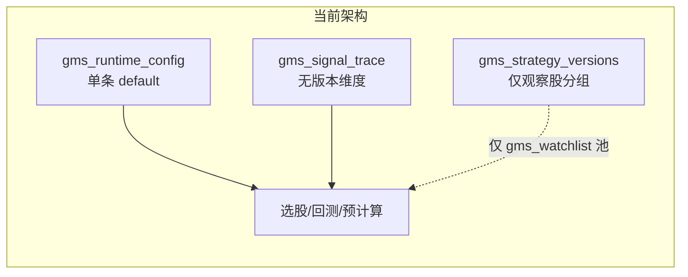
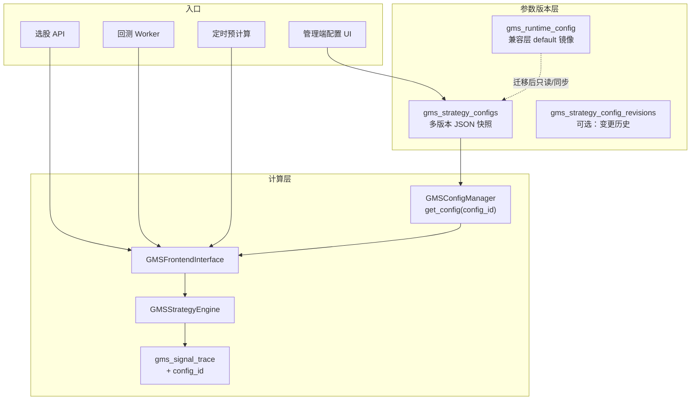
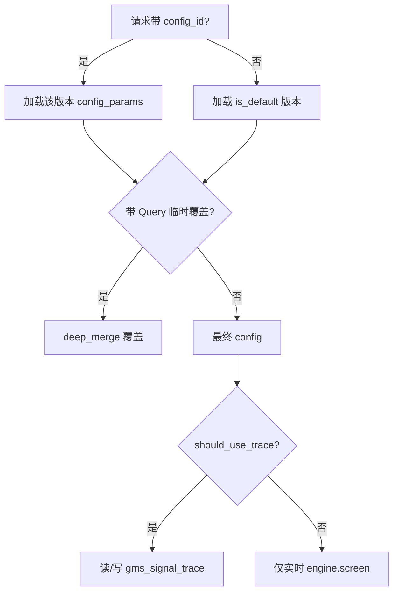

# GMS 策略信号多版本管理实现方案

## 一、现状与核心问题



| 模块 | 现状 | 问题 |
|------|------|------|
| 参数存储 | [`GMSConfigManager`](backend_core/strategies/gms/config.py) 读写 `gms_runtime_config` 单行 `name=default` | 无法保存多份参数快照，改配置即覆盖全局 |
| 信号缓存 | [`GMSSignalTrace`](backend_api/models.py) PK=`(code, date, market_type)` | 多版本参数会互相覆盖 trace |
| 选股 API | [`GET /api/screening/gms-strategy`](backend_api/stock/stock_screening_routes.py) 支持 Query 临时覆盖 | 参数存 localStorage，不落库、不可复现 |
| 回测 | [`backtest_runner.py`](backend_core/strategies/gms/backtest_runner.py) 固定 `GMSConfigManager().get_config()` | 无法指定版本；任务 config 不含策略参数快照 |
| 管理 UI | [`StrategyConfiguration.vue`](admin/src/components/gms/StrategyConfiguration.vue) 纯 JSON 编辑 | 无版本列表、克隆、对比、启用默认 |
| 观察股 | [`gms_strategy_versions`](backend_api/models.py) + stocks 表 | **名称易混淆**：是观察股分组，不是参数版本 |

**可借鉴参考**：PVFRS 已有 [`pvfrs_strategy_configs`](backend_api/models/pvfrs_enhanced.py) 多命名配置 + 回测 `strategy_config_id` 模式，GMS 可对齐该模式并补强 trace/预计算。

---

## 二、目标架构



**设计原则**
- **参数版本** 与 **观察股分组** 解耦；观察股表可增加可选 `config_id` 绑定（见第六节）。
- **向后兼容**：不传 `config_id` 时行为等同当前「默认生产版本」。
- **可复现**：回测创建时固化 `strategy_config_id` + `config_params_snapshot` 写入 `gms_backtest_tasks.config`。
- **Trace 策略（默认推荐）**：仅 `is_default=true` 或 `precompute_enabled=true` 的版本写入/读取 trace；其它版本 **按需实时计算、不写 trace**，控制存储与预计算成本。

---

## 三、数据模型变更

### 3.1 新建 `gms_strategy_configs`

| 字段 | 类型 | 说明 |
|------|------|------|
| id | PK | |
| name | varchar(100) unique | 如 `v1.0-保守左侧` |
| version_label | varchar(32) | 展示用语义版本，如 `1.0.0` |
| description | text | |
| config_params | jsonb | 完整 GMS 参数树（与现 `gms_config.json` 结构一致） |
| is_active | bool | 禁用后不可用于新建任务 |
| is_default | bool | 全局唯一默认（生产选股/预计算） |
| precompute_enabled | bool | 是否参与定时预计算 |
| parent_id | int nullable | 克隆来源，便于谱系 |
| created_by | varchar(50) | |
| created_at / updated_at | datetime | |

索引：`is_default`、`is_active`、`precompute_enabled`。

### 3.2 可选 `gms_strategy_config_revisions`（建议 Phase 2）

每次 PUT 前将旧 `config_params` 写入 revisions（`config_id`, `revision_no`, `config_params`, `changed_by`, `change_note`），支持管理端「历史对比 / 回滚」。

### 3.3 扩展 `gms_signal_trace`

- 新增列 `config_id int NOT NULL`，PK 改为 `(code, date, market_type, config_id)`。
- 迁移脚本：将现有行统一 `config_id = <默认配置 id>`。
- 查询/写入处（[`frontend_interface.py`](backend_core/strategies/gms/frontend_interface.py) `_save_result_to_trace`、`get_selection_results`）均带 `config_id` 过滤。

### 3.4 扩展 `gms_backtest_tasks.config` JSON

新增字段（不破坏现有字段）：
- `strategy_config_id: int`
- `config_params_snapshot: object`（创建任务时深拷贝，防止后续改版本影响历史报告）

### 3.5 观察股分组（可选增强）

在 [`GMSStrategyVersion`](backend_api/models.py) 增加可空 `config_id` FK → `gms_strategy_configs.id`。  
`scope=gms_watchlist` 选股时：若版本绑定了 `config_id` 则自动使用，否则回落默认配置。

### 3.6 迁移与兼容

新建 [`migrations/add_gms_strategy_configs.py`](migrations/) + SQL：
1. 建表 `gms_strategy_configs`。
2. 将 `gms_runtime_config` 中 `default` 行导入为 `id=1, is_default=true, name='default'`。
3. `ALTER gms_signal_trace` 加 `config_id` 并重建 PK。
4. 保留 [`GET/PUT /api/admin/gms/config`](backend_api/admin/gms_admin_routes.py)：**读写默认版本的快捷入口**（内部转 `strategy_config_id=default`）。

---

## 四、后端改造

### 4.1 配置管理器重构 — [`config.py`](backend_core/strategies/gms/config.py)

```python
# 目标 API 面（示意）
class GMSConfigManager:
    def get_config(self, config_id: Optional[int] = None) -> Dict
    def get_config_row(self, config_id: int) -> GMSStrategyConfig
    def list_configs(self, active_only=False) -> List[GMSStrategyConfig]
    def create_config(self, name, config_params, ...) -> int
    def update_config(self, config_id, partial, change_note=None) -> bool
    def clone_config(self, config_id, new_name) -> int
    def set_default(self, config_id) -> bool
    def resolve_config_id(self, config_id=None) -> int  # None -> default
    def should_use_trace(self, config_id) -> bool  # default or precompute_enabled
```

- 内存缓存按 `config_id` 分桶；`save/update/set_default` 时失效对应缓存。
- `get_default_config()` 保留为代码级 fallback，与 DB merge 逻辑不变。

### 4.2 信号计算链路

| 文件 | 改动要点 |
|------|----------|
| [`frontend_interface.py`](backend_core/strategies/gms/frontend_interface.py) | 构造参数 `config_id`；读 trace 带 `config_id`；`should_use_trace` 为 false 时跳过读/写 trace |
| [`strategy_engine.py`](backend_core/strategies/gms/strategy_engine.py) | 无逻辑变更，继续接收 `config` dict |
| [`scheduled_precompute.py`](backend_core/strategies/gms/scheduled_precompute.py) | 遍历 `precompute_enabled OR is_default` 的配置逐份预计算；`.env` 可增加 `GMS_PRECOMPUTE_CONFIG_IDS` 白名单 |
| [`stock_screening_routes.py`](backend_api/stock/stock_screening_routes.py) | 新增 `config_id` Query；优先级：**Query 临时覆盖 > 指定 config_id > default** |
| [`gms_trace_routes.py`](backend_api/stock/gms_trace_routes.py) / [`gms_frontend_routes.py`](backend_api/stock/gms_frontend_routes.py) | 公开接口增加 `config_id`（默认版本） |
| [`gms_admin_routes.py`](backend_api/admin/gms_admin_routes.py) | 新增 `/strategy-configs` CRUD + clone/set-default/compare；`/config` 代理默认版本 |

### 4.3 回测模块

| 文件 | 改动要点 |
|------|----------|
| [`gms_admin_routes.py`](backend_api/admin/gms_admin_routes.py) `BacktestCreateBody` | 增加 `strategy_config_id: Optional[int]` |
| [`admin_interface.py`](backend_core/strategies/gms/admin_interface.py) | 创建任务时解析配置、写入 snapshot |
| [`backtest_worker.py`](backend_core/strategies/gms/backtest_worker.py) | 从 task config 取 `strategy_config_id` / snapshot |
| [`backtest_runner.py`](backend_core/strategies/gms/backtest_runner.py) | `GMSFrontendInterface(db, config=snapshot, config_id=...)` |

回测报告列表/详情展示关联的 `strategy_config_id` 与版本名称。

### 4.4 管理端查询选股

[`query_gms_signal_trace_selection`](backend_api/admin/gms_admin_routes.py) 及 [`GmsScreeningResults.vue`](admin/src/components/gms/GmsScreeningResults.vue) 增加 `config_id` 过滤，与网站选股一致。

---

## 五、前端可视化（管理端为主）

### 5.1 策略参数版本管理页（重构 [`StrategyConfiguration.vue`](admin/src/components/gms/StrategyConfiguration.vue)）

布局建议：

```
┌─────────────────────────────────────────────────────────┐
│ [新建] [从当前克隆] [设为默认] [启用预计算] [保存] [JSON] │
├──────────────┬──────────────────────────────────────────┤
│ 版本列表      │ 分栏表单                                  │
│ ● v1.0 默认   │ 左侧买点 | 右侧买点 | 评分 | 退出 | 权重  │
│   v1.1-beta   │ （字段与 screening 页参数对齐，非裸 JSON） │
│   实验-激进   │ 高级模式：JSON 编辑器（保留现有能力）      │
└──────────────┴──────────────────────────────────────────┘
```

- [`gmsApi.ts`](admin/src/services/gmsApi.ts) 新增 `listStrategyConfigs / create / update / clone / setDefault / getRevisions`。
- 版本对比：选中两个版本，diff `config_params` 关键字段（可用简单 deep-diff 或 JSON patch 展示）。
- 观察股页面 [`WatchlistManagement.vue`](admin/src/components/gms/WatchlistManagement.vue) 文案改为 **「观察股分组」**，可选下拉绑定 `config_id`。

### 5.2 回测创建 — [`BacktestManagement.vue`](admin/src/components/gms/BacktestManagement.vue)

- 增加「策略参数版本」下拉（默认选中 `is_default`）。
- 任务列表/详情展示版本名；rerun 使用原任务 snapshot（已有 config JSON，无需改版本）。

### 5.3 网站选股 — [`screening.js`](frontend/js/screening.js) / 管理端 [`GmsScreeningResults.vue`](admin/src/components/gms/GmsScreeningResults.vue)

- localStorage 从仅存扁平参数 → 存 `{ config_id, overrides? }`。
- 有 `config_id` 时以服务端版本为主，仅 `overrides` 作为临时微调（可选，Phase 2）。
- Phase 1 可简化为：只选 `config_id`，去掉大量 Query 覆盖（减少与版本体系重复）。

### 5.4 用户端信号追溯 — [`stock_gms_trace.js`](frontend/js/stock_gms_trace.js)

- 回测请求体增加 `strategy_config_id`（可选，默认版本）。

---

## 六、参数优先级与边界规则



- 删除版本：若被回测任务引用则 **软删除**（`is_active=false`），禁止物理删除。
- 同时仅允许一个 `is_default=true`（DB 事务内先清零再设置）。
- 禁用默认版本前必须指定新的默认版本。

---

## 七、实施分期

### Phase 1 — 数据与配置 API（基础）
- 建表 + 迁移 `gms_runtime_config` → `gms_strategy_configs`
- 重构 `GMSConfigManager` + Admin CRUD API
- `/config` 兼容层
- 单元测试：配置 CRUD、默认版本唯一性、迁移后 get_config 等价

### Phase 2 — 计算与 trace 贯通
- `gms_signal_trace` 加 `config_id` + 全链路读写改造
- 选股 API / 管理端选股 / 公开 frontend API 支持 `config_id`
- `should_use_trace` 策略落地

### Phase 3 — 回测与预计算
- 回测创建/执行/报告展示 `strategy_config_id` + snapshot
- `scheduled_precompute` 多版本循环
- 测试：[`test/test_gms_backtest_*.py`](test/)、[`test/test_gms_trace_backtest_routes.py`](test/) 增补 config_id 用例

### Phase 4 — 管理端 UI
- 版本列表 + 分栏表单 + 克隆/设默认
- 回测/选股/观察股绑定 UI
- 文档更新：[`docs/GMS回测管理中心设计开发与使用手册.md`](docs/GMS回测管理中心设计开发与使用手册.md)

### Phase 5（可选）— 增强
- `gms_strategy_config_revisions` 历史与回滚
- 版本 diff 可视化
- Walk-forward 脚本 [`manual_scripts/gms_walk_forward_eval.py`](manual_scripts/gms_walk_forward_eval.py) 支持批量多版本评估

---

## 八、测试要点

| 场景 | 期望 |
|------|------|
| 两版本不同 `left_buy.ratio_d20_abs_max` | 同股同日信号结果不同 |
| 默认版本预计算后切换 config_id | 非预计算版本不读默认 trace |
| 回测 rerun | 使用任务内 snapshot，不受后续改配置影响 |
| 不传 config_id 的旧客户端 | 行为与现网一致 |
| 观察股绑定 config_id | `gms_watchlist` 自动用绑定参数 |

测试文件建议新增：[`test/test_gms_strategy_config_versions.py`](test/test_gms_strategy_config_versions.py)。

---

## 九、风险与缓解

| 风险 | 缓解 |
|------|------|
| `gms_signal_trace` PK 变更导致迁移停机 | 提供 SQL 迁移 + 低峰执行；迁移前备份 |
| 名称与 `gms_strategy_versions` 混淆 | UI 改称「观察股分组」；API 新资源用 `strategy-configs` |
| 多版本预计算耗时倍增 | 默认只预计算 `is_default`；其余手动开启 `precompute_enabled` |
| localStorage 旧参数格式 | 前端读取时兼容旧 key，首次访问提示选择版本 |
