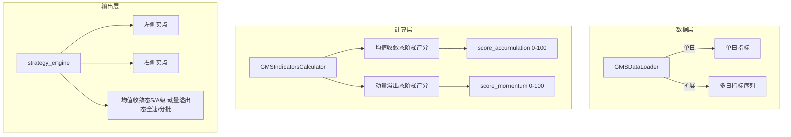

# GMS 精细化评分体系前后端改造方案

## 一、新规与现状对比

### 1.1 评分架构变化


| 维度    | 现状                         | 新规                                                |
| ----- | -------------------------- | ------------------------------------------------- |
| 评分结构  | 单一百分制：蓄势(30)+平衡(40)+动量(30) | 双模块各100分：均值收敛态 / 动量溢出态                            |
| 均值收敛态 | 简单阈值                       | 阶梯式：F/Z、                                          |
| 动量溢出态 | 简单阈值                       | 阶梯式：Δ/d₁、d₂₀-d、m₂₀/m 各档位                          |
| 执行标准  | 总分>60/90                   | 均值收敛态≥85 S级、[70,85) A级；动量溢出态≥90 全速切入、[80,90) 分批买入 |


### 1.2 均值收敛态细化规则（手册第一节）


| 维度         | 权重  | 阶梯规则                        | 现状          |
| ---------- | --- | --------------------------- | ----------- |
| 时间耗散 F/Z   | 30分 | ≥2.5→30；[1.5,2.5)→20；<1.5→0 | ≥1.5→30     |
| 引力粘合       | Δ/d |                             | 40分         |
| 成交量缩 m₂₀/m | 30分 | ≤0.6→30；(0.6,0.8]→15；>0.8→0 | 无阶梯，仅信号用0.8 |


### 1.3 动量溢出态细化规则（手册第二节）


| 维度         | 权重  | 阶梯规则                         | 现状      |
| ---------- | --- | ---------------------------- | ------- |
| 盈亏反转 Δ/d₁  | 40分 | (0%,3%]且斜率陡峭→40；刚过0轴→20；<0→0 | Δ>0即给分  |
| 推力支撑 d₂₀-d | 30分 | 站稳3日→30；仅当日→15；<0→-10        | 未区分     |
| 攻击强度 m₂₀/m | 30分 | ≥2.0→30；[1.5,2.0)→20；<1.5→0  | ≥1.5→30 |


### 1.4 依赖多日数据的能力

- **站稳3日**：需目标日及前 2 日共 3 日 `instant_deviation` 序列
- **Δ/d₁ 斜率**：需多日 `ratio_d1` 才能算斜率（可简化为：仅用当日，斜率相关项暂用「刚过0轴」档）

---

## 二、改造思路总览




---

## 三、后端改造

### 3.1 数据加载扩展

**文件**：[backend_core/strategies/gms/data_loader.py](backend_core/strategies/gms/data_loader.py)

- 新增 `load_indicators_multi_day(codes, end_date, market_type, days=3)`：按 `date <= end_date` 取最近 `days` 日数据，按 code+date 排序。
- 返回结构：`List[Dict]`，每只股票可含多行，便于计算「站稳3日」和 Δ/d₁ 斜率（若实现）。
- 原有 `load_indicators` 保留，供不需要多日场景使用。

### 3.2 指标与评分计算重写

**文件**：[backend_core/strategies/gms/indicators_calculator.py](backend_core/strategies/gms/indicators_calculator.py)

**均值收敛态阶梯评分（满分 100）**：

```python
# F/Z: ≥2.5→30, [1.5,2.5)→20, <1.5→0
# |Δ/d|: ≤0.01→40, ≤0.015→20, >0.015→0  (ratio_d = delta/d)
# m₂₀/m: ≤0.6→30, (0.6,0.8]→15, >0.8→0
```

**动量溢出态阶梯评分（满分 100）**：

```python
# Δ/d₁: (0,0.03]→40(可简化为“刚过0轴”20分), <0→0
# d₂₀-d: 站稳3日→30, 仅当日→15, <0→-10
# m₂₀/m: ≥2.0→30, [1.5,2.0)→20, <1.5→0
```

**输出结构扩展**（GMSIndicators / 返回 dict）：

- `score_accumulation`：均值收敛态总分 0–100
- `score_momentum`：动量溢出态总分 0–100（可含负分）
- `score_total`：保留用于排序，建议 `max(score_accumulation, score_momentum)` 或两模块加权
- `accumulation_grade`：`"S"` / `"A"` / `""`
- `momentum_grade`：`"全速切入"` / `"分批买入"` / `""`

### 3.3 配置与参数

**文件**：[backend_core/strategies/gms/gms_config.json](backend_core/strategies/gms/gms_config.json)

- 均值收敛态：`accumulation_fz_tiers`、`balance_ratio_d_tiers`、`volume_ratio_shrink_tiers`
- 动量溢出态：`ratio_d1_tiers`、`instant_deviation_stable_days`(3)、`volume_ratio_attack_tiers`
- 执行标准：`accumulation_s_threshold`(85)、`accumulation_a_threshold`(70)、`momentum_full_threshold`(90)、`momentum_batch_threshold`(80)

### 3.4 信号与选股

**文件**：[backend_core/strategies/gms/strategy_engine.py](backend_core/strategies/gms/strategy_engine.py)、[backend_core/strategies/gms/signal_detector.py](backend_core/strategies/gms/signal_detector.py)

- 左侧买点：优先用均值收敛态得分与 S/A 级判断。
- 右侧买点：优先用动量溢出态得分与全速/分批判断。
- `score_detail` 需返回：两模块各维度得分、阶梯阈值、等级标签，供前端展示。

### 3.5 API 参数扩展

**文件**：[backend_api/stock/stock_screening_routes.py](backend_api/stock/stock_screening_routes.py)

- 新增可选 Query：均值收敛态/动量溢出态各阶梯阈值、执行标准阈值，用于覆盖 config。
- 与现有一致：以前端传入参数为准。

---

## 四、前端改造

### 4.1 策略说明更新

**文件**：[frontend/screening.html](frontend/screening.html)（GMS 策略说明卡片）

- 将单一百分制说明改为双模块说明。
- 均值收敛态：F/Z、Δ/d、m₂₀/m 阶梯规则及 S/A 级标准。
- 动量溢出态：Δ/d₁、d₂₀-d、m₂₀/m 阶梯规则及全速切入/分批买入标准。
- 风险管理：硬性止损、分级止盈（15%/20%）。

### 4.2 参数面板

**文件**：[frontend/screening.html](frontend/screening.html)、[frontend/js/screening.js](frontend/js/screening.js)

- 均值收敛态：F/Z 档位（2.5/1.5）、Δ/d 档位（1%/1.5%）、地量档位（0.6/0.8）、S/A 阈值（85/70）。
- 动量溢出态：量比档位（2.0/1.5）、推力支撑“站稳3日”开关、全速/分批阈值（90/80）。
- 将上述参数纳入 `getGmsParams()` 并随请求传给后端。

### 4.3 得分明细展示

**文件**：[frontend/js/screening.js](frontend/js/screening.js)

- 拆分为两个表格：「均值收敛态得分」与「动量溢出态得分」。
- 均值收敛态：时间耗散(F/Z)、引力粘合(Δ/d)、成交量缩(m₂₀/m)、小计、等级(S/A)。
- 动量溢出态：盈亏反转(Δ/d₁)、推力支撑(d₂₀-d)、攻击强度(m₂₀/m)、小计、等级(全速/分批)。
- 显示各档位阈值及阶梯规则说明。

### 4.4 结果表格

- 列扩展：均值收敛态得分、均值收敛态等级、动量溢出态得分、动量溢出态等级（可选列或折叠展示）。
- 买点类型仍为「左侧/右侧」，与两模块等级对应。

---

## 五、暂不实现（手册标注）

- A股 T+1 熔断阀（14:30 后量能确认）
- 港股波动补偿阀（Δ/d 1.5% 放宽）
- 大盘共振过滤

---

## 六、实施顺序建议

1. 数据层：扩展 data_loader 支持多日加载。
2. 计算层：indicators_calculator 实现双模块阶梯评分，输出新字段。
3. 配置：gms_config.json 及 API 参数扩展。
4. 策略引擎：strategy_engine、signal_detector 接入新得分与等级。
5. 前端：参数、得分明细、结果表格依次更新。

