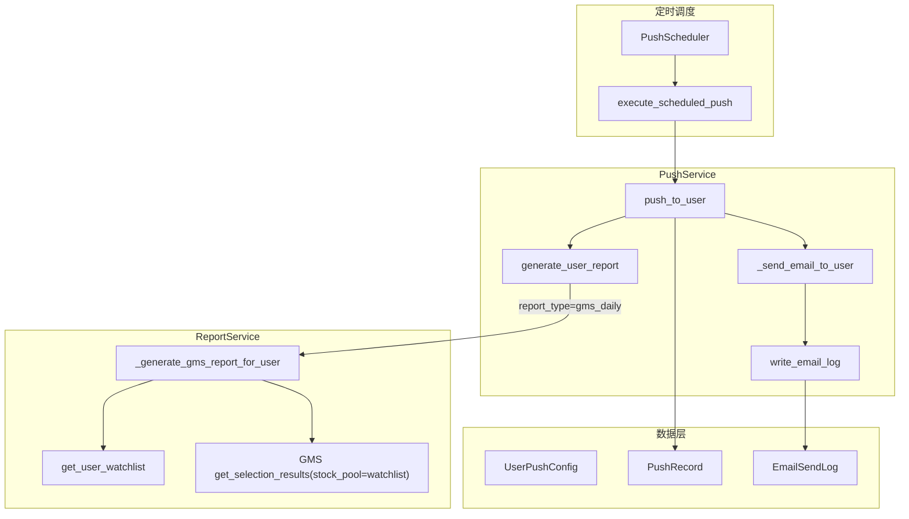

# GMS 自选股邮件推送与管理端实现计划

## 一、需求摘要

- **推送内容**：对每个用户推送**专属于该用户自选股**的 GMS 均值引力策略选股结果（即 GMS 仅在用户自选股池内筛选，结果仅含自选股中通过筛选的标的）。
- **管理端配置**：提供邮件发送配置界面，可管理用户的推送开关、渠道、推送时间、报告类型（含「GMS 自选股」）。
- **发送邮箱参数配置**：在管理端提供发件邮箱（SMTP）参数配置功能，可配置 SMTP 服务器、端口、账号、发件人邮箱/名称、是否 TLS 等，并支持测试发信；发送邮件时优先使用该配置。
- **邮件发送日志**：每次邮件发送（成功或失败）均落库记录，并在管理端提供邮箱发送日志查询功能。

## 二、架构与数据流

## 三、后端实现

### 3.1 报告类型：GMS（按用户自选股）

**文件**：[backend_api/services/report_service.py](backend_api/services/report_service.py)

- 在 `generate_user_report` 中增加 `report_type == 'gms_daily'` 分支。
- 新增 `_generate_gms_report_for_user(self, user_id: int) -> ReportResult`：
  - 调用现有 `get_user_watchlist(user_id)` 得到该用户自选股列表（stock_code, stock_name, market）。
  - 若自选股为空，返回 `success=True, has_data=False`，与现有「无自选股」逻辑一致。
  - 使用 `GMSFrontendInterface(self.db, config).get_selection_results(date=None, stock_pool=watchlist_codes, market="all")` 获取该用户自选股范围内的 GMS 选股结果（date 由接口内部取最新可用日）。
  - 将结果写入 CSV（代码、名称、日期、总分、蓄势/平衡/动量分、买点类型、等级、关键指标等），文件路径建议：`gms_{user_id}_{date}.csv`，避免多用户并发覆盖。
  - 返回 `ReportResult`，`report_info.report_type='gms_daily'`。
- 名称列：若 GMS 结果中无 name，用 watchlist 或 StockBasicInfo/StockBasicInfoHK 补全，与 [stock_screening_routes.py](backend_api/stock/stock_screening_routes.py) 中 GMS 接口补全方式一致。

### 3.2 邮件发送日志

**数据模型**

- 新增表 `email_send_logs`，建议字段：
  - `id` (PK), `user_id` (FK users.id), `to_email`, `subject`, `report_type` (如 summary/detailed/gms_daily), `push_record_id` (FK push_records.id, 可空), `sent_at` (DateTime), `success` (Boolean), `error_message` (Text, 可空), `created_at`。
- 在 [backend_api/models.py](backend_api/models.py) 中新增模型 `EmailSendLog`，并加入导出；若使用迁移脚本，在 [migrations](migrations/) 或项目约定目录增加创建该表的迁移。

**写入逻辑**

- 在 [backend_api/services/push_service.py](backend_api/services/push_service.py) 的 `_send_email_to_user` 中，在调用 `email_service.send_report_email` 之后（无论成功或失败）：
  - 写入一条 `EmailSendLog` 记录：user_id, to_email=user.email, subject, report_type=report_info.report_type, push_record_id=当前推送记录 id（若已有）, sent_at=now(), success=result.success, error_message=失败时的错误信息。
- 可通过在 [backend_api/services/record_repository.py](backend_api/services/record_repository.py) 增加 `create_email_send_log(...)`，或新建 `EmailSendLogRepository`，由 `PushService` 注入并调用，以保持职责清晰。

**查询接口（管理端）**

- 新增管理端接口：`GET /api/admin/push/email-logs`，参数：user_id（可选）、start_date、end_date、success（可选）、limit、offset。
- 返回分页的邮件发送日志列表（含 user_id、username、to_email、subject、report_type、sent_at、success、error_message 等），仅管理员可访问（复用现有 get_current_admin 等鉴权）。

### 3.3 报告类型与配置校验

- 在 [backend_api/push_routes.py](backend_api/push_routes.py) 中，用户更新推送配置的 `PUT /config` 里，将 `report_type` 的合法值从 `['summary', 'detailed']` 扩展为 `['summary', 'detailed', 'gms_daily']`。
- 管理端若需替指定用户更新推送配置，需新增管理员专用接口（见下）。

### 3.4 管理端：修改用户推送配置

- 新增：`PUT /api/admin/push/configs/{user_id}`（或 `PATCH`），请求体与现有用户端更新配置一致（enabled, channels, push_times, report_type, stock_codes 等），仅管理员可调用。
- 实现时调用现有 `ConfigService.update_user_config(user_id, config_update)`，确保 report_type 支持 `gms_daily`。

### 3.5 发送邮箱参数配置

**存储**

- 新增表 `email_sender_config`（或复用通用系统配置表 key-value）：保存发件邮箱参数。建议字段：`id`, `host`, `port`, `username`, `password`（存储时加密或仅存密文），`from_email`, `from_name`, `use_tls` (Boolean), `updated_at`。若采用单行配置，可约定仅保留一条记录（如 id=1）。
- 在 [backend_api/models.py](backend_api/models.py) 中新增模型（如 `EmailSenderConfig`），并做迁移。

**接口**

- `GET /api/admin/push/email-sender-config`：返回当前发件邮箱配置（返回时 **password 脱敏**，如仅显示后几位或返回占位符）。
- `PUT /api/admin/push/email-sender-config`：更新发件邮箱参数（请求体含 host, port, username, password 可选、from_email, from_name, use_tls）；若未传 password 表示不修改密码字段。仅管理员可访问。
- `POST /api/admin/push/email-sender-config/test`（可选）：请求体含 `to_email`，使用当前配置向该邮箱发送一封测试邮件，返回成功/失败及错误信息，便于管理端「测试连接」或「发送测试邮件」。

**发送时读取逻辑**

- 在 [backend_api/push_routes.py](backend_api/push_routes.py) 的 `get_push_service`（或创建 EmailService 的入口）中：优先从数据库读取 `EmailSenderConfig`；若存在且有效则用其构造 `SMTPConfig` 并创建 `EmailService`，否则回退到 [backend_api/config.py](backend_api/config.py) 的 `SMTP_CONFIG`（环境变量）。同理，[start_scheduler.py](start_scheduler.py) 中若需使用统一配置，可改为从 DB 读取或通过共享服务获取。
- 注意：定时任务与 API 使用同一套发件配置逻辑，避免两处不一致。

### 3.6 邮件主题与正文（GMS）

- 在 [backend_api/services/push_service.py](backend_api/services/push_service.py) 中，当 `report_info.report_type == 'gms_daily'` 时：
  - 邮件主题使用：`GMS自选股选股结果 - {report_info.report_date}`（或类似表述）。
  - `_format_email_content` 中为该类型定制 HTML 正文（标题与简要说明，注明详见附件 CSV）。

## 四、管理端前端

### 4.1 邮件推送配置界面

- **路由与菜单**：在 [admin/src/router/index.ts](admin/src/router/index.ts) 中新增路由（如 `path: 'push-config'`）；在 [admin/src/views/AdminLayout.vue](admin/src/views/AdminLayout.vue) 的 `menuItems` 中增加一项，如「邮件推送配置」，指向该路由。
- **页面功能**：
  - 列表：调用 `GET /api/admin/push/configs`（现有接口），展示用户列表及推送配置（用户名、邮箱、启用状态、渠道、推送时间、报告类型等）；可带分页。
  - 编辑：每行或每用户提供「编辑」入口，打开对话框/抽屉，表单字段包括：启用推送、渠道（多选：微信/邮件）、推送时间（多选或输入）、报告类型（下拉：汇总报告 / 详细报告 / **GMS自选股选股**）。
  - 提交：调用 `PUT /api/admin/push/configs/{user_id}`，成功后刷新列表。
- **报告类型选项**：前端下拉选项增加 `gms_daily`，展示名称为「GMS自选股选股」或「GMS 均值引力策略（自选股）」。

### 4.2 发送邮箱参数配置界面

- **路由与菜单**：新增路由（如 `path: 'email-sender-config'`），菜单增加「发送邮箱配置」（或放在「邮件推送配置」同组下）。
- **页面功能**：
  - 表单：调用 `GET /api/admin/push/email-sender-config` 拉取当前配置，展示并可编辑：SMTP 主机、端口、用户名、密码（输入框占位提示「不修改请留空」）、发件人邮箱、发件人名称、是否启用 TLS。
  - 保存：提交时调用 `PUT /api/admin/push/email-sender-config`；未填写密码时请求体不传 password，后端保留原密码。
  - 测试：提供「发送测试邮件」按钮，输入一个收件邮箱后调用 `POST /api/admin/push/email-sender-config/test`，根据返回结果提示成功或失败原因。

### 4.3 邮件发送日志查询界面

- **路由与菜单**：新增路由（如 `path: 'email-logs'`），菜单增加「邮件发送日志」。
- **页面功能**：
  - 查询：调用 `GET /api/admin/push/email-logs`，支持筛选：用户（下拉或搜索）、发送时间范围（start_date、end_date）、发送结果（成功/失败）。
  - 列表：表格展示发送时间、用户、收件邮箱、主题、报告类型、是否成功、失败原因等；支持分页。
  - 无后端分页时可在前端做 limit/offset 或由后端返回分页信息。

## 五、实现顺序建议

1. **后端**：发送邮箱参数配置表与读写/测试接口 → 推送服务创建 EmailService 时优先读 DB 配置 → 报告类型 GMS（按自选股）→ 推送服务中 GMS 邮件主题/正文 → 邮件发送日志表与写入 → 管理端邮件日志查询 API → 管理端修改用户推送配置 API → 用户端 report_type 校验扩展。
2. **管理端前端**：发送邮箱参数配置页（表单 + 保存 + 测试发信）→ 邮件推送配置页（列表 + 编辑，含 gms_daily）→ 邮件发送日志页（筛选 + 表格）。

## 六、关键文件索引

| 项目                       | 路径                                                                                                                                    |
| ------------------------ | ------------------------------------------------------------------------------------------------------------------------------------- |
| 报告生成入口与 GMS 分支           | [backend_api/services/report_service.py](backend_api/services/report_service.py)                                                      |
| GMS 选股接口（stock_pool=自选股） | [backend_core/strategies/gms/frontend_interface.py](backend_core/strategies/gms/frontend_interface.py)                                |
| 邮件发送与日志写入                | [backend_api/services/push_service.py](backend_api/services/push_service.py)                                                          |
| 推送配置校验（report_type）      | [backend_api/push_routes.py](backend_api/push_routes.py)                                                                              |
| 推送记录与邮件日志数据层             | [backend_api/services/record_repository.py](backend_api/services/record_repository.py)、[backend_api/models.py](backend_api/models.py) |
| 发件邮箱配置（当前为环境变量）          | [backend_api/config.py](backend_api/config.py) SMTP_CONFIG；新增表与接口后发送时优先读 DB                                                           |
| 管理端路由与菜单                 | [admin/src/router/index.ts](admin/src/router/index.ts)、[admin/src/views/AdminLayout.vue](admin/src/views/AdminLayout.vue)             |

## 七、测试建议

- 报告：将某用户 report_type 设为 gms_daily，自选股中有标的且指标表有数据，执行一次推送，检查生成的 CSV 是否仅含该用户自选股且为 GMS 筛选结果。
- 日志：发送成功与失败两种情况下，检查 `email_send_logs` 是否各有一条记录，且 success/error_message 正确。
- 管理端：在推送配置页修改某用户为 GMS 自选股并保存；在邮件发送日志页按用户、日期、成功/失败筛选，确认列表与后端一致。

