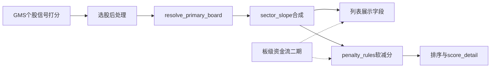

# GMS 与所在行业板块共振联动

## 现状结论

- GMS 引擎/打分**不读**行业板；选股 API 仅事后挂展示字段 `industry`，行业/概念 `scope` 只缩池，板 scope 下才挂 `role_tags`。
- 白皮书（[GMS_逻辑证伪_交易系统白皮书.md](docs/strategies/gms/GMS_逻辑证伪_交易系统白皮书.md)）§6.3「板块走弱」环境过滤**未启用**；「均值频率共振」是个股量价指标，与板块共振无关。
- 可复用：[RPE `resolve_primary_board` / `sector_slope`](backend_core/strategies/rpe/)、[成分与归属](backend_api/utils/industry_board_query.py)、[龙头中军 `board_change_percent_est`](backend_core/board_roles/)、东财 [`industry_board_realtime_quotes`](backend_api/models.py)（仅当日）。**无**板块历史日线表。
- **斜率入库（已落地）**：因无板日线指数，采集行情成功后用成分股日线合成斜率写入 [`industry_board_daily_metrics`](migrations/add_board_daily_metrics.py) / `concept_board_daily_metrics`；**仅 `board_code_source=tonghuashun` 行业+概念板**（其它来源不扫不算不入库）；GMS enrich 优先读库、缺失回退现算（非同花顺跳过）；默认全成分（`board_panel_member_limit=null/0` 不截断）。辅助模块：[sector_slope_store](backend_core/board_metrics/sector_slope_store.py)；挂载点：`RealtimeStockIndustryBoardCollector.run`（概念无独立 realtime，对称刷新）。

### 板块资金流采集核查（已确认）

**结论：当前行业/概念板每日与实时采集均不含资金流量参数。**

| 数据 | 现状 |
|------|------|
| `industry_board_realtime_quotes` | 仅有涨跌、成交额/量、换手、涨跌家数、领涨股等；**无**主力净流入/超大单等列（见 [models.py](backend_api/models.py)、[realtime_stock_industry_board_ak.py](backend_core/data_collectors/akshare/realtime_stock_industry_board_ak.py)） |
| 概念板实时行情表 | **不存在** |
| 板级日线/资金流表与采集任务 | **不存在**（`data_collectors` 无 board fund_flow 脚本） |
| 个股资金流 | [stock_fund_flow.py](backend_api/stock/stock_fund_flow.py) 按需调 AkShare，**未落库**，不宜现算上卷做全市场板强弱 |

本轮板强弱**不能**依赖库内资金流；二期需先补板级采集（或个股资金流落库再按成分上卷）后再并入共振。

## 默认口径（已选定）

**共振 = 主行业板未走弱时个股信号更可信；板走弱则软减分并标标签，不直接否决。**

| 项 | 约定 |
|----|------|
| 主板块 | 同花顺行业优先，多板取成分数最多（对齐 RPE `resolve_primary_board`） |
| 强弱（本轮） | 主：成分日线合成量权基准 \(I_t\) 近 N 日斜率（默认 60）；`slope < 0` 视为板走弱。旁证：当日 `change_percent` / `board_change_percent_est` |
| 资金流（本轮） | **不参与计分**；结果预留 `board_main_net_inflow`（或同名）字段恒为 null + 配置开关 `enable_board_fund_flow=false`，便于二期接入 |
| 计分 | 增强版 `penalty_rules` 新增 `board_weak`（默认减约 8～12 分，可配）；**不加分、默认不硬过滤** |
| 展示 | `primary_board_code/name`、`sector_slope`、`board_weak`、可选当日板涨跌；资金流列可占位「暂无数据」 |
| 明确不做（本轮） | 硬过滤「仅板走强」；RPE Z 直接作 GMS 加分；上线前强依赖资金流 |
| 斜率存储 | 新建日度板指标表（非实时表扩展）：实时表多 tick、斜率属日度成分合成指标 |

## 实现步骤

### 1. 后处理模块（选股路径）

在 [stock_screening_routes.py](backend_api/stock/stock_screening_routes.py) 的 GMS 结果 enrich 阶段（现有 `batch_resolve_industries` / `role_tags` 附近）增加批量逻辑，或抽到 `backend_core/strategies/gms/` 下小模块（如 `board_resonance.py`）：

- 对每只票解析 `primary_board_*`
- 按板缓存合成基准并算 `sector_slope`（复用 [sector_benchmark.py](backend_core/strategies/rpe/sector_benchmark.py)、[data_loader](backend_core/strategies/rpe/data_loader.py) 的成分/日线加载；同板只算一次）
- 写出顶层字段 + `score_detail.board_resonance`（或并入 penalty 明细）；资金流相关键预留为空

性能：全市场扫票时按 `board_code` 分组现算；预计算任务同样注入，避免 live/trace 口径分裂。

### 2. 软减分接入 scoring

- [penalties.py](backend_core/strategies/gms/scoring/penalties.py) / 配置 registry：新规则 `board_weak`（条件：`sector_slope < 0` 或可配阈值）
- [gms config 默认](backend_core/strategies/gms/config.py)：写入可配 `penalty` 分值与 `sector_slope_window`；文档标明环境降权、非证伪一票否决
- 重新汇总 `score_*` 时与现有 `poor_structure_rr` 等软减分同路径

若完整重算成本高：第一刀可在 API enrich 后对已有总分做减法并写 `risk_tags`/`score_detail`（需在注释与文档写清「后处理减分」）；预计算路径应走同一函数以免双口径。

### 3. 前端

- [screening.html](frontend/screening.html) / [screening.js](frontend/js/screening.js)：GMS 表增加「主行业板 / 板斜率 / 板环境」列或 chip；得分明细展示 `board_weak`
- 本轮**不**加「仅板块走强」勾选（留给后续）；全市场结果也可显示主板块（不仅限行业 scope）

### 4. 文档与测试

- 更新白皮书 §6.3 / 信号规则说明：环境软减分已启用、字段与默认参数；注明板级资金流尚未采集、二期计划
- 单测：主板块解析、斜率&lt;0 触发减分、同板缓存；路由冒烟字段存在

### 5. 二期：资金流纳入板强弱（依赖新采集）

目标：将「板块主力净流入」作为强弱**参考因子**（与斜率并用，默认仍软降权而非硬否决）。

建议顺序：

1. 新增板级资金流采集（优先东财行业板资金流接口，若有）写入新表或扩展实时表列（如 `main_net_inflow`、分档净流入）；概念板按需同步。
2. 备选：个股资金流定时落库 + 按 `industry_board_constituents` 上卷（成本高，仅当无板级接口时）。
3. GMS `board_resonance`：读取当日（或近 N 日累计）净流入；配置例如 `fund_flow_weak_threshold`；与 `sector_slope` 组合规则（默认：**斜率走弱或资金净流出明显** → `board_weak`）。
4. 前端展示板资金流；文档补充口径与数据源。

## 后续可选项（仍不在本轮必做）

- 可选硬过滤 `require_board_not_weak`
- 个股 5 日相对板强度（需合成板收益序列）
- 全市场默认挂 `role_tags`（成本更高）
