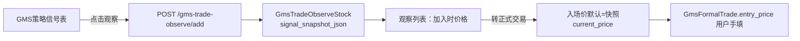
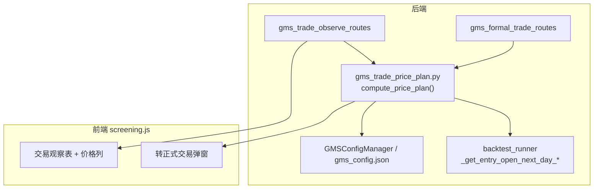

# GMS 交易观察：买入/卖出价格建议实现方案

## 现状与缺口

纳入「交易观察」后，系统**目前不自动给出买卖价建议**，仅做信号快照归档：



| 环节 | 现有行为 | 缺口 |
|------|----------|------|
| 加入观察 | [`_buildGmsTradeObserveSnapshot`](frontend/js/screening.js) 保存 `current_price`、`buy_type`、`d_ma20` 等 | 无 `sell_signal`、无价格计划 |
| 观察列表 | 列「加入时价格」= 信号日收盘价快照 | 无建议买入/止损/止盈 |
| 转正式交易 | [`openGmsFormalTransferModal`](frontend/js/screening.js) 默认 `snap.current_price` | 与回测规则不一致（回测用 **T+1 开盘价**） |
| 卖点 | [`GMSSignalDetector.detect_sell`](backend_core/strategies/gms/signal_detector.py) 仅 `ratio_d20 > 15%` | 未接入观察/正式交易 UI |

回测与文档中已有可复用规则（见 [`docs/GMS交易回测买卖规则说明.md`](docs/GMS交易回测买卖规则说明.md)、[`backtest_runner.py`](backend_core/strategies/gms/backtest_runner.py)）：

- **建议买入价**：信号日后下一交易日开盘价（`_get_entry_open_next_day_cn/hk/etf`）
- **止损价**：`stop_loss_pct=0` 时兜底 **入场价 × 95%**（与 `_simulate_trade_exit` 一致）
- **止盈价**：`入场价 × (1 + target_pct)`，默认 `target_pct=5%`
- **参考卖点（策略层）**：`ratio_d20 > overbought_ratio(15%)` 时提示减仓，非固定价位

---

## 目标行为

观察股纳入后，系统为每条记录生成 **`price_plan`**（交易价格计划），并在前端展示：

| 字段 | 含义 | 计算规则 |
|------|------|----------|
| `buy_price_suggested` | 建议买入价 | 优先 T+1 开盘价；若无下一交易日 K 线则回退信号日收盘价 |
| `buy_price_alt` | 备选买入参考 | 左侧：`d_ma20` 附近（均值收敛锚点）；右侧：信号日收盘（已突破 MA20） |
| `stop_loss_price` | 建议止损价 | `max(结构止损, 入场价×(1-stop_loss_pct))`；一期仅用百分比：`入场×95%`（`stop_loss_pct` 默认 0.05） |
| `take_profit_price` | 建议止盈价 | `入场价 × (1 + target_pct)`，默认 +5% |
| `reference_sell_price` | 参考卖点（乖离） | `d20 × (1 + overbought_ratio)`，来自快照 `d_ma20` + 配置 `exit.overbought_ratio` |
| `params` | 所用参数 | `target_pct`、`stop_loss_pct`、`overbought_ratio`、`buy_type` |
| `computed_at` | 计算时间 | ISO 时间戳 |

**说明**：价格为**系统建议参考**，正式交易仍以用户确认的 `entry_price` 为准；转正式交易时可将 `price_plan` 写入 `signal_snapshot_json` 或 `GmsFormalTrade.notes` 旁路字段供复盘。

---

## 架构设计



### 1. 新增计算服务（核心）

新建 [`backend_core/strategies/gms/trade_price_plan.py`](backend_core/strategies/gms/trade_price_plan.py)（或 `backend_api/services/gms_trade_price_plan.py`，与现有 API 服务风格一致即可）：

```python
def compute_price_plan(
    db: Session,
    *,
    market: str,
    code: str,
    signal_date: date,
    snapshot: dict,
    target_pct: float = 0.05,
    stop_loss_pct: float = 0.05,  # 0 时内部仍用 5% 兜底，与回测一致
    overbought_ratio: float | None = None,  # 默认读 gms_config.exit
) -> dict: ...
```

**实现要点**：
- 复用 [`backtest_runner._get_entry_open_next_day_cn`](backend_core/strategies/gms/backtest_runner.py) 等函数（可抽到 `trade_price_plan.py` 同模块 import，避免重复 SQL）
- `entry` = T+1 open 或 `snapshot.current_price`
- `d20` = `snapshot.d_ma20` 或 `score_detail.d20`
- `reference_sell_price` = `d20 * (1 + overbought_ratio)`（`d20` 缺失则省略）
- 左侧 `buy_price_alt.conservative` = `d_ma20`；右侧 `buy_price_alt` = 信号收盘
- 返回结构化 dict + `notes` 中文说明（如「T+1 开盘价暂不可用，已用信号日收盘」）

**默认参数来源**（一期固定常量，与 [`BacktestCreateBody`](backend_api/admin/gms_admin_routes.py) 默认对齐）：
- `target_pct = 0.05`
- `stop_loss_pct = 0.05`（显式使用 5%，避免回测「传 0 再兜底」的歧义）
- `overbought_ratio` 从当前 GMS 策略配置 `exit.overbought_ratio` 读取

二期可选：从 `user_gms_preferences` 读取用户自定义 `target_pct` / `stop_loss_pct`。

### 2. 扩展交易观察 API

修改 [`backend_api/gms_trade_observe_routes.py`](backend_api/gms_trade_observe_routes.py)：

- `GmsTradeObserveItem` 增加 `price_plan: Optional[dict]`
- 在 `_row_to_item` 或 list 接口中调用 `compute_price_plan(...)`（列表批量时注意 N+1：可按 `(market,code,signal_date)` 批量预取 T+1 开盘价）
- 新增 `GET /api/stock/gms-trade-observe/{id}/price-plan`：单条刷新（观察列表「刷新」时可按需调用）

**加入观察时**（`add_gms_trade_observe`）：
- 扩展前端 [`_buildGmsTradeObserveSnapshot`](frontend/js/screening.js)：补充 `sell_signal`、`ratio_d20`（选股行已有则写入快照）
- 服务端 add 成功后可选将 `price_plan` 写入 `signal_snapshot_json.price_plan`（减少列表重复计算；刷新接口可覆盖）

### 3. 扩展转正式交易流程

修改 [`backend_api/gms_formal_trade_routes.py`](backend_api/gms_formal_trade_routes.py) 与前端：

- `create_from_observe`：若 body 未传 `entry_price`，可用 `price_plan.buy_price_suggested` 作服务端默认（前端仍展示可编辑）
- [`openGmsFormalTransferModal`](frontend/js/screening.js)：默认入场价改为 `price_plan.buy_price_suggested`，无则 `current_price`
- 弹窗增加只读提示区：**建议止损**、**建议止盈**、**参考卖点**、参数说明（5% 止盈 / 5% 止损 / 15% 乖离）
- [`frontend/screening.html`](frontend/screening.html) 转正式交易 modal 增加 `gmsFormalTransferPricePlanHint` 区块

### 4. 观察列表 UI

修改 [`frontend/screening.html`](frontend/screening.html) 表头与 [`renderGmsTradeObserveTable`](frontend/js/screening.js)：

| 新增列 | 展示 |
|--------|------|
| 建议买入 | `buy_price_suggested`（带来源 tooltip） |
| 止损价 | `stop_loss_price` |
| 止盈价 | `take_profit_price` |
| 参考卖点 | `reference_sell_price`（可选列，或合并为「价格计划」展开行） |

保留「加入时价格」列，与「建议买入」区分：**快照价 vs 规则价**。

正式交易列表（[`renderGmsFormalTradeTable`](frontend/js/screening.js)）持仓中可展示「距止损/止盈」百分比（基于当前价 API，二期；一期可只显示计划价）。

### 5. 测试

在 [`test/`](test/) 新增 `test_gms_trade_price_plan.py`：

- T+1 开盘价存在 → `buy_price_suggested` = 开盘价
- 信号日为最近交易日、无 T+1 → 回退 `current_price`
- 止损/止盈公式与 `backtest_runner._simulate_trade_exit` 初始值一致
- 左侧/右侧 `buy_price_alt` 分支
- API 集成：`list` 返回含 `price_plan`

---

## 与白皮书路线图的关系

本方案实现 **§7.2 入场确认** 与 **§8.3 兜底风控** 的**价格量化一期**（百分比止损 + 目标止盈 + 乖离参考卖点）。

**暂不纳入本期**（可单列二期）：
- 证伪预案 `falsification_plan_json`（[`GMS_逻辑证伪_交易系统白皮书.md`](docs/GMS_逻辑证伪_交易系统白皮书.md) §7.1 步骤 3–4）
- 结构止损（跌破 d₁/d₂₀）
- 收盘后每日刷新观察股 `price_plan` 定时任务
- 移动止损/分批止盈的动态价位（需持仓态与最高价）

---

## 关键文件一览

| 文件 | 变更 |
|------|------|
| `backend_core/strategies/gms/trade_price_plan.py` | **新建** 价格计划计算 |
| `backend_api/gms_trade_observe_routes.py` | 列表/详情返回 `price_plan` |
| `backend_api/gms_formal_trade_routes.py` | 转入时附带价格计划（可选默认 entry） |
| `frontend/js/screening.js` | 快照字段、表格列、转正式弹窗 |
| `frontend/screening.html` | 表头与弹窗 UI |
| `test/test_gms_trade_price_plan.py` | **新建** 单测 |

---

## 验收标准

1. 用户将 GMS 信号加入交易观察后，列表可见 **建议买入价、止损价、止盈价**（有数据时）。
2. 点击「转正式交易」，入场价默认填充 **T+1 开盘价**（不可用则为信号日收盘），并展示止损/止盈参考。
3. 计算规则与 [`docs/GMS交易回测买卖规则说明.md`](docs/GMS交易回测买卖规则说明.md) 第 3–4 节默认参数一致。
4. 单测覆盖主要分支，无回归现有观察/正式交易 CRUD。
