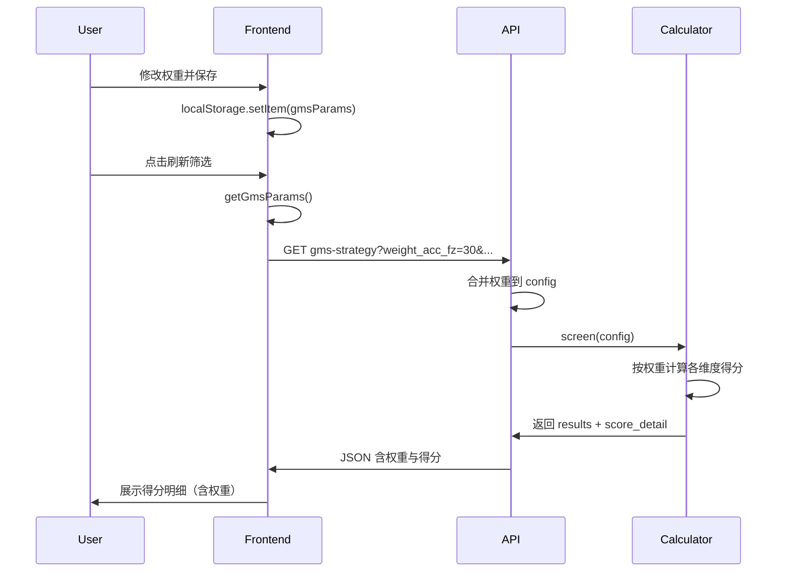

# GMS 评分规则权重参数化方案

## 一、参数清单

依据《交易评分体系细化手册》，将以下 6 个维度的**权重（满分）**设为可配置：


| 模块    | 维度         | 默认权重 | 参数名                  |
| ----- | ---------- | ---- | -------------------- |
| 均值收敛态 | 时间耗散 F/Z   | 30   | weight_acc_fz        |
| 均值收敛态 | 引力粘合       | Δ/d  |                      |
| 均值收敛态 | 成交量缩 m₂₀/m | 30   | weight_acc_volume    |
| 动量溢出态 | 盈亏反转 Δ/d₁  | 40   | weight_mom_ratio_d1  |
| 动量溢出态 | 推力支撑 d₂₀-d | 30   | weight_mom_deviation |
| 动量溢出态 | 攻击强度 m₂₀/m | 30   | weight_mom_volume    |


每模块三项权重默认合计 100 分，用户可自定义（后端按比例参与总分计算）。

---

## 二、前端改造

### 2.1 参数面板 [frontend/screening.html](frontend/screening.html)

在现有 GMS 策略参数卡片中，新增「评分权重」分组：

```
【均值收敛态权重】(合计建议 100)
- 时间耗散 F/Z 权重: [输入框] 默认 30
- 引力粘合 |Δ/d| 权重: [输入框] 默认 40  
- 成交量缩 权重: [输入框] 默认 30

【动量溢出态权重】(合计建议 100)
- 盈亏反转 Δ/d₁ 权重: [输入框] 默认 40
- 推力支撑 d₂₀-d 权重: [输入框] 默认 30
- 攻击强度 权重: [输入框] 默认 30
```

每个输入框设置 `min=0`, `max=100`, `step=1`，并增加简要说明。

### 2.2 参数读写 [frontend/js/screening.js](frontend/js/screening.js)

- **loadGmsParams**：在 `defaults` 中增加上述 6 个权重的默认值；从 localStorage 读取后写入对应 input。
- **getGmsParams**：在返回值中加入 `weight_acc_fz`、`weight_acc_balance`、`weight_acc_volume`、`weight_mom_ratio_d1`、`weight_mom_deviation`、`weight_mom_volume`。
- **saveGmsParams**：保存时写入 `gmsParams`，与现有参数一并持久化。
- **API 请求**：在构建 GMS 筛选 URL 时，将 6 个权重加入 `URLSearchParams` 传给后端（仅当有有效数值时追加）。

---

## 三、后端改造

### 3.1 API 入参 [backend_api/stock/stock_screening_routes.py](backend_api/stock/stock_screening_routes.py)

在 `get_gms_strategy` 中新增可选 Query 参数：

- `weight_acc_fz`, `weight_acc_balance`, `weight_acc_volume`
- `weight_mom_ratio_d1`, `weight_mom_deviation`, `weight_mom_volume`

类型为 `Optional[float]`，默认 `None`。收到非空值时，合并进传入前端的 `config`，覆盖默认权重。

### 3.2 配置合并

在现有「以前端传入参数覆盖 config」逻辑附近，增加对 6 个权重的合并，例如：

```python
config.setdefault("scoring", {})
if weight_acc_fz is not None: config["scoring"]["weight_acc_fz"] = weight_acc_fz
# ... 其余 5 个同理
```

### 3.3 评分计算 [backend_core/strategies/gms/indicators_calculator.py](backend_core/strategies/gms/indicators_calculator.py)

- 在 `__init`__ 中从 `config["scoring"]` 读取 6 个权重，缺失时使用默认值（30/40/30 等）。
- 将原先写死的 30、40、30 替换为对应权重变量，例如：
  - `score_acc` 满足条件时给 `weight_acc_fz` 分
  - `score_bal` 满足条件时给 `weight_acc_balance` 分
  - `score_mom` 满足条件时给 `weight_mom_volume` 分（动量溢出态量比维度）
- 总分 `score_total` = 均值收敛态三档得分之和 + 动量溢出态三档得分之和（与当前结构保持一致，仅数值由权重决定）。

### 3.4 score_detail 回传

在 `strategy_engine` 的 `score_detail` 中，返回实际使用的 6 个权重值，便于前端在得分明细中展示「当前权重配置」。

---

## 四、数据流




---

## 五、信号强度判定与列表展示

### 5.1 信号强度计算（基于得分）

在得分基础上派生 `signal_strength`（0–1），供前端展示与筛选：

- **公式**：`signal_strength = score_total / 100`（总分 0–100 映射为 0–1）
- **等级划分**（与 PVFARS 一致，用于颜色展示）：
  - 强：≥ 0.8（≥ 80 分）
  - 中：0.6 ≤ x < 0.8（60–79 分）
  - 弱：< 0.6（< 60 分）

### 5.2 后端

- **strategy_engine**：在每条结果中增加 `signal_strength = ind.score_total / 100`
- **stock_screening_routes**：把 `r.get("signal_strength")` 写入 `results_data`，传给前端

### 5.3 前端列表展示

- **表头**：[frontend/screening.html](frontend/screening.html) 在「总分」与「买点类型」之间增加列：`<th>信号强度</th>`，空状态行 `colspan` 改为 11
- **表格行**：[frontend/js/screening.js](frontend/js/screening.js) 在 GMS 表格行中增加信号强度 `<td>`，得分明细展开行 `colspan` 改为 11
  - 显示为百分数：`(signal_strength * 100).toFixed(1) + '%'`
  - 按 `signal_strength` 使用 `strength-high` / `strength-mid` / `strength-low` 样式（复用 PVFARS 的 `.strength-high` 等）
- **得分明细**：在得分明细展开区增加一行「信号强度：由总分/100 得出」，说明来源

### 5.4 可选扩展

- 支持 `min_strength` 参数过滤（与 PVFARS 类似），仅展示信号强度 ≥ 阈值的股票
- 支持按信号强度排序

---

## 六、兼容与校验

- 权重为 0 时，该维度不参与计分。
- 信号强度：无 `signal_strength` 时前端用 `score_total/100` 计算，或显示为 `--`。
- 若某权重为负数或非法，后端使用默认值并忽略非法输入。
- 旧版 `gmsParams` 无权重字段时，前端用默认权重，后端用 config 默认值，行为与现有一致。

