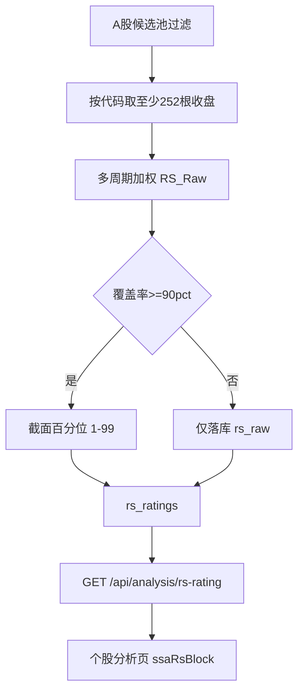
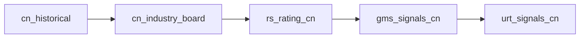

# IBD 股价相对强度（RS Rating）实现方案

## 目标与边界

- **目标**：为 A 股个股提供可横向比较的 RS 评级（1–99），作为个股分析页的独立交易参考，**不并入 RPE/四策略卡片**，也**不替代** RSI / PVFRS「即时强度」。
- **V1 范围**：算法模块 + `rs_ratings` 全市场预计算 + **采集流程节点**接入「A股收盘后标准流程」+ 个股查询 API + 个股分析页展示 + 单测/文档。
- **市场**：**仅 A 股（CN）**；港股不建节点、不建表口径、不写 API。
- **V1 不做**：选股频道按 RS 筛选、RS 历史曲线副图、港股、与 RPE/龙头中军打分联动；**不**在 `main.py` 再挂独立分散 cron（避免与流程编排重复）。

## 算法（锁定）

采用业界对 IBD RS 的常用反推公式（非 IBD 官方开源公式）：

```
ROC(n) = P_t / P_{t-n} - 1   // n 为有效交易日根数
RS_Raw = 0.4×ROC(63) + 0.2×ROC(126) + 0.2×ROC(189) + 0.2×ROC(252)
RS_Rating = round(percentile_rank × 98 + 1)   // 整数 1–99
```

- **价格口径（V1）**：用 `historical_quotes.close` 按交易日序列取 `P_t`、`P_{t-n}`（与多数指标日终表一致）。除权除息对长窗口有影响，文档标明；二期再评估前复权批算。
- **截面宇宙**：当日能算出完整 `RS_Raw` 的 A 股（`LENGTH(code)=6`），且：
  - `stock_basic_info` 存在；
  - `COALESCE(collect_enabled, TRUE)=TRUE`；
  - 名称排除 ST（复用 [`backend_api/utils/st_stock_filter.py`](backend_api/utils/st_stock_filter.py) / 名称含「退」）；
  - 四个窗口均有足够有效交易日收盘价。
- **百分位**：对当日宇宙的 `RS_Raw` 做截面排名；并列用平均秩（可复用/抽离 [`board_roles/classify.py`](backend_core/board_roles/classify.py) 中 `_percentile_ranks` 思路）。覆盖率低于 **90%**（相对候选池）时：该日只写 `rs_raw`、不发布 `rs_rating`（避免残缺宇宙误导）。
- **解读档（展示用，不参与计算）**：≥90 很强；70–89 偏强；50–69 中性；30–49 偏弱；&lt;30 很弱。



## 日终触发：采集流程节点（核心变更）

全市场 RS 预计算作为**独立流程节点**，挂在每日 A 股数据采集链中运行；由流程 cron / 管理端「运行流程」驱动，**不**新增 `main.py` 分散 job。

文档与实现惯例见 [`docs/fixed/COLLECTION_WORKFLOW.md`](docs/fixed/COLLECTION_WORKFLOW.md)、[`backend_core/data_collectors/workflow/`](backend_core/data_collectors/workflow/)。对标已有策略节点：`gms_signals_cn` / `rpe_signals_cn`。

### 节点定义

| 项 | 取值 |
|----|------|
| `node_key` | `rs_rating_cn` |
| 显示名 | A股相对强度RS预计算 |
| category | `strategy`（或 `cn` 指标类；与 GMS/RPE 并列更清晰，用 `strategy`） |
| executor | `exec_rs_rating_cn` → 调用 `scheduled_rs_rating_cn()` |
| 市场 | 仅 CN；**不**注册 `rs_rating_hk` |

### 挂载位置（「A股收盘后标准流程」）

插在 **`cn_industry_board` 之后、`gms_signals_cn` 之前**（原 GMS/URT `order_index` 后移）：

1. 依赖已就绪：`cn_historical` 已写入日 K，且内部已算完 MA/RSI 等（RS 本身只读 close，但保证当日行情完整）。
2. 独立节点：失败可单独重跑 / `on_failure` 可配置，不污染日 K 采集；也不塞进 `_run_indicators_for_date`（全市场截面与单票指标批算模型不同）。



### 接入改动清单

1. [`backend_core/data_collectors/workflow/adapters/__init__.py`](backend_core/data_collectors/workflow/adapters/__init__.py)：新增 `exec_rs_rating_cn`（同 `exec_rpe_cn` 模式）。
2. [`backend_core/data_collectors/workflow/node_registry.py`](backend_core/data_collectors/workflow/node_registry.py)：`NODE_DEFS` 登记 `rs_rating_cn`。
3. **迁移**：向预置「A股收盘后标准流程」插入该节点并调整后续 `order_index`（对标 [`migrations/add_collection_workflow_tables.py`](migrations/add_collection_workflow_tables.py) 模板写法）；已存在库用迁移 `UPDATE`/`INSERT`，避免只改代码不改 DB 模板。
4. 管理端节点库自动出现该节点；亦可在「采集流程」中手动启停/重跑该环节。
5. **不**在 [`main.py`](backend_core/data_collectors/main.py) 增加 `ENABLE_RS_RATING_*` 分散 cron；若 `ENABLE_LEGACY_COLLECTION_CRON=true`，也不为 RS 单独加 legacy job，统一走流程。

手动补算路径：管理端启动整条 A 股收盘流程，或对失败/漏跑的 `rs_rating_cn` 使用「重启环节」。

## 后端计算模块

新建（独立于 RPE）：

- [`backend_core/indicators/rs_rating/`](backend_core/indicators/rs_rating/)
  - `config.py`：窗口 `[63,126,189,252]`、权重 `[0.4,0.2,0.2,0.2]`、覆盖率阈值、解读档
  - `universe.py`：A 股候选池过滤
  - `calculator.py`：单票 `RS_Raw`、批量截面排名
  - `storage.py`：upsert `rs_ratings`
  - `scheduled_precompute.py`：`run_rs_rating_precompute` / `scheduled_rs_rating_cn`（供流程节点调用）
  - `service.py`：个股 as-of 查询（最新有效评级日）

**表 `rs_ratings`（PostgreSQL）**

- 主键：`(code, date, market_type)`，仅使用 `market_type='CN'`
- 字段：`rs_raw`、`rs_rating`（可空）、`roc_63/126/189/252`、`universe_size`、`coverage_ratio`、`created_at`/`updated_at`
- 迁移 + ORM（[`backend_api/models.py`](backend_api/models.py)）

**API**

- `GET /api/analysis/rs-rating?code=&date=`  
  返回：`rs_rating`、`rs_raw`、四分期 ROC、解读档、`trade_date`、`universe_size`、`asof`、无数据原因。
- 只读预计算表，**不在请求内现算全市场**。

## 前端（个股分析页）

1. [`frontend/js/stock_analysis_panel.js`](frontend/js/stock_analysis_panel.js)：`ssaStrategyBlock` 之后、`ssaLevelsBlock` 之前增加 `ssaRsBlock`
2. [`frontend/js/stock_multi_strategy.js`](frontend/js/stock_multi_strategy.js)：并行加载 `loadRsRatingSection`
3. [`frontend/css/analysis.css`](frontend/css/analysis.css) 沿用 `.ssa-block`
4. 可选镜像：[`frontend/analysis.html`](frontend/analysis.html)

展示：大号 RS（1–99）+ 强弱文案；次行四分期涨幅与权重；无数据提示预计算未跑/历史不足/覆盖率不足。

## 测试与文档

- [`test/test_rs_rating_calculator.py`](test/test_rs_rating_calculator.py)：加权、1–99、并列秩、覆盖率护栏
- [`docs/indicators/股价相对强度_RS_Rating.md`](docs/indicators/股价相对强度_RS_Rating.md)
- 更新 [`docs/fixed/COLLECTION_WORKFLOW.md`](docs/fixed/COLLECTION_WORKFLOW.md)：补充 `rs_rating_cn` 节点说明与推荐顺序

## 关键实现顺序

1. 计算器 + 表/ORM + storage  
2. `scheduled_precompute` + **workflow 适配器/节点库/模板迁移**  
3. 查询 API  
4. 个股分析页 UI  
5. 单测与文档  

## 明确不做的混淆点

| 已有能力 | 与本 RS 关系 |
|----------|----------------|
| RPE 比价 Z | 相对**板块**中期偏离；保留，互不替代 |
| RSI | 自身动量振荡；保留 |
| PVFRS 即时强度 | 相对自身均线；不在本页，不改 |
| GMS「相对强度消失」 | 文档规则，本需求不实现 |
| 港股采集流程 | 不挂 RS 节点 |
