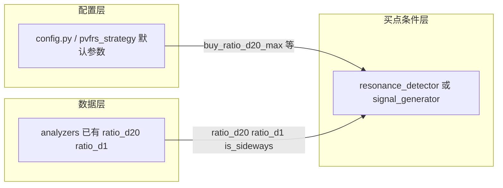

# PVFARS 选股策略整体需求落地计划

本文档将**两图手写笔记**与 [docs/PVFARS量价频幅度共振策略详细说明.md](docs/PVFARS量价频幅度共振策略详细说明.md)（下称《详细说明》）对齐，在买点判断中落实 Δ、Δ/d₂₀、Δ/d₁、F/Z 警示、横盘与 Δ/d₂₀ 上限。

---

## 一、与《详细说明》的对应关系

| 《详细说明》章节         | 内容要点                                                  | 与本次实施的关系                                                                               |
| ---------------- | ----------------------------------------------------- | -------------------------------------------------------------------------------------- |
| **2.1.1–2.1.5**  | Δ = d₂₀−d₁，即时强度 d₂₀−d，d = 20日均价，幅度                    | Δ                                                                                      |
| **2.2.1–2.2.4**  | 条件1 Δ>0，条件2 即时强度为正，**横盘                               | Δ                                                                                      |
| **3.1.0–3.1.3**  | Δᵢ = dᵢ₊₁−dᵢ，Z = count(Δᵢ>0)，F = count(Δᵢ<0)，频率优势 Z>F | 与两图一致；代码中 rising_days/falling_days 即 Z/F                                               |
| **3.3.4 重点关注条件** | **F > Z 且 d₂₀ < d₁**：下跌频率占优且整体下跌，**可作为卖出信号或风险预警**     | 与图1「则位以重来关注」一致；本次实现为**买点排除**：F ≥ Z 且 Δ < 0 时不发出买点（《详细说明》写 F>Z，笔记为 F≥Z，实施采用 F≥Z 以与笔记一致） |
| **3.2 虚假繁荣**     | 单日涨幅>5%、过度涨幅占比>30% 的检测                                | 本次**注释掉**对虚假繁荣的判断，使该条件不参与买点/共振；相关代码保留便于日后恢复                                            |
| **9.1 选股流程**     | 数据获取 → 维度分析 → 共振检测 → 信号生成 → 结果输出                      | 本次改动落在「共振检测/买点条件」环节，不改变整体流程                                                            |
| **11.1 参数配置**    | 最小信号强度 0.6、观察周期 20 天等                                 | 本次新增参数 buy_ratio_d20_max、buy_exclude_sideways 与现有配置并存                                  |

《详细说明》未写「Δ/d₂₀ 越小数越好」；该条来自**图2（趋势论 A）**，本次按两图增加 **ratio_d20 上限** 条件。

---

## 二、两图需求综合

### 图1（位移与频率，对应《详细说明》2.1、2.2、3.1、3.3.4）

- **Δ = d₂₀ − d₁**：20 日位移；|Δ| 为幅度；**Δ = 0 → 横盘**。
- **Δ/d₂₀、Δ/d₁**：位移相对期末价、期初价的比例（已算：`ratio_d20`、`ratio_d1`，见 [analyzers.py](backend_core/strategies/pvfrs/analyzers.py) 第 40–41、50–52 行）。
- **警示条件**：Δi = d_{i+1}−d_i；F = Δi&lt;0 天数，Z = Δi&gt;0 天数。**若 F ≥ Z 且 d₂₀ &lt; d₁（即 Δ &lt; 0）→「则位以重来关注」**：不参与买点或降权。

### 图2（趋势论 A，《详细说明》未单独展开）

- **d = ∑dᵢ/20，m = ∑mᵢ/20**：20 日均价、均量，代码中已有 `avg_price_20d`、`avg_volume_20d`。
- **Δ/d₂₀ 越小数越好**：买点侧希望位移相对当前价不要过大，即用 **Δ/d₂₀ 作为上限**（如 `ratio_d20 < 某阈值`），过滤过度拉升或波动过大的标的。
- **s₂₀-d 条件**：笔记中未给出 s₂₀ 的定义，本次实施**不包含** s₂₀-d 相关逻辑；若日后补充定义再单独加入。

---

## 三、Δ / Δ/d₁ / Δ/d₂₀ 与买点趋势判断思路（概念说明）

以下从交易视角统一说明：三个量属于哪个维度、横盘/涨/跌如何判断、买点趋势下 Δ/d₁、Δ/d₂₀ 应如何理解与使用。

### 3.1 三个量属于哪个维度？

Δ、Δ/d₁、Δ/d₂₀ 均由**价格** d₁、d₂₀ 计算，属于**价格维度**的幅度/趋势强度指标，与频率（Z/F）、成交量（m）无关：

- **Δ** = d₂₀ − d₁：20 日价格的**绝对变化**（元）。
- **Δ/d₁** = Δ ÷ d₁：20 日**涨幅（收益率）**，相对期初价。
- **Δ/d₂₀** = Δ ÷ d₂₀：同一段涨幅占**当前价（期末价）**的比例；因 d₂₀ > d₁，同一次上涨下 |Δ/d₂₀| < |Δ/d₁|。

### 3.2 用 Δ、Δ/d₁、Δ/d₂₀ 判断横盘、涨幅、跌幅

| 判断     | 条件（核心看 Δ） | Δ/d₁、Δ/d₂₀                                |
| ------ | --------- | ----------------------------------------- |
| **横盘** | Δ ≈ 0（或   | Δ                                         |
| **涨幅** | Δ > 0     | 两者都 > 0；Δ/d₁ = 相对期初的 20 日收益率（如 0.05 = 5%） |
| **跌幅** | Δ < 0     | 两者都 < 0                                   |

**方向（横盘/涨/跌）由 Δ 决定**；Δ/d₁、Δ/d₂₀ 是同一趋势下「相对期初价」「相对当前价」的**强度**表达，用于阈值过滤。

### 3.3 买点趋势下：为什么「Δ/d₂₀ 越小越好」？

做多买点要求 Δ > 0（有上涨）。在此基础上：

- **Δ/d₂₀ 大**（如 0.4～0.5）：20 日涨幅占**当前价**比例大 → 往往已涨一大段，易偏高位、追涨、回调风险大 → 买点**不希望** Δ/d₂₀ 过大。
- **Δ/d₂₀ 小**（如 0.05～0.15）：同样是涨，但涨幅占当前价比例小 → 温和上涨或刚启动，相对当前价未「涨过头」 → 买点**更希望** Δ/d₂₀ 小。

因此「Δ/d₂₀ 越小数越好」在实现上体现为：**设上限**（如 ratio_d20 < 0.2～0.5），过滤已拉得过高、相对当前价涨幅过大的标的。

### 3.4 买点趋势下：Δ/d₁ 如何用？

Δ/d₁ = 20 日涨幅，描述「趋势强不强」，买点侧讲究**适度**，不是越小越好：

- **Δ/d₁ 太小**（如 0.01）：趋势弱，买点质量一般。
- **Δ/d₁ 太大**（如 0.3～0.5）：已涨很多，易处阶段高位，买点风险大。
- **适中**（如 0.03～0.15）：有明确上涨且未明显过热，更适合买点。

可设 **下限**（如 Δ/d₁ ≥ 0.02～0.03）表示「有趋势」，**可选上限**（如 Δ/d₁ ≤ 0.15～0.20）表示「不过热」。

### 3.5 买点趋势判断：简洁思路汇总

| 层级            | 看什么       | 买点含义                                                 |
| ------------- | --------- | ---------------------------------------------------- |
| **方向**        | **Δ**     | Δ > 0 才考虑做多；Δ ≈ 0 横盘不做；Δ < 0 下跌不做。                   |
| **趋势强度（别太弱）** | **Δ/d₁**  | 20 日涨幅要够（如 Δ/d₁ ≥ 0.02～0.05）；可选上限防过热（如 ≤ 0.15～0.20）。 |
| **相对当前价别太猛**  | **Δ/d₂₀** | 「涨幅占当前价」要小：Δ/d₂₀ < 上限（如 0.2～0.5），避免已拉高、追涨。           |

一句话：**Δ 定方向，Δ/d₁ 定「趋势够不够、有没有过热」，Δ/d₂₀ 定「相对当前价有没有涨过头」**；横盘时 Δ≈0，Δ/d₁、Δ/d₂₀ 均接近 0。

---

## 四、与现有代码的对应关系

| 需求              | 当前实现                                                                                                        | 缺口                                |
| --------------- | ----------------------------------------------------------------------------------------------------------- | --------------------------------- |
| Δ、Δ/d₂₀、Δ/d₁、横盘 | [analyzers.py](backend_core/strategies/pvfrs/analyzers.py) 已计算并输出                                           | 买点中未用 ratio_d20/ratio_d1；未用「横盘」排除 |
| F、Z（下跌/上涨天数）    | [resonance_detector.py](backend_core/strategies/pvfrs/resonance_detector.py) 中 `rising_days`、`falling_days` | 未实现「F≥Z 且 Δ&lt;0 → 排除」            |
| Δ/d₂₀ 越小越好      | 无                                                                                                           | 需增加「ratio_d20 &lt; 上限」条件          |
| d、m             | 已有 20 日均价、均量                                                                                                | 无                                 |
| s₂₀-d 条件        | 笔记未定义 s₂₀                                                                                                   | 不纳入本次实施                           |

---

## 四、建议的买点逻辑改动（与两图及《详细说明》一致）

### 1. 排除条件：F ≥ Z 且 Δ &lt; 0（图1「则位以重来关注」）

- **位置**：在构造买点条件处（如 [resonance_detector.py](backend_core/strategies/pvfrs/resonance_detector.py) 的 `_check_conditions` 或 [signal_generator.py](backend_core/strategies/pvfrs/signal_generator.py) 的买入前校验）。
- **逻辑**：若 `falling_days >= rising_days` 且 `macro_displacement < 0`，则**不发出买点**（或标记为「弱势/观望」）。
- **数据**：`rising_days`、`falling_days`、`macro_displacement` 均已存在，仅增加一条布尔判断。

### 2. Δ/d₂₀ 越小越好 → 作为买点上限（图2）

- **位置**：同一买点判断处，在已有价格维度条件之后。
- **逻辑**：仅当 `ratio_d20` 有值且 **ratio_d20 &lt; 配置上限** 时允许买（否则过滤）。例如：`ratio_d20 is None or ratio_d20 < buy_ratio_d20_max`。
- **配置**：在 [config.py](backend_core/strategies/pvfrs/config.py)（及 [pvfrs_strategy.py](backend_core/strategies/pvfrs/pvfrs_strategy.py) 的默认参数）中新增 `buy_ratio_d20_max`（如 0.5 或 0.8，表示 50% 或 80%；0 表示不启用该过滤）。
- **说明**：「越小越好」在实现上体现为「不超过某上限」，避免追高或波动过大的位移。

### 3. Δ/d₁ 的用法（可选）

- 图2未对 Δ/d₁ 写「越小越好」，仅图1给出定义。若你希望一起用，可二选一：
  - 同样作**上限**：`ratio_d1 < buy_ratio_d1_max`（防止 20 日涨幅过大、过热）；或
  - 仅作展示与回测分析，暂不参与买点。
- 建议先实现 Δ/d₂₀ 上限，再视需要加 Δ/d₁。

### 4. 横盘（Δ ≈ 0）不参与买点（图1；《详细说明》2.2.4 横盘时建议等待波幅放大）

- **位置**：买点条件中，与 `macro_displacement_positive` 并列。
- **逻辑**：已有 `is_sideways`（|Δ| &lt; ε）。增加：若 `is_sideways == True` 则**不发出买点**（或仅当「突破横盘」逻辑单独实现后再用）。
- **配置**：可沿用现有 `amplitude_flat_threshold`；若需可配置开关，可加 `buy_exclude_sideways`（默认 True）。

### 5. 注释掉虚假繁荣判断（本次新增）

- **意图**：本次修改中**注释掉**对虚假繁荣（单日暴涨>5%、过度涨幅占比>30%）的判断，使该条件不再参与买点/共振；代码保留便于日后恢复。
- **涉及位置**（按 [grep 结果](backend_core/strategies/pvfrs)）：
  - [resonance_detector.py](backend_core/strategies/pvfrs/resonance_detector.py)：`conditions_met['no_false_prosperity']`、`critical_conditions` 中的 `no_false_prosperity`、频率维度得分中对 `has_false_prosperity` 的引用；
  - [signal_generator.py](backend_core/strategies/pvfrs/signal_generator.py)：买入条件中对 `no_false_prosperity` / `has_false_prosperity` 的校验及原因文案；
  - [analyzers.py](backend_core/strategies/pvfrs/analyzers.py)：可选，在频率维度分析中注释掉对 `detect_false_prosperity` 的调用及 `has_false_prosperity` 的写入，或保留计算、仅在共振/买点侧注释使用。
- **做法**：在以上位置用注释禁用「无虚假繁荣」条件（例如条件恒为 True 或从关键条件列表中移除/注释），不删除原有逻辑。

### 6. 频率权重：由 Z > F 改为 F > Z 作为买点判断权重（本次新增）

- **原逻辑**：买点判断中，**上涨天数 Z 大于 下跌天数 F**（即 Z > F，频率优势）作为买点的一个权重/条件。
- **本次修改**：改为 **下跌天数 F 大于 上涨天数 Z**（即 F > Z）作为买点判断的一个权重。
- **涉及位置**：[resonance_detector.py](backend_core/strategies/pvfrs/resonance_detector.py) 中 `conditions_met['frequency_advantage']`（原为 `rising_days > falling_days`，改为 `falling_days > rising_days`）、频率维度得分及关键条件列表中对「频率优势」的引用；[signal_generator.py](backend_core/strategies/pvfrs/signal_generator.py) 中若存在对 Z > F 的显式判断也一并改为 F > Z。
- **与排除条件的关系**：**排除条件「F ≥ Z 且 Δ < 0」保持不变**（仍为「则位以重来关注」、不发出买点）。即：在 Δ < 0（下跌趋势）时，F ≥ Z 仍触发排除；在 Δ > 0（上涨趋势）时，买点权重改为以 F > Z 为正向贡献（下跌天数多于上涨天数作为买点侧的一个权重）。

---

## 六、实施顺序与涉及文件

1. **配置**：在 [config.py](backend_core/strategies/pvfrs/config.py) 与策略默认参数中增加 `buy_ratio_d20_max`（及可选 `buy_exclude_sideways`）。
2. **买点条件**：在 [resonance_detector.py](backend_core/strategies/pvfrs/resonance_detector.py) 的 `_check_conditions`（或统一入口）中：
  - 增加「F ≥ Z 且 Δ &lt; 0 → 不满足买点」；
  - 增加「ratio_d20 不为空且 ratio_d20 &lt; buy_ratio_d20_max」；
  - 增加「is_sideways 为 True 则不满足买点」（若启用）；
  - **注释掉**对虚假繁荣（no_false_prosperity / has_false_prosperity）的判断，使该条件不参与共振/买点；
  - **频率权重**：将「Z > F（频率优势）」改为「F > Z」作为买点判断的一个权重（`frequency_advantage` 等由 `rising_days > falling_days` 改为 `falling_days > rising_days`）。
3. **虚假繁荣**：在 [resonance_detector.py](backend_core/strategies/pvfrs/resonance_detector.py)、[signal_generator.py](backend_core/strategies/pvfrs/signal_generator.py) 中注释掉对虚假繁荣的依赖（条件恒为 True 或从关键条件中移除）；可选在 [analyzers.py](backend_core/strategies/pvfrs/analyzers.py) 注释调用 `detect_false_prosperity` 或保留计算仅下游不用。
4. **传参**：确保价格维度把 `ratio_d20`、`ratio_d1`、`is_sideways` 传入上述条件判断处（[strategy_engine.py](backend_core/strategies/pvfrs/strategy_engine.py) 等已传 PVFRSIndicators，需在条件中从 indicators 取用）。

实施时保持与《详细说明》**9.1 选股流程**一致：条件判断发生在「共振检测」阶段（[resonance_detector.py](backend_core/strategies/pvfrs/resonance_detector.py) 或 [signal_generator.py](backend_core/strategies/pvfrs/signal_generator.py) 的买入前校验），不改变数据获取与维度分析的计算方式。

---

## 七、可选确认

**Δ/d₁ 是否参与买点**：首版是否加 `buy_ratio_d1_max`（上限）过滤，还是仅用 Δ/d₂₀ 上限即可？若暂不确认，可先只实现 Δ/d₂₀ 上限与 F/Z 排除、横盘排除。