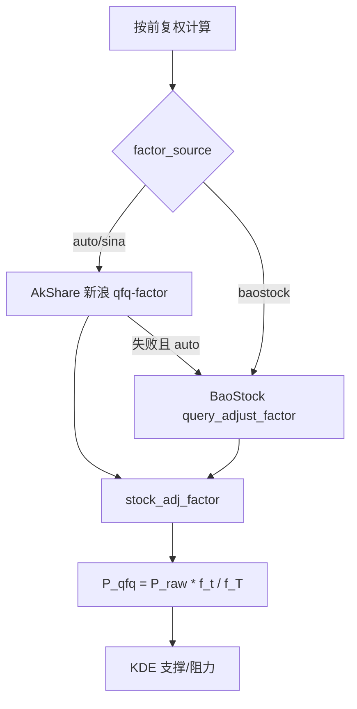

# RPE 前复权改造方案（更新版）

## 1. 背景结论

| 问题 | 结论 |
|------|------|
| 比价模型日 K **应该**用什么 | **前复权** |
| 日终主路径实际写什么 | **不复权现价**：实时 → `historical_quotes` |
| 稳健架构（方案 C） | 库内只存 **不复权行情 + 每日复权因子**，查询/内存现算 |
| 因子主源 | AkShare 新浪 `stock_zh_a_daily(adjust="qfq-factor")` |
| **因子备用源（新增）** | **BaoStock** `query_adjust_factor` → 字段 `foreAdjustFactor`（向前复权因子）；`source=baostock_qfq` |
| Tushare `adj_factor` | 权限不足时不作主路径；留二期 |

## 2. 本期范围

已落地：采集不变、`stock_adj_factor`、支撑压力默认不复权 +「按前复权计算」。

**本次增量**：复权因子调用增加 **BaoStock 备用源**，并支持选择：

| `factor_source` | 行为 |
|------------------|------|
| `auto`（默认） | 先新浪；失败再 BaoStock |
| `sina` | 仅新浪 |
| `baostock` | 仅 BaoStock |

## 3. BaoStock 约定

- 依赖：`baostock`（写入 `requirements.txt` / `backend_api/requirements.txt`）
- 代码：`sh.600519` / `sz.000001`（`to_baostock_symbol`）
- 接口：`bs.login()` → `bs.query_adjust_factor(code, start_date, end_date)` → `bs.logout()`
- 入库因子：取 **`foreAdjustFactor`**，事件日序列 + 读层 forward-fill（与现公式一致）
- `source` 字段：`baostock_qfq`；新浪仍为 `akshare_sina_qfq`

注意：两家因子数值未必逐位一致；结果区展示实际 `adj_factor_source`。

## 4. 接口与前端

- `GET /api/analysis/levels/...?adjust=qfq&factor_source=auto|sina|baostock&refresh_factor=0|1`
- 支撑压力页：因子源下拉（自动 / 新浪 / BaoStock），默认「自动」
- 结果 meta 标明实际来源

## 5. 验收（本次）

- 新浪失败时 `auto` 能落到 BaoStock 并算出支撑压力
- `factor_source=baostock` 强制走备用源
- 未安装 baostock 时给出中文提示（`pip install baostock`）
- 相关单测 mock 通过
