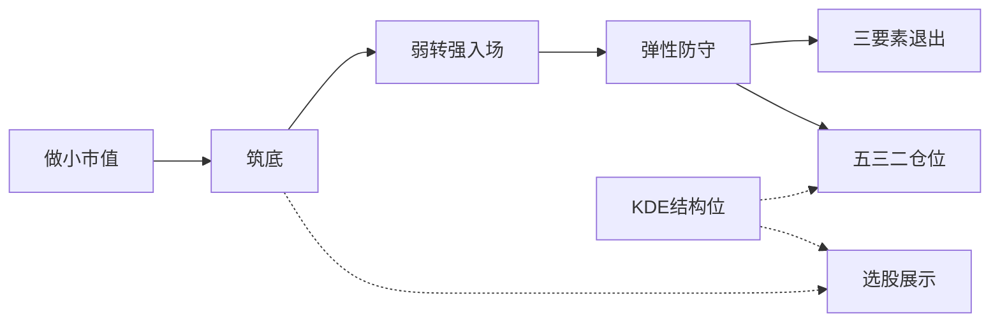

# SBBR 做小做底：支撑阻力与规则优化

## 规则现状与优化判断

当前流水线：做小 → 筑底 → 弱转强入场 → 防守/退出 → 五三二仓位（见 [docs/strategies/sbbr/SBBR_做小做底_信号计算规则.md](docs/strategies/sbbr/SBBR_做小做底_信号计算规则.md)）。

| 问题                          | 现状                                                        | 本次处理                          |
| --------------------------- | --------------------------------------------------------- | ----------------------------- |
| 箱体支撑/阻力未露出                  | 已在 `bottom_detector` 算出，仅埋在 `detail`                      | 提升为顶层字段并上表                    |
| 无 KDE 结构位                   | URT/RPE/GMS 有，SBBR 无                                      | 复用 `gms.structure_levels`     |
| 「上方支撑确认」虚化                  | `evaluate_position` 用 `not breached`；选股用 `bottom_matched` | 改为真实结构确认                      |
| 高位盘整窗口                      | `near_high` 相对全部已加载 K 线最高点                                | 改为自入场日起算                      |
| 换手退出                        | `turnover_rate` 缺失时 sum=0 永假                              | 用成交额/流通股本估算回退                 |
| 流通市值 5~10 亿过窄、大盘代理 `000001` | 有优化空间                                                     | **本轮不改默认阈值**（避免改变选股分布；可在文档标注） |

前复权：选股表增加与 URT 同款「按前复权计算」按钮，调用已有 `POST /api/analysis/levels/batch`，只刷新列表中的 KDE 列，不改写策略信号。

---

## 1. 引擎：写入箱体位 + KDE

文件：[backend_core/strategies/sbbr/strategy_engine.py](backend_core/strategies/sbbr/strategy_engine.py)、[config.py](backend_core/strategies/sbbr/config.py)

- `evaluate_code` / `evaluate_position` 拉 K 线时按 `kde_bars_limit(cfg)` 扩窗（默认覆盖 `kde_lookback_max≈750`），再截断做原有 60/120 逻辑。
- 调用 `compute_structure_levels(bars_desc, cfg, price=close)`（bars 需 DESC）。
- 返回字段（顶层，便于前端与快照）：
  - `box_support` / `box_resistance`（来自筑底）
  - `nearest_support` / `nearest_resistance`
  - `kde_ok` / `kde_reason` / `kde_lookback_used`
- 默认 config 增加与 GMS 对齐的 `structure`/`kde` 子节（lookback 等），不改 size/entry 阈值。

---

## 2. 「上方支撑确认」规则（加仓门闩）

新增小函数（建议放在 `defense_exit.py` 或独立 `support_confirm.py`）：

`**support_confirmed = True` 当且仅当：**

1. 防守未破位（`close >= defense_low`）
2. KDE 有效且 `close > nearest_support`
3. 箱体确认（二选一）：
  - 横盘底且有 `box_resistance`：`close >= box_resistance * (1 - tol)`（默认 tol=1%，表示站上原阻力、阻力转支撑）
  - 无箱体阻力（如黄金坑）：仅要求 1+2，且 `close >= MA20`

`evaluate_position` 将 `has_new_support=support_confirmed(...)` 传入 `advise_position`；返回体带上 `support_confirm` 明细供正式交易页展示。

选股日 `evaluate_code` 的 `position_advice` 仍为试探阶段（`stage=None`），不因 `bottom_matched` 误触发「可加仓」。

---

## 3. 退出规则修补

文件：[backend_core/strategies/sbbr/defense_exit.py](backend_core/strategies/sbbr/defense_exit.py)

- **高位盘整**：用 `entry_idx`（由 `entry_date` 在 bars 中定位）后的子序列算 `hi` / 近 N 日窗口；无入场日则退回全序列（兼容旧调用）。
- **换手**：近 N 日若缺 `turnover_rate`，用 `amount / (free_float_shares * close)` 估日换手（需 loader 在 evaluate_position 传入流通股本，或 bar 上已有字段）；仍全缺则 `turnover_ok=False` 且 `turnover_reason=missing_data`（避免静默当 0）。

`evaluate_position` 把 `entry_idx` 传入 `evaluate_exit_factors`。

---

## 4. 前端展示

- [frontend/screening.html](frontend/screening.html)：SBBR 选股表增加列「箱体支撑 / 箱体阻力 / KDE支撑 / KDE阻力」；工具栏加 `sbbrQfqLevelsBtn`。
- [frontend/js/sbbr_screening.js](frontend/js/sbbr_screening.js)：渲染上述字段；前复权按钮复用 URT 的 `levels/batch` 模式，写回行内 `nearest_support`/`nearest_resistance`。
- 正式交易列表：在「最新评估」旁展示支撑确认结果（是/否 + 简短原因）。

观察列表快照已存整行 JSON，新字段会自然进入快照，无需改表结构。

---

## 5. 文档与测试

- 更新 [SBBR_做小做底_信号计算规则.md](docs/strategies/sbbr/SBBR_做小做底_信号计算规则.md) §7 支撑确认、§6 退出窗口/换手回退；业务版补一句「列表可见箱体+KDE」。
- [test/test_sbbr_detectors.py](test/test_sbbr_detectors.py)：新增 `support_confirmed` 用例；修正 `evaluate_exit_factors` 入场后高点与换手缺失行为。
- 不改流通市值默认区间（文档注明「可配置、偏窄」即可）。

