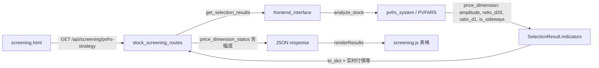

# 选股策略 PVFARS 更名与价格维度幅度展示

## 现状

- **前端**：[`frontend/screening.html`](frontend/screening.html) 策略 tab 为「PVFRS三维共振」，策略说明与导出文件名亦为 PVFRS；价格维度列仅展示 `price_dimension_status`（当前为「宏观位移: X.XX」）。
- **前端逻辑**：[`frontend/js/screening.js`](frontend/js/screening.js) 请求 `/api/screening/pvfrs-strategy?scope=...`，渲染表格时使用 `stock.price_dimension_status`，导出 CSV 时文件名含「PVFRS三维共振」。
- **后端**：[`backend_api/stock/stock_screening_routes.py`](backend_api/stock/stock_screening_routes.py) 的 `/pvfrs-strategy` 使用 `create_frontend_interface().get_selection_results()`，即 PVFARS 策略；`price_dimension_status` 主要来自 DB 的 `macro_displacement_delta`，或回退到 `price_indicators`（策略结果），但**未包含**幅度 |Δ|、ratio_d20、ratio_d1、is_sideways。
- **策略输出**：`get_selection_results` 使用 `pvfrs_system.analyze_stock`，其 `strategy_analysis['price_dimension'] `来自 `PriceDimensionAnalyzer.analyze()`，已包含 `amplitude`、`ratio_d20`、`ratio_d1`、`is_sideways`；这些字段经 `indicators['price_dimension']` 或 `resonance_analysis.details['price_indicators']` 传入 screening 路由。

## 目标

1. **策略名称**：模块内展示统一为 **PVFARS**（量价频幅度共振）。
2. **价格维度**：价格维度列**需包含幅度数据**（|Δ|、Δ/d₂₀、Δ/d₁、横盘）。
3. **后台**：继续调用最新 **PVFARS 策略**（已满足，仅需确认未被绕过）。

---

## 实施项

### 1. 前端 - 策略名称与说明（screening.html）

- **Tab 按钮**：`data-strategy="pvfrs"` 的按钮文案由「PVFRS三维共振」改为 **「PVFARS量价频幅度共振」**（保留 `data-strategy="pvfrs"` 以兼容现有逻辑）。
- **策略说明卡片**（`#pvfrs-content` 内）：
  - 在「选股条件」中**价格维度**一条补充幅度相关说明，例如：包含「幅度 |Δ|、Δ/d₂₀、Δ/d₁、横盘判断」等表述，与 [PVFARS 策略详细说明](docs/PVFARS量价频幅度共振策略详细说明.md) 一致。
- **表格**：表头已存在「价格维度」列，无需新增列；后端扩展 `price_dimension_status` 后即可在前端原列展示。

### 2. 前端 - 导出与文案（screening.js）

- **导出 CSV**：PVFRS 策略分支中，`filename` 由 `PVFRS三维共振筛选结果_...` 改为 **`PVFARS量价频幅度共振筛选结果_...`**。
- **PVFRS 相关注释/日志**：若存在面向用户的「PVFRS三维共振」等字样，改为 **PVFARS**；`data-strategy`、API 路径 `/api/screening/pvfrs-strategy` 保持不变。

### 3. 后端 - 价格维度含幅度（stock_screening_routes.py）

在构建每条选股结果的 `price_dimension_status` 时：

- **数据来源**：优先从 `indicators['price_dimension']` 或 `resonance_analysis.details['price_indicators'] `取 `price_indicators`（即策略输出的价格维度 dict）。
- **现有**：继续输出「宏观位移: X.XX」。
- **新增**：在同样逻辑块中，从 `price_indicators` 读取并拼接：
  - `amplitude` → 幅度 |Δ|，格式如「幅度: X.XX」；
  - `ratio_d20` → Δ/d₂₀，如「Δ/d₂₀: X.XX%」；
  - `ratio_d1` → Δ/d₁，如「Δ/d₁: X.XX%」；
  - `is_sideways` → 横盘，如「横盘: 是/否」。
- **拼接格式**：建议用 ` | ` 连接，例如：  

`宏观位移: X.XX | 幅度: X.XX | Δ/d₂₀: X.XX% | Δ/d₁: X.XX% | 横盘: 否`

若某字段缺失则省略该项，避免出现 `None`。

- **兼容**：当 `price_indicators` 无幅度相关字段时，保持现有「宏观位移」或「--」行为；若 DB 有 `macro_displacement` 但策略无幅度，则仅展示宏观位移。

可选：在 `result_dict` 中新增 `amplitude`、`ratio_d20`、`ratio_d1`、`is_sideways` 等字段，供前端表格 tooltip 或后续扩展使用；本次以「价格维度列包含幅度」为主即可。

### 4. 后端 - 确认调用 PVFARS 策略

- Screening 接口已通过 `frontend_interface.get_selection_results()` → `pvfrs_system.analyze_stock()` 使用策略引擎，且项目已完成 PVFARS 更名与 `pvfars_config.json` 配置。
- **无需改动**：仅需确认 screening 路由未改用其他策略或旧配置；若存在硬编码 `pvfrs_config.json` 的路径，应已指向 `pvfars_config.json`（此前更名已处理）。

### 5. 联调与验证

- 本地前端：`http://localhost:8000/screening.html`，API：`http://localhost:5000`（如 [config.js](frontend/js/config.js)）。
- 切换至「PVFARS量价频幅度共振」tab → 刷新筛选 → 检查：
  - 策略名称、说明为 PVFARS；
  - 价格维度列包含宏观位移、幅度、Δ/d₂₀、Δ/d₁、横盘；
  - 导出 CSV 文件名为「PVFARS量价频幅度共振筛选结果_...」；
- 验证选股结果来源于最新 PVFARS 策略（即 `get_selection_results` 路径未变）。

---

## 涉及文件

| 文件 | 修改内容 |

|------|----------|

| [`frontend/screening.html`](frontend/screening.html) | Tab 文案、策略说明中价格维度补充幅度 |

| [`frontend/js/screening.js`](frontend/js/screening.js) | 导出文件名、相关文案改为 PVFARS |

| [`backend_api/stock/stock_screening_routes.py`](backend_api/stock/stock_screening_routes.py) | 构建 `price_dimension_status` 时拼接幅度、ratio_d20、ratio_d1、横盘 |

---

## 数据流简述

缩小范围：仅改展示与命名，路由、`data-strategy`、接口路径保持不变；幅度数据一律来自**策略结果**中的 `price_indicators` / `price_dimension`。