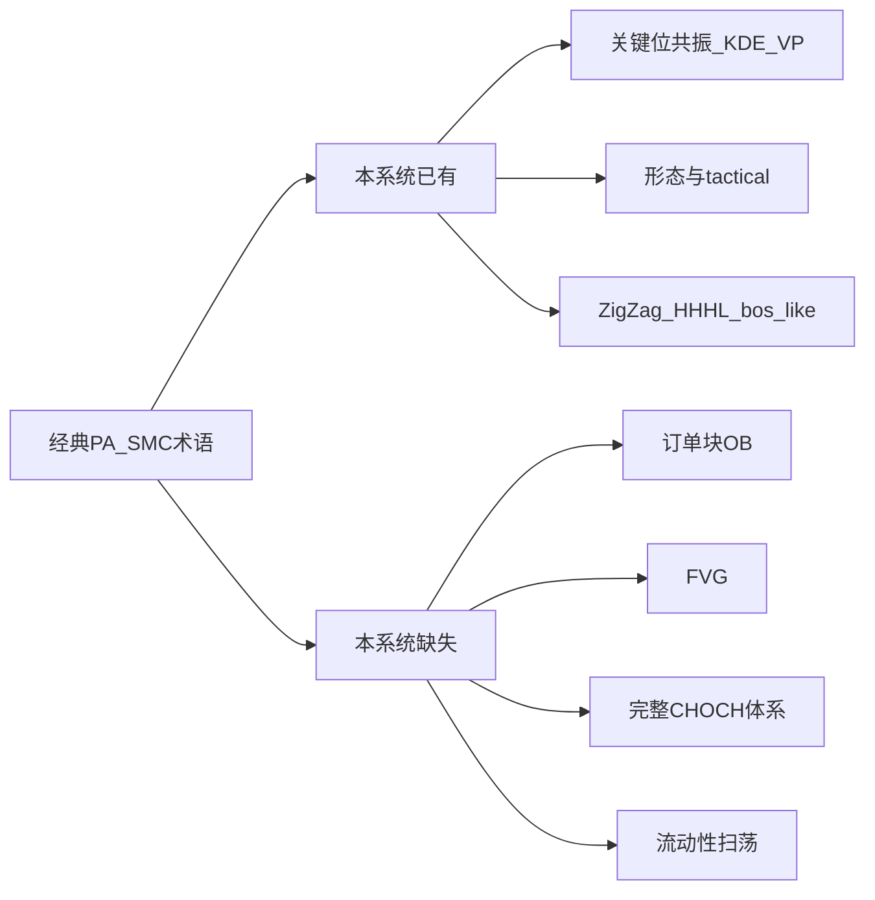

# 个股分析加入 PA/SMC：可行性评估

## 结论（直接回答）

| 目标 | 是否可行 | 说明 |
|------|----------|------|
| **PA 式结构研判（关键位 + 形态 + HH/HL 波段）** | **可行，且已基本落地** | 个股分析（SSA）已有三块 + 交易参考合成 |
| **把现有能力收成「价格行为」专区/叙事** | **可行，偏产品/前端** | 数据与 API 齐，主要是信息架构与文案 |
| **完整 SMC（订单块 OB、FVG、流动性扫荡、完整 CHOCH）** | **现网不可用；算法上可后续做** | 日线 OHLC 够算，但 **无对应引擎与字段**；与一期产品边界相反 |

一句话：**「在个股分析里做 PA」= 可行（多数已有）；「在个股分析里做完整 SMC」= 需新开发，不是开关级能力。**

---

## 现有能力对照（证据）

已落地（同源日线 OHLC，`adjust` 可前复权）：

- **阻力支撑 / 供需区近似**：`GET /api/analysis/levels/{code}` → SSA「阻力支撑位」（KDE + VP + 共振带）
- **K 线几何形态 + 短线三态**：patterns + `tactical.short_bias` → SSA「形态识别」
- **市场结构轻量版**：[`market_structure.py`](backend_core/analysis/market_structure.py)（头注释写明一期不做完整 SMC）→ ZigZag、HH/HL/LH/LL、`trend`、`last_bos_like`、日/周对照 → SSA「波段与趋势」；[`market_structure_routes.py`](backend_api/stock/market_structure_routes.py) 与 [`stock_analysis_bundle.py`](backend_core/analysis/stock_analysis_bundle.py) 已算周线并进交易参考

前端入口已在 [`analysis.html`](frontend/analysis.html) / [`stock_multi_strategy.js`](frontend/js/stock_multi_strategy.js)（`ssaLevelsBlock` / `ssaPatternBlock` / `ssaSwingBlock`）。

经典术语映射：

产品边界文档与历史计划（[`波段趋势结构建议`](.cursor/plans/波段趋势结构建议_8e64df16.plan.md)）明确：**近端不做完整 SMC**；`last_bos_like` **不得**对外叫完整 CHOCH。

---

## 数据侧：够不够算「真 SMC」？

- **已有**：A/港股日线 OHLC、复权、可选实时末根、日→周聚合、ZigZag 与 Fib/KDE 结构锚同参。
- **对完整 SMC**：日线 OHLC **足以**实现简化 OB/FVG（不依赖 tick）；分钟线/成交明细 **非必需**，但精度与机构级 SMC 不同。
- **缺口在引擎与产品语义**，不在「没有 K 线」。

---

## 若确认要「加入」：推荐落地范围（默认方案）

不做完整 SMC 引擎；在 SSA 做 **PA 专区聚合**（命名可用「价格行为 / 结构」），避免虚假 SMC 承诺。

1. **信息架构**：在个股分析增加或重组一节「价格行为」，按固定顺序呈现：波段与趋势 → 形态战术 → 关键位/共振 → 与策略/交易参考对照句（冲突并列，不覆盖）。
2. **文案纪律**：UI/PDF/专家解读统一「波段破位 / 结构转换」；禁止 OB、FVG、CHOCH 未实现术语。
3. **可选轻增强（仍复用现有数据）**：图表叠加 ZigZag/关键水平线；强化日周冲突提示（bundle 已有 `weekly` / `counter_trend_caution` 时可抬到更醒目）。
4. **明确不做（本阶段）**：订单块、FVG、流动性池、完整 CHOCH 状态机、写入 URT/GMS 硬筛。

完整 SMC 若未来要做：另开引擎计划（新模块 + 标注层 + 与 `tactical`/波段去冲突），不混进本次「基于现有能力」范围。

---

## 风险

- 对外写「SMC 分析」而只有 HH/HL + bos_like → **过度承诺**。
- 用波段静默覆盖形态 `short_bias` → 违背现网并列设计。
- ZigZag 参数与 Fib/KDE 分叉 → 结构锚漂移。

---

## 总结

- **可行**：在个股分析强化/展示 **PA 式三维**（多数已接好）。
- **不可行（不改代码）**：宣称已具备完整 SMC。
- **建议**：产品聚合 + 命名诚实；完整 SMC 另立项。
