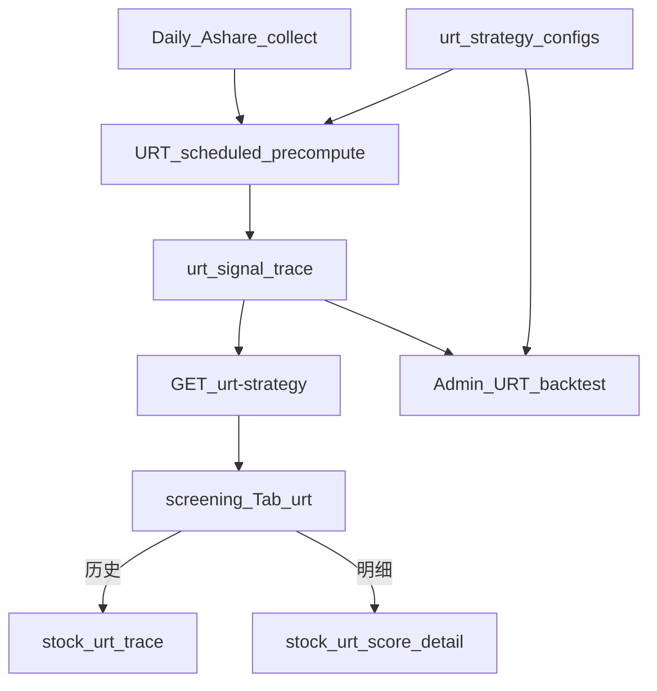

# URT 上升趋势策略落地计划

## 1. 策略提炼（来自两份纪要）

产品名：**上升趋势策略**；短码：**urt**（Upward Right-side Trend）。

| 层次 | 规则 | 系统落点 |
|------|------|----------|
| 趋势确认 | 收盘价站上 **MA20** | 硬筛 |
| 动能连阳 | **4 日内 ≥3 阳** 或 **5 日内 ≥4 阳** | 硬筛 |
| 资金确认 | 当日量 ≥ **近 20 日均量 × 2.5** | 硬筛 |
| 得分 | 默认 `min_score=70` | 硬筛后过滤 |
| 止损/止盈 | 亏 5%–10%、连跌 3 日、涨 25%–30% 后回撤 5% | 回测纪律 |

数据主源：`historical_quotes` 现算指标；不依赖 `mean_frequency_resonance_indicators`。

## 2. 一期（已完成）

- Core：`backend_core/strategies/urt/`
- ORM/API：`urt_strategy_configs`、`GET /api/screening/urt-strategy`、`/api/admin/urt`
- 前台 Tab + 权限；Admin 参数配置；单测与 `docs/URT_STRATEGY_IMPLEMENTATION_DESIGN.md`

## 3. 二期范围（本阶段交付）

### 3.1 每日采集后全量预计算（暂仅 A 股）

| 项 | 落点 |
|----|------|
| 表 | `urt_signal_trace`：PK `code+date+config_id` |
| 配置 | `urt_strategy_configs.precompute_enabled`；默认版本或开关开启才预计算 |
| 任务 | `scheduled_precompute.py`，挂日线采集后流水线 |
| 选股 | 优先读 trace；缺失回退实时算 |

### 3.2 后端 URT 回测管理

| 项 | 落点 |
|----|------|
| 表 | `urt_backtest_tasks` |
| Core | backtest_runner / storage / worker |
| Admin | `/api/admin/urt/backtests*` + 管理端回测 Tab |
| 纪律 | 复用 `evaluate_exit_rules` |

### 3.3 选股操作按钮与页面

| 按钮 | 目标 |
|------|------|
| 历史 | `stock_urt_trace.html`（URT 策略信号时间轴） |
| 明细（原「详情」） | `stock_urt_score_detail.html`（信号计算明细） |

### 3.4 后续（不在本阶段）

观察股/老股监控、收盘微信推送、港股 scope。

## 4. 配置默认值

见 `backend_core/strategies/urt/urt_config.json`；细则见设计文档 §1.1 / §6。

## 5. 关键参考

- GMS：`scheduled_precompute.py`、`gms_signal_trace`、`gms_backtest_tasks`、`stock_gms_trace.html`
- URT 一期：`backend_core/strategies/urt/`、`docs/URT_STRATEGY_IMPLEMENTATION_DESIGN.md`
