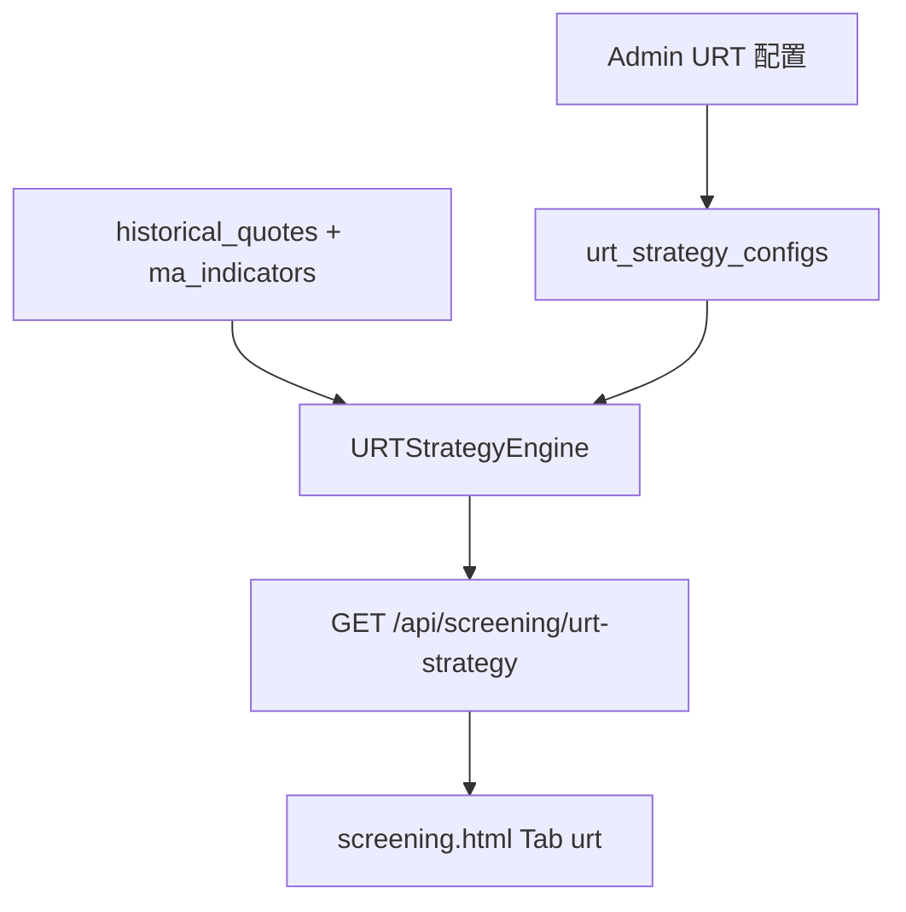

# URT 上升趋势策略落地计划

## 1. 策略提炼（来自两份纪要）

产品名：**上升趋势策略**；短码：**urt**（Upward Right-side Trend）；内部别名可称「连续阳线 / 陈氏右侧」。

| 层次 | 规则 | 系统落点 |
|------|------|----------|
| 趋势确认 | 收盘价站上 **MA20** | 硬筛条件 |
| 动能连阳 | **4 日内 ≥3 阳** 或 **5 日内 ≥4 阳** | 硬筛条件（可配置窗口） |
| 资金确认 | 当日成交量 ≥ **近 20 日均量 × 2.5** | 硬筛条件 |
| 精细化（待办） | **换手率、量比** 阈值 | 一期参数预留，默认关闭或宽阈值 |
| 人工终选 | 大势/行业/基本面 | 系统只做初筛；观察股池给人终选 |
| 仓位 | 分仓、不重仓单票 | 配置说明 + 二期交易模块约束 |
| 止损 | 亏 **5%–10%** 斩仓；或 **连续跌 3 日** 离场 | 写入 `urt` 配置，**回测/正式交易二期**执行 |
| 止盈 | 涨 **25%–30%** 进入警惕；自高点回撤 **5%** 了结 | 同上 |

与 GMS 差异：URT **不做左侧吸附**，只做右侧「站上 MA20 + 连阳 + 爆量」；数据主源用日线行情 + `ma_indicators`（不必绑 `mean_frequency_resonance_indicators`）。



## 2. 实现路径（对齐 GMS 垂直切片）

系统无跨策略 Factory；新策略按 GMS/PVFRS 方式「整包克隆 + 挂路由」。一期不复制完整回测中心，但目录与表前缀按可扩展同构预留。

### 2.1 Core 包（新建）

目录：[`backend_core/strategies/urt/`](backend_core/strategies/urt/)

| 文件 | 职责 |
|------|------|
| `config.py` + `urt_config.json` | 默认参数：连阳窗口、量能倍数、MA 周期、换手/量比开关、纪律参数 |
| `data_loader.py` | 按 scope（all/cn/industry_board/watchlist…）拉日线与 MA20 |
| `indicators.py` | 计算：是否站上 MA20、N 日阳线数、vol/avg_vol_20、量比、换手率 |
| `signal_detector.py` | 买点判定（满足硬筛即信号）；卖点规则对象化供二期回测 |
| `scoring.py` | 简单百分制（连阳强度 + 量能超额 + 可选换手/量比），对齐纪要「≥70 分」过滤 |
| `strategy_engine.py` | `screen(trade_date, scope, config)` |
| `frontend_interface.py` | 选股对外入口（一期可无 trace 缓存，接口形状对齐 GMS） |

默认硬筛伪代码：

```text
close >= ma20
AND (yang_count(4) >= 3 OR yang_count(5) >= 4)
AND volume >= avg_volume_20 * volume_multiple   # default 2.5
AND score >= min_score                         # default 70
```

阳线定义（定稿）：`close > open`（不引入上影线复杂规则，可配置）。

### 2.2 数据与 ORM

在 [`backend_api/models.py`](backend_api/models.py) 增加（命名对齐 `gms_*`）：

- `urt_strategy_configs`：参数多版本 JSON（`name`/`is_default`/`params`）
- （一期可选）`urt_selection_snapshots`：同日同 scope+param_hash 结果缓存
- 二期：`urt_strategy_versions` / `urt_strategy_version_stocks`、`urt_backtest_tasks`、`urt_trade_observe_*`

上游复用：`historical_quotes`、`ma_indicators`（已有 `ma20`）、板块成分过滤工具。

### 2.3 API

- 选股：在 [`backend_api/stock/stock_screening_routes.py`](backend_api/stock/stock_screening_routes.py) 增加 `GET /api/screening/urt-strategy`（参数：`trade_date`、`scope`、`config_id`、分页、`min_score` 等）
- 管理：新建 [`backend_api/admin/urt_admin_routes.py`](backend_api/admin/urt_admin_routes.py)，前缀 `/api/admin/urt`（configs CRUD、设默认、试跑选股摘要）
- [`backend_api/main.py`](backend_api/main.py) `include_router`，与 GMS/PVFRS 前缀隔离

### 2.4 前台（用户选股）

- [`frontend/screening.html`](frontend/screening.html)：新 Tab `data-strategy="urt"` + `#urt-content`
- [`frontend/js/screening.js`](frontend/js/screening.js)：筛选表单（日期、板块/scope、最低分、量能倍数）、结果表（代码、名称、MA20、连阳统计、量比/均量倍数、得分、换手）
- [`frontend/js/permission-registry.js`](frontend/js/permission-registry.js)：`channel.screening.tab.urt`

### 2.5 管理端（Admin Vue）

精简版对齐 GMS 配置页，不一期铺满回测中心：

- `admin/src/services/urtApi.ts`
- `admin/src/views/UrtManagementView.vue` + `components/urt/StrategyConfiguration.vue`（参数编辑）
- 侧栏与路由：`/urt-management`
- 管理端选股面板可挂 URT Tab（参考 [`ScreeningStrategiesPanel.vue`](admin/src/components/screening/ScreeningStrategiesPanel.vue)）

### 2.6 二期（计划内预留，本期不实现代码）

1. 观察股 / 「老股」监控列表 + 交易观察链路（对标 `gms_trade_observe_*`）
2. 收盘后微信推送（纪要 Action：5 日涨 3–4 天 + 量能翻倍）
3. 回测管理中心：嵌入双轨止损 + 回撤止盈，复现「≥70 分、观察期内涨超 10%、命中率约 67%」类报告
4. 港股数据接入

## 3. 配置默认值（写入 `urt_config.json`）

```json
{
  "ma_period": 20,
  "yang_rule_a": {"window": 4, "min_up_days": 3},
  "yang_rule_b": {"window": 5, "min_up_days": 4},
  "volume_lookback": 20,
  "volume_multiple": 2.5,
  "min_score": 70,
  "use_turnover": false,
  "use_volume_ratio": false,
  "risk": {
    "stop_loss_pct_min": 5,
    "stop_loss_pct_max": 10,
    "time_stop_down_days": 3,
    "take_profit_alert_pct_min": 25,
    "take_profit_alert_pct_max": 30,
    "trailing_drawdown_pct": 5
  }
}
```

## 4. 一期交付清单与验收

1. Core `urt` 引擎对给定交易日可筛出满足 MA20+连阳+量能的股票列表并打分  
2. `GET /api/screening/urt-strategy` 可用；管理端可改参数版本并设默认  
3. 网站选股页出现「上升趋势」Tab，结果可分页展示关键字段  
4. `test/test_urt_*.py`：连阳计数、量能倍数、站上 MA20、得分阈值的单元测试  
5. 文档：`docs/URT_STRATEGY_IMPLEMENTATION_DESIGN.md`（策略规则 + API + 与 GMS 对照）

## 5. 关键参考文件

- GMS 选股入口：[`backend_api/stock/stock_screening_routes.py`](backend_api/stock/stock_screening_routes.py) 中 `gms-strategy`
- GMS 内核：[`backend_core/strategies/gms/`](backend_core/strategies/gms/)
- GMS 管理路由：[`backend_api/admin/gms_admin_routes.py`](backend_api/admin/gms_admin_routes.py)
- 更轻对照（若选股接口形态简化）：[`backend_core/strategies/volume_shrink_breakout/`](backend_core/strategies/volume_shrink_breakout/)
