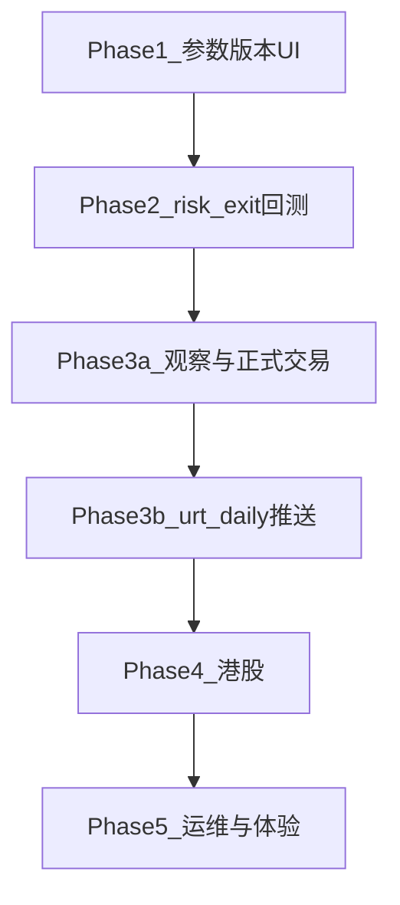

# URT 上升趋势策略任务实施计划

依据：[docs/URT_GMS功能对比与技术方案.md](docs/URT_GMS功能对比与技术方案.md)。已完成主链路（选股/预计算/追溯/Admin 命中率回测）不重做；本计划只覆盖文档 §4–§5 待办。

---

## Phase 1 — 体验一致性：选股页参数版本 UI（高）

**目标**：上升趋势 Tab 可选参数版本，请求带 `config_id`；页面级量能/最低分覆盖仍生效且不落库。

**做法（已定）**：新增只读前台接口，不直接暴露 Admin 全量写接口。

| 步骤 | 落点 |
|------|------|
| 1.1 | 在 [backend_api/stock/urt_frontend_routes.py](backend_api/stock/urt_frontend_routes.py) 增加 `GET /api/frontend/urt/strategy-configs`（返回 id/name/is_default/简述，鉴权同选股登录用户） |
| 1.2 | [frontend/screening.html](frontend/screening.html) + [frontend/js/screening.js](frontend/js/screening.js)：URT Tab 增加版本下拉；加载列表、默认选中 `is_default`；`buildUrtQuerySearchParams` 写入 `config_id` |
| 1.3 | 对照 GMS 版本切换交互，切换版本后不自动刷新，仍由「刷新」触发 |
| 1.4 | 单测或轻量前端自检：有 `config_id` 时走对应版本；无覆盖参数时优先读 `urt_signal_trace` |

**验收**：选非默认版本后刷新，结果与 Admin 该版本试算一致；覆盖 `min_score` 时不写库。

---

## Phase 2 — 规则闭环：回测 `risk_exit`（高）

**目标**：命中率模式保持默认；可选纪律出场模式接入已有 `evaluate_exit_rules`。

| 步骤 | 落点 |
|------|------|
| 2.1 | [backend_core/strategies/urt/backtest_runner.py](backend_core/strategies/urt/backtest_runner.py)：任务 config 增加 `exit_mode`，枚举 `hit_rate`（默认）\| `risk_exit` |
| 2.2 | `risk_exit`：次日开盘入场后，持仓交易日循环调用 `evaluate_exit_rules`（价格止损 / 连跌 / 回撤止盈）；汇总字段区分出场原因 |
| 2.3 | [admin/src/components/urt/BacktestManagement.vue](admin/src/components/urt/BacktestManagement.vue) + [TaskDetail.vue](admin/src/components/urt/TaskDetail.vue)：创建表单与详情展示 `exit_mode` / 出场原因 |
| 2.4 | 更新 [docs/URT策略交易回测说明.md](docs/URT策略交易回测说明.md)，对齐流程图与实现 |
| 2.5 | 扩展 [test/test_urt_strategy.py](test/test_urt_strategy.py) / 回测相关单测覆盖两种模式 |

**验收**：同区间同池，`hit_rate` 行为与现网一致；`risk_exit` 能因止损/连跌/回撤提前平仓并写入原因。

---

## Phase 3a — 交易闭环：观察股 + 正式交易（中）

**目标**：垂直切片对齐 GMS，独立 URT 表（不复用 GMS 表）；先观察列表/归档，再正式交易记账；价格计划后置。

| 步骤 | 落点 |
|------|------|
| 3a.1 | ORM + migration：`urt_trade_observe_stocks`、`urt_trade_observe_history`、`urt_formal_trades`（字段对齐 GMS 精简集：user_id、code、name、signal_date、config_id、status、备注、时间戳） |
| 3a.2 | 新路由：`/api/stock/urt-trade-observe`（list/add/delete/history）、`/api/stock/urt-formal-trade`（list/from-observe/patch/delete）；[backend_api/main.py](backend_api/main.py) 挂载 |
| 3a.3 | 权限码扩展：`channel.screening.tab.urt.btn.observe` 等，写入 registry |
| 3a.4 | [frontend/screening.html](frontend/screening.html) / [screening.js](frontend/js/screening.js)：URT 三子面板（策略信号 / 交易观察 / 正式交易），交互镜像 GMS 子面板 |
| 3a.5 | API 与前端冒烟测试 |

**验收**：选股结果可加入观察、移除归档；可从观察转入正式交易并改状态。

---

## Phase 3b — 运营推送：`urt_daily`（中）

**前置**：Phase 3a 完成后再做（日报可基于自选 + 当日买点；有观察股后可扩展）。

| 步骤 | 落点 |
|------|------|
| 3b.1 | [backend_api/services/report_service.py](backend_api/services/report_service.py) 增加 `urt_daily` 报表生成（Excel） |
| 3b.2 | [backend_api/services/push_service.py](backend_api/services/push_service.py) 识别 `urt_daily`，休市跳过逻辑对齐 `gms_daily` |
| 3b.3 | 管理端推送配置可选 URT 日报类型 |
| 3b.4 | 文档补充推送说明 |

**验收**：配置收件人后可手动/定时发出 URT 日报；休市日不发。

---

## Phase 4 — 市场扩展：港股（中）

| 步骤 | 落点 |
|------|------|
| 4.1 | [backend_core/strategies/urt/data_loader.py](backend_core/strategies/urt/data_loader.py)：港股候选 + `historical_quotes_hk` |
| 4.2 | [scheduled_precompute.py](backend_core/strategies/urt/scheduled_precompute.py) 增加 `scheduled_urt_signals_hk`；[main.py](backend_core/data_collectors/main.py) 注册 `SCHED_URT_SIGNALS_HK_*` |
| 4.3 | 选股 `scope=hk` + 前台数据源选项；`urt_signal_trace` 用现有 market 字段或约定区分 |
| 4.4 | 抽样验证连阳/量能字段兼容 |

**验收**：港股范围可选股；日终港股预计算写入可被选股读到。

---

## Phase 5 — 运维与体验完善（低）

按依赖并行度打包，单次 PR 可拆：

| 项 | 落点 |
|----|------|
| 主表 migrations | `urt_strategy_configs` / `urt_signal_trace` / `urt_backtest_tasks` 正式脚本（[migrations/](migrations/)） |
| Admin `/system/status`、`/audit-logs` | [urt_admin_routes.py](backend_api/admin/urt_admin_routes.py) + Admin Tab；审计 `operation_logs` 前缀 `urt_` |
| 个股详情 URT 卡片 | [frontend/js/stock.js](frontend/js/stock.js) 调 score-detail / 单股选股 |
| 追溯页单股回测 | [stock_urt_trace.js](frontend/js/stock_urt_trace.js) 复用 Admin 回测创建 API |
| 报告 xlsx | backtest export 增加 xlsx（CSV 保留） |

**验收**：迁移可空库重建；审计可见配置/回测操作；详情页可见 URT 区块。

---

## 工程约束

- 不引入 MFR / GMS 双模块评分；观察/交易用独立 `urt_*` 表。
- 每阶段结束：更新 [docs/URT_GMS功能对比与技术方案.md](docs/URT_GMS功能对比与技术方案.md) 状态句，并重跑 `python generate_urt_completion_excel.py` 刷新 Excel。
- 测试目录：`test/`；文档与 Excel 产出在 `docs/`、`exported_docs/`。

## 建议排期（人天量级，供排期）

| 阶段 | 估时 |
|------|------|
| Phase 1 | 1–2 天 |
| Phase 2 | 2–3 天 |
| Phase 3a | 4–6 天 |
| Phase 3b | 2–3 天 |
| Phase 4 | 3–4 天 |
| Phase 5 | 3–5 天 |
