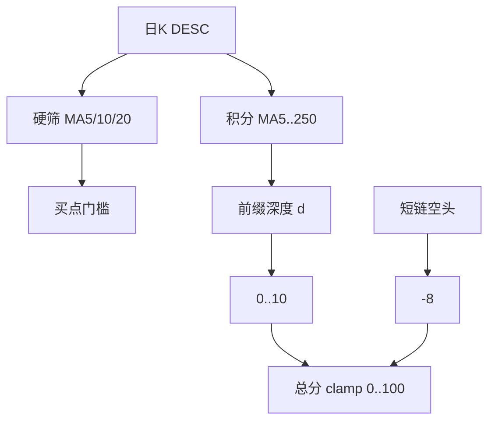

# URT 均线多头分档计分（已确认，待实现）

**状态：方案已确认。** 当前仍在 Plan 模式；需你在 Cursor 中批准切换到 Agent（或回复「开始实现」并允许切模式）后才能改代码。

同源方案文档：`[.cursor/plans/urt换手率积分方案_194ceac0.plan.md](.cursor/plans/urt换手率积分方案_194ceac0.plan.md)`（换手部分已完成；本节为待做）。

## 定稿口径

- **硬筛不变**：`require_ma_bull` + `ma_bull_periods=[5,10,20]` → 仅 `MA5>MA10>MA20`
- **积分链**：`ma_bull_score_periods=[5,10,20,30,60,120,250]`，前缀深度 `d`（连续相邻 `MA[i]>MA[i+1]`）
- **分表**：d→`[0,2,4,6,8,9,10]`（基线短多 d=2 得 **+4**，全链 d=6 得 **+10**）；`ma_bull_score_max=10`
- **空头**：仅 5/10/20 空头排列 → **−8**
- **K 线长度**：`min_bars_needed` **不**因 250 抬高「指标整段失败」门槛（短历史仍可出信号）；长均线算不出则深度自然截断。另加 `recommended_bars_for_ma_score`（或等价）供拉取侧尽量覆盖 250；选股侧已有 KDE 长历史时一般够用

## 实现落点

1. `[backend_core/strategies/urt/indicators.py](backend_core/strategies/urt/indicators.py)`
  - `normalize_ma_bull_score_periods`、`ma_bull_prefix_depth`
  - `ma_bull_ok` / `ma_bear_ok` 仍只基于硬筛周期
  - 输出 `ma_bull_score_periods` / `ma_bull_score_values` / `ma_bull_depth`（可选）
2. `[backend_core/strategies/urt/scoring.py](backend_core/strategies/urt/scoring.py)`
  - `_ma_bull_tier_score` 替换固定 +6；`parts.ma_bull` 写 depth / score_values / max=10
3. `[config.py](backend_core/strategies/urt/config.py)` + `[urt_config.json](backend_core/strategies/urt/urt_config.json)`：新键 + `merge_overrides` 白名单
4. `[frontend/js/urt_score_detail.js](frontend/js/urt_score_detail.js)`：note 展示深度与关键均线
5. 文档：业务简化版 §6.2、实施设计相关节
6. `[test/](test/)` 新单测：d=2→4、d=6→10、短空 −8、硬筛仍仅 5/10/20

## 非目标

- 不把硬筛扩展到 30/60/120/250
- 不改换手甜区已落地逻辑（除非联调冲突）

