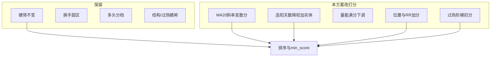

# URT 策略优化建议：现状对照与修改方案

## 附件建议 vs 系统现状

| 附件建议                      | 现状结论                                                                                                            | 差距                        |
| ------------------------- | --------------------------------------------------------------------------------------------------------------- | ------------------------- |
| 1. 消除硬筛与打分重叠（MA20/多头静态满分） | 硬筛仍要 `above_ma20` + `require_ma_bull`；打分里 `above_ma20` 仍是 **过线即 +10**；`ma_bull` 已做前缀链分档（0～10），重叠主要在 **站上 MA20** | MA20 项需改为斜率/发散梯度；多头可再微调满分 |
| 2. 支撑贴近度 + RR 进积分         | KDE/RR 已进 `trade_advice`、风险标签与结构硬闸；`[scoring.py](backend_core/strategies/urt/scoring.py)` **不加减分**              | 新增「位置与赔率」分项（约 15 分）       |
| 3. 连阳权重过高 + 缺实体质量         | `yang` 满分 **40**（天数表）；无实体/波幅质量                                                                                  | 天数降权 + 新增实体质量分            |
| 4. 过热乖离扣分                 | 软标 15%、硬闸约涨幅 25%/乖离 20%；**不减分**，过硬筛后仍可 90+                                                                      | 在软阈值起做阶梯扣分（−10～0）         |

附件表中「量能 34」与现网 `**volume` 满分 31**（0～40 再 ×31/40）略有口径差，以下按**现网代码**为基线。

**已落地、本方案保留（附件未覆盖）：** 换手甜区 ±8；均线多头分档计分；结构破位/贴阻/悬空硬闸；过热硬闸。  
**明确不做：** 改形态模块突破软确认；用周线否决 URT；一夜关掉 `above_ma20`/`require_ma_bull` 硬筛。

---

## 定稿权重（默认配置）

正项理论合计约 **100**（含换手满分），再 `clamp(0,100)`；过热为负项。

| 分项                    | 现行默认   | 建议默认       | 说明                                     |
| --------------------- | ------ | ---------- | -------------------------------------- |
| MA20 趋势（原 above_ma20） | 10（布尔） | **10**（梯度） | 硬筛仍要求站上；打分用斜率/发散                       |
| 连阳天数                  | 40     | **20**     | 沿用天数阶梯，整体缩放到 20                        |
| K 线实体/波幅质量            | 0      | **10**     | 近窗实体饱满度 + 突破波幅                         |
| 量能倍数                  | 31     | **25**     | 梯级公式不变，满分改为 25                         |
| 中期阳线                  | 6      | **5**      | 略降                                     |
| 均线多头                  | 10     | **8**      | 分档表按比例缩放或改 `ma_bull_score_table`/`max` |
| 筹码位置与 RR（新）           | 0      | **15**     | 贴近支撑约 8 + RR 约 7                       |
| 换手                    | ±8     | **±8**（保留） | 不改公式                                   |
| 量比                    | +5 默认关 | 默认关        | 不变                                     |
| 过热扣分（新）               | 0      | **−10～0**  | 对齐软阈值起扣，硬闸仍独立                          |

买点公式不变：`filter_ok ∧ structure_gate ∧ overheat_gate ∧ score≥min_score`。`min_score` 默认仍 **70**；上线后用抽样校准，必要时再调（不在首期默认改 70）。

---

## 规则细则（实现口径）

### 1. MA20 趋势分（替换静态 +10）

在已通过「收盘≥MA20」前提下（未过硬筛本就不进打分池；打分函数内若未站上仍给 0）：

- 计算 `bias20 = (close - ma20) / ma20`
- 计算 `slope20`：近 N 日（默认 5）MA20 相对变化 `(ma20_t - ma20_{t-N}) / ma20_{t-N}`
- 映射到 0～10：贴线横盘（bias 很小且 slope≈0）低分；温和发散中档；过强发散交给过热扣分，本项可封顶但不过度奖励极端乖离  
- 配置键：`ma20_score_mode=slope_bias`（默认）、`ma20_score_max=10` 及阶梯阈值写入 `[urt_config.json](backend_core/strategies/urt/urt_config.json)` / `[config.py](backend_core/strategies/urt/config.py)`

### 2. 连阳：天数 20 + 实体质量 10

- **天数**：现有 `_yang_score` 结果 ×(20/40)  
- **实体质量**（近 5 日，可配）：  
  - 实体比 `body/range`（阴线或十字偏低）  
  - 波幅 `|close-open|/pre_close`  
  - 突破日（量能倍数最大或最新阳）加权更高
- `parts` 拆成 `yang`（天数）与 `yang_quality`（实体），明细页分两行展示

### 3. 位置与 RR（+15）

复用已算好的 `nearest_support` / `nearest_resistance` / `structure_rr`（`[signal_detector](backend_core/strategies/urt/signal_detector.py)` + GMS `compute_structure_rr`）：

- **贴近支撑（0～8）**：`dist = (close-support)/close`；`≤2%` 满分，其后阶梯递减；无支撑/破位给 0（破位仍由硬闸处理）  
- **RR（0～7）**：`RR≥3` 满分；`2～3` 中档；`<1.5` 低分或 0（与附件一致）；RR 缺失（KDE 失败）本子项给中性偏低分（如 2），**不因缺 KDE 误杀硬筛已过标的**

新增 `parts.structure_position`（或拆 `support_proximity` + `structure_rr_score`）。

### 4. 过热扣分（−10～0）

与现有软标阈值对齐，避免与硬闸双重「突然死亡」：

- 近 `overheat_lookback_days` 涨幅 ≥ `overheat_soft_pct`(15%) 或 MA20 乖离 ≥ `overheat_bias_soft_pct`(15%) 起扣  
- 逼近硬阈值（涨幅 25% / 乖离 20%）扣满约 −10  
- 硬闸逻辑不动；扣分只影响排序与是否够 `min_score`

---

## 实施分期

| 阶段     | 内容                                    | 价值                |
| ------ | ------------------------------------- | ----------------- |
| **P0** | MA20 梯度分 + 量能满分 31→25 + 中期/多头微调；配置与单测 | 立刻拉开「贴线 vs 发散」分辨率 |
| **P1** | 连阳天数缩至 20 + `yang_quality` 10         | 降十字星刷满 40 分       |
| **P2** | `structure_position` 15 分（贴近 + RR）    | 悬空高分问题对症          |
| **P3** | 过热阶梯扣分；明细/PDF/文档同步；抽样校准 `min_score`   | 高位霸榜回落            |

前端：[urt_score_detail.js](frontend/js/urt_score_detail.js) / [urt_score_detail_pdf.js](frontend/js/urt_score_detail_pdf.js) 增行；文档 `[docs/strategies/urt/](docs/strategies/urt/)` 更新权重表。

---

## 主要改动文件

- `[backend_core/strategies/urt/scoring.py](backend_core/strategies/urt/scoring.py)` — 分项公式与合计  
- `[backend_core/strategies/urt/indicators.py](backend_core/strategies/urt/indicators.py)` — MA20 斜率、实体比等输入  
- `[backend_core/strategies/urt/signal_detector.py](backend_core/strategies/urt/signal_detector.py)` — 把 structure/overheat 指标喂进 scoring  
- `[backend_core/strategies/urt/config.py](backend_core/strategies/urt/config.py)` + `[urt_config.json](backend_core/strategies/urt/urt_config.json)`  
- `test/test_urt_*.py`（新建或扩展现有 URT 计分测例）  
- 明细 UI/PDF + 策略说明文档

---

## 风险与纪律

- **命中率**：只改打分分布时，`min_score=70` 下买点数量可能下降——P3 用历史信号抽样对比后再决定是否调阈值。  
- **DB 自定义配置**：新键必须有默认值并入 `URTConfigManager` 白名单，旧配置缺键不报错。  
- **硬筛重叠**：附件目标是「过筛后仍能分出强弱」，**不是**取消硬筛；产品文案写明「满分≠已贴近买点」。  
- **KDE 缺失**：位置分降权给分，避免无筹码数据时全体异常低分。

