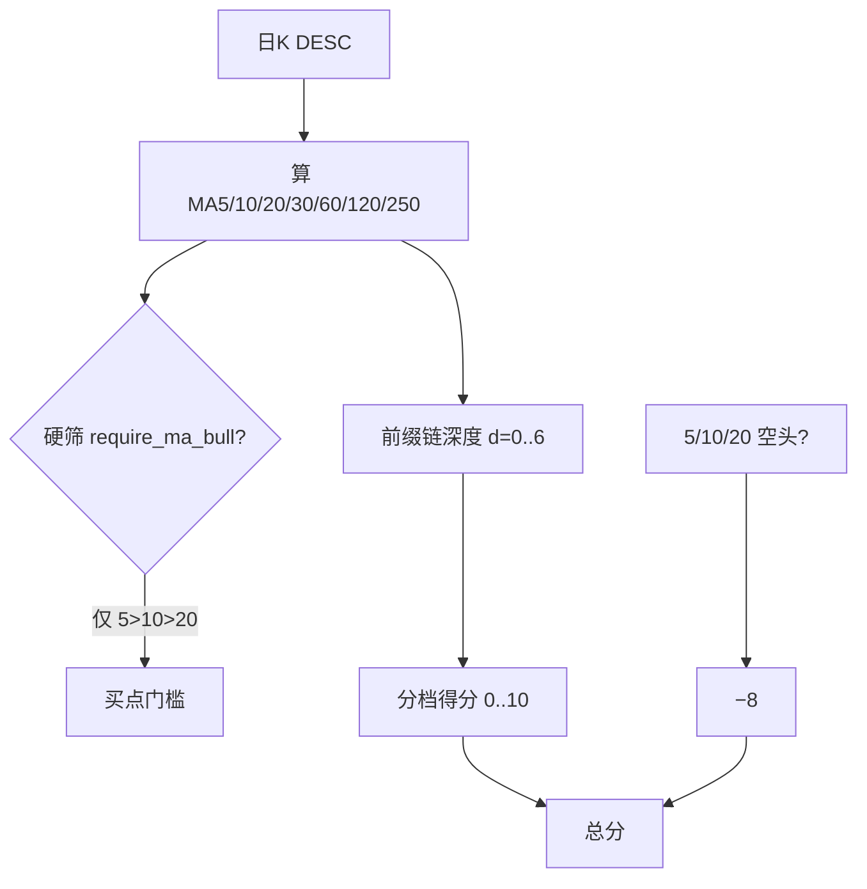

# URT 信号积分演进：换手甜区（已完成）+ 均线多头分档（待做）

## 第一部分：换手率（已落地，摘要保留）

| 结论 | 口径 |
|------|------|
| 50% 日换手 | **减分**至约 −8 + 软标签，不再线性满分 |
| 个性化 | 相对自身近 20 日中位；绝对 % 作熔断安全网 |
| 解耦 | `turnover_hard_filter` / `turnover_score_enabled` |

实现见现行 [`scoring.py`](backend_core/strategies/urt/scoring.py) / [`indicators.py`](backend_core/strategies/urt/indicators.py)。

---

## 第二部分：均线多头分档计分（新增思路与定稿）

### 现状问题

明细常见一行：

| 均线多头 | 6.00 | 6 | MA5 · MA10 · 多头 |

现行逻辑（[`scoring.py`](backend_core/strategies/urt/scoring.py)）：`ma_bull_periods` 默认 **[5,10,20]**，整链 `MA5>MA10>MA20` 则 **+6**，否则 0；`MA5<MA10<MA20` 则 **−8**。无法区分「刚过短多」与「中长期均线全面多头」。

### 设计原则

1. **门槛与积分分离**：硬筛 `require_ma_bull` 仍只要求 **MA5>MA10>MA20**（与现网买点密度一致）；**30/60/120/250 不参与硬筛**，只抬排序分。
2. **前缀链深度**：按短→长检查相邻均线是否严格递减排列；从短端起连续满足的档数越多分越高（禁止「短线乱、只靠年线多头」凑分）。
3. **空头仍只看短中期**：空头减分仍基于 **5/10/20** 空头排列（−8），避免长均线短暂空头误杀趋势票。
4. **拉数足够**：`min_bars_needed` / 历史拉取覆盖 **≥250** 根（选股侧已为 KDE 拉更长，一般够用）。

### 计分定稿

配置：

| 键 | 默认 | 含义 |
|----|------|------|
| `ma_bull_periods` | `[5,10,20]` | **硬筛**用周期链（保持兼容） |
| `ma_bull_score_periods` | `[5,10,20,30,60,120,250]` | **积分**用周期链 |
| `ma_bull_score_max` | `10` | 满分（全链多头） |
| `ma_bull_score_table` | 见下表 | 深度 → 分；可配置覆盖 |

**深度 d**：在 `score_periods` 上，从左起连续满足 `MA[i] > MA[i+1]` 的相邻对数（最长前缀）。7 根均线 → d∈[0,6]。

| 深度 d | 含义（约） | 得分 |
|--------|------------|------|
| 0 | 连 5>10 都不成立 | **0** |
| 1 | 仅 5>10 | **2** |
| 2 | 5>10>20（硬筛基线） | **4** |
| 3 | …>30 | **6** |
| 4 | …>60 | **8** |
| 5 | …>120 | **9** |
| 6 | …>250 全链 | **10** |

空头：若硬筛三段 `MA5<MA10<MA20` → 分项 **−8**（覆盖正分；与现逻辑一致）。若既非短多前缀也非短空 → 0。

权重：多头满分由 **6→10**；量能保持 **31**、换手 **±8**，总分仍 clamp [0,100]（理论峰值略超 100 时夹紧，可接受）。

明细 `parts.ma_bull` 增写：

- `score_periods` / `score_values`（各档均线）
- `depth` / `pairs_ok`（如 `5>10✓ 10>20✓ …`）
- `score` / `max=10` / `min=-8`
- 展示文案示例：`MA5 8.92 · … · 深度3/6（至MA30）· +6`

### 实现落点（待做）

1. [`indicators.py`](backend_core/strategies/urt/indicators.py)：按 `ma_bull_score_periods` 计算全套 SMA；`ma_bull_ok` 仍只看硬筛三段；输出 `ma_bull_score_values`、可选 `ma_bull_depth`。
2. [`scoring.py`](backend_core/strategies/urt/scoring.py)：`_ma_bull_tier_score(...)` 替换固定 +6。
3. [`config.py`](backend_core/strategies/urt/config.py) + [`urt_config.json`](backend_core/strategies/urt/urt_config.json)：新键与 `merge_overrides` 白名单；`min_bars_needed` 含 250。
4. [`urt_score_detail.js`](frontend/js/urt_score_detail.js)：分项 note 展示深度与关键均线（不必塞满 7 个数时可折叠「短/中/长」）。
5. 文档：业务简化版 §6.2 + 实施设计 §1.1。
6. 单测：深度 2→4 分、深度 6→10 分、短空 −8、硬筛仍仅 5/10/20。

### 预期效果

- 刚满足短多（5>10>20）仍可通过硬筛，但积分仅中档（约 +4），排序靠后。
- 中长期均线层层多头（至 60/120/250）积分更高，名单更靠前。
- 不因要求年线多头而大幅减少正式买点数量。
