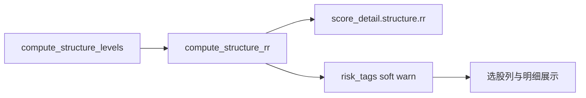

# URT 结构盈亏比风险提示修改方案

## 结论

URT 已有 KDE 支撑/阻力（`[signal_detector._compute_structure_levels](backend_core/strategies/urt/signal_detector.py)` → `score_detail.structure`），**不参与硬筛、无减分框架**。与 GMS「减分版 `poor_structure_rr`」不同，本需求做 **风险提示（软标签）**：计算并展示 RR，偏低/破位时打 `risk_tags`，**不改 `score` / `buy_signal`**。

口径对齐 GMS `[compute_structure_rr](backend_core/strategies/gms/structure_levels.py)`：

```
P = 信号日收盘 close
RR = (nearest_resistance − P) / (P − nearest_support)
```


| 情形                                    | 风险提示                |
| ------------------------------------- | ------------------- |
| 有支撑、P>支撑、有阻力、upside>0 且 `RR < min_rr` | `warn`：结构盈亏比偏低      |
| P≤支撑 / downside≤0 或贴/超阻力              | `danger`：破位支撑 / 贴阻力 |
| 无阻力                                   | 不提示（上方空间视为充足）       |
| 无支撑 / KDE 失败                          | 不提示                 |


默认：`min_rr = 1.5`，提示默认开启。




---

## 改动清单

### 1. 计算与写入（后端）

在 `[evaluate_buy_signal](backend_core/strategies/urt/signal_detector.py)` 算完 structure 后：

1. 复用 GMS `compute_structure_rr(close, nearest_support, nearest_resistance)`（不复制公式）。
2. 写入 `score_detail.structure.rr` / `rr_reason`；顶层展平 `structure_rr`（可选，便于列表）。
3. 新增轻量 `build_structure_rr_risk_tags(structure, cfg) -> List[{id,label,level,reason}]`（可放在 `urt/risk_tags.py` 或 `signal_detector` 旁）：
  - 配置：`structure_rr_warn_enabled`（默认 true）、`structure_rr_min_rr`（默认 1.5）
  - 标签 id：`poor_structure_rr`（与 GMS 语义对齐，便于前端复用样式）
4. 结果顶层与 `score_detail` 均带 `risk_tags`（合并进 JSON，**无需新 DB 列**）。

`[trace_store](backend_core/strategies/urt/trace_store.py)` 查询展平：带出 `risk_tags`、`structure_rr` / `rr_reason`（从 `score_detail`）。

旧 trace：强制重算后才有新字段；读路径若仅有 structure 无 `rr`，可在展平时现算 RR + 标签（只读 enrich，不改买点分），避免「有支撑阻力却无提示」。

### 2. 配置

`[urt/config.py](backend_core/strategies/urt/config.py)` 默认增加：

```json
"structure_rr_warn_enabled": true,
"structure_rr_min_rr": 1.5
```

管理端 URT 参数表（若已有 KDE/`risk` 区块）增加两项开关与阈值；无现成表单项则仅文档 + JSON/默认配置即可，本方案默认以后端默认键为准。

### 3. 前端展示

- `[urt_score_detail.js](frontend/js/urt_score_detail.js)`：【支撑/阻力】旁展示 `盈亏比 RR`（对齐 GMS）；增加【风险提示】区渲染 `risk_tags`。
- `[screening.js](frontend/js/screening.js)` + `[screening.html](frontend/screening.html)`：URT 策略信号表在「得分」前增「风险」列（复用 `gms-risk-tag` 样式）；观察快照已含整份 `score_detail`，补算后自动带标签。
- `[stock_urt_trace.js](frontend/js/stock_urt_trace.js)`：历史表可不加列，明细组件展示即可。

### 4. 文档与测试

- 更新 `[docs/strategies/urt/URT_STRATEGY_IMPLEMENTATION_DESIGN.md](docs/strategies/urt/URT_STRATEGY_IMPLEMENTATION_DESIGN.md)`、`[URT_上升趋势_业务简化版.md](docs/strategies/urt/URT_上升趋势_业务简化版.md)`：明确 RR 为参考提示、不硬筛、不减分。
- 单测 `test/test_urt_structure_rr_risk.py`：RR 偏低出 warn；破位出 danger；无阻力无标签；关闭 `structure_rr_warn_enabled` 无标签；得分/buy_signal 不变。

---

## 明确不做

- 不做 GMS 式减分、不做 RPE 式硬筛（不否决买点）。
- 不新建表字段（JSON `score_detail` / 顶层字段即可）。
- 不与回测 `risk.*` 止损止盈百分比混用算 RR。

---

## 实施顺序

1. `evaluate_buy_signal` 写 rr + `risk_tags` + 配置默认值
2. `trace_store` 展平 / 旧数据读时补算 RR 标签
3. 前端明细与选股风险列
4. 文档 + 单测

