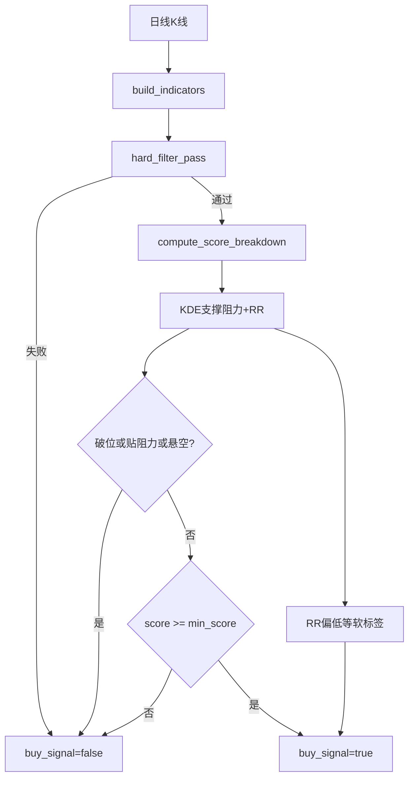

# URT 策略参数与加减分优化方案

## 已确认口径（混合）

- **结构盈亏比偏低**（`rr < structure_rr_min_rr`，默认提到 **2.0**）：仅 `risk_tags` 提示，**不**取消正式买点、**不**减分。
- **破位支撑 / 贴·超阻力 / 悬空离支撑**：参与**硬筛否决**正式买点（与附件「放弃入场 / 暂缓」对齐）；同时保留 danger 级风险标签便于列表展示。
- 既有 DB 中的旧 `config_id` **不强制改写**；改 [`urt_config.json`](backend_core/strategies/urt/urt_config.json) + 代码默认，管理端可新建「右侧确认加强」版本。

---

## 1. 硬筛收紧（对齐附件）

改默认（[`config.py`](backend_core/strategies/urt/config.py) / [`urt_config.json`](backend_core/strategies/urt/urt_config.json)），逻辑已在 [`indicators.hard_filter_pass`](backend_core/strategies/urt/indicators.py)：

| 参数 | 现状默认 | 优化默认 | 作用 |
|------|----------|----------|------|
| `volume_multiple` | 2.5 | **3.0** | 放量确认更严 |
| `require_ma_bull` | false | **true** | 硬筛 `MA5>MA10>MA20` |
| `use_yang_medium` | false | **true** | 硬筛 10≥6 ∧ 15≥8 ∧ 20≥10 |
| `use_turnover` | false | **true** | 硬筛 + 加分；`min_turnover` 默认 **3.0**（可配置，避免 0 形同虚设） |

[`signal_detector.build_buy_logic`](backend_core/strategies/urt/signal_detector.py) 文案随开关自动变为「硬筛」，无需另套规则。

前台 [`screening.html`](frontend/screening.html) 量能输入默认改为 **3.0**；`min_score` 仍 70（收紧后自然更稀）。

---

## 2. 结构 RR / KDE：混合落地（核心新逻辑）

文件：[`risk_tags.py`](backend_core/strategies/urt/risk_tags.py)、[`signal_detector.evaluate_buy_signal`](backend_core/strategies/urt/signal_detector.py)、[`config.py`](backend_core/strategies/urt/config.py)。

**配置新增/调整：**

- `structure_rr_min_rr`: **2.0**（写出 JSON）
- `structure_rr_hard_gate_enabled`: **true**（新）
- `structure_hang_min_upside_pct`: **0.08**（新：相对支撑距离 ≥8% 视为「悬空」；`(price-support)/price`）
- 贴阻力：复用现有 `rr_reason == "at_resistance"`（贴/超阻力）
- 破位：复用 `below_or_no_support` / `zero_downside`

**硬闸（在硬筛通过且算完 score/structure 之后、定 `buy_signal` 之前）：**

若 `structure_rr_hard_gate_enabled` 且 KDE 有效：

- 破位支撑 → 否决买点，`buy_logic` 增加一步 `structure_hard_gate`
- 贴/超阻力 → 否决
- 悬空（有支撑且距离 ≥ `structure_hang_min_upside_pct`）→ 否决

**软标签：** `rr < 2.0` 仍打「结构盈亏比偏低」warn；悬空新增独立 tag：`id=structure_hanging`，label「悬空离支撑」。

无支撑/无阻力/KDE 失败：**不硬闸**（与现软标签一致），避免全市场误杀。

管理端 [`StrategyConfiguration.vue`](admin/src/components/urt/StrategyConfiguration.vue) 增加 RR 阈值、硬闸开关、悬空阈值表单项（写入 `config_params`）。

---

## 3. 打分权重微调

文件：[`scoring.py`](backend_core/strategies/urt/scoring.py)。

### 3.1 量能超额阶梯

在 `need = volume_multiple`（新默认 3.0）下：

- `vm < need`：按比例给基础分（现逻辑）
- `need ≤ vm < volume_score_full_multiple`：过渡到接近满分
- `vm ≥ volume_score_full_multiple`（新配置，默认 **4.0**）：量能分项拉满（缩放后仍上限 **34**）

拉开「刚好过硬筛」与「极端放量」的排序差距。

### 3.2 换手

默认打开 `use_turnover`；现有 `to/8×5` 封顶 5 保留。若硬筛 `min_turnover=3`，加分主要服务排序区分。

### 3.3 多头排列：加分 + 未多头减分

现状：多头仅 **+4**，非多头 **0**。

调整：

- `ma_bull_ok` → **+6**（略提高）
- 非多头且非空头 → **0**（中性）
- 因默认已硬筛多头，正式买点路径上几乎总是 +6；**单股跳过硬筛**与关闭 `require_ma_bull` 的版本仍靠加减分排序

### 3.4 空头趋势：风险提示 + 减分（可加，纳入本方案）

**定义（与多头对称）：** `MA5 < MA10 < MA20` → `ma_bear_ok`（在 [`indicators.build_indicators`](backend_core/strategies/urt/indicators.py) 增加字段）。

| 用途 | 行为 |
|------|------|
| 风险标签 | 新 tag：`id=bearish_ma_trend`，label「空头趋势」，level=danger（`close < MA20` 可另打 warn「跌破中期均线」，可选） |
| 减分 | `ma_bear_ok` → **-8**（计入总分后再 `max(0, min(100, score))`）；与多头互斥 |
| 硬筛 | **不**因空头单独硬筛（有多头硬筛已覆盖）；标签+减分服务单股明细与关闭多头硬筛的配置 |

---

## 4. 文档与回归

- 更新 [`docs/strategies/urt/URT_上升趋势_业务简化版.md`](docs/strategies/urt/URT_上升趋势_业务简化版.md)、[`URT_GMS功能对比与技术方案.md`](docs/strategies/urt/URT_GMS功能对比与技术方案.md)：默认硬筛表、混合 RR、加减分与新 tag。
- 单测：`test/` 下补充/调整 URT 硬筛默认、量能满分阈值、悬空硬闸、空头 tag/减分、RR&lt;2 仍可买点。
- 预计算：同源 `evaluate_buy_signal`，改默认后次日 trace 自然变严；无需改调度，但需在发布说明中写清「信号变少属预期」。

---

## 5. 明确不做（本方案边界）

- 不改默认回测为 `risk_exit`（可另开任务）。
- 不加市场环境/大盘过滤。
- 不把「仅 RR&lt;2.0」做成硬筛（你已选混合第 3 项）。
- 不自动迁移用户已保存的旧 `config_id` 参数包。

---

## 关键改动文件（实现时）

- [`backend_core/strategies/urt/config.py`](backend_core/strategies/urt/config.py)、[`urt_config.json`](backend_core/strategies/urt/urt_config.json)
- [`indicators.py`](backend_core/strategies/urt/indicators.py)、[`scoring.py`](backend_core/strategies/urt/scoring.py)、[`risk_tags.py`](backend_core/strategies/urt/risk_tags.py)、[`signal_detector.py`](backend_core/strategies/urt/signal_detector.py)
- 管理端 URT 配置表单；前台量能默认值
- 业务文档 + 相关单测
