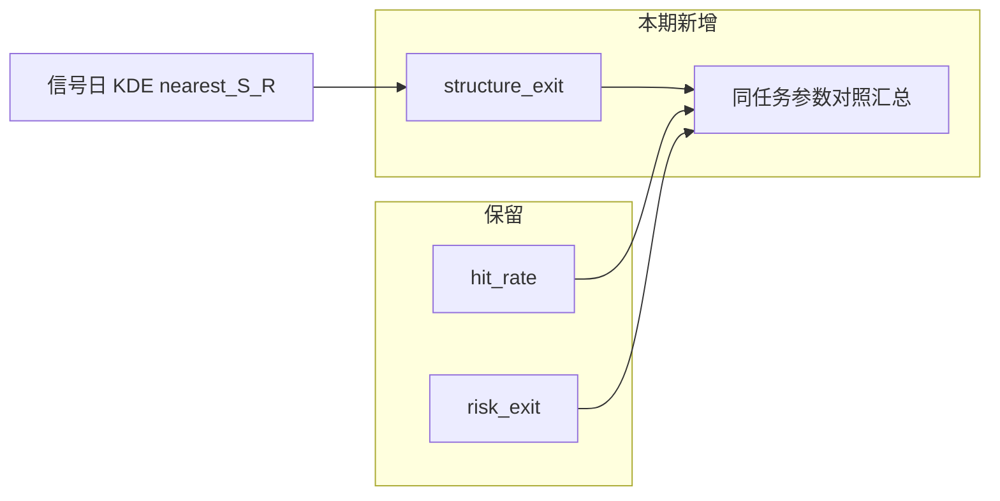

# URT 回测：结合关键支撑/压力的结构出场与对照分析

## 建议（结论）

**先做结构出场 + 对照汇总，结构位用信号日现成的 URT KDE，不要一上来重算个股 confluence。**

理由：
- 最大缺口在**持仓期**：入场已用结构硬闸/位置分，出场仍是固定 `target_pct` / 百分比纪律；`trade_advice` 的支撑止损从未进回测。
- 信号 trace / 实时明细里已有 `nearest_support` / `nearest_resistance` / `rr`，回测可直接消费，成本低、可复现。
- 个股「结构锚窗 + confluence」是另一条重算链路（贵、且与现网 URT 日历扩窗 KDE 不完全同口径）；适合作为**二期对齐**，避免一期混入口径与性能问题。
- 纯离线报告不改引擎，管理端仍无法一键跑「结构纪律」对照。

---

## 一期口径（定稿）

### 新 `exit_mode=structure_exit`

在 [`backtest_runner.py`](backend_core/strategies/urt/backtest_runner.py) 与 [`evaluate_exit_rules`](backend_core/strategies/urt/signal_detector.py) 旁新增结构出场（或独立 `evaluate_structure_exit_rules`）：

| 规则 | 口径 |
|------|------|
| 入场 | 不变：信号次日开盘 |
| 止损 | 信号日 `nearest_support` 下移缓冲（默认 **2%**，与 `trade_advice._urt_stop_with_buffer` 一致）；收盘（或最低价，一期定**收盘破位**）≤ 止损价 → `structure_stop` |
| 止盈 | 优先信号日 `nearest_resistance`；若缺失或阻力相对入场上行不足 `min_upside_pct`（复用配置约 3%），回退 `entry×(1+target_pct)` → `structure_target` / `pct_target` |
| 无支撑 | 回退现有 `risk_exit` 百分比止损（或仅 `horizon_end`）；明细标注 `structure_fallback` |
| 满期 | 仍 `horizon_end` |
| 目标命中统计 | 保留 `hit_target`（相对 `target_pct`），便于与 `hit_rate` 对照 |

信号侧结构字段来源：现有 [`_compute_structure_levels`](backend_core/strategies/urt/signal_detector.py) / `score_detail.structure`（`extract_kde_levels_expand_support`），**不**在回测持仓日重算 KDE。

### 对照分析（同一套任务参数）

- Admin / runner 支持同区间连续跑或结果侧对比字段：`exit_mode`、胜率、平均持有天数、平均盈亏、最大回撤样本、`structure_stop` / `structure_target` 占比、无结构回退占比。
- 明细行增加：`stop_price`, `target_price`, `nearest_support`, `nearest_resistance`, `structure_rr`, `exit_reason`。
- 文档：更新 [`URT策略交易回测说明.md`](docs/strategies/urt/URT策略交易回测说明.md)。

### 明确不做（一期）

- 不改默认 `exit_mode`（仍 `hit_rate`）。
- 不强制全市场重算 confluence / 结构锚窗。
- 不把形态 `tactical.buy_hints` 写入硬出场。

---

## 主要改动文件

- [`backend_core/strategies/urt/backtest_runner.py`](backend_core/strategies/urt/backtest_runner.py) — 接入 `structure_exit`；从信号带出 structure；明细与 summary 对照字段
- [`backend_core/strategies/urt/signal_detector.py`](backend_core/strategies/urt/signal_detector.py) — 结构出场判定（止损/止盈价与 reason）
- [`backend_core/strategies/urt/config.py`](backend_core/strategies/urt/config.py) + [`urt_config.json`](backend_core/strategies/urt/urt_config.json) — `structure_stop_buffer_pct` 等（有默认、白名单可缺键）
- [`backend_api/admin/urt_admin_routes.py`](backend_api/admin/urt_admin_routes.py) + 管理端任务表单（若已有 `exit_mode` 下拉则增选项）
- [`docs/strategies/urt/URT策略交易回测说明.md`](docs/strategies/urt/URT策略交易回测说明.md)
- `test/test_urt_*.py` — 结构止损/阻力止盈/缺失回退单测

---

## 二期（建议单独立项，不在一期范围）

1. 信号日结构对齐个股：结构锚窗 KDE + `compute_confluence_from_reference`，`trade_advice` 传入 `reference_levels`。
2. 可选：强共振带（`tier=strong`）优先作止损/止盈锚，而非单点 `nearest_*`。
3. 批量对照脚本：同池同区间三模式导出 CSV 归因（破位/贴阻/RR vs 后续收益）。

---

## 实施顺序

1. 抽出「信号 → stop/target 价」纯函数 + 单测  
2. `run_urt_backtest` 接入 `structure_exit` 与明细字段  
3. Admin API / 表单选项 + `trade_logic` 文案  
4. 文档与小结对照字段  
5.（可选后续）自选/短区间手工跑一轮，核对与明细页支撑阻力一致
