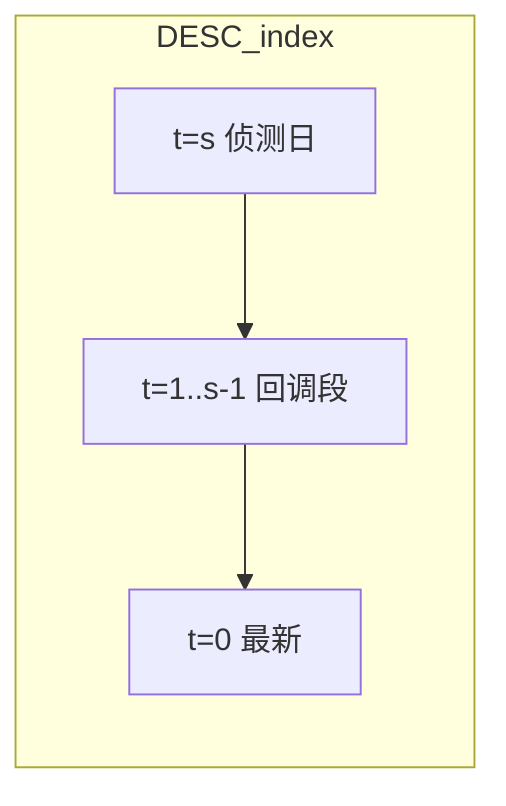

# 三阶段买入策略：更新 VSB 核心逻辑与交付物

## 与现状的差异（必读）

当前 [`evaluate_stock`](e:\wangxw\股票分析软件\编码\stock_quote_analayze\backend_core\strategies\volume_shrink_breakout\strategy_engine.py) 等价于：在 `[k_min,k_max]` 内找**最近**满足 `V[k] >= R*V[k+1]` 的 `k`，并要求 `k` 处 MA5>MA10>MA20，且**最新日** `C[0]>C[k]`、`V[0]<V[k]`。

新需求要求：

1. **阶段1（侦测）**：在侦测日 `n`（对应 DESC 下标记为 `s`）满足倍量、**MA5 上穿 MA20** 且均线向上，并**锁定** `H_limit`、`C_limit`（及用于阶段2的 `O_limit`、`L_limit`）。
2. **阶段2（回调）**：从侦测日的下一交易日到触发前一日，价格不「有效跌破」侦测日开盘/最低；回调段量能相对 `V_limit` 萎缩；均线多头或 MA5 走平但不破 MA20。
3. **阶段3（买入）**：最新日 `C_now > C_limit` 且 `V_now < V_limit`。

这是**路径依赖**判定，不能再用「只检查 k 与 0」的两点式逻辑，必须在 DESC 序列上从候选 `s` 向 `0` 扫描验证中间段。

## 下标与时间约定（实现基准）

- K 线仍为 **DESC**：下标 `0` = 最近一日，`t` 增大 = 更早。
- 侦测日下标 **`s`**：`V[s] >= volume_ratio * V[s+1]`（与现有 `find_boom_index` 的倍量关系一致，默认倍数 3 即配置 `volume_ratio`）。
- 「侦测日的下一交易日」→ DESC 中区间为 **`t = 1 .. s-1`**（比侦测日更近的交易日），阶段2与阶段3都落在此区间及 `t=0`。

## 阶段1：信号侦测（实现要点）

- **倍量**：沿用 `V[s] >= R * V[s+1]`，`R` 来自配置 `volume_ratio`（默认 3）。
- **MA5 上穿 MA20 且向上**：
  - **上穿**：`MA5[s+1] <= MA20[s+1]` 且 `MA5[s] > MA20[s]`（与现有 `_sma_at_index` 一致，在 `s` 与 `s+1` 比较）。
  - **向上**：需定义可测规则（建议在计划中固定）：例如 `MA20[s] > MA20[s+5]` 且 `MA5[s] > MA5[s+3]`（「短中期均线方向向上」的可操作近似）；具体窗口用配置项 `trend_ma_lookback`（默认 5）写入 [`vsb_config.json`](e:\wangxw\股票分析软件\编码\stock_quote_analayze\backend_core\strategies\volume_shrink_breakout\vsb_config.json) + [`config.py`](e:\wangxw\股票分析软件\编码\stock_quote_analayze\backend_core\strategies\volume_shrink_breakout\config.py) `merge_overrides`。
- **关键位**：从 `historical_data[s]` 读取 `high`/`close`/`open`/`low`（缺省回退 `close`），记 `H_limit`、`C_limit`、`O_limit`、`L_limit`；`V_limit = V[s]`。

**候选 `s` 的选取**：在 `[k_min,k_max]` 内枚举所有满足阶段1 的 `s`，对每个 `s` 依次跑阶段2、3；**命中策略**：取**最小 `s`（离最新最近）**且整条路径通过的第一组（与当前「最近爆量」哲学一致）。若无命中则 `None`。

## 阶段2：回调观察（实现要点）

对固定侦测日 `s`，检查每个 `t ∈ [1, s-1]`（若 `s<2` 则阶段2视为「无中间日」：可配置为直接允许进入阶段3，或要求 `s>=2`；建议在实现中 **`s>=2` 才允许完整三阶段**，否则不满足）。

- **价格**：对每个 `t`，要求收盘价（或「有效跌破」用收盘价判定）  
  `C[t] >= min(O_limit, L_limit) * (1 - eps)`；`eps` 可配置（默认 `0.003`～`0.01`），写入配置并文档说明。
- **成交量**：用户式子 `V_retracement < V_limit * 0.5` 解释为**回调段每一日** `V[t] < 0.5 * V_limit`（严格实现）；若过严，可在配置中加 `retracement_volume_relax`（例如允许「均量」或「峰值」二选一）作为二期。
- **均线**：对每个 `t` 计算 `MA5[t], MA20[t]`（及可选 `MA10[t]`）  
  - 多头：`MA5 > MA10 > MA20` **或**  
  - 允许 MA5 走平：`abs(MA5[t]-MA5[t+3]) / MA5[t+3] < flat_tol` 且 `MA5[t] >= MA20[t]`（`flat_tol` 配置，默认小量如 `0.008`）。

未通过的 `s` 丢弃，尝试下一个候选 `s`。

## 阶段3：触发买入（实现要点）

- **价格**：`C[0] > C_limit`（与用户一致；可与现有一致）。
- **量能**：`V[0] < V_limit`（与现有一致）。
- **确认**：上述成立则 `evaluate_stock` 返回非空，并在返回 dict 中增加**阶段标记**便于前端与落库：如 `phase1_date`、`phase2_ok`、`entry_trigger_date`、`H_limit`、`C_limit`、`V_limit` 等（字段名与现有 `boom_*` 对齐或并存：建议 **保留 `boom_*` 别名** 指向侦测日，以减少前端/CSV 大改；新增 `strategy_phase`=`three_phase_v1`）。

## 信号强度与提醒（与三阶段对齐）

[`build_buy_signal_bundle`](e:\wangxw\股票分析软件\编码\stock_quote_analayze\backend_core\strategies\volume_shrink_breakout\strategy_engine.py) 需改为消费三阶段中间量：

- 阶段2 是否发生明显回踩但未破关键位（计数/幅度）。
- 阶段2 缩量程度（相对 `0.5*V_limit` 的余量）。
- 阶段3 突破幅度 `(C[0]-C_limit)/C_limit`、缩量比 `V[0]/V_limit`。
- 阶段1 是否严格 MA5 金叉 MA20（布尔）。

[`VolumeShrinkBreakoutSignal`](e:\wangxw\股票分析软件\编码\stock_quote_analayze\backend_api\models.py) 若字段爆炸：优先把阶段摘要写入现有 `signal_reminders_json` / 或单一 `phase_state_json`（新增一列需迁移脚本，与既有 [`alter_vsb_signal_buy_columns.py`](e:\wangxw\股票分析软件\编码\stock_quote_analayze\backend_api\alter_vsb_signal_buy_columns.py) 风格一致）。

## 测试与回归

- 更新 [`test/test_volume_shrink_breakout_strategy_engine.py`](e:\wangxw\股票分析软件\编码\stock_quote_analayze\test\test_volume_shrink_breakout_strategy_engine.py)：构造**最小 DESC 序列**覆盖：通过阶段1→阶段2→阶段3；以及阶段2失败（跌破关键位、量不够缩、MA 破坏）应拒绝。
- 保留一条「旧逻辑对照」：若产品要求兼容期，可用 `vsb_config.json` 中 `evaluation_mode: legacy|three_phase` 双路径；若不需要兼容，则直接替换并更新文档「破坏性变更」说明。

## 文档与前端

- 更新 [`docs/3倍量缩量突破策略设计与使用手册.md`](e:\wangxw\股票分析软件\编码\stock_quote_analayze\docs\3倍量缩量突破策略设计与使用手册.md) §1.2 / §10：明确三阶段定义、`eps`、回调量规则、与旧版差异。
- [`frontend/screening.html`](e:\wangxw\股票分析软件\编码\stock_quote_analayze\frontend\screening.html) 策略说明条目中用三阶段语言替换旧「单句」描述；[`screening.js`](e:\wangxw\股票分析软件\编码\stock_quote_analayze\frontend\js\screening.js) 若新增返回字段则扩展表格/导出（若仅复用 `boom_*` 别名可少改）。

## 需产品拍板的一项（否则按默认实现）

- **阶段2 无中间日**（`s=1`）：是否允许「侦测次日即触发」算作有效（默认计划：**允许**，阶段2 用空真值）。

---

## 实施任务拆分

1. **配置**：`vsb_config.json` + `VolumeShrinkBreakoutConfigManager.merge_overrides` 增加 `trend_ma_lookback`、`retracement_break_eps`、`ma_flat_tol`、可选 `evaluation_mode`。
2. **引擎**：在 [`strategy_engine.py`](e:\wangxw\股票分析软件\编码\stock_quote_analayze\backend_core\strategies\volume_shrink_breakout\strategy_engine.py) 实现 `find_signal_day_candidates`、`validate_retracement`、`validate_entry`，重写 `evaluate_stock` 主流程；删除或降级与三阶段冲突的旧 `pass_ma_bull_at_k`（MA5>MA10>MA20）为「阶段2 均线分支」之一或完全替换为 MA5/MA20 规则。
3. **买点强度**：调整 `build_buy_signal_bundle` 输入为「三阶段诊断结构体」。
4. **持久化**：视需要扩展 `signal_storage` / DB 列或 `phase_state_json`；同步 [`vsb_signals_service.signal_to_dict`](e:\wangxw\股票分析软件\编码\stock_quote_analayze\backend_api\services\vsb_signals_service.py)。
5. **测试 + 文档 + 前端说明**。
