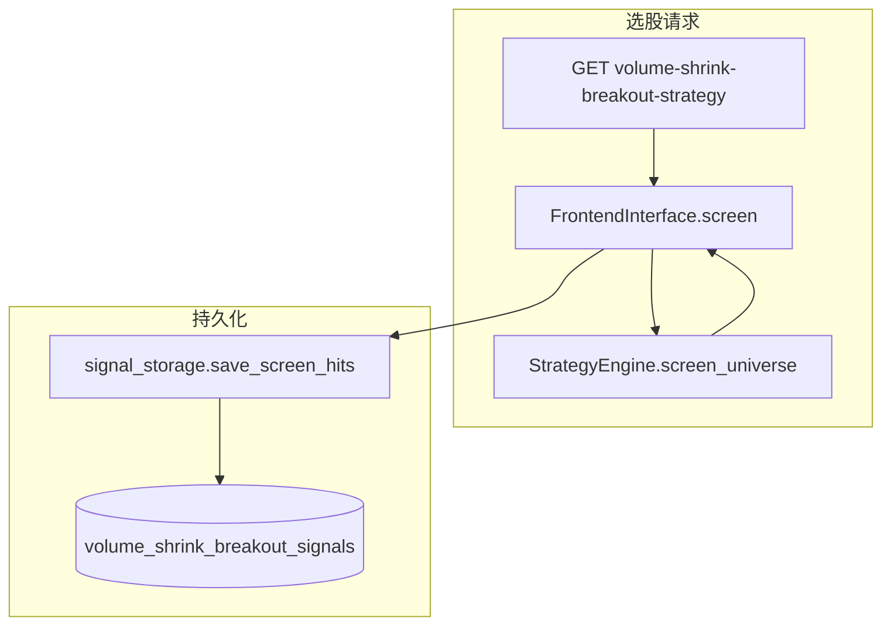

# 3 倍量缩量突破：交易信号与信号历史

## 背景与参照

- **GMS**（[`backend_api/models.py`](e:\wangxw\股票分析软件\编码\stock_quote_analayze\backend_api\models.py) `GMSSignalTrace` + [`backend_core/strategies/gms/frontend_interface.py`](e:\wangxw\股票分析软件\编码\stock_quote_analayze\backend_core\strategies\gms\frontend_interface.py) `_save_result_to_trace` + [`backend_api/stock/gms_trace_routes.py`](e:\wangxw\股票分析软件\编码\stock_quote_analayze\backend_api\stock\gms_trace_routes.py)）：按 **(code, date, market_type)** 存 **每个交易日** 的指标与信号，选股优先读表再回补。
- **一阳穿三线**（[`OneYangThreeLinesSignal`](e:\wangxw\股票分析软件\编码\stock_quote_analayze\backend_api\models.py) + [`one_yang_three_lines_strategy.py`](e:\wangxw\股票分析软件\编码\stock_quote_analayze\backend_api\stock\one_yang_three_lines_strategy.py)）：在筛选命中时 **UPSERT** `(code, signal_date)`，适合「形态触发日」类信号。

**VSB 现状**（[`strategy_engine.evaluate_stock`](e:\wangxw\股票分析软件\编码\stock_quote_analayze\backend_core\strategies\volume_shrink_breakout\strategy_engine.py)）：K 线 **最新在前**，只在 **当前截面** 上判定爆量日 `k` 与「最新日缩量突破」，**没有** GMS 那种「对历史上每个交易日 T 把 T 当最新日重算」的循环。因此：

- **一期（本计划实施）**：采用与一阳穿三线一致的 **「每次选股命中即写入一条信号记录」** + **按 code / 按 signal_date 区间查询**，满足「交易策略信号 + 信号历史」的主体需求。
- **二期（可选、工作量大）**：若需 **严格对齐 GMS 的「逐日 trace」**，需新增「以任意交易日为 index=0」的滚动窗口重算引擎 + 定时任务，与现有 `evaluate_stock` 解耦；本计划不实现，仅在文档中预留说明。

## 一期设计

### 1. 数据表与 ORM

- 新建表建议名：`volume_shrink_breakout_signals`（与 `one_yang_three_lines_signals` 命名风格一致）。
- **业务主键 / 唯一约束**：`(code, signal_date)`，其中 **`signal_date` = 突破日 `breakout_date`**（与当前返回字段 [`frontend_interface` / `evaluate_stock`](e:\wangxw\股票分析软件\编码\stock_quote_analayze\backend_core\strategies\volume_shrink_breakout\strategy_engine.py) 一致），同一股票同一天只保留一条；重复跑选股时用 **merge / upsert** 更新数值字段与 `updated_at`（若加该列）或覆盖 `created_at` 策略与一阳穿一致即可。
- **建议列**（覆盖选股结果 + 可追溯参数）：
  - 标识：`code`, `name`, `signal_date` (DATE)
  - 形态：`boom_date`, `boom_close`, `boom_volume`, `boom_volume_ratio_vs_prev`, `ma5_at_boom`, `ma10_at_boom`, `ma20_at_boom`, `breakout_close`, `breakout_volume`, `current_change_percent`
  - 可选审计：`volume_ratio_param`, `boom_lookback_min`, `boom_lookback_max`, `boards_json`（TEXT/JSON 存本次筛选 boards），`run_search_date`（VARCHAR，接口层 `search_date`）
  - `created_at`（及按需 `updated_at`）
- 在 [`backend_api/models.py`](e:\wangxw\股票分析软件\编码\stock_quote_analayze\backend_api\models.py) 增加 `VolumeShrinkBreakoutSignal`（或同类命名）模型与 `UniqueConstraint('code','signal_date',...)`。
- 提供建表脚本：仿 [`backend_api/create_one_yang_signal_table.py`](e:\wangxw\股票分析软件\编码\stock_quote_analayze\backend_api\create_one_yang_signal_table.py)，并在 [`database/tables`](e:\wangxw\股票分析软件\编码\stock_quote_analayze\database\tables) 或现有 SQL 汇总处补 DDL（若项目惯例要求）。

### 2. 写入路径（信号生成）

- 在策略包内新增薄模块（例如 [`backend_core/strategies/volume_shrink_breakout/signal_storage.py`](e:\wangxw\股票分析软件\编码\stock_quote_analayze\backend_core\strategies\volume_shrink_breakout\signal_storage.py)）：
  - `save_screen_hits(db, rows: List[dict], *, parameters: dict, search_date: str) -> int`
  - 将 `evaluate_stock`/`screen_universe` 产出的 dict 映射为 ORM；对每条 `db.merge` 或「先查再更新」以保证 SQLite/PG 行为一致（一阳穿使用 raw `ON CONFLICT`，若生产仅为 PG 可二选一，建议 **ORM merge** 降低方言差异）。
- 在 [`VolumeShrinkBreakoutFrontendInterface.screen`](e:\wangxw\股票分析软件\编码\stock_quote_analayze\backend_core\strategies\volume_shrink_breakout\frontend_interface.py) 末尾、`return` 之前调用保存逻辑；增加参数 **`persist_signals: bool = True`**（默认 True），便于单测或纯内存场景关闭。
- [`stock_screening_routes.get_volume_shrink_breakout_strategy`](e:\wangxw\股票分析软件\编码\stock_quote_analayze\backend_api\stock\stock_screening_routes.py) 增加可选 Query **`persist`**（默认 `true`），传入 `screen(..., persist_signals=persist)`；失败时 **仅打日志不阻断** 选股成功响应（与一阳穿「保存失败仍返回结果」一致）。

### 3. 信号历史 API（对齐 GMS「单股历史」形态）

- 新建路由模块，例如 [`backend_api/stock/vsb_signal_routes.py`](e:\wangxw\股票分析软件\编码\stock_quote_analayze\backend_api\stock\vsb_signal_routes.py)，`prefix="/api/stock"`，`tags` 自拟。
- 建议端点：
  - **`GET /api/stock/vsb-signals`**：`code` 必填，`start_date` / `end_date` 可选，按 `signal_date` 降序返回该股的 **信号历史**（读表即可，不做全量重算）。
  - **`GET /api/stock/vsb-signals/by-date`**：`signal_date=YYYY-MM-DD` 必填，可选 `limit`，返回当日 **全市场命中列表**（供管理端或复盘；注意数据量，默认加 `limit` 上限）。
- 在 [`backend_api/main.py`](e:\wangxw\股票分析软件\编码\stock_quote_analayze\backend_api\main.py) `_include_router` 注册新 router（参照 [`gms_trace_router`](e:\wangxw\股票分析软件\编码\stock_quote_analayze\backend_api\main.py)）。

### 4. 测试与文档

- 在 [`test/`](e:\wangxw\股票分析软件\编码\stock_quote_analayze\test) 下增加：
  - `normalize` + `row` 映射单测（无 DB）；
  - 若有现成 PG/SQLite 测试夹具，可对 `save_screen_hits` 做 upsert 重复键测试（否则 mock `Session`）。
- 更新 [`docs/3倍量缩量突破策略设计与使用手册.md`](e:\wangxw\股票分析软件\编码\stock_quote_analayze\docs\3倍量缩量突破策略设计与使用手册.md)：新增「信号持久化」「历史查询 API」「persist 参数」「与 GMS 日频 trace 的差异与二期说明」。

### 5. 前端（可选、按需实施）

- 参照 [`frontend/stock_gms_trace.html`](e:\wangxw\股票分析软件\编码\stock_quote_analayze\frontend\stock_gms_trace.html) + [`frontend/js/stock_gms_trace.js`](e:\wangxw\股票分析软件\编码\stock_quote_analayze\frontend\js\stock_gms_trace.js)，增加「VSB 信号历史」页与选股结果里「历史」链接；**若本期只做后端**，可在计划中标注为后续迭代，避免范围膨胀。

## 风险与约定

- **线程池 + Session**：现有 VSB 路由已在 `run_in_executor` 中使用传入的 `db`；落库逻辑必须 **与 `screen` 同在同一线程内** 完成，不新增跨线程共享 Session。
- **`signal_date` 解析**：以 `breakout_date` 字符串转 `DATE`，异常行跳过并记日志。
- **与 GMS 差异**：一期 **不承诺**「无选股也能从空表生成历史」；历史来自 **已发生的选股落库** 或后续你单独加的定时任务（可写在文档「运维建议」中）。
