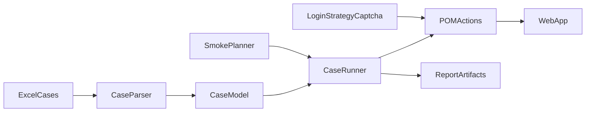

# Web系统自动化扫功能与用例执行方案

## 目标与边界
- 面向 Web 系统，交付“自动登录 + 功能冒烟扫描 + Excel 用例执行”一体化能力。
- 登录存在验证码，优先采用“测试环境免验证码/白名单开关”方案；若无法改造，再使用“人工一次性注入会话态”作为过渡。
- 测试代码统一放在 [e:/wangxw/股票分析软件/编码/stock_quote_analayze/test](e:/wangxw/股票分析软件/编码/stock_quote_analayze/test)。

## 分层架构（建议 Playwright + 数据驱动）
- **执行层**：Playwright 测试运行器（并发、重试、报告、截图录像）。
- **业务层**：页面对象（POM）封装登录、菜单导航、关键业务动作。
- **数据层**：Excel -> 标准 JSON/YAML 用例模型（步骤、断言、前置条件）。
- **编排层**：
  - `smoke` 套件：按菜单/模块覆盖主流程。
  - `cases` 套件：按 Excel 用例批量执行。
- **观测层**：HTML 报告 + 失败截图 + 控制台/网络日志 + 失败重跑。

## 登录与验证码策略（按优先级）
- **方案A（首选）**：测试环境支持免验证码开关（IP 白名单、测试账号白名单、header 标识），自动化直接走账号登录。
- **方案B（次选）**：预登录生成 `storageState`（Cookie/LocalStorage），后续用例复用会话，规避频繁触发验证码。
- **方案C（兜底）**：半自动模式：启动前人工完成一次验证码，脚本接管后续全流程。
- 明确不建议：在生产风控逻辑上硬破解验证码，易失效且有合规风险。

## 实施阶段
- **阶段1：框架落地（1-2天）**
  - 初始化 `test` 目录结构、环境配置、基础运行脚本。
  - 完成登录能力与会话复用能力。
- **阶段2：功能冒烟（2-4天）**
  - 建立菜单发现与关键路径扫描（首页、核心列表页、详情页、提交页）。
  - 输出可追踪报告（模块通过率、失败截图、失败原因）。
- **阶段3：Excel用例接入（2-5天）**
  - 约定 Excel 模板字段（用例ID、步骤、输入、期望、前置）。
  - 开发解析器与数据驱动执行器，支持关键字动作与断言。
- **阶段4：CI集成（1-2天）**
  - 在 CI 中配置定时/提交触发执行，失败告警到企业沟通渠道。

## 关键目录规划
- [e:/wangxw/股票分析软件/编码/stock_quote_analayze/test/e2e](e:/wangxw/股票分析软件/编码/stock_quote_analayze/test/e2e)：冒烟与回归入口。
- [e:/wangxw/股票分析软件/编码/stock_quote_analayze/test/pages](e:/wangxw/股票分析软件/编码/stock_quote_analayze/test/pages)：页面对象。
- [e:/wangxw/股票分析软件/编码/stock_quote_analayze/test/data](e:/wangxw/股票分析软件/编码/stock_quote_analayze/test/data)：Excel与转换后的结构化数据。
- [e:/wangxw/股票分析软件/编码/stock_quote_analayze/test/utils](e:/wangxw/股票分析软件/编码/stock_quote_analayze/test/utils)：登录态、断言、日志、重试策略。

## 验收标准
- 可一键执行 `smoke` 并产出报告（通过率、失败截图、失败步骤）。
- 可读取 Excel 用例并至少稳定执行 20+ 条核心用例。
- 对验证码场景有稳定可复用策略（A/B/C 至少一种可长期运行）。
- 在 CI 中每日自动跑一轮并可追踪历史结果。