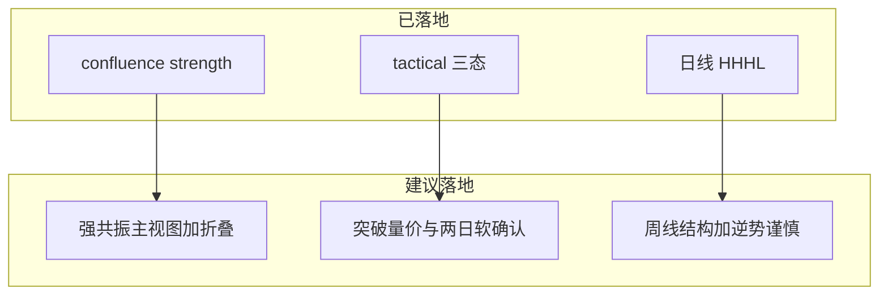

# 个股分析优化建议：现状对照与实现方案

## 附件建议 vs 系统现状

| 附件建议               | 现状结论                                                                                                                                                       | 差距                                                                                                             |
| ------------------ | ---------------------------------------------------------------------------------------------------------------------------------------------------------- | -------------------------------------------------------------------------------------------------------------- |
| 1. 支撑阻力「多算法共振」加权   | **算法已有**：`[confluence_zones.py](backend_core/analysis/confluence_zones.py)` DBSCAN/距离合并、`strength`、筹码 HVZ/真空；挂在 levels 的 `classic_levels.confluence_zones` | **产品未主视图化**：`[kde_levels_tool.js](frontend/js/kde_levels_tool.js)` 仍是 KDE→VP→Fib→Pivot→Cam→**共振垫底**；无「强共振」标签叙事 |
| 2. 形态「右侧确认」+ 假突破过滤 | 突破确认多为 **单日收盘 ×1.005**（`[rules.py](backend_core/analysis/chart_patterns/rules.py)` `BREAKOUT_UP_MULT`）；量 1.5×MA20 **仅楔形** `breakout_follow`                | **通用突破无量能、无连续 2 日站稳**                                                                                          |
| 3. 波段趋势「多周期共振」     | 日线 `[market_structure.py](backend_core/analysis/market_structure.py)` 已落地；行情有周线表                                                                           | **无周线 HH/HL**；无「逆势谨慎」；不改 URT/GMS                                                                               |
| 4. 可视化主视图 / 明细折叠   | 个股 `#ssaLevelsBlock` 与工具页同一套平铺渲染                                                                                                                           | **缺核心共振主视图 + 算法明细折叠**                                                                                          |

附件中的 EMA/BOLL：现网关键价位主源是 **KDE/VP/Fib/Pivot/Cam/ATR-Pivot**，**不做 EMA/BOLL 入共振**（一期），避免与现行口径分叉。

---

## 总体原则（定稿）

1. **先产品化已有算法，再加规则**：建议 1+4 优先（几乎只改前端编排）。
2. **形态/周线用软增强**：写 `evidence` / 风险提示 / 买点降权，**不立刻改**全市场 `confirmed` 硬门槛、**不写** URT/GMS 硬筛（与既有「并列不覆盖」纪律一致）。
3. 分三期：P0 UI → P1 突破软确认 → P2 周线对照。

---

## P0：强共振主视图 + 多算法明细折叠（对应建议 1+4）

**目标**：一眼看到「强共振支撑/压力」，明细默认折叠。

### 后端（轻量）

在 `[confluence_zones.py](backend_core/analysis/confluence_zones.py)` / levels 组装处为每条带增加展示字段（不改聚类公式）：

- `tier`: `strong` / `normal`（例如 `strength≥10` 或 sources≥3 → strong；阈值写入常量，与战术贴压档对齐可调）
- `label_zh`: `强共振支撑` / `强共振压力` / `共振支撑` / `共振压力`

### 前端

改 `[kde_levels_tool.js](frontend/js/kde_levels_tool.js)` `renderEmbedded`（个股分析与技术工具共用）：

1. **主视图卡（置顶）**：最近强共振 S/R + 带区间 + strength + sources；无强带则展示「最近共振带」并注明非强。
2. **明细折叠**：KDE / VP / Fib / Pivot / Cam 包进 `
`，默认收起；共振完整列表可放主视图下或折叠内。
3. 同步 `[analysis.html](frontend/analysis.html)` 工具区静态结构（若有）与 PDF `[stock_analysis_pdf.js](frontend/js/stock_analysis_pdf.js)` 章节顺序：先共振主结论，再算法明细。

**验收**：个股分析阻力支撑块首屏以共振为主；明细可展开；不改 API 契约（仅增字段）。

---

## P1：形态突破软确认（对应建议 2）

**目标**：过滤诱多假突破，但避免一夜改掉全部 `confirmed` 命中率。

### 规则（软层，写入 `tactical`）

对「已确认上破 / 看多买点」增加质量标记（`[pattern_tactical.py](backend_core/analysis/pattern_tactical.py)`）：

| 条件                          | 含义                                        |
| --------------------------- | ----------------------------------------- |
| 突破日量 ≥ 1.5×近 20 日均量         | 量价配合（复用楔形 `WEDGE_BREAKOUT_VOL_MULT` 常量口径） |
| 含突破日在内连续 ≥2 日收盘 ≥ 突破位×1.005 | 右侧站稳                                      |

产出：

- `breakout_quality`: `strong` | `weak` | `unconfirmed_hold`
- `evidence[]`：如 `breakout_vol_ok` / `breakout_hold_2d` / `breakout_vol_missing`
- 买点：`weak` 时 **降低 priority** 或改 `watch`，文案提示「缺量/未站稳，防假突破」；**不**把已 `confirmed` 形态打回 `forming`（硬生命周期另议）

### 前端

专家区 / 买点列表展示「突破质量」徽章；PDF 摘要带一句。

### 明确不做（P1）

- 不改 `lifecycle` 归档主路径；不把 2 日规则写入全族 `breakout_up` 硬确认（可列为 P1.5 开关 `breakout_hard_confirm`，默认关）。

---

## P2：周线结构 +「逆势谨慎」（对应建议 3）

**目标**：日线波段/形态买点旁增加大级别过滤提示。

### 后端

1. 复用 `[analyze_market_structure](backend_core/analysis/market_structure.py)`：对周线 OHLC（`weekly_quotes` 或日线聚合）跑同一套 ZigZag→HH/HL→trend。
2. API：`[market_structure_routes.py](backend_api/stock/market_structure_routes.py)` 增加 `weekly` 字段，或 `period=daily|weekly`。
3. 对照规则：
  - 周线 `downtrend` 且日线买点/看多 → `counter_trend_caution=true`，文案「逆势谨慎」
  - 写入 `pattern_tactical.evidence`（如 `weekly_downtrend`），**不改** `short_bias` 主判定
4. 个股波段块展示「日线 / 周线」双标签 + 对照句。

### 明确不做（P2）

- 不因周线空头否决 URT/GMS 正式买点；策略硬筛另立项。

---

## 建议实施顺序与工期感

| 阶段     | 内容                      | 价值              |
| ------ | ----------------------- | --------------- |
| **P0** | 强共振主视图 + 明细折叠 + tier 标签 | 最高（附件 1+4，数据已齐） |
| **P1** | 突破量价/两日软确认              | 中高（降假突破噪音）      |
| **P2** | 周线结构 + 逆势谨慎             | 中（稳健风格对齐）       |

---

## 与附件「一、现状梳理」的对齐说明

附件四模块映射现网：

1. **多维打分卡** → RPE/SBBR/GMS/URT（个股策略块）— 本次不改打分公式
2. **多源支撑阻力** → levels（KDE/VP/经典位）+ **共振带已是聚类结果** — P0 把它推到主视图
3. **形态规则引擎** → patterns + tactical — P1 加右侧质量
4. **结构复盘** → 各策略 trace / 形态生命周期 — 不在本方案范围；若要做「历史结构回测面板」需单独需求

---

## 风险

- P1 若误做成硬确认，选股/形态命中会骤降 → 必须软层默认。  
- P0 折叠后用户找不到旧算法 → 明细标题保留算法名，默认一键「展开全部」。  
- 周线样本少的次新股 → `weekly.insufficient` 时不报警。

