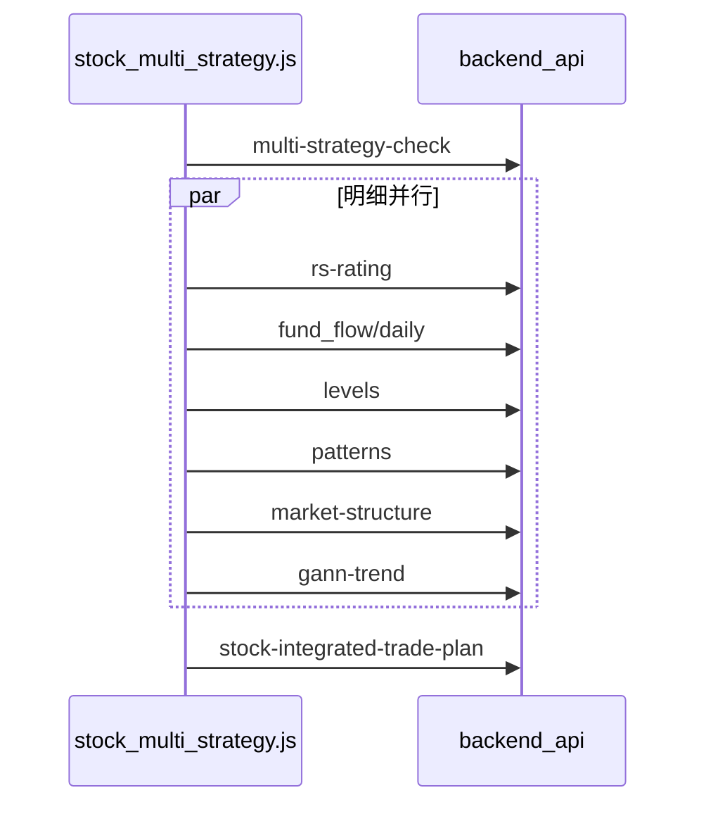
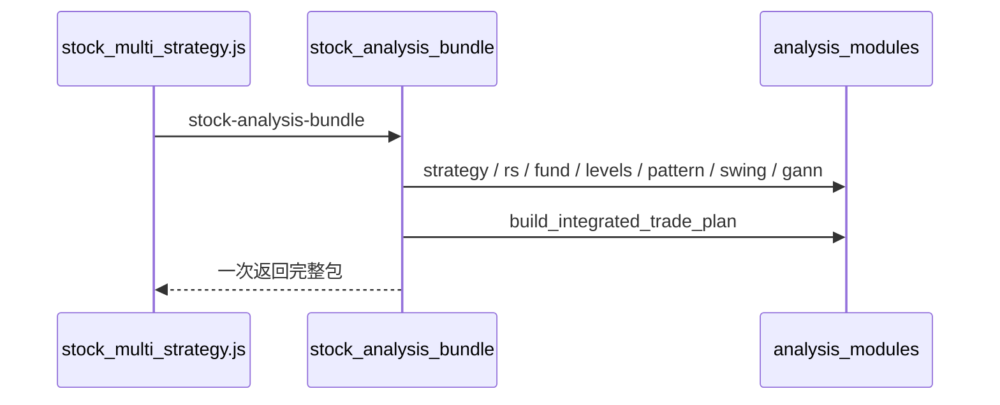

# 个股分析统一服务入口

## 现状与目标

当前 `[frontend/js/stock_multi_strategy.js](frontend/js/stock_multi_strategy.js)` 在 `_runAnalyzeCore` / `_fetchAnalysisBundle` 中自行编排：




目标改为：




**范围（已定）：** 仅分析主链路（四策略 + RS/资金/阻力/形态/波段/江恩 + 综合交易计划）。自选、交易观察、龙头选板等工具栏动作不收口。技术工具 Tab 继续用现有细粒度 API。

## 后端

### 1. 编排服务

新增 `[backend_core/analysis/stock_analysis_bundle.py](backend_core/analysis/stock_analysis_bundle.py)`：

- 入参对齐现有：`code`/`name`、`date`、`use_realtime`、可选 `strategies`
- 解析股票：复用 `resolve_levels_stock_identifier`（与 `multi-strategy-check` 同口径；歧义时返回 `candidates`）
- 内部调用（不走 HTTP）：
  - `collect_stock_multi_strategy_check`（`[stock_multi_strategy.py](backend_core/analysis/stock_multi_strategy.py)`）
  - RS：复用 `get_rs_rating` 同源逻辑（从 `[board_analysis_routes.py](backend_api/stock/board_analysis_routes.py)` 抽到 core 或直接调已有 core 函数）
  - 资金：复用 `stock_fund_flow` 日线查询逻辑
  - levels / patterns / market-structure / gann：复用各 route 已调用的 core 函数（与现有 GET 行为一致，含 `use_realtime`、复权默认）
  - 形态完成后若需 `pattern_short_bias`，在服务端再算一次 swing（对齐前端 `_refreshSwingContrast`）
  - `build_integrated_trade_plan`：用服务端已算 snapshots，**不再依赖前端回传**
- **容错：** 策略解析失败（歧义/未找到）整体失败；各明细模块独立 try/except，区块级 `*_error`，其余照常；策略失败但代码像股票代码时（对齐前端 fallback）仍尽量拉明细+计划
- **并发：** 明细用 `ThreadPoolExecutor`，**每个任务独立 `SessionLocal()`**（禁止跨线程共用请求 Session）
- 返回结构建议（与前端现有 `last*` 字段易对齐）：

```python
{
  "success": True,
  "data": {
    "strategy": {...},          # 原 multi-strategy-check.data
    "rs": {...} | None,
    "rs_error": str | None,
    "fund_flow": {...} | None,
    "fund_flow_error": str | None,
    "levels": {...} | None,
    "levels_error": str | None,
    "pattern": {...} | None,
    "pattern_error": str | None,
    "swing": {...} | None,
    "swing_error": str | None,
    "gann": {...} | None,
    "gann_error": str | None,
    "trade_plan": {...} | None,
    "trade_plan_error": str | None,
  }
}
```

### 2. HTTP 入口

在 `[backend_api/stock/board_analysis_routes.py](backend_api/stock/board_analysis_routes.py)` 增加（与现有 stock_ai 权限同域）：

- `GET /api/analysis/stock-analysis-bundle`
- Query：与 `multi-strategy-check` 一致（`code`/`stock_code`、`date`、`strategies`、`use_realtime`）
- 权限：`require_permission("channel.analyze.tab.stock_ai")`
- Handler 薄封装：校验 → 调 `build_stock_analysis_bundle` → JSON

**保留**现有细粒度接口（`multi-strategy-check`、`levels`、`patterns`、`market-structure`、`gann-trend`、`rs-rating`、`stock-integrated-trade-plan`），供技术工具与导出/单独刷新使用。

## 前端

### 3. 主链路改单次调用

改 `[frontend/js/stock_multi_strategy.js](frontend/js/stock_multi_strategy.js)`：

- `_runAnalyzeCore`：改为一次 `authFetch(.../stock-analysis-bundle)`，再按区块调用现有 `renderStrategyResult` / 各 section 渲染（把「加载」与「渲染」拆开，或新增 `_applyBundleToUi(data)`）
- `_fetchAnalysisBundle`（批量）：同样改调统一入口，去掉明细并发 HTTP 与二次 POST trade-plan
- 保留歧义候选 UI（`candidates`）与策略失败 fallback 渲染行为
- `loadRsRatingSection` 等细粒度函数可保留：供以后单独刷新；主路径不再并行打 6+1 个接口
- `loadTradePlanSection`：主路径改为消费 bundle 内 `trade_plan`；若仍有「仅重算计划」需求，可继续走旧 POST（本期可不强制删）

嵌入面板 `[stock_analysis_panel.js](frontend/js/stock_analysis_panel.js)` 复用同一套 `StockMultiStrategy`，无需另写编排。

## 测试

在 `[test/](test/)` 增加：

- 编排服务单元/冒烟：mock 或轻量 DB fixture，断言返回字段齐全、某明细抛错时其它区块仍有数据、trade_plan 在 snapshots 齐全时生成
- 路由冒烟（若项目已有 FastAPI TestClient 惯例）：权限与参数校验
- 前端：对 `stock_multi_strategy.js` 做字符串/契约级断言（统一 URL 存在、旧主路径并行 URL 不再出现在 `_runAnalyzeCore`），或沿用现有 `test_*` 风格

## 不改动

- 自选 / 交易观察 / 正式交易 / 龙头选板 API
- 技术工具页对 `KdeLevelsTool` / `PatternTool` 等细粒度调用
- 旧 Gemini `GET /api/analysis/stock/{code}`

