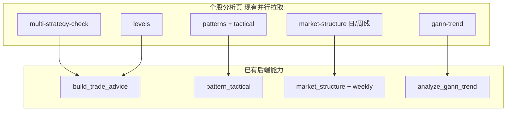
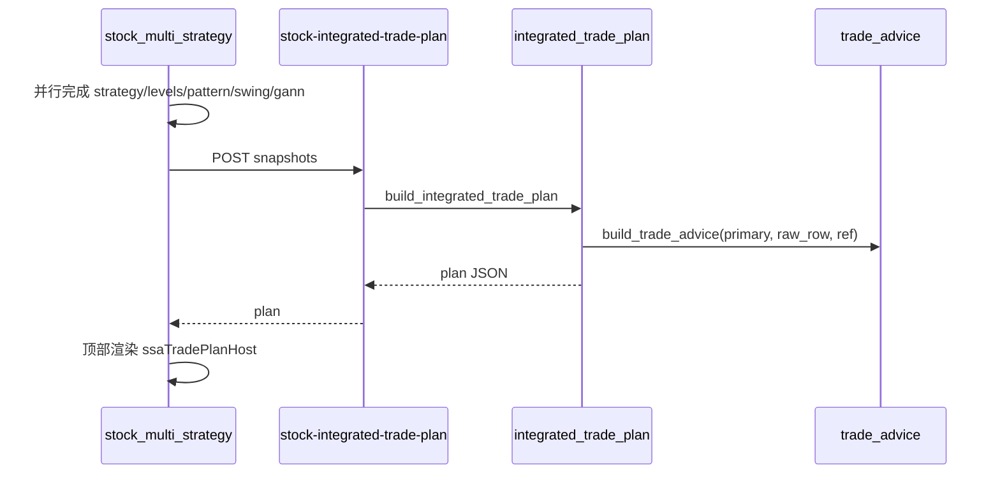

# 个股分析 · 综合交易策略整合方案

## 目标

在 `[frontend/analysis.html](frontend/analysis.html)` 个股分析页 **顶部**（`#ssaMeta` 下方、策略卡片上方）增加独立区域 **「综合交易策略」**，将现有模块数据整合为：

- **短线**（数日至约 2 周）：操作倾向、入场/止损/止盈、触发与失效条件
- **中长线**（数周至数月）：趋势立场、回撤观察区、持有/加仓与退出逻辑

口径与现有系统一致，复用 `[backend_core/analysis/trade_advice.py](backend_core/analysis/trade_advice.py)` 的买卖区/止损/horizon 规则，以及 `[backend_core/analysis/pattern_tactical.py](backend_core/analysis/pattern_tactical.py)` 的 short_bias / buy_hints。

## 现状与可复用能力




- 前端 `[frontend/js/stock_multi_strategy.js](frontend/js/stock_multi_strategy.js)` 已在分析后并行写入 `lastStrategy / lastLevels / lastPattern / lastSwing / lastGann`。
- 板块分析已用 `build_trade_advice(strategy, row, reference_levels=ref)` 生成结构化建议；URT 已区分 `horizon.short_term` / `horizon.medium_term`（见 `trade_advice.py` 约 631–646 行）。
- **缺口**：无「跨模块」汇总器；multi-strategy 接口只返回 slim `detail`，不足以直接调 `build_trade_advice`，需在合成 API 内重新取 **完整策略行**。

## 架构设计

### 1. 后端：合成模块 + API

新增 `[backend_core/analysis/integrated_trade_plan.py](backend_core/analysis/integrated_trade_plan.py)`：

**输入上下文** `IntegratedTradePlanContext`（由 API 组装）：


| 字段                 | 来源                                       |
| ------------------ | ---------------------------------------- |
| `strategy_pack`    | 四策略完整原始行 + 命中摘要                          |
| `levels`           | KDE/VP/经典位/共振带（与 levels API 同结构）         |
| `pattern`          | 形态 items + `tactical`                    |
| `market_structure` | 日线 trend + weekly + `counter_trend_note` |
| `gann`             | `gann_trend.verdict` + 关键角度/时间窗摘要        |
| `meta`             | code / name / trade_date / close         |


**核心函数** `build_integrated_trade_plan(ctx) -> dict`，输出结构（示例）：

```python
{
  "stance_short": "buy|watch|avoid",      # 短线总立场
  "stance_medium": "bull|neutral|bear", # 中长线趋势立场
  "confidence": "high|medium|low",
  "primary_strategy": "urt|gms|sbbr|rpe|none",
  "short_term": {
    "action_label": "回踩承接",
    "entry_zone": {"low", "high", "label"},
    "stop_zone": {...},
    "take_profit": {...},
    "triggers": [...],   # 加仓/减仓触发
    "summary": "...",
    "evidence": [...]    # 可追溯条目
  },
  "medium_term": {
    "bias_label": "周线偏多观察",
    "watch_zone": {...},  # MA20/更深支撑/周线结构位
    "holding_plan": "...",
    "exit_triggers": [...],
    "summary": "...",
    "evidence": [...]
  },
  "key_levels": {"support", "resistance", "close"},
  "conflicts": [...],     # 如日线多头 vs 周线逆势
  "disclaimer": "规则模板，非投资建议"
}
```

**合成规则（V1，可单测）**：

1. **主策略选取**：在命中策略中按优先级 `URT > GMS > SBBR > RPE`；同优先级取得分更高者；均未命中则 `primary_strategy=none`，短线默认 `watch`。
2. **短线价位**：对主策略调用 `build_trade_advice(primary, raw_row, reference_levels=levels)`；若形态 `tactical` 存在，沿用其 `_soft_merge_pattern_tactical` 逻辑（已在 URT 分支内）。
3. **形态旁证**：`short_bias` 看多/看空/震荡 调整 `confidence`；与日线 trend 冲突时写入 `conflicts`（不强行改 action）。
4. **中长线**：综合 `weekly.trend`、形态 NLG 中线语义（或 `tactical` 的 weekly 逆势 evidence）、`horizon.medium_term`（MA20/更深回撤）、江恩 `verdict.bias`；输出 `watch_zone` 与 `exit_triggers`（如周线 HL 破坏、江恩时间窗到期）。
5. **阻力支撑**：`nearest_support/resistance`、强共振带作为 `key_levels` 与 evidence；与买点/止损不一致时在 `conflicts` 说明。

新增路由（挂到 `[backend_api/stock/board_analysis_routes.py](backend_api/stock/board_analysis_routes.py)` 或 `[backend_api/stock/stock_analysis_routes.py](backend_api/stock/stock_analysis_routes.py)`）：

- `POST /api/analysis/stock-integrated-trade-plan`
- Body：`{ code, date?, snapshots?: { strategy, levels, pattern, swing, gann } }`
- 行为：若带 `snapshots` 则直接合成（避免重复算 levels/形态）；否则服务端按 code+date 拉全量（便于 PDF/深链复用）。
- 权限：复用 `channel.analyze.tab.stock_ai`（与个股分析同入口）。

为 `build_trade_advice` 补充 **原始行获取**：在 `[backend_core/analysis/stock_multi_strategy.py](backend_core/analysis/stock_multi_strategy.py)` 增加 `collect_strategy_raw_rows(db, code, date)`，返回四策略完整 dict（不 slim），供合成模块专用。

### 2. 前端：顶部独立区块 + 渲染

**HTML**（`[frontend/analysis.html](frontend/analysis.html)`）在 `#ssaMeta` 后、`#ssaStrategyBlock` 前插入：

```html
<section class="ssa-block ssa-trade-plan-block" id="ssaTradePlanBlock" hidden>
  <h4 class="ssa-block-title">综合交易策略</h4>
  <div class="ssa-block-status" id="ssaTradePlanStatus"></div>
  <div id="ssaTradePlanHost"></div>
</section>
```

仍在 `#ssaExportRoot` 内，以便 PNG/PDF 一并导出。

**JS**：

- 新增 `[frontend/js/stock_trade_plan.js](frontend/js/stock_trade_plan.js)`：`render(host, plan)` + 证据列表/冲突提示 UI（风格对齐 `[frontend/js/urt_score_detail.js](frontend/js/urt_score_detail.js)` 买点建议区）。
- 扩展 `[frontend/js/stock_multi_strategy.js](frontend/js/stock_multi_strategy.js)`：
  - `lastTradePlan` 状态
  - `loadTradePlanSection()`：在四路并行完成后 `POST` 合成 API（附 snapshots）
  - `analyze()` 的 `Promise.all` 末尾追加 `loadTradePlanSection`
  - `hideResultBlocks()` / `updateExportBtn()` 纳入新 block
- 在 `[frontend/js/stock_analysis_pdf.js](frontend/js/stock_analysis_pdf.js)` / PNG 导出根节点中增加「综合交易策略」一节（表格 + summary）。

**CSS**（`[frontend/css/analysis.css](frontend/css/analysis.css)`）：

- 顶部总览卡片：双列「短线 / 中长线」、立场徽章、关键价位条、冲突警示条（复用 `.urt-advice-badge` 色系或新建 `.ssa-plan-*`）。

### 3. 测试

- 新增 `[test/test_integrated_trade_plan.py](test/test_integrated_trade_plan.py)`：用 fixture JSON 覆盖
  - URT 命中 + 形态看多 + 周线逆势 → conflicts 含逆势提示
  - 无策略命中 → watch + 结构位观察
  - GMS 左侧 + KDE 支撑 → 短线 buy_zone 合理
- 扩展 `[test/test_stock_analysis_png.js](test/test_stock_analysis_png.js)`：断言 `ssaTradePlanBlock` / `stock_trade_plan.js` 已挂载。

## 数据流（实现后）




## 不在本期范围（可后续迭代）

- 自动下单、仓位百分比、回测验证
- 用户可编辑策略权重
- 独立权限码（V1 与分析按钮共用）

## 关键文件清单


| 操作    | 文件                                                        |
| ----- | --------------------------------------------------------- |
| 新增    | `backend_core/analysis/integrated_trade_plan.py`          |
| 修改    | `backend_core/analysis/stock_multi_strategy.py`（raw rows） |
| 新增/修改 | `backend_api/stock/*_routes.py`（POST 路由）                  |
| 新增    | `frontend/js/stock_trade_plan.js`                         |
| 修改    | `frontend/analysis.html`、`frontend/css/analysis.css`      |
| 修改    | `frontend/js/stock_multi_strategy.js`                     |
| 修改    | `frontend/js/stock_analysis_pdf.js`（导出）                   |
| 新增    | `test/test_integrated_trade_plan.py`                      |


