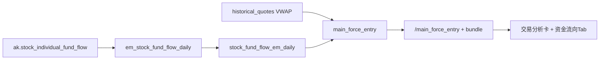

# 主力入场判定实现计划

## 定案（一期范围）

依据 [outputs/主力入场判断-可行性与数据缺口评估.md](outputs/主力入场判断-可行性与数据缺口评估.md) 与现有采集现状：

| 做 | 不做 |
|---|---|
| 东财个股主力/超大/大/中/小单日序列落库 + 回填 | 同花顺「即时」冒充历史；覆盖 THS `net_amount` |
| 入场**时间窗口**识别 + **净流入加权均价**（价位近似） | **完整 CYQ 筹码分布**（见下节） |
| 判定卡叠加现有 **Volume Profile**（POC/VAH/VAL）作价位旁证 | 龙虎榜/席位历史、L2 逐笔、机构持仓 |
| 交易分析判定卡 + 资金流向 Tab 分档曲线 | 改写 URT/GMS 评分；宣称「机构已入场」 |

口径文案（前后端统一）：**主力 = 东财按成交额分档推断的主力净流入（≈超大单+大单），非账户归属。**

---

## 筹码分布能否进本期？

**结论：完整 CYQ 筹码分布不进一期；一期只用现有日线 Volume Profile 做价位旁证。**

| 维度 | 说明 |
|---|---|
| 现状 | [`volume_profile.py`](backend_core/analysis/volume_profile.py) 已是「均匀摊量、无换手衰减」的轻量 VP；**不是**通达信 CYQ |
| 硬前置 | 真 CYQ 需按换手率做历史筹码衰减；评估实测 `historical_quotes.turnover_rate` 填充率约 **17%**；虽有 [`historical_turnover_rate.py`](backend_core/data_collectors/akshare/historical_turnover_rate.py)，默认只回溯约 30 天且定时任务默认关闭 |
| 工作量 | 换手率多年回填 + 三角摊量衰减算法 + 直方图 API/UI + 与主力窗口对齐 ≈ 与「东财分档落库+判定」同级的独立交付 |
| 风险 | 与主力分档并行会拉长一期、口径更易混淆（「成本重心」vs「筹码峰」） |

**一期价位答案（已定）**：`cost_center`（主力净流入加权均价）+ 窗口 `price_low/high` + 同窗 VP 的 POC/VAH/VAL 是否落入/贴近成本重心（旁证字段，不单独做筹码图产品）。

若强行把完整 CYQ 塞进本期：须先完成换手率 3～5 年回填并通过验收，再做算法与 UI，一期工期至少再扩一档；**默认不采纳**。




---

## 1. 数据层：旁路表存东财分档

**新建表** `stock_fund_flow_em_daily`（不扩 THS 主表，避免与 `source=ths` 的流入/流出/净额混口径）。

建议字段（单位：元，与板块表一致）：

- PK：`code`, `trade_date`
- `main_net_inflow`, `main_net_inflow_pct`
- `super_large_net_inflow`, `large_net_inflow`, `mid_net_inflow`, `small_net_inflow`（及可选占比列）
- `close_price`, `change_percent`（接口若有则落）
- `source` 默认 `em`，`created_at` / `updated_at`

产物：

- 迁移：`migrations/add_stock_fund_flow_em_daily.py`
- ORM：`[backend_api/models.py](backend_api/models.py)` 新增模型
- env_sync：在 `[backend_api/env_sync](backend_api/env_sync)` 市场数据包中登记该表（按 `trade_date` 区间），便于环境同步

THS `[stock_fund_flow_daily](backend_api/models.py)` 与日采 `ths_fund_flow_daily` **保持不变**，继续服务现有「流入/流出/净额」图表。

---

## 2. 采集层：日更 + 历史回填

复用已在 `[backend_api/stock/stock_fund_flow.py](backend_api/stock/stock_fund_flow.py)` `/today` 验证过的源：`ak.stock_individual_fund_flow(stock, market)`，**补全四档+占比映射**（勿再只取 2 个字段）。


| 组件        | 路径 / 行为                                                                                                                                |
| --------- | -------------------------------------------------------------------------------------------------------------------------------------- |
| Collector | `backend_core/data_collectors/akshare/em_stock_fund_flow_daily.py`：按 code 拉序列 → UPSERT；sh/sz/bj 探测；限速与失败重试                             |
| Workflow  | `node_registry` 注册 `em_stock_fund_flow_daily`；挂在 `ths_fund_flow_daily` 之后（或并行日终节点）；默认对**活跃股票池**（与现有日采 universe 对齐）只 upsert **当日/最近几日** |
| 回填脚本      | `test/backfill_em_stock_fund_flow_daily.py`：全市场或 code 列表、断点续跑、`--days` / `--sleep`；目标深度约 **100+ 交易日/票**（以实测为准）                         |
| 手动 API    | `POST /api/stock_fund_flow/em/collect?code=&trade_date=`（单票或触发批任务）                                                                     |


注意：全市场逐票请求量大，日更用「活跃池 + 增量」；历史回填走后台脚本，不阻塞主 workflow。

---

## 3. 判定引擎：`main_force_entry`

新建 `[backend_core/analysis/main_force_entry.py](backend_core/analysis/main_force_entry.py)`（纯计算，可单测）。

**输入**：`stock_fund_flow_em_daily` 近 N 日（默认 **60**）+ `historical_quotes` 的 `amount/volume`（VWAP = `amount/volume/100`，与评估文档一致）。

**规则（一期固定阈值，配置化放模块常量）**：

1. **入场日**：`main_net_inflow > 0` 且 `main_net_inflow / turnover_amount`（或当日成交额）≥ 参与度下限（如 3%，可调）。
2. **入场窗口**：连续 ≥2 个入场日，或滚动 5 日主力净额合计 > 0 且其中入场日 ≥3 → 合并为一段 `entry_window`（`start_date` / `end_date` / `net_sum`）。
3. **价位近似**（窗口内仅 `main_net_inflow > 0` 的日）：
  `cost_center = Σ(main_net × VWAP) / Σ(main_net)`；并给出 `price_low/high`（这些日的最低/最高）作为区间。
4. **形态标签**（互斥优先）：`accumulating`（窗口内价涨+放量）、`high_catch`（成本重心明显高于窗口末收盘）、`pulse`（单日脉冲无连续）、`net_outflow`、`insufficient_data`。
5. **旁证（不改变主结论）**：同窗 THS `net_amount` 方向是否一致；所属板 `board_fund_flow_daily.main_net_inflow` 是否同向（有则返回 `board_resonance: bool`）；同窗调用现有 `compute_volume_profile_from_bars`，返回 `vp_poc/vah/val` 及与 `cost_center` 的相对偏离（`cost_vs_poc_pct`）。

**输出 JSON 摘要**：

```json
{
  "code": "...",
  "lookback_days": 60,
  "verdict": "accumulating|high_catch|pulse|net_outflow|insufficient_data",
  "latest_window": {
    "start_date", "end_date", "main_net_sum",
    "cost_center", "price_low", "price_high",
    "vs_last_close_pct",
    "vp_poc", "vp_vah", "vp_val", "cost_vs_poc_pct"
  },
  "series_summary": { "main_net_sum", "inflow_days", "outflow_days" },
  "disclaimer": "订单分档代理，非机构身份；价位为加权均价近似，非筹码分布"
}
```

单测：`[test/test_main_force_entry.py](test/test_main_force_entry.py)`（合成序列覆盖连续流入、脉冲、净流出、缺数）。

---

## 4. API 与 Bundle

在 `[backend_api/stock/stock_fund_flow.py](backend_api/stock/stock_fund_flow.py)`：

- `GET /api/stock_fund_flow/em/daily?code=&days=`：读东财分档序列（详情图用）
- `GET /api/stock_fund_flow/main_force_entry?code=&days=60`：调判定引擎
- 改造 `/today`：优先读库，缺数再打东财（或标注 deprecated 指向新接口，避免双路径语义混乱）

在 `[backend_core/analysis/stock_analysis_bundle.py](backend_core/analysis/stock_analysis_bundle.py)`：

- 并行任务增加 `main_force_entry`（与现有 `fund_flow` 并列）；`fund_flow` 仍走 THS `compute_daily_fund_flow`（近 20 日不变）。

---

## 5. 前端挂载


| 位置              | 改动                                                                                                                                                                                                                                                        |
| --------------- | --------------------------------------------------------------------------------------------------------------------------------------------------------------------------------------------------------------------------------------------------------- |
| **P0 交易分析**     | `[frontend/js/stock_multi_strategy.js](frontend/js/stock_multi_strategy.js)` + `[analysis.html](frontend/analysis.html)` / `[stock_analysis_panel.js](frontend/js/stock_analysis_panel.js)`：在 `ssaFundFlowBlock` 旁增加「主力入场」卡（结论、窗口日期、成本重心、相对现价、disclaimer） |
| **P1 资金流向 Tab** | `[frontend/js/stock.js](frontend/js/stock.js)`：在现有流入/流出/净额图下增加主力/大单净流入序列（读 `/em/daily`）；高亮 `latest_window` 日期区间                                                                                                                                           |
| Trace 页         | **一期不做**（判定为区间结果卡，非日频策略信号表）                                                                                                                                                                                                                               |


样式复用现有分析卡片 token（`[frontend/css/analysis.css](frontend/css/analysis.css)` / design-tokens），不新开视觉体系。

---

## 6. 文档与运维

- 更新 `[docs/fixed/COLLECTION_WORKFLOW.md](docs/fixed/COLLECTION_WORKFLOW.md)`：节点顺序与限速说明
- 简短产品说明写入评估文档附录或 `docs/notes`：口径、窗口默认 60 日、与 THS 净额差异
- 复盘报告「个股主力净流入」若仍用 THS `net_amount`，一期可后续单独立项改为读 EM `main_net_inflow`（**本计划不改复盘**，避免口径 silently 切换）

---

## 7. 实施顺序

1. 迁移 + ORM + collector UPSERT（单票冒烟）
2. 回填脚本 + 小范围验证（字段齐全、与 `/today` 抽样对齐）
3. `main_force_entry` 引擎 + 单测
4. API + bundle
5. 前端判定卡 + 资金流向分档图
6. workflow 节点注册与日终联调

---

## 关键风险

- **限流/耗时**：全市场回填需分批；日更只跑活跃池。
- **口径混用**：UI 必须区分「同花顺净额」与「东财主力净流入」。
- **加权均价局限**：评估文档 §4 已列（净额≠买入、非持仓成本）；产品文案必须带 disclaimer。
- **港股**：一期仅 A 股东财接口；港股维持现有文件日采，不进主力判定。

---

## 二期候选（不在本期实施）

按对「主力入场」价值与成本排序，二期可单独立项：

| 优先级 | 能力 | 依赖 / 说明 |
|---|---|---|
| **P0** | **CYQ 筹码分布** | 先开换手率回填（3～5 年）→ 三角摊量 + 换手衰减 → 获利盘/90% 成本区间/单峰密集；与主力 `cost_center`、入场窗口对照展示 |
| **P0** | 超大单加权均价 / 分档参与度细拆 | 一期表字段已具备；二期产品化「超大单成本重心 vs 主力成本重心」 |
| **P1** | 龙虎榜历史连续落库 | 现仅按需拉取、库内约 1 日；补日采后作**上榜日事件旁证**（机构净额有值才写，不把超大单写成机构） |
| **P1** | 复盘「个股主力净流入」改读 EM | 避免 silently 改口径；单独切换并标注数据源 |
| **P1** | 主力入场信号追溯页 | 仿 `stock_*_trace`：日频 verdict 落库、区间回看、强制重算 |
| **P2** | 前复权对齐资金流窗口 | 接 `stock_adj_factor` / `apply_qfq_to_bars`，除权前后价位可比 |
| **P2** | 北向 / 十大流通股东增减仓 | 补「是谁」的低频证据（CAN SLIM 的 I）；季报延迟大 |
| **P3** | L2 / 逐笔归档 | 成本最高；仅事件级复盘需要时再做 |

二期默认主线：**换手率回填 → CYQ → 与一期主力窗口/成本重心联动**；席位与机构持仓按产品优先级另排。

