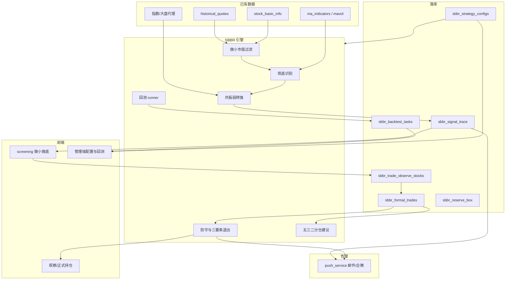

# 「做小做底」资产共振波动策略实现计划（一/二期合并交付）

## 交付范围说明

**原一期 + 原二期一并实现**，不再分期。交付边界：

| 纳入本次 | 仍不做 |
|---------|--------|
| 全市场自动选股 + 日终预计算 | 自动券商/模拟盘下单 |
| 交易观察 + 正式交易（五·三·二） | 分钟级盘中决策 |
| 推送告警（入场/破位/退出） | |
| 管理端参数版本 + 回测 UI | |
| 命中率回测 + 交易模拟回测 | |
| 可选储备箱人工补充 | |

## 策略理解（可量化要点）

| 文档概念 | 落地量化（默认参数，均可配置） |
|---------|-------------------------------|
| **做小** | 总市值 20–200 亿；流通市值约 5–10 亿；缺股本默认排除全市场入选（可配置放宽） |
| **做底·横盘收集** | 振幅 ≤60%；涨时放量跌时缩量；第 3/4 次触及区间下沿 |
| **做底·打压收集** | 跟随大盘急跌后收复 MA20（黄金坑） |
| **共振入场** | 大盘同期调整 + 缩量后收盘上穿 MA20 且微放量；**仅日线尾盘** |
| **弹性防守** | 弱转强日最低价为锚，缓冲 2%–5%；尾盘跌破下沿 → 退场 |
| **三要素退出** | 任一触发分批锁定；三项同时 → 全额退出建议 |
| **五·三·二** | 试探 50% → 加仓 30% → 现金预留 20%；同时开仓 ≤2–3 |

## 全链路架构

## 模块落点

新建 [`backend_core/strategies/sbbr/`](backend_core/strategies/)：

| 文件 | 职责 |
|------|------|
| `config.py` | 全部阈值 + 推送开关阈值 + 回测默认参数 |
| `data_loader.py` | 做小宇宙粗筛 + 日线/MA/MAVOL + 大盘序列 |
| `size_filter.py` / `bottom_detector.py` / `entry_detector.py` / `defense_exit.py` / `position_advisor.py` | 规则检测 |
| `strategy_engine.py` | 全市场 screen + 持仓 evaluate |
| `scheduled_precompute.py` | 日终写 trace + 持仓防守/退出评估 + 触发推送 |
| `signal_storage.py` | upsert trace |
| `backtest_runner.py` | `signal_hit_rate` + `trade_simulation`（对齐 GMS） |
| `backtest_storage.py` | `sbbr_backtest_tasks` 任务与报告 |
| `alert_hooks.py` | 入场/破位/退出事件组装，调用现有 `push_service` |

性能：先市值粗筛再深算；回测默认在「做小宇宙 ∩ 有完整日线」上跑，支持指定股票列表。

## 数据模型（PostgreSQL）

1. `sbbr_signal_trace` — 全市场日信号（`config_id` 隔离）
2. `sbbr_strategy_configs` — JSON 参数版本 + `is_default`
3. `sbbr_trade_observe_stocks` — 交易观察
4. `sbbr_formal_trades` — 正式交易（含 `stage` / `budget_total` / `allocated_pct` / `defense_*` / `exit_reason` / `pnl_*`）
5. `sbbr_reserve_box` — 人工储备补充
6. `sbbr_backtest_tasks` — 回测任务与报告 JSON（仿 `gms_backtest_tasks`）
7. 迁移：[`migrations/`](migrations/)；测试：[`test/`](test/)

## API

**用户端**
- `GET /api/screening/sbbr-strategy`（`scope=market|watchlist|reserve`，`trace_only`）
- `CRUD /api/sbbr/reserve-box`
- `CRUD /api/sbbr/trade-observe`
- `CRUD /api/sbbr/formal-trades`（开仓/加仓/平仓；校验同时持仓 ≤2–3、allocated≤80%）

**管理端**（对齐 [`gms_admin_routes.py`](backend_api/admin/gms_admin_routes.py)）
- `/admin/sbbr/configs` — 参数版本 CRUD、设默认
- `/admin/sbbr/backtests` — 创建回测任务、查状态/报告（`signal_hit_rate` / `trade_simulation`）
- `/admin/sbbr/precompute/trigger` — 手动触发日终扫描（可选）

**推送**
- 预计算结束后：对新增 `entry_signal`、持仓 `defense_breach`、`exit_triggered` 调用现有推送通道（邮件/企微）；用户级订阅开关若 GMS 已有则复用，否则 SBBR 配置内默认开/关字段

## 前端

**用户端** [`frontend/screening.html`](frontend/screening.html) + [`js/screening.js`](frontend/js/screening.js)
- 「做小做底」标签：全市场选股、加入观察、转正式、持仓防守/退出/仓位建议

**管理端**
- 路由 `/sbbr-management`：参数配置 Tab + 回测任务 Tab（参考 [`GMSManagementView.vue`](admin/src/views/GMSManagementView.vue) / PVFRS）
- [`admin/src/services/sbbrApi.ts`](admin/src/services/) + 对应 View/Components
- `router/index.ts` 注册菜单

## 日终调度

[`backend_core/data_collectors/main.py`](backend_core/data_collectors/main.py)：`sbbr_signals_cn` @ 19:30，`ENABLE_SBBR_PRECOMPUTE`
1. 做小宇宙 → 筑底/入场 → `sbbr_signal_trace`
2. open 正式持仓 → 防守/退出评估
3. 告警事件推送

## 回测（原二期，现一并做）

| 类型 | 行为 |
|------|------|
| `signal_hit_rate` | 入场信号日后 N 日是否触及目标涨幅/是否触发防守 |
| `trade_simulation` | 按五·三·二规则模拟加仓与退出，输出收益曲线与交易明细 |

存储与异步任务模式对齐 GMS `backtest_runner` + Admin 轮询。

## 明确不做

- 自动实盘/对接券商下单
- 分钟级盘中决策（仅日线尾盘）

## 实现注意

- 阈值全部进 `config.py` / `sbbr_strategy_configs`
- 箱体触底次数可解释，写入 `detail`
- 换手优先行情字段，缺失则成交量/流通股估算
- 测试：`test_sbbr_detectors.py`、`test_sbbr_screening_api.py`、`test_sbbr_formal_trades.py`、`test_sbbr_backtest.py`、`test_sbbr_alerts.py`
