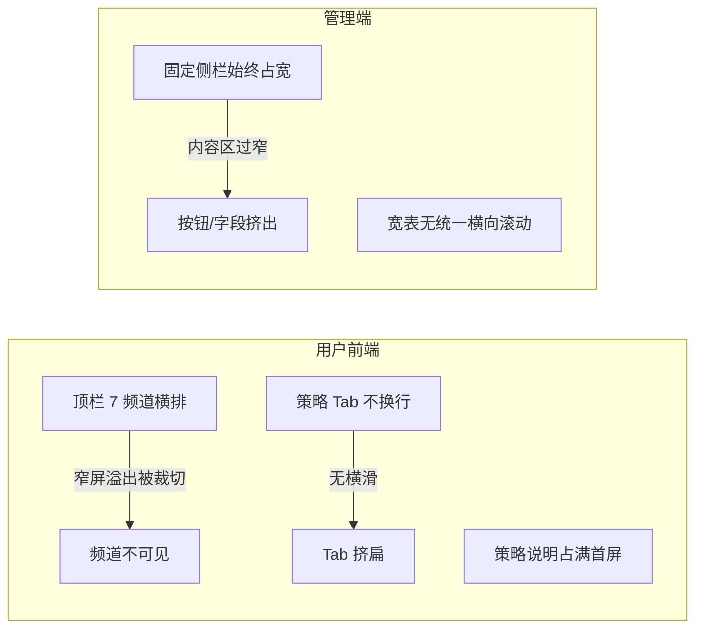

# 前后端多端像素适配方案

## 问题根因（对照截图）



- **用户前端**：[`frontend/components/header.html`](frontend/components/header.html) 七频道横排无折叠；[`frontend/css/common.css`](frontend/css/common.css) 的旧 `.nav-menu` 规则与当前 `.nav-bar` 脱节；[`frontend/css/screening.css`](frontend/css/screening.css) 策略 Tab / 操作区未横滑或 wrap。
- **管理端**：[`admin/src/views/AdminLayout.vue`](admin/src/views/AdminLayout.vue) 窄屏只把侧栏从 256px 缩到 128px，**不隐藏**，内容区过窄；多数表格页缺统一 `overflow-x: auto`。

## 断点约定（全站统一）

| 档位 | 宽度 | 用途 |
|------|------|------|
| PC | ≥769px | 现有桌面布局 |
| Tablet/Phone | ≤768px | 抽屉导航、单列栅格 |
| Small Phone | ≤480px | 再缩小字号/间距 |

CSS 变量建议写在 [`frontend/css/common.css`](frontend/css/common.css) 与 [`admin/src/style.css`](admin/src/style.css)：`--bp-md: 768px; --bp-sm: 480px`。

---

## 一、用户前端网站（`frontend/`）

### 1. 顶栏：汉堡 + 抽屉（P0）

改 [`frontend/components/header.html`](frontend/components/header.html) + [`frontend/components/header.js`](frontend/components/header.js)，并真正启用/收敛 [`frontend/components/header.css`](frontend/components/header.css)（去掉与内联 `!important` 冲突的部分）：

- ≤768：隐藏横排 `.nav-bar`，显示汉堡按钮；点击打开全屏/半屏抽屉，内含 7 频道 + 搜索入口 + 用户菜单。
- 打开时 `body` 锁滚；点链接或遮罩关闭。
- 弹窗宽度统一：`width: min(360px, 92vw)`。
- 顶栏改为 `position: sticky; top: 0; z-index` 足够高；`html/body` 的 `overflow-x: hidden` 改为仅约束 `main`，避免裁切导航。

### 2. 首页 [`frontend/css/home.css`](frontend/css/home.css)（P1）

- 指数卡：≤768 改为 2×2（`grid-template-columns: repeat(2, 1fr)`），≤480 单列；`minmax` 降到约 140–160px。
- 下方四栏保持已有单列堆叠；列表价格区取消过大 `min-width`，允许名称省略号。
- `min-height: calc(100vh - …)` 改为 `100dvh`（兼 `100vh` 回退）。
- 底部内容加 `padding-bottom: env(safe-area-inset-bottom)`，避免被手机浏览器底栏挡住。

### 3. 选股页 [`frontend/css/screening.css`](frontend/css/screening.css) + 少量 HTML（P0）

- `.strategy-tabs`：`flex-wrap: nowrap; overflow-x: auto; -webkit-overflow-scrolling: touch`，缩小 padding/字号。
- `.screening-actions`：`flex-wrap: wrap; gap`。
- 策略说明：默认折叠（`<details>` 或「展开/收起」），避免占满首屏导致列表/按钮看不见。
- 结果表：统一外包 `.table-scroll`；非 GMS 表也设合理 `min-width`；保留 GMS 操作列 sticky。
- ≤768 下调 `h1` 字号。

### 4. 其它业务页（P2，同一模式）

对 `watchlist` / `markets` / `stock` / `analysis` / `news` / `profile`：复用 header 抽屉；宽表套 `.table-scroll`；主操作按钮区 `flex-wrap`。不断点各自为政时，逐步对齐到 768/480。

---

## 二、管理端 Web（`admin/`）

### 1. 布局壳：窄屏抽屉侧栏（P0）

改 [`admin/src/views/AdminLayout.vue`](admin/src/views/AdminLayout.vue)：

- ≥769：保持现有左侧固定侧栏 + `ml-64`。
- ≤768：侧栏默认隐藏（`translateX(-100%)` 或 `el-drawer`）；增加顶部栏（标题 + 汉堡 + 用户/退出）；`admin-main` 的 `margin-left: 0` 全宽。
- 路由 `afterEach` 自动关抽屉；遮罩点击关闭。
- 清理未使用的死样式，或接到真实顶栏 DOM。

### 2. 全局工具类 [`admin/src/style.css`](admin/src/style.css)（P1）

```css
.table-scroll { width: 100%; overflow-x: auto; -webkit-overflow-scrolling: touch; }
.dialog-responsive { width: min(520px, 92vw) !important; }
```

表格页统一外包 `.table-scroll`；对话框 `width` 改为响应式（`min(…, 92vw)`）。

### 3. 典型页面补齐（P1–P2）

| 范围 | 改动 |
|------|------|
| [`QuotesView.vue`](admin/src/views/QuotesView.vue) | `.responsive-table` 补 `overflow-x: auto` |
| Roles / Permissions / StockBasic / DataCollect / Monitoring / Logs / EnvSync 等 | 表外包 `.table-scroll`；`el-col` 加 `:xs="24"`；窄屏 `label-position="top"` |
| Dashboard | 侧栏改抽屉后复查 padding，避免双重挤压 |

不先大改 PVFRS 子组件（已有局部 `@media`），布局壳稳定后再按需收口。

---

## 三、验收标准

- **手机（≤390px 宽）**：用户站顶栏汉堡可打开全部频道；首页指数与四栏可读；选股策略 Tab 可横滑，说明可折叠，列表可横滑看到操作列。
- **PC（≥1200px）**：布局与现网一致，无回归。
- **管理端手机**：侧栏不占内容宽，汉堡打开菜单；表格可横滑，对话框不撑破视口。
- **平板 768 边界**：切换抽屉/固定侧栏行为正确。

## 四、实施顺序

1. 用户前端 header 抽屉 + screening Tab/说明/操作区  
2. 管理端 AdminLayout 抽屉顶栏  
3. 首页 + 全局 table-scroll / 弹窗宽度  
4. 管理端高频 CRUD 页表单/表格补齐  

预计主要改动文件：`header.html/js/css`、`common.css`、`home.css`、`screening.css`（及 screening.html 小改）、`AdminLayout.vue`、`admin/src/style.css`，以及若干 admin 视图包一层滚动容器。
