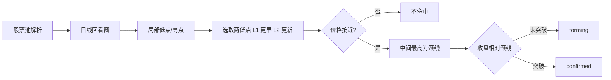

# 双底策略管理端 MVP

## 目标与边界

- **规则 A+B**：识别经典 W 双底；同时输出  
  - `forming`：两低点接近 + 颈线成立，**尚未**收盘突破颈线  
  - `confirmed`：在 forming 基础上，**收盘价突破颈线**（可选量能放大）  
- **分析范围（本期新增）**：管理端预计算 / 试算必须支持按 **行业板块 / 概念板块 / 个股** 限定股票池（可多选板块；个股可多码）  
- **管理端 MVP**：配置版本 + 按范围手动预计算/试算 + 结果列表/导出  
- **不做**：用户 `screening.html` Tab、前台权限码、回测任务、定时调度（可后续接）

策略代号：`dblb`（double bottom）；包名 `backend_core/strategies/double_bottom/`。

## 识别算法（可配参数）

对日线 OHLC（不复权，与多数选股一致）在回看窗内识别：



默认参数（写入 `config_params` JSON，可在管理端改）：

| 参数 | 默认 | 含义 |
|------|------|------|
| `lookback_days` | 120 | 扫描窗口 |
| `swing_left/right` | 3 | 局部极值左右各 N 根 |
| `min_trough_gap_bars` | 8 | 两底最小间隔 |
| `max_trough_gap_bars` | 60 | 两底最大间隔 |
| `trough_tol_pct` | 0.03 | 两底价差相对均值容差 |
| `min_rise_to_neck_pct` | 0.05 | 谷到颈线最小升幅（避免假箱体） |
| `confirm_close_above` | true | 收盘突破确认 |
| `confirm_buffer_pct` | 0.0 | 突破缓冲 |
| `require_volume_expand` | false | 确认日量 > 近 N 日均量（可选） |
| `status_filter` | `both` | 预计算落库：`forming` / `confirmed` / `both` |

输出字段（每条命中）：`code/name`、`status`、`l1_date/price`、`l2_date/price`、`neckline`、`neck_date`、`last_close`、`confirm_date`（仅 confirmed）；多板范围时附加 `board_labels`（所属行业/概念名）。

实现上可复用项目内 ZigZag/分形思路（参考 [`backend_core/analysis/swing_zigzag.py`](backend_core/analysis/swing_zigzag.py)），但双底专用检测放在策略包内，避免与 Fib 锚定耦合。

## 股票池 / 分析条件

对齐管理端 URT/GMS 回测的 `stock_pool_mode`，本期 **预计算与试算** 共用同一套 scope：

| mode | 含义 | 入参 | 解析方式 |
|------|------|------|----------|
| `industry_board` | 行业板块 | `industry_board_codes[]`（可多选） | 复用现有行业成分解析（参考 [`urt_admin_routes.py`](backend_api/admin/urt_admin_routes.py) 的 `_resolve_industry_codes` / `resolve_industry_board_codes`） |
| `concept_board` | 概念板块 | `concept_board_codes[]`（可多选） | 复用概念成分解析（同 URT `_resolve_concept_codes`） |
| `stocks` | 个股 | `stock_codes[]`（可多码，支持空格/逗号输入） | 归一化 A 股 6 位代码后直接筛 |
| `market` | 全市场（可选） | 无 / `universe_limit` | 仅作运维兜底；UI 默认不强调，需显式选择 |

规则：

- 多板取 **成分并集**（去重）；个股与板块可在 UI 上互斥（选 mode 切换），避免歧义  
- 解析后若股票池为空 → API 返回 400  
- 预计算写入 `dblb_signal_trace` 时记录本次 `scope_meta`（mode + 板码列表摘要）到任务响应；信号行可带 `board_labels`  
- 试算 `POST /trial`：即时跑检测，默认**不落库**（`persist=false`）；需要时可选落库  

引擎接口形态：

```python
screen(
  db,
  *,
  trade_date,
  config_id=None,
  status_filter="both",
  stock_pool_mode="stocks",  # industry_board|concept_board|stocks|market
  industry_board_codes=None,
  concept_board_codes=None,
  stock_codes=None,
  universe_limit=None,
)
```

股票池解析抽到 `double_bottom/universe.py`（或 `data_loader.py`），内部调用与 URT/板块分析相同的成分加载能力（如 `RPEDataLoader.load_board_members` / admin 侧 resolve 工具），避免重复造轮子。

## 后端结构（对齐 SBBR，去掉回测）

新建包 [`backend_core/strategies/double_bottom/`](backend_core/strategies/double_bottom/)：

- `config.py`：默认 JSON + `DblbConfigManager`（读/写 `dblb_strategy_configs`）
- `detector.py`：单票双底识别（forming/confirmed）
- `universe.py`：按行业/概念/个股解析股票池  
- `data_loader.py`：批量拉日线  
- `strategy_engine.py`：`screen(...)`（先解析池再检测）  
- `signal_storage.py`：`upsert` / 按日查询 `dblb_signal_trace`  
- `scheduled_precompute.py`：`run_dblb_precompute(...)`（接受 scope 参数；暂不挂 cron）

模型（[`backend_api/models.py`](backend_api/models.py)）：

- `DblbStrategyConfig` → `dblb_strategy_configs`  
- `DblbSignalTrace` → `dblb_signal_trace`（`code, trade_date, config_id` 唯一；`status`；形态关键价与 JSON `detail`）

提供 PostgreSQL 建表脚本 `CREATE TABLE IF NOT EXISTS ...`。

Admin API（新建 [`backend_api/admin/dblb_admin_routes.py`](backend_api/admin/dblb_admin_routes.py)，前缀 `/api/admin/dblb`，挂载 [`backend_api/main.py`](backend_api/main.py)）：

- 配置：`GET/POST /strategy-configs`，`PUT .../update`，`PATCH .../default`  
- `POST /precompute/trigger`：body 含 `trade_date`、`config_id`、`status_filter`、**`stock_pool_mode` + 对应 codes**  
- `POST /trial`：同上 scope，返回命中列表（默认不落库）  
- `GET /signals`：按 `trade_date` / `status` / `config_id` 分页；可选按 code 过滤  

**明确不挂**：`/api/screening/*`、用户权限 registry。

## 管理端 UI

- 路由：`/dblb-management`（[`admin/src/router/index.ts`](admin/src/router/index.ts)）  
- 菜单：[`admin/src/views/AdminLayout.vue`](admin/src/views/AdminLayout.vue) 增加「双底策略」  
- 页面：`admin/src/views/DblbManagementView.vue` + `admin/src/services/dblbApi.ts`  
  - Tab「策略配置」：列表 / 新建 / 编辑 JSON / 设默认  
  - Tab「分析试算 / 预计算」：  
    - 股票池模式：`行业板块` / `概念板块` / `个股`（可选「全市场」）  
    - 行业/概念：多选（交互对齐现有 URT/GMS 回测板选择，或复用 catalog 下拉多选；参考 [`admin/src/components/urt/BacktestManagement.vue`](admin/src/components/urt/BacktestManagement.vue)）  
    - 个股：文本框输入代码（逗号/空格分隔）  
    - 状态过滤、交易日、配置版本  
    - 按钮：「试算」（看结果表格）、「写入预计算」（落库）  
  - Tab「信号结果」：查已落库信号；CSV 导出  
  - **无回测 Tab**

## 文档与测试

- 文档：[`docs/strategies/double_bottom/DBLB_双底_信号计算规则.md`](docs/strategies/double_bottom/DBLB_双底_信号计算规则.md)（规则 A+B、scope、参数、管理端用法）  
- 单测 [`test/test_dblb_detector.py`](test/test_dblb_detector.py)：forming / confirmed / 拒绝分支  
- 单测 [`test/test_dblb_universe.py`](test/test_dblb_universe.py)：industry/concept/stocks 解析与并集（mock 成分）  

## 验收标准

1. Admin 侧栏可见「双底策略」，可建配置并设默认  
2. 可分别按 **行业多选 / 概念多选 / 个股多码** 试算，并看到 forming / confirmed  
3. 同范围可「写入预计算」，「信号结果」可查可导出  
4. 用户选股页无新 Tab；无新增 `channel.screening.*` 权限  
5. 单测覆盖 detector 与股票池解析  

## 主要改动文件

- 新增：`backend_core/strategies/double_bottom/*`  
- 新增：`backend_api/admin/dblb_admin_routes.py`  
- 修改：`backend_api/models.py`、`backend_api/main.py`  
- 新增：`admin/src/views/DblbManagementView.vue`、`admin/src/services/dblbApi.ts`  
- 修改：`admin/src/router/index.ts`、`admin/src/views/AdminLayout.vue`  
- 新增：文档 + 单测 + 建表 SQL  
