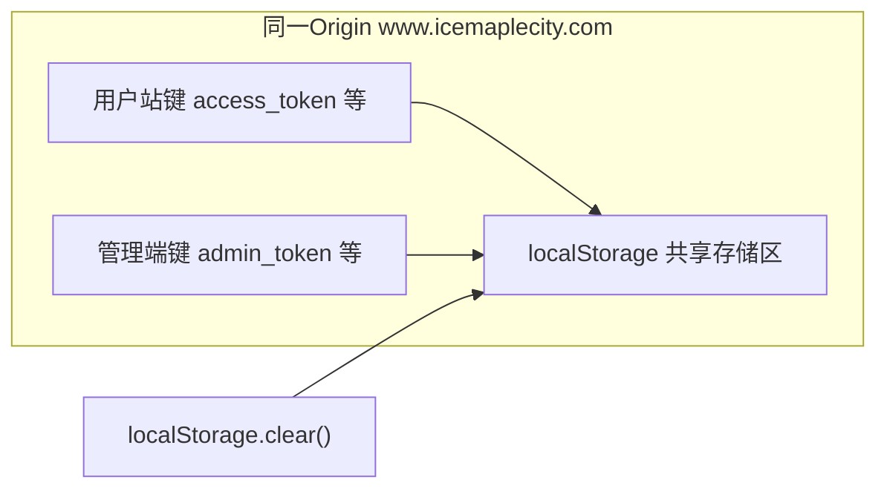

# 同域用户站与管理端「session 冲突」原因与规避

## 结论：不是典型「服务端 Session 互斥」

当前栈为 **JWT + 浏览器 localStorage**（用户站用 `access_token` 等，管理端用 `admin_token` / `admin_user`），见 [admin/src/stores/auth.ts](e:/wangxw/股票分析软件/编码/stock_quote_analayze/admin/src/stores/auth.ts) 与 [frontend/js/common.js](e:/wangxw/股票分析软件/编码/stock_quote_analayze/frontend/js/common.js)。后端用户与管理登录为不同路由（如 `/api/auth/login` 与 `/api/admin/auth/login`），令牌载荷里通过 `is_admin` 区分（见 [backend_api/admin/auth.py](e:/wangxw/股票分析软件/编码/stock_quote_analayze/backend_api/admin/auth.py)）。

**同一站点** `https://www.icemaplecity.com` 下，路径 `/` 与 `/admin` **共用同一套 localStorage（按源 origin 隔离，不按路径隔离）**。因此任意一端若执行「清空全部本地存储」，另一端保存的令牌也会被删掉，表现就像「session 冲突」或「刚登管理端又掉线」。

## 主要原因（按影响排序）

### 1. 用户登录页每次打开即清空全部 localStorage（高概率主因）

[frontend/login.html](e:/wangxw/股票分析软件/编码/stock_quote_analayze/frontend/login.html) 在 `<head>` 内内联脚本中执行：

- `localStorage.clear()`
- `sessionStorage.clear()`
- 以及清空 `path=/` 的 cookie

只要用户**先打开管理端再打开用户站登录页**（或在新标签打开 `login.html`），**管理端 JWT 会被立刻清掉**，管理端再请求会出现未登录或 401，极易被误判为「session 冲突」。

### 2. 用户站退出登录同样清空全部 localStorage

[frontend/js/common.js](e:/wangxw/股票分析软件/编码/stock_quote_analayze/frontend/js/common.js) 中 `CommonUtils.auth.logout()` 在清除用户信息后调用 `localStorage.clear()`。用户从主站退出时，**会顺带清除 `admin_token`**，管理端会话一并失效。

### 3. 其它需知（通常不是主因，但可加重困惑）

- **多标签**：同域多标签共享 localStorage，一处 `clear` 全局生效。
- **令牌键名已分离**：用户 `access_token` 与管理 `admin_token` 不同名，**正常不会互相覆盖**；冲突主要来自 **整库清空** 或业务上误用同一键（仓库里 [admin/src/views/DataCollectView.vue](e:/wangxw/股票分析软件/编码/stock_quote_analayze/admin/src/views/DataCollectView.vue) 等处存在对 `token` 的兜底读取，建议保持管理端只依赖 `admin_token`，避免与旧键混用）。

## 规避与改进方向

| 方向 | 做法 |
|------|------|
| **必改（低成本）** | 去掉或严格限定 **login 页** 的 `localStorage.clear()`：仅清除用户站相关键（如 `access_token`、`userInfo`、`rememberedUsername` 等），**不要** `clear()` 全库。 |
| **必改（低成本）** | 用户站 `logout` 改为**按键删除**用户相关项，保留 `admin_token` / `admin_user`（若产品接受「主站退出不影响管理端」）。若产品要求「一键退出所有身份」，再提供单独「全部退出」并明确提示。 |
| **架构（可选）** | 管理端使用独立子域（如 `admin.icemaplecity.com`），则 localStorage 天然隔离；代价是 Cookie 的 `Domain`、CORS、证书与部署配置需配套。 |
| **长期（安全）** | 敏感令牌改为 **HttpOnly Cookie** + 正确 `SameSite`/`Path`，并按用户/管理使用不同 Cookie 名或路径；与当前 JWT 存 localStorage 方案相比改动面更大。 |

## 建议实施顺序（待你确认后再改代码）

1. 修改 [frontend/login.html](e:/wangxw/股票分析软件/编码/stock_quote_analayze/frontend/login.html)：删除无条件 `localStorage.clear()` / 全站 cookie 清空，或改为只清理用户站所需键；若需「强制全新登录」，应通过显式查询参数或按钮触发，而非每次打开页面执行。
2. 修改 [frontend/js/common.js](e:/wangxw/股票分析软件/编码/stock_quote_analayze/frontend/js/common.js) 的 `logout`：用 `removeItem` 列举用户键替代 `localStorage.clear()`。
3.（可选）梳理文档或运维说明：同域下主站与管理端登录关系、退出行为预期。

---

**说明**：你当前处于 **Plan 模式**；上述为调查结论与修改计划，确认后可在 Agent 模式下按文件逐项落地修改并补充回归用例（例如在 `test` 目录增加说明或简单 E2E 场景）。
