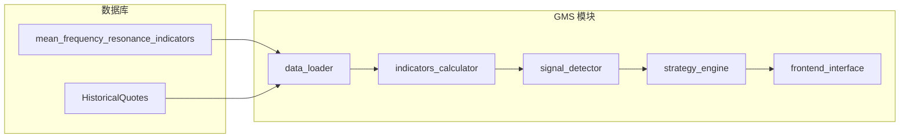

# 均值引力动量策略 (GMS) 系统实现计划（修订版）

## 一、数据源：复用 mean_frequency_resonance_indicators

GMS 所需指标**均已在该表中预计算**，无需重复计算。直接从该表读取并做衍生即可。

### 1.1 表结构及 GMS 指标映射


| GMS 指标   | 公式        | 表字段                        | 说明                                                 |
| -------- | --------- | -------------------------- | -------------------------------------------------- |
| Δ        | d₂₀ - d₁  | `macro_displacement_delta` | 宏观位移                                               |
| d        | 20 日均价    | `ma20_d`                   | 周期均价                                               |
| d₂₀      | 末日收盘价     | 可由 Δ+d₁ 或历史行情得到            | 策略中多用 Δ、ratio 即可                                   |
| Δ/d₂₀    | 偏离率       | `ratio_d20`                | 现价相对周期末价张力                                         |
| Δ/d₁     | 突变率       | `ratio_d1`                 | 现价相对周期起点位移                                         |
| **Δ/d**  | 相对位移/幅度系数 | **需计算**                    | `macro_displacement_delta / ma20_d` (ma20_d>0)     |
| F        | 下跌天数      | `falling_days_f`           | 空头天数                                               |
| Z        | 上涨天数      | `rising_days_z`            | 多头天数                                               |
| m        | 20 日平均成交量 | `mavol20_m`                | 平均量                                                |
| m₂₀      | 当日成交量     | **需计算**                    | `efficiency_m20_minus_m + mavol20_m`               |
| 量比 m₂₀/m | 成交量比      | **需计算**                    | `(efficiency_m20_minus_m + mavol20_m) / mavol20_m` |
| d₂₀ vs d | 价格 vs 均线  | `instant_deviation`        | d₂₀ - d，>0 表示站稳均线                                  |


### 1.2 Δ/d 指标处理（新增）

**Δ/d = 宏观位移 / 20 日均价**，即 `macro_displacement_delta / ma20_d`。

- **含义**：宏观位移相对于 20 日均价的幅度，用于刻画价格偏离均线的程度（与 PVFRS 幅度系数一致）。
- **用途**：
  - 平衡评分：可与 Δ/d₂₀ 一并考虑（文档用 Δ/d₂₀  1%）。
  - exit 规则「乖离过大」：文档用 Δ/d₂₀  15%，Δ/d 可作为补充或替代维度（由配置选择）。
- **实现**：在 `indicators_calculator` 或数据加载层，从表字段计算：
  - `ratio_d = delta / ma20_d if ma20_d and ma20_d > 0 else None`

---

## 二、策略核心逻辑摘要（与优化说明一致）


| 概念   | 符号    | 含义                |
| ---- | ----- | ----------------- |
| 周期   | N=20  | 20 个交易日           |
| 数方比  | F/Z   | 下跌天数 / 上涨天数       |
| 偏离率  | Δ/d₂₀ | ratio_d20，越小越平衡   |
| 突变率  | Δ/d₁  | ratio_d1，负转正为动量突变 |
| 相对位移 | Δ/d   | 宏观位移 / d，幅度系数     |


**买点**：左侧「均值吸附」、右侧「动量引爆」；**评分**：蓄势 30 + 平衡 40 + 动量 30；**退出**：趋势破坏或乖离过大（Δ/d₂₀  15%，可扩展 Δ/d）。

---

## 三、目录与模块结构

```
backend_core/strategies/
├── gms/
│   ├── __init__.py
│   ├── models.py                 # GMSIndicators、GMSSignal、异常类
│   ├── config.py                 # 策略参数（含 Δ/d 使用方式）
│   ├── interfaces.py             # 抽象接口
│   ├── data_loader.py            # 从 mean_frequency_resonance_indicators 加载
│   ├── indicators_calculator.py  # 衍生：Δ/d、量比、评分
│   ├── signal_detector.py        # 买点/卖点检测
│   ├── strategy_engine.py        # 策略引擎
│   ├── frontend_interface.py     # 选股接口
│   └── gms_config.json
```

说明：不再新建 `gms_indicators` 表；`gms_signals` 或 `gms_screening_cache` 仅在有缓存/回测需求时再建。

---

## 四、数据流（以指标表为主）




- `data_loader`：从 `MeanFrequencyResonanceIndicators` 读取，必要时关联 `HistoricalQuotes` 获取当日 volume（若表内没有现成量比）。
- `indicators_calculator`：计算 **Δ/d**、量比、蓄势/平衡/动量得分、总分。

---

## 五、Δ/d 与 ratio 指标使用规范


| 场景        | 使用指标        | 阈值（示例）       |
| --------- | ----------- | ------------ |
| 左侧买点 极度粘合 |             | Δ/d₂₀        |
| 平衡评分      |             | Δ/d₂₀        |
| 右侧买点 加速度  | Δ/d₁        | 首次突破 0 且斜率向上 |
| 退出 乖离过大   | Δ/d₂₀ 或 Δ/d | 15%          |
| 幅度/相对位移展示 | Δ/d         | 用于报告或扩展条件    |


配置中可增加 `use_ratio_d_for_exit`，以在 Δ/d₂₀ 与 Δ/d 间切换或同时使用。

---

## 六、实施步骤（Todo）

1. **新建 gms 目录**：`__init__.py`、`interfaces.py`、`config.py`、`gms_config.json`
2. **models.py**：GMSIndicators（含 ratio_d）、GMSSignal、异常类
3. **data_loader.py**：从 `MeanFrequencyResonanceIndicators` 批量加载，计算 **Δ/d**、量比
4. **indicators_calculator.py**：评分（蓄势 30、平衡 40、动量 30）、总分
5. **signal_detector.py**：左/右买点、卖点（含 Δ/d 的退出规则）
6. **strategy_engine.py**：串联加载 → 计算 → 检测 → 信号
7. **frontend_interface.py**：选股、单股分析接口
8. **API 路由**：在 backend_api 注册 GMS 选股、详情等

---

## 七、配置参数示例（含 Δ/d）

```json
{
  "observation_period": 20,
  "ratio_indicators": {
    "use_ratio_d": true,
    "use_ratio_d_for_exit": false
  },
  "left_buy": { "ratio_d20_abs_max": 0.015, "volume_ratio_max": 0.8 },
  "right_buy": { "volume_ratio_min": 1.5 },
  "scoring": {
    "balance_ratio_max": 0.01,
    "watch_threshold": 60,
    "alert_threshold": 90
  },
  "exit": { "trend_break_days": 3, "overbought_ratio": 0.15 }
}
```

