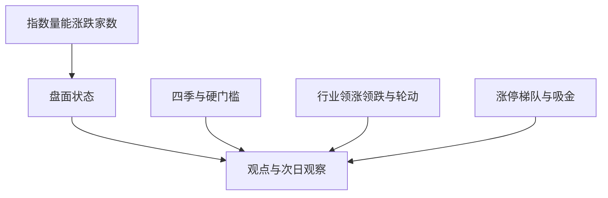

# 每日复盘报告优化方案

对照对象：附件《9 月 18 日 A 股市况复盘报告》与系统已导出的 [exported_docs/2026年09月18日 股市复盘报告.md](exported_docs/2026年09月18日%20股市复盘报告.md)。生成链路是 [backend_core/market_review/compute.py](backend_core/market_review/compute.py) → [rules.py](backend_core/market_review/rules.py) → [render.py](backend_core/market_review/render.py) / [pdf_export.py](backend_core/market_review/pdf_export.py)，页面在 [frontend/js/daily_review.js](frontend/js/daily_review.js)。

## 专家报告里真正有用的结构

附件不是多几张表，而是按交易决策顺序写盘面：

- 大盘：指数收盘、涨跌、距前高/整数关，量能绝对额和较昨日增减，上涨/下跌/涨停/跌停。
- 结构：领涨与领跌、当日主线与支线、相对昨日的轮动，而不是一份很长的概念名单。
- 个股：主线龙头、连板高度、封单、吸金居前，用来验证主线是否有载体。
- 情绪：用 3 条可核对事实下结论（放量、涨停扩张、主线切换），并写出次日要看什么。
- 总结：一句主线、一句支线、一句赚钱效应。

这些判断都可以从本库已有数据算出。美股点位、黄仁勋讲话、住建部政策等消息归因没有结构化来源，不自动编写，避免编造催化。

## 9 月 18 日系统报告的具体问题

当天系统快照本身是对的：量能 1.83→2.08 万亿，连板 9→12，高度 5→4，行业表里半导体 +4.31%、净流入约 226.6 亿。写出的文字却相反。

- [rules.py](backend_core/market_review/rules.py) 的 `draft_viewpoint` 在没有恶化信号时仍固定写「明日需确认能否止跌；若继续缩量阴跌则保持观望」。`draft_advice` 只要季节是秋或冬就写「优先空仓」。规则引擎只识别缩量、连板跌破、假高度，不识别放量上攻。
- 涨停家数已在 `compute_market_metrics` 里算出（`limit_up_count`），Markdown 不展示。没有指数、没有上涨/下跌家数、没有跌停。
- 近 10 日概念表 47 行全是「观察」，核心主线 0 个。当日真正的主线埋在行业表里，净流入按元打印（`22660000000`），没有领涨股、没有领跌、没有相对昨日的切换。
- 涨停池已采集封单、连板数、所属行业（[zt_pool_em.py](backend_core/data_collectors/akshare/zt_pool_em.py)），个股资金流在 `stock_fund_flow_daily`，报告都没用。
- Lo/Hi/Spread 百分位同为 100%，四象限却是「冬/冰点」，区间定位列是 `--`。百分位用 `market_daily_review` 历史（含当日）；样本很短或当日恰为窗口最大值时会顶到 100%，和绝对阈值四象限打架，读者无法使用。
- 观点里的成交额打印成 `2.0825452 万亿`，未格式化。

四季模型和五项硬门槛保留。它们回答的是「连板生态冷热」，专家报告回答的是「今天能不能做、做什么」。两套并列，叙述以盘面事实为准，不再用秋期一句话覆盖放量普涨。

## 实施方案

### 1. 盘面状态，先纠正自相矛盾的文字

在 [rules.py](backend_core/market_review/rules.py) 增加 `classify_tape_regime`，只用已有日对比，不新造指标：

- 放量：今日成交额较昨日增加，且不低于约 1500 亿（可调常量）。
- 缩量：今日小于昨日。
- 配合涨跌家数（下一步算出后接入）：上涨家数明显高于下跌为普涨，反之为普跌。

`draft_viewpoint` / `draft_advice` 按状态分支，去掉写死的「止跌 / 缩量阴跌 / 空仓」：

- 放量普涨：写明放量金额、涨停与跌停、当日主线名称；次日看主线是否继续放量、高标溢价、指数距前高。硬门槛未达标时写成「连板生态仍偏冷，但指数与广度已改善」，而不是空仓模板。
- 缩量调整：保留现有防守话术。
- 平量或涨跌接近：写观察，不预判方向。

`build_trend_rules` 在放量时追加「量能放大」信号；「核心指标相对平稳」仅在量能变化很小时使用。

### 2. 新增大盘环境段

在 [compute.py](backend_core/market_review/compute.py) 增加快照字段 `market_env`，渲染为报告第一节（现有「趋势解读」后移）：

- 指数：读 `index_historical_quotes`。默认已采集上证 `000001.SH`、深成 `399001.SZ`、创业板 `399006.SZ`、沪深 300。科创 50 有行才展示，不新增采集。字段：收盘、涨跌幅、成交额；并给出收盘相对近 20 日最高价的距离（点或百分比）。整数关只对上证做规则：收盘跨越百点整数（如 3900）时写一句，不写「有望挑战前高」这类预测。
- 量能：全市场成交额（沿用 `_compute_vol`）、较昨日差额（亿元）、是否站上 2 万亿。观点数字格式化为两位小数。
- 广度：`historical_quotes` 统计上涨、下跌、平盘；涨停用已有 `limit_up_count`；跌停用现有涨停判定的对称规则（ST 剔除，与 `is_limit_up` 同一套阈值）。涨停池不可用时沿用 `hist_proxy`，并在文末保留现有口径说明。

### 3. 板块改成「当日结构」，概念表降噪

行业数据已在 `build_industry_confirm`。调整展示，不改「概念定主线、行业只确认赛道」的统计口径：

- 领涨：涨幅前 10，列涨跌幅、净流入（亿元，保留一位小数）。领跌：跌幅前 3，同样列净流入。净流入缺失写 `--`，不再打印原始元。
- 当日主线：在领涨且净流入为正的行业里，取净流入最大的 1 个作为主线，其余领涨且净流入为正的作为支线。没有同时满足的，主线写「不明确」。
- 轮动：用上一交易日同一套行业上榜，标出「昨日上榜今日跌出」和「今日新进且净流入居前」。只陈述名单变化，不写「资金从农业切换到科技」除非两边行业名都能对上。
- 板块内上涨/下跌家数：仅当已有成分股表能稳定关联到 `historical_quotes` 时才填；关联不上就留空，不估。
- 概念近 10 日表：正文只保留近 10 日上榜不少于 2 次，或今日上榜且能对应到当日主线/支线行业的概念。其余 1 次「掉队」不进正文，摘要里保留总个数。

### 4. 用涨停池和个股资金流补龙头与梯队

仍放在主线小节下，不单独开「荐股」：

- `stock_zt_pool_daily`：按 `board_count` 汇总连板梯队（2 板、3 板、4 板及以上各多少只，点出最高板个股名称）。主线行业内的涨停，按封单 `seal_fund` 取前几只（名称、涨幅、封单、连板数）。
- `stock_fund_flow_daily`：当日主力净流入前 5 只（名称、净流入亿元）。若行业字段能对上主线，再加「主线内吸金前 3」。对不上就不做行业过滤。
- 不把超大单写成「机构」、中小单写成「游资」。资金段只写行业净流入前 5 与净流出前 3，个股只写主力净流入排名。

### 5. 情绪段改成证据，并修百分位展示

- 四季判定算法不动。其下增加 3 条事实：量能方向与差额、涨停/跌停相对昨日、主线行业名称与净流入。
- 次日观察固定三条槽位，全部由数据填空：主线行业明日涨跌幅与净流入是否仍为正；最高连板个股的次日溢价（沿用已有 `prev_cb_return` 的算法，文案写成「观察昨日高标溢价」）；上证距 20 日高点还差多少。不写「可积极参与」。
- 百分位：样本少于 20 个交易日时显示「样本不足」，不显示 100%。四象限保留，但 Lo 的绝对阈值（`lo < 35` 即冰点）与当前 Lo 定义（近 10 日低位组收益，常为负）不一致，区间定位改为：样本足够时按百分位分位描述，不够时写「阈值未校准」，避免再出现「百分位 100% + 冬/冰点」。

### 6. 渲染、页面与测试

- [render.py](backend_core/market_review/render.py) 与 [pdf_export.py](backend_core/market_review/pdf_export.py) 同步新小节：大盘环境、领涨领跌、轮动、梯队、吸金、证据与次日观察。快照缺字段时整节省略，不留空表。
- [frontend/js/daily_review.js](frontend/js/daily_review.js) 在现有指标卡下增加指数、涨跌家数、盘面状态；行业表净流入改为亿元。概念表跟随后端已过滤的 `rows`。管理端 [admin/src/views/dashboard/DailyReviewPanel.vue](admin/src/views/dashboard/DailyReviewPanel.vue) 若同样渲染这些字段，做同样格式，不新做交互。
- 扩展 [test/test_market_daily_review_metrics.py](test/test_market_daily_review_metrics.py)：放量普涨时观点不得含「缩量阴跌/止跌」；缩量时仍含防守表述；净流入渲染为亿；概念过滤后 1 次掉队不出现；百分位样本不足时文案为样本不足。

重算仍走现有 `POST /api/market_review/compute`。不改采集流程，不改硬门槛阈值。