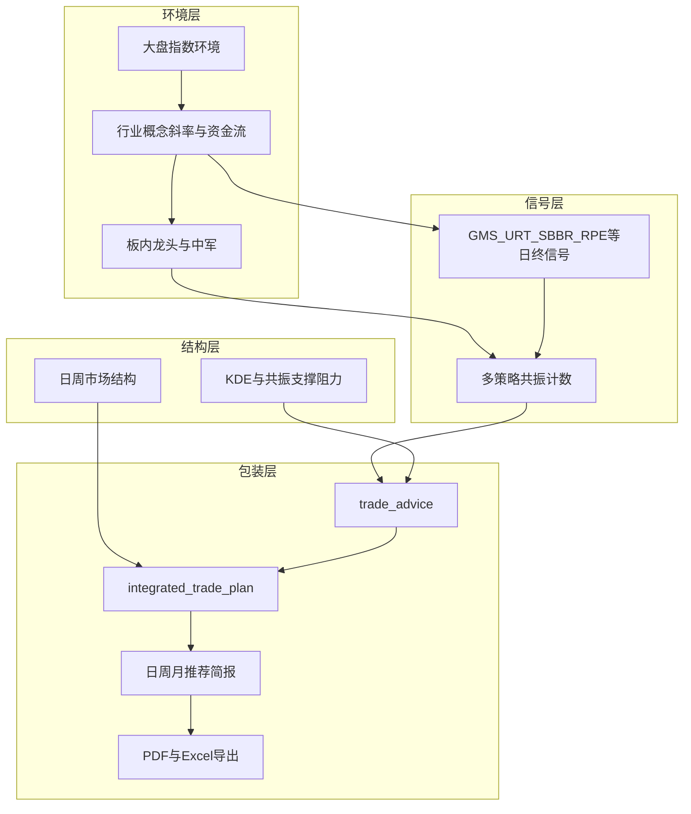
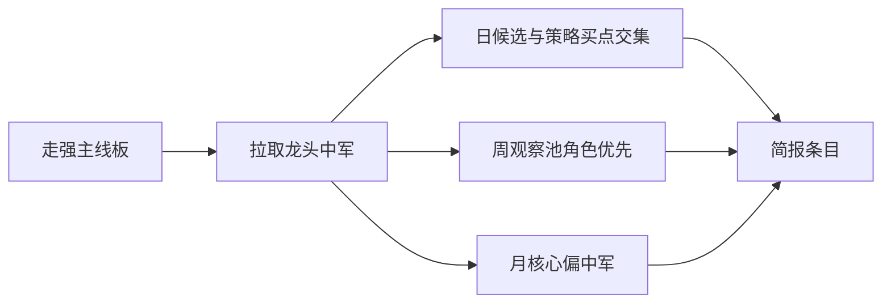

# 日 / 周 / 月个股推荐与交易思路框架

## 0. 交易策略专家审查结论（2026-09-13）

### 0.1 总评

| 维度 | 判断 |
|------|------|
| 框架方向 | **正确**：环境→板块→个股→价位、多周期分工、角色分层、冲突降级，符合可执行交易系统习惯 |
| 主要风险 | **一期范围过宽**（日+周+月+双端菜单+PDF+Excel）易导致规则未经验证就固化；龙头日频优先易**追高**；缺**分散上限**与**卖出/风险侧** |
| 建议决策 | **先实现 Daily Brief MVP 并观察 2–4 周，再开 Weekly/Monthly/PDF**；周月设计保留在文档中作目标态，不阻塞一期 |

### 0.2 方案中应保留的优点

1. **环境优先 + 板弱否决**：比「全市场策略分排序」更抗噪。  
2. **复用 trade_advice / 综合计划**：买区、止损、证据链已有，避免另造黑箱打分。  
3. **龙头/中军纳入**：解决「主线对了但票不对」；月偏中军、日标角色，逻辑自洽。  
4. **周期冲突降级**：日 buy + 周 bear → 观察，是正确的风控叙事。

### 0.3 建议在 MVP 就改掉的问题（低成本、高收益）

1. **角色打分宜简**：一期只做 **标签 + 固定小加分**（如龙头 +3、中军 +2），不做「弹性分/稳健分」双轨合成——否则未回测就过拟合。  
2. **防追高**：可执行清单剔除（或降为观察）当日涨停、或近 N 日涨幅过大/远离买区过多的标的；龙头尤其要过这道门。  
3. **分散约束**：同一行业/概念板进入「可执行」的上限（如每板 ≤2、全清单主题板 ≤3），避免简报变成单一题材拥挤。  
4. **Asof 一致性**：简报、策略信号、板斜率、角色快照必须同一 `asof_date` 冻结入库，禁止用「打开页面时的实时角色」重写历史简报。  
5. **补一列风险侧（轻量）**：每日简报增加「结构风险观察」小节即可——来自正式交易/观察池中破支撑或板转弱的代码，不强制做完整卖出引擎。  
6. **观察期 KPI（纸面）**：触达买区率（T+1～T+3）、可执行名单板上赫芬达尔/集中度、角色子集相对普通成分的后续收益差——管理端先记日志或简单统计表，再谈调权。

### 0.4 可留到观察期后再做（不必改设计大方向）

- Weekly / Monthly 自动生成与独立产品页  
- PDF 精美排版（Excel 足够复盘）  
- 复杂角色加权、机器学习排序  
- 周/月指标落库与周策略引擎  

### 0.5 专家拍板：优化还是先实现？

**先实现 Daily MVP（含下述瘦身），边用边观察；周月与 PDF 按观察结果再开。**  
不是否定周月框架，而是避免「未验证的三层产品同时上线」导致无法归因。

### 0.6 周报 / 月报发布时间：用户提案分析

**提案**：周五收盘后～周一开盘前出「下周操盘计划」；每月最后一个交易日收盘后出「下月操盘计划」。

#### 结论：**有道理，建议采纳为周/月产品的标准发布窗**

这与「月定方向 → 周定池 → 日找触发」一致，且贴合 A 股「周末读研报、周一开盘执行」的常见操盘节奏。

#### 周报窗（周五收盘 → 周一开盘）

| 优点 | 注意点 |
|------|--------|
| asof = 本周最后一个交易日，信息完整 | A 股周末常有政策/外围扰动 → 计划应写清「周一开盘若跳空/板环境翻转则降级执行」 |
| 周末有充足阅读与仓位预演时间 | 若周五不是本周最后交易日（极少），应用**本周最后交易日**而非死绑周五 |
| 与「每周观察池 + 下周触发条件」产品形态匹配 | 生成应挂在**该日日终流程成功之后**（策略预计算、斜率、资金流齐备），不是周五 15:05 强跑半成品 |
| 避开盘中改计划的噪音 | 长假前一周（国庆/春节）：周报仍出，但标题标「节前/节后特别说明」，仓位建议更保守 |

**推荐实现口径**：`trigger = 本周最后交易日 EOD 成功` → 产出 `horizon=weekly`，`plan_for = 下一交易周`；展示窗与消费心智定为「周末可读、周一前有效」。

#### 月报窗（月底收盘 → 下月）

| 优点 | 注意点 |
|------|--------|
| 自然月主题与仓位骨架清晰 | 必须用**本月最后交易日**，不是日历月末（遇周末/节假日） |
| 给下月开局留准备时间 | 月底有「窗口粉饰」效应：斜率/资金流可能失真 → 月报应交叉看 60/120 日，勿只看最后 3 日 |
| 与「中军核心 + 主题板」匹配 | 季报披露密集月：月报可加「财报季降杠杆」纪律条文 |
| | 若最后交易日日终任务失败：允许 T+1 开盘前补跑，并标记 `late_run=true` |

**推荐实现口径**：`trigger = 自然月最后一个交易日 EOD 成功` → `horizon=monthly`，`plan_for = 下一自然月`。

#### 与每日简报的关系（避免三份报告打架）

- **月报**：主题、核心中军、总仓上限 —— 周内不因单日信号推倒。  
- **周报**：主线板、观察池、龙头/中军名单、下周触发条件 —— 是日报的「候选宇宙」。  
- **日报**：仅对池内（或主题内）给「可执行」；池外命中默认「观察」，避免周月计划被日频打散。  

一期仍只做日报；但周/月一经上线，**发布窗按上述提案**，并在周报中显式引用「当前有效月报 asof」。

#### 是否还要「周日晚再刷一次」？

**一期不必。** 周五 EOD 数据是主源；若二期要吸收周末新闻，做「轻量覆写备注」即可，不要重算全套斜率/策略（周末无 A 股成交）。

---

## 1. 现状判断（结合现有能力）

系统已具备较完整的**日频决策链**，缺的是「跨周期打包成推荐产品」，而不是再堆一个选股公式。

| 层级 | 已有 | 对推荐的意义 |
|------|------|----------------|
| 行情 | 日/周/月 K 表与 API | 日执行靠日 K；周月定方向/主题靠周月结构 |
| 指标 | 日频 MA/MAVOL/MACD/KDJ/BOLL/RSI、RS | 过滤与确认；周月指标一期现算或用长窗日频近似 |
| 大盘/板块 | 指数、板斜率 5/10/20/60/120、板资金流、GMS 板共振 | **环境门控**：弱环境降仓/只观察 |
| 板内角色 | 龙头 / 中军（[`board_roles`](backend_core/board_roles/classify.py)） | **池内优先级与仓位角色**（见 §3.4） |
| 策略 | GMS/URT/SBBR/RPE 闭环；CSB/VSB/CANSLIM/形态 | **信号供给**；多策略共振抬权重 |
| 结构 | KDE SR、共振带、市场结构、形态战术、江恩 | **价位与风险** |
| 合成 | [`trade_advice.py`](backend_core/analysis/trade_advice.py)、[`integrated_trade_plan.py`](backend_core/analysis/integrated_trade_plan.py) | 短线 + 中长线立场，上卷为推荐条目 |
| 导出 | [`report_service.py`](backend_api/services/report_service.py)（xlsx）、[`stock_analysis_pdf.js`](frontend/js/stock_analysis_pdf.js) / BoardAnalysisPdf | Excel / PDF 能力可复用 |

**一期原则**：不新建周/月指标全表、不重写策略；**只落地每日简报**（信号 + 板环境 + 角色标签 + 综合计划字段）；周/月用文档中的目标态，观察期后再编码。

---

## 2. 三维时间框架怎么分工

| 产品 | 持仓尺度 | 决策问题 | 主输入（现有） | 输出形态 |
|------|----------|----------|----------------|----------|
| **每日推荐** Daily Brief | 1–10 个交易日 | 今天/明天能不能买、买哪、怎么管 | 当日四策略入场 + 板短窗斜率/资金流 + 龙头/中军标签 + trade_advice | 可执行清单：买/观察/回避 + 价区 + 角色 |
| **每周推荐** Weekly Watch | 2–6 周 | 本周主线与观察池 | 60 日走强板 + 板内龙头/中军 + 周线结构 + 多策略累计命中 | 主线板 + 观察池（角色分层）+ 加减仓纪律 |
| **每月推荐** Monthly Theme | 1–3 月 | 主题与持仓骨架 | 120 日主题板 + **中军为核心**、龙头择机 + CANSLIM/形态 | 主题板 + 核心/卫星标的 + 仓位上限 |

三者关系：**月定方向 → 周选池 → 日找触发**。日信号若与周月立场冲突，降级为「观察」而非「买入」。

---

## 3. 统一漏斗规则（日/周/月共用）

### 3.1 环境门控（先环境、后个股）

1. **大盘**：指数近 N 日趋势。空头日：每日推荐只出观察/回避，不推新开仓。
2. **板块**：读 [`sector_slope_store`](backend_core/board_metrics/sector_slope_store.py) + 板资金流。
   - 日：5/10/20 日斜率未否决，资金流中性及以上
   - 周：60 日走强（含 R²）的行业/概念为主线
   - 月：120 日走强 + 近月净流入改善的主题板
3. **板弱否决**：GMS `board_resonance` / RPE trend_veto——板弱时个股买点降为 `watch`。

### 3.2 个股评分（可解释、可排序）

| 因子 | 权重思路 | 来源 |
|------|----------|------|
| 策略共振 | 高 | 同日/近 N 日命中 URT/GMS/SBBR/RPE 个数 |
| 主策略质量 | 高 | 主策略得分 / entry_signal / trade_advice.action=buy |
| 板块环境 | 中 | 主板块斜率档位 + 资金流 |
| 板内角色 | **标签 + 小加分**（龙头 +3 / 中军 +2，可配置） | [`classify_board_roles`](backend_core/board_roles/classify.py) |
| 结构质量 | 中 | 近支撑、盈亏比、未破位 |
| 流动性 | 硬门槛 | 各策略已有 |
| 周月一致性 | 二期抬权 | swing / stance_medium（日 MVP 可只记录） |
| 防追高/分散 | 硬约束 | 见 §0.3、§8 |

排序：`action=buy` 优先 → 推荐分 → 策略分。

### 3.3 交易思路模板（每条推荐固定字段）

- **立场**：买入 / 观察 / 回避  
- **主策略**：URT > GMS > SBBR > RPE  
- **板内角色**：龙头 / 中军 / 普通（无角色不排除，仅影响分与仓位建议）  
- **买区 / 止损 / 止盈**：来自 `trade_advice`  
- **失效条件**：破结构支撑、板转弱、大盘切换、龙头加速后中军掉队等  
- **仓位建议**：按角色 + 周期差异化（§3.4）  
- **证据链**：命中策略、板代码与斜率、角色标签、结构位、冲突项  

### 3.4 龙头 / 中军：必须纳入（结论）

**需要纳入。** 系统已在行业/概念详情中推导龙头与中军（[`docs/features/板块龙头中军业务规则.md`](docs/features/板块龙头中军业务规则.md)；实现 [`backend_core/board_roles/`](backend_core/board_roles/)）。推荐漏斗在「主线板确定之后」应用角色，避免只推杂毛成分。

| 角色 | 业务含义（与现规则一致） | 在推荐中的用法 |
|------|--------------------------|----------------|
| **龙头** | 板内短线领涨、涨停代理加分、市值门槛 | **日**：可执行优先（有买点时）；**周**：主线板「弹性观察」；**月**：卫星/择机，非默认核心底仓（波动大） |
| **中军** | 流通市值更大、跟涨稳健 | **日**：买点确认后稳健可执行；**周**：观察池主力；**月**：**主题核心持仓优先中军** |
| **普通成分** | 无角色标签 | 仅当策略强共振 + 结构完整时进入，分低于同条件有角色者 |

**硬规则（一期 MVP）：**

1. 简报条目标注角色（龙头/中军/普通）；加分固定、可配置，默认龙头 +3、中军 +2。  
2. 可执行列表应用防追高与每板条数上限（§8）。  
3. 板弱时角色不豁免。  
4. 小样本无角色 → 纯策略排序。  
5. **周观察池优先角色、月核心偏中军**：保留为二期规则，日 MVP 只展示角色、不做月仓位引擎。

---

## 4. 三类产品的具体做法

### 4.1 每日推荐（优先做）

**生成时机**：收盘流程末尾（策略预计算之后）。

**候选池**：当日 GMS/URT/SBBR/RPE 买点；可选 VSB/CSB（低权）。

**过滤**：大盘非极端空头；主板块短窗未否决；流动性通过；trade_advice 分流 buy/watch。

**角色**：对候选标注所属板角色；排序时角色加分；列表展示「龙头/中军」标签。

**输出**：Top N 可执行 + Top M 观察；落库 `stock_recommend_brief`（建议统一表，用 `horizon=daily|weekly|monthly` + `asof_date`）；字段含 role_tags、board_code、payload JSON。

### 4.2 每周推荐（二期；发布窗已定）

**发布时间（采纳）**：本周**最后交易日**收盘且日终任务成功后生成；供 **周五夜～周一开盘前** 阅读，作为「下周操盘计划」。

**主线板**：60 日走强 + 资金流不显著流出；每板附龙头/中军。

**观察池**：主线板内——优先中军与龙头中近 5 日有策略命中或近支撑者；stance_medium=bear 剔除/降权。

**输出**：3–5 主线板（含角色名单）+ 观察股 15–30 + 下周触发条件 + **周一跳空/环境翻转时的降级条款**；并标注引用的有效月报 asof（若有）。

**与日报关系**：下周日报「可执行」优先来自本周报观察池；池外强信号默认观察。

### 4.3 每月推荐（二期；发布窗已定）

**发布时间（采纳）**：**自然月最后一个交易日**收盘且日终成功后生成；作为「下月操盘计划」（下月首个交易日前可读）。

**主题板**：120 日走强簇（勿只看月末 3 日）。

**核心持仓**：每主题 2–4 只，**默认优先中军**；龙头作卫星。可叠加 CANSLIM/杯柄双底质量过滤。

**输出**：主题、核心/卫星、总仓与单票上限、失效条件；失败则允许开盘前补跑并标 `late_run`。

---

## 5. 前台与管理端菜单（本期明确纳入）

### 5.1 用户前台（[`frontend`](frontend/)）

- 主导航新增 **「策略推荐」**；**一期仅「每日推荐」Tab**（周/月 Tab 可灰显或隐藏，避免空壳）。  
- 权限：`channel.recommend`、`channel.recommend.daily`、`...btn.export`。  
- 能力：按 asof 看历史简报、角色/立场筛选、加入观察、导出 Excel。

### 5.2 管理端（[`admin`](admin/)）

- 侧栏 **「策略推荐」**：日终任务重跑、asof 历史、主线/角色快照核对、Excel 导出、（可选）纸面 KPI 摘要。  
- 周/月生成开关默认关闭，待观察期后打开。

---

## 6. 导出：一期 Excel，二期 PDF

| 格式 | 阶段 | 方案 |
|------|------|------|
| **Excel** | **一期必做** | 服务端 openpyxl（对齐 `report_service`）：摘要 + 可执行 + 观察 +（可选）风险观察 |
| **PDF** | **二期** | 复用 BoardAnalysisPdf / jsPDF；观察期确认字段稳定后再做版式 |

文件名：`recommend_daily_{asof}_{timestamp}.xlsx`。

---

## 7. 与现有模块的衔接点

| 步骤 | 复用 | 新增（一期） |
|------|------|----------------|
| 日终编排 | workflow 策略节点后 | 节点 `stock_recommend_brief`（日必跑；周/月按日历触发） |
| 角色 | `board_roles.service` / 详情 API | 简报生成时批量拉取主线板角色并写入 payload |
| 个股合成 | `build_integrated_trade_plan` / `build_trade_advice` | 批量候选调用 |
| 板环境 | 斜率多窗、板资金流 | 主线板排名 |
| 前台 | header 导航、权限引擎 | 推荐频道页 + 导出 |
| 管理端 | Element 菜单/路由/权限 | 推荐管理页 + 重跑/导出 |
| 闭环 | 交易观察 API | 「加入观察」 |
| 导出 | report_service、jsPDF 封装 | brief 专用 export API |

一期**必做**：日终节点、落库、前台每日页、管理端重跑、Excel、加入观察、防追高/分散、asof 冻结。  
一期**不做**：周/月自动产品、PDF、复杂角色双轨分、周月指标库、自动下单。

---

## 8. 推荐纪律（含 MVP 硬约束）

1. **环境优先**：大盘/板弱 → 降级，角色不豁免。  
2. **多策略共振优先于单点爆款**。  
3. **价位可执行**：无买区/止损不进可执行清单。  
4. **防追高**：涨停或显著远离买区 → 观察，不进可执行。  
5. **分散**：可执行名单单板上限、主题板数量上限（配置项）。  
6. **Asof 冻结**：历史简报只读快照。  
7. **周期一致**（二期强化）：日 buy + 周 bear → 观察。  
8. **披露**：规则合成参考，非投资建议。

---

## 9. 落地顺序（修订）

**阶段 A — Daily MVP（现在就做）**

1. 表 `stock_recommend_brief`（horizon=daily）+ 生成器 + workflow 节点  
2. 前台「策略推荐·每日」+ 管理端菜单/重跑  
3. Excel 导出 + 加入观察  
4. 防追高、分散、角色标签、可选风险观察列  
5. 简单复盘指标（管理端或日志）

**阶段 B — 观察 2–4 周**

- 看触达买区率、集中度、龙头子集是否明显更差（追高）  
- 再决定：调加分 / 收紧追高 / 是否上 Weekly  

**阶段 C — 扩展**

1. Weekly Watch → Monthly Theme  
2. PDF  
3. 周月 Tab 与权限细化  

---

## 10. 一句话交易哲学

> 用月线/长窗定主线，用周线定池（中军打底、龙头弹性），用日线策略与结构位触发；板弱则收缩，角色不能对抗环境。  
> **落地顺序上：先把「日触发清单」做对并量好，再铺周月叙事。**
