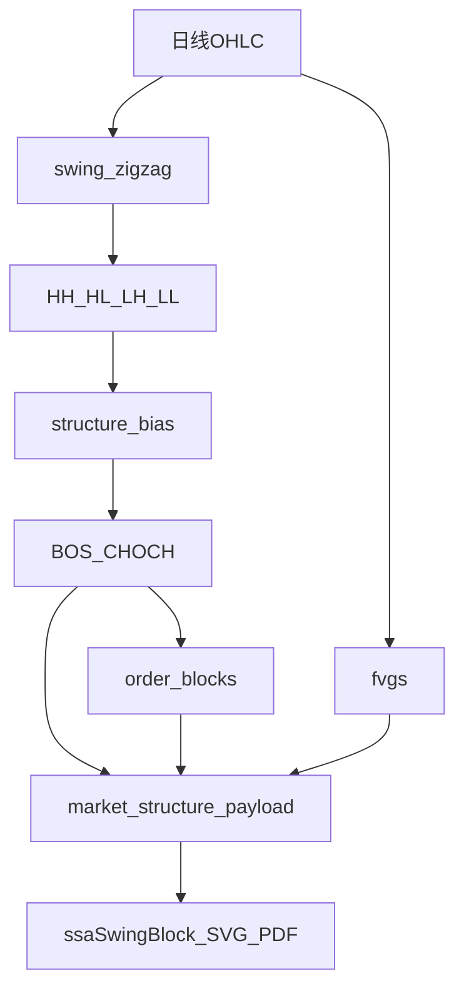

# 完整 SMC：OB / FVG / CHOCH 实现计划

## 目标与边界

- **做**：日线主判的完整结构事件链 —— **CHOCH / BOS**、**订单块（OB）**、**公允价值缺口（FVG）**；状态（活跃/缓解/失效）；SSA「波段与趋势」与 PDF 展示；周线只读对照（与现网 `weekly` 同模式）。
- **不做（本阶段）**：分钟线 SMC、流动性扫荡池、写入 URT/GMS/RPE 硬筛、改写 `tactical.short_bias`、ECharts K 线叠加（继续用现有 SVG 扩展价区）。
- **命名纪律**：新字段用 `choch` / `bos` / `order_blocks` / `fvgs`；保留 `last_bos_like` 作兼容别名或标记 deprecated，UI 主文案改为 CHOCH/BOS。

数据前提：仅依赖已有日线 OHLC（可选 `qfq`、实时末根），与 `[swing_zigzag.py](backend_core/analysis/swing_zigzag.py)` / `[market_structure.py](backend_core/analysis/market_structure.py)` 同参。

---

## 算法口径（锁定，避免实现漂移）

### 1) 结构状态机：BOS / CHOCH

输入：全链 ZigZag 标注点（`HH/HL/LH/LL`，与现网 `_label_hhhl` 一致）+ 收盘价。

- **趋势上下文** `structure_bias`：`bullish`（近端抬升系列）/ `bearish`（近端走弱系列）/ `neutral`（range/transition/不足）。
- **BOS（延续）**  
  - bullish：收盘有效上破**最近确认摆动高**（缓冲沿用 `1.005`）  
  - bearish：收盘有效下破**最近确认摆动低**（`0.995`）
- **CHOCH（性质转换）**  
  - 在 bearish 语境：收盘有效上破最近确认摆动高 → `choch_bullish`  
  - 在 bullish 语境：收盘有效下破最近确认摆动低 → `choch_bearish`  
  - neutral：只报 BOS 式破位，不升格 CHOCH（或标 `structure_shift_unconfirmed`）
- 输出事件列表（按时间）：`{ type: bos|choch, direction, level, level_date, bar_date, close, excess_pct }`；另给 `last_event`（最近一条）供徽章。
- **替换语义**：现 `_last_bos_like` 升级为上述状态机；旧字段可映射自 `last_event` 以免前端瞬间断裂。

### 2) 订单块 OB

锚定在**引发 BOS/CHOCH 的那条冲动腿**上：

- **看涨 OB**：结构上破前，该腿内**最后一根阴线**（`close < open`；若无 open 字段则用 `close < 前收`）的 `[low, high]` 为区块。  
- **看跌 OB**：结构下破前，该腿内**最后一根阳线**的 `[low, high]`。  
- 若腿内无符合 K 线：回退为腿起点分形蜡烛的高低区间。  
- **状态**：`active`（现价未完全穿越对侧）/ `mitigated`（收盘穿过区块对侧）/ `invalidated`（收盘大幅穿越且后续已形成反向结构事件，可选第二期细化；一期可先 active|mitigated）。  
- 只保留最近 N 个未完全失效块（默认 **6**），按距现价远近排序。

需在 bar 解析中补 **open**（现 `_parse_bars` 仅 H/L/C）——扩展为 OHLCV 可选 open，无 open 时用前收近似。

### 3) FVG

三连 K 线缺口（日线简化 ICT）：

- **看涨 FVG**：`bar[i-2].high < bar[i].low`，区间 `[high_{i-2}, low_i]`  
- **看跌 FVG**：`bar[i-2].low > bar[i].high`，区间 `[high_i, low_{i-2}]`  
- **过滤**：缺口高度 ≥ `max(ATR * 0.15, last_close * 0.003)`，抑制噪音。  
- **填充**：后续 K 线触及区间则 `partial`；完全穿越则 `filled`；否则 `open`。  
- 对外最近 **8** 条（优先 `open`/`partial`）。

### 4) 叙事与并列规则

- 一句 NLG：`smc_summary`（最近 CHOCH/BOS + 最近活跃 OB + 最近未填 FVG）。  
- 与形态：继续 `contrast_with_pattern_bias`，**SMC 不覆盖 short_bias**。  
- 与 KDE 关键位：列表并列，不合并价区。

---

## 代码落点

### 后端

1. **新建** `[backend_core/analysis/smc_engine.py](backend_core/analysis/smc_engine.py)`（或 `smc/` 包）：
  `detect_structure_events` / `detect_order_blocks` / `detect_fvgs` / `analyze_smc(bars, zigzag_labeled, ...)` → 纯函数，便于单测。
2. **扩展** `[market_structure.analyze_market_structure](backend_core/analysis/market_structure.py)`：在现有返回上挂载 `smc: { events, last_event, order_blocks, fvgs, summary }`；更新文件头「一期不做 SMC」注释。
3. **解析**：`swing_zigzag._parse_bars` 或 SMC 专用 parse 增加 `open`（及可选 `volume`，FVG/OB 暂不用量）。
4. **API**：`[market_structure_routes.py](backend_api/stock/market_structure_routes.py)` 与 `[stock_analysis_bundle.py](backend_core/analysis/stock_analysis_bundle.py)` 透传；周线同样跑一遍 SMC（展示折叠，与现周线一致）。
5. **文档**：`[docs/features/支撑阻力与形态识别_算法说明.md](docs/features/支撑阻力与形态识别_算法说明.md)` §1.3 改为「已实现 SMC 子集」，写清缓冲、过滤、状态机与非目标（扫荡/分钟线/硬筛）。

### 前端

1. `[market_structure_tool.js](frontend/js/market_structure_tool.js)`
  - `renderEmbedded`：徽章（最近 CHOCH/BOS）、OB/FVG 表、状态色。  
  - `buildZigzagSvg`：价区 `<rect>`（OB/FVG，透明度区分 active/open vs mitigated/filled）+ CHOCH 标注。  
  - `formatPlainText`：供 PDF。
2. `[stock_analysis_pdf.js](frontend/js/stock_analysis_pdf.js)`「波段与趋势」追加 SMC 小节。
3. `[stock_analysis_png.js](frontend/js/stock_analysis_png.js)`：若 SVG 增高，注册 layout。
4. `[analysis.html](frontend/analysis.html)` 文案：波段块说明改为含 CHOCH/OB/FVG（避免虚假「仅轻量破位」）。

### 测试

- 新建 `[test/test_smc_engine.py](test/test_smc_engine.py)`：合成序列覆盖  
  - 下降后上破 → CHOCH bullish + 看涨 OB  
  - 上升中上破前高 → BOS bullish  
  - 三连缺口 FVG open→filled  
  - 缺口过小被过滤
- 扩展 `[test/test_market_structure.py](test/test_market_structure.py)`：`analyze_market_structure` 含 `smc` 键。

### 交易参考（软）

- `[integrated_trade_plan.py](backend_core/analysis/integrated_trade_plan.py)`：evidence 可追加「最近 CHOCH/活跃 OB」一句；**不**改决策主逻辑。

---

## 实施顺序

1. `smc_engine` + 单测（事件 → OB → FVG）
2. 接入 `analyze_market_structure` + API/bundle
3. SSA/工具 UI + SVG 价区 + PDF
4. 文档与兼容字段收尾

---

## 风险

- A 股日线缺口少、跳空多 → FVG 过滤阈值要可配，默认偏严。  
- OB 依赖「最后反向 K」启发式，边界腿需单测锁定。  
- 文案若同时强调形态看空与 CHOCH 看多，必须并列展示冲突。  
- 性能：单票 lookback≤400，纯 Python 可接受；勿全市场批量硬筛。

