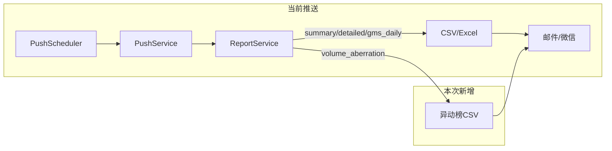

# 邮件通知增加「成交量异动排行榜」推送任务

## 一、现状与数据流

- **推送链路**：`[push_scheduler.py](backend_core/scheduler/push_scheduler.py)` 按 `user_push_configs.push_times` 触发 → `[push_service.execute_scheduled_push](backend_api/services/push_service.py)` → 每用户 `push_to_user` → `[report_service.generate_user_report(report_type=config.report_type)](backend_api/services/report_service.py)` 生成报告 → 邮件/微信发送附件。
- **现有报告类型**：`summary`、`detailed`、`gms_daily`；校验位于 `[push_routes.py](backend_api/push_routes.py)` 第 276 行与第 708 行。
- **成交量异动榜接口**：`[GET /api/stock/volume_aberration_list](backend_api/stock/stock_manage.py)`（约 486–589 行），参数：`market`(cn/hk)、`date`、`order`(desc/asc)、`page`、`page_size`；返回 `data`、`total`、`date`。数据来自 `historical_quotes` / `historical_quotes_hk` JOIN `mavol_indicators`，按量比(20) 排序。

## 二、范围说明

- **管理端**：在管理端的「邮件推送配置」中**增加配置项**，使管理员可为用户选择报告类型「成交量异动榜」，从而为用户开启该推送任务。
- **前端-行情-成交量异动榜**：**展示逻辑不变**。行情页下已有的「成交量异动榜」入口、表格、分页、导出等（`markets.html` / `markets.js`，`GET /api/stock/volume_aberration_list`）保持现状，不在此次改动范围内。

## 三、实现要点

### 1. 后端：异动榜数据可复用

- 异动榜**不依赖用户自选股**，按市场+日期+排序取全市场数据。建议将 `[stock_manage.get_volume_aberration_list](backend_api/stock/stock_manage.py)` 中的“查库 + 计算量比 + 排序分页”逻辑**抽取为独立函数或小模块**（例如放在 `backend_api/stock/` 或 `backend_api/services/`），供：
  - 现有 API 路由调用（保持接口不变）；
  - `ReportService` 调用，用于生成推送用异动榜报告。
- 抽取时注意：当前接口在内存中全量排序后分页；**推送报告暂不限制条数**，导出全量异动榜数据（A 股放量榜 + 港股放量榜均全量）。

### 2. 后端：ReportService 新增报告类型

- 在 `[report_service.py](backend_api/services/report_service.py)` 的 `generate_user_report` 中增加分支：`report_type == 'volume_aberration'`。
- 行为建议：
  - 不依赖 `watchlist`，直接调用上一步抽取的异动榜数据函数（或传入 `db` 的等价查询）。
  - 默认：A 股 `market=cn`、港股 `market=hk`，均取**最新交易日**、**放量榜**（`order=desc`），**暂不限制条数**，每条榜单导出全量。
  - 输出：单 CSV 文件（可含两段表头：A股放量榜 / 港股放量榜）或单 Excel 多 sheet（sheet1: A股放量榜，sheet2: 港股放量榜），字段与设计文档一致（排名、代码、名称、日期、成交量、量比(5)/(20)、涨跌幅等）。
- 返回 `ReportResult`，`ReportInfo.report_type='volume_aberration'`，`has_data` 根据是否有异动榜数据判断；无数据时仍返回成功，`has_data=False`，由现有推送逻辑决定是否跳过发送（与当前“无自选股”行为一致即可）。

### 3. 后端：PushService 文案与主题

- 在 `[push_service.py](backend_api/services/push_service.py)` 中：
  - `_format_push_message`、`_format_email_content`：对 `report_info.report_type == "volume_aberration"` 使用展示名「成交量异动榜」。
  - `_send_via_email` 中邮件主题：当 `report_type == "volume_aberration"` 时使用类似「成交量异动榜 - {report_date}」的 subject。

### 4. 后端：推送配置校验

- 在 `[push_routes.py](backend_api/push_routes.py)` 中：
  - 用户更新推送配置处的 `valid_types`（约 277 行）增加 `'volume_aberration'`。
  - 管理员更新推送配置处（约 708 行）的 `report_type` 校验同样增加 `'volume_aberration'`。

### 5. 管理端：邮件推送配置增加配置项

- **管理端**（后台）的邮件/推送配置界面中，在报告类型配置项里**增加「成交量异动榜」选项**，选项值 `volume_aberration`，便于管理员为用户勾选该推送任务。后端 `PUT /api/admin/push/configs/{user_id}` 已通过校验接受 `volume_aberration`（见 §4），仅需在管理端前端（若有独立管理页）的报告类型下拉/选项中新增该选项。
- **前端-行情-成交量异动榜**：不修改。行情页异动榜的展示、分页、导出逻辑与入口均保持不变。

### 6. 测试与兼容性

- 在 `test/` 下补充或调整：
  - ReportService：`report_type='volume_aberration'` 时能生成文件且 `ReportInfo.report_type`、`has_data` 正确。
  - PushService/推送路由：`report_type` 为 `volume_aberration` 时邮件主题与正文展示名称正确；配置更新接口接受 `volume_aberration`。
- 数据库：`user_push_configs.report_type` 为 String(20)，无需迁移即可支持新值。

## 四、可选扩展（后续）

- 在 `user_push_configs` 或配置 JSON 中为 `volume_aberration` 增加可选参数：市场（仅 A/仅港/双市场）、排序（放量/缩量）、条数上限等；当前计划采用默认（双市场、放量、不限制条数）即可上线。

## 五、涉及文件汇总

| 类型      | 文件                                                                                                                               |
| ------- | -------------------------------------------------------------------------------------------------------------------------------- |
| 抽取/复用   | `[backend_api/stock/stock_manage.py](backend_api/stock/stock_manage.py)` 或新建 `backend_api/services/volume_aberration_service.py` |
| 报告生成    | `[backend_api/services/report_service.py](backend_api/services/report_service.py)`                                               |
| 推送文案与主题 | `[backend_api/services/push_service.py](backend_api/services/push_service.py)`                                                   |
| 配置校验    | `[backend_api/push_routes.py](backend_api/push_routes.py)`（两处 valid_types）                                                       |
| 管理端前端   | 邮件推送配置页（报告类型增加「成交量异动榜」选项）；行情页异动榜不改动                                                                                              |
| 测试      | `test/test_report_service.py`、`test/test_push_*.py`、`test/test_push_routes.py` 等                                                 |

