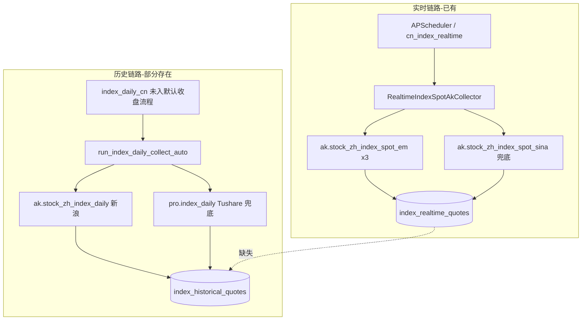
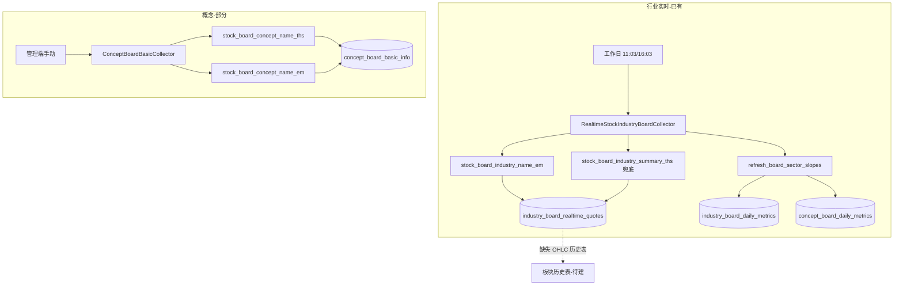
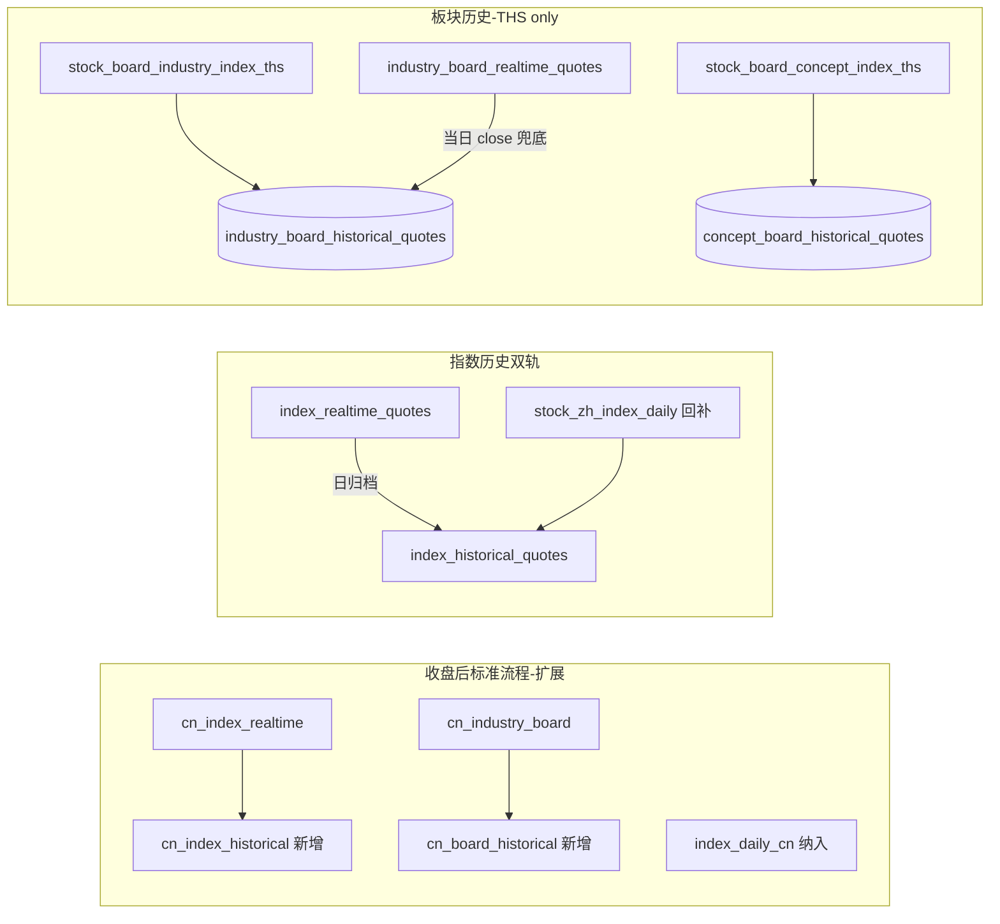

# A股指数与板块历史数据采集方案

## 一、现状梳理

### 1. A股指数




| 维度    | 现状                                                                                         | 关键文件                                                                                                                                  |
| ----- | ------------------------------------------------------------------------------------------ | ------------------------------------------------------------------------------------------------------------------------------------- |
| 实时采集  | 东财 `stock_zh_index_spot_em`（三类指数）→ 失败则新浪 `stock_zh_index_spot_sina`；**全表 DELETE 后 INSERT** | `[realtime_index_spot_ak.py](backend_core/data_collectors/akshare/realtime_index_spot_ak.py)`                                         |
| 历史采集  | 仅 4 个指数（000300/000001/399001/399006），新浪 `stock_zh_index_daily` 全量拉取后内存过滤；CAN SLIM M 专用     | `[index_daily.py](backend_core/data_collectors/akshare/index_daily.py)`                                                               |
| 实时→历史 | **无**（港股已有 `hk_index_historical` 可参考）                                                      | `[hk_index_historical_collector.py](backend_core/data_collectors/akshare/hk_index_historical_collector.py)`                           |
| 调度    | 实时有 legacy cron + 预置流程；`index_daily_cn` **未**在默认收盘模板中                                      | `[main.py](backend_core/data_collectors/main.py)`、`[add_collection_workflow_tables.py](migrations/add_collection_workflow_tables.py)` |


**表结构差异（归档需注意）**：

- 实时表 `index_realtime_quotes`：主键 `(code, update_time, index_spot_type)`，字段 `price`
- 历史表 `index_historical_quotes`：主键 `(ts_code, trade_date)`，字段 `close`，需 `code→ts_code` 映射（如 `000300` → `000300.SH`）

---

### 2. 板块（行业 + 概念）




| 维度      | 行业                                              | 概念                                      |
| ------- | ----------------------------------------------- | --------------------------------------- |
| 列表      | 随实时采集 upsert `industry_board_basic_info`        | 仅手动；`stock_board_concept_name_ths` + 东财 |
| 实时行情    | `industry_board_realtime_quotes`（多时间点快照）        | **无实时行情表**                              |
| 成分股     | 东财 `stock_board_industry_cons_em` + THS HTML 抓取 | 东财 + THS HTML；**无 cron**                |
| 日度指标    | 成分股合成斜率 → `industry_board_daily_metrics`        | 同上 → `concept_board_daily_metrics`      |
| 历史 OHLC | **无**                                           | **无**                                   |
| 口径      | 查询/斜率默认 `board_code_source=tonghuashun`         | 同左                                      |


同花顺行业 summary 兜底时**无指数点位**（`[normalize_ths_industry_df](backend_core/data_collectors/akshare/industry_board_normalize.py)` 置空最新价），东财同名板会镜像点位给 THS 板——历史归档不应依赖此镜像，应直接调 THS 指数接口。

---

## 二、AkShare 同花顺接口调研结论

### 可用于板块历史的 THS 接口（akshare 1.17.70）


| 接口                                 | 用途               | 参数                                                | 历史          |
| ---------------------------------- | ---------------- | ------------------------------------------------- | ----------- |
| `stock_board_industry_index_ths`   | 同花顺**行业**板块指数日 K | `symbol`=板块名称, `start_date`, `end_date`（YYYYMMDD） | **是**       |
| `stock_board_concept_index_ths`    | 同花顺**概念**板块指数日 K | 同上；**不可**用 industry 接口查概念                         | **是**       |
| `stock_board_industry_name_ths`    | 行业板列表            | 无参                                                | 否           |
| `stock_board_concept_name_ths`     | 概念板列表            | 无参                                                | 否           |
| `stock_board_industry_summary_ths` | 行业汇总（实时）         | 无参                                                | 否，且无指数 OHLC |


**注意**：行业/概念接口必须分开调用（[akshare #5955](https://github.com/akfamily/akshare/issues/5955)）；`stock_board_*_cons_ths` 成分股接口**已移除**，项目继续用 `[ths_board_constituents.py](backend_core/data_collectors/akshare/ths_board_constituents.py)` HTML 抓取。

### 主要 A 股指数（用户确认：继续新浪/东财）


| 接口                                                    | 数据源   | 用途建议              |
| ----------------------------------------------------- | ----- | ----------------- |
| `stock_zh_index_daily`                                | 新浪    | 历史回补（当前生产）        |
| `stock_zh_index_daily_em`                             | 东财    | 可选第二源/校验          |
| `index_zh_a_hist`                                     | 东财    | 测试代码有，支持区间参数，可作优化 |
| `stock_zh_index_spot_em` / `stock_zh_index_spot_sina` | 东财/新浪 | 实时（当前生产）          |


**无** akshare 同花顺接口覆盖 000300/000001 等主要指数。

---

## 三、目标架构




---

## 四、实施计划

### Phase 1：数据库与模型

新增迁移脚本（如 `[migrations/add_board_historical_quotes.py](migrations/add_board_historical_quotes.py)`）：

`**industry_board_historical_quotes` / `concept_board_historical_quotes**`（结构对齐 THS 指数返回字段）：

- 主键：`(board_code, trade_date)`
- 字段：`board_name, open, high, low, close, volume, amount, collected_source='tonghuashun', update_time`
- 索引：`(trade_date)`、`(board_code, trade_date DESC)`
- 仅写入 `board_code_source=tonghuashun` 的板块

在 `[models.py](backend_api/models.py)` 增加对应 ORM。

---

### Phase 2：A股指数 — 实时转历史 + 调度补齐

**新建** `[backend_core/data_collectors/akshare/cn_index_historical_collector.py](backend_core/data_collectors/akshare/cn_index_historical_collector.py)`，参照 `[hk_index_historical_collector.py](backend_core/data_collectors/akshare/hk_index_historical_collector.py)`：

1. 从 `index_realtime_quotes` 读取指定交易日最后一条快照（按 `update_time` 取 max）
2. 映射 `code` → `ts_code`（复用 `[index_daily.py](backend_core/data_collectors/akshare/index_daily.py)` 中 `_AK_SYMBOL` 反向映射，并支持实时表中的其它指数 code）
3. UPSERT 到 `index_historical_quotes`（`close=price`，`collected_source='realtime_archive'`）
4. 与 `index_daily_cn` 并存：归档负责**当日收盘快照**；`index_daily_cn` 负责**历史回补/校正**（新浪全量或区间）

**工作流**：

- 在 `[node_registry.py](backend_core/data_collectors/workflow/node_registry.py)` 注册 `cn_index_historical`
- 在 `[adapters/__init__.py](backend_core/data_collectors/workflow/adapters/__init__.py)` 增加 `exec_cn_index_historical`
- 更新 `[add_collection_workflow_tables.py](migrations/add_collection_workflow_tables.py)` 预置模板：`cn_index_realtime` → `cn_index_historical` → `index_daily_cn`
- 在 `[main.py](backend_core/data_collectors/main.py)` 增加 legacy cron（默认工作日 15:40，可 `.env` 配置）

---

### Phase 3：板块 — THS 历史回补采集器

**新建** `[backend_core/data_collectors/akshare/board_historical_ths.py](backend_core/data_collectors/akshare/board_historical_ths.py)`：

```python
# 核心逻辑示意
for board in load_boards(kind, source="tonghuashun"):
    if kind == "industry":
        df = ak.stock_board_industry_index_ths(symbol=board.board_name, start_date=..., end_date=...)
    else:
        df = ak.stock_board_concept_index_ths(symbol=board.board_name, start_date=..., end_date=...)
    upsert_to_historical_table(df, board_code=board.board_code)
```

- 从 `industry_board_basic_info` / `concept_board_basic_info` 读取 `board_code_source='tonghuashun'`
- 参数：`years_back`（默认 3）、`board_codes` 可选过滤、`request_interval` 防封
- 列映射：THS 返回 `日期/开盘价/最高价/最低价/收盘价/成交量/成交额` → 标准字段
- 错误处理：单板块失败记日志继续；名称不匹配时尝试 `board_name` 别名

**历史回补模式**：

- `mode=backfill`：按区间从 THS 拉取（首次部署 / 管理端触发）
- `mode=daily`：仅拉取最近 1~3 个交易日（收盘后增量）

---

### Phase 4：板块 — 每日实时转历史

**新建** `[backend_core/data_collectors/akshare/board_daily_archive.py](backend_core/data_collectors/akshare/board_daily_archive.py)`：

优先级策略（同花顺为准）：

1. **首选**：调用 `stock_board_*_index_ths` 拉取当日 K 线（权威 OHLC）
2. **兜底**：从 `industry_board_realtime_quotes` 取当日最后快照的 `latest_price` 作为 `close`（仅行业；概念无实时表则必须走 THS API）
3. 写入 `*_board_historical_quotes`，`collected_source` 标记 `ths_api` / `realtime_archive`

工作流节点：`cn_board_historical`（内部：`board_daily_archive` + 可选 `board_historical_ths` daily 模式）

---

### Phase 5：调度与流程整合


| 节点 key                 | 名称        | 时机    | 依赖                                 |
| ---------------------- | --------- | ----- | ---------------------------------- |
| `cn_index_historical`  | A股指数实时→历史 | 收盘后   | `cn_index_realtime`                |
| `index_daily_cn`       | A股指数历史回补  | 收盘后   | 无（可与上并行）                           |
| `cn_board_historical`  | 同花顺板块历史归档 | 收盘后   | `cn_industry_board`、概念列表已同步        |
| `cn_concept_board`（可选） | 概念列表同步    | 收盘前/后 | 新增，调用 `ConceptBoardBasicCollector` |


更新预置「A股收盘后标准流程」顺序建议：

```
cn_realtime → cn_index_realtime → cn_industry_board
→ cn_index_historical → index_daily_cn → cn_board_historical
→ cn_industry_constituents（月频可独立）
```

概念成分仍建议管理端/独立 cron，本阶段可选加 `cn_concept_constituents` 节点。

---

### Phase 6：管理端与 API（可选，第二阶段）

- 管理端 `[QuotesView.vue](admin/src/views/QuotesView.vue)` 增加 A 股指数历史、板块历史 Tab（参照港股历史）
- API：仿 `GET /api/quotes/hk-index-historical` 增加 `index-historical`、`board-historical` 查询
- 管理端手动触发：历史回补 `years_back`、指定板块 code 列表

---

### Phase 7：测试

在 `[test/](test/)` 目录新增：

- `test_cn_index_historical_collector.py`：mock 实时表 → 历史表 UPSERT
- `test_board_historical_ths.py`：mock akshare 返回，验证列映射与 tonghuashun 过滤
- 集成测试：单板块 THS 接口连通性（标记 `@pytest.mark.integration`）

---

## 五、风险与约束


| 风险                   | 缓解                                                      |
| -------------------- | ------------------------------------------------------- |
| THS 接口限流/封 IP        | 请求间隔、单板块失败跳过、重试 3 次                                     |
| 板块名称与 THS symbol 不一致 | 以 `board_name` 为准；失败时记录待修复清单                            |
| 概念板无实时表              | 日归档**必须**走 `stock_board_concept_index_ths`              |
| 指数实时表无 `trade_date`  | 归档时用 `update_time::date` 或参数传入交易日                       |
| 与现有斜率指标重复            | 历史 OHLC 表与 `*_daily_metrics` 并存；斜率仍用成分股合成，OHLC 供 K 线/回测 |


---

## 六、不在本次范围

- 主要指数改用同花顺源（akshare 无接口）
- 东财来源板块的历史 OHLC（用户确认仅 tonghuashun）
- 同花顺成分股 akshare 接口恢复（仍用 HTML 抓取）
- 概念板实时行情表（可后续独立需求）

